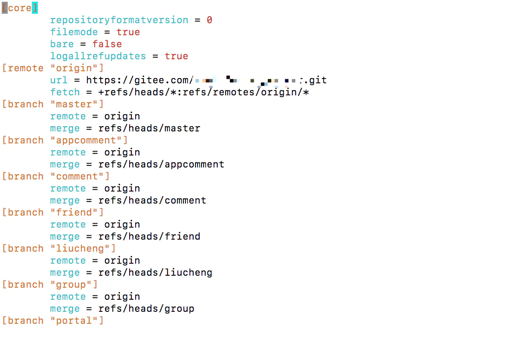

### 场景一（关联）：本地有仓库，要和远程仓库做关联

```shell
git init
git add .
git commit -m “first commit” 
#在GitHub上创建一个远程仓库
git remote add origin https://github.com/xpromise/oa.git
#备注：如果此步关联错了，解决办法如下。
#暴力解决：删除.git文件夹，重新建立本地仓库。
#优雅解决：git remote remove origin，再在重新关联仓库。
```

> **切记**:如果我们在创建远程仓库的时候添加了`README`和`.ignore`等文件,我们在后面关联仓库后,需要先执行`pull`操作

### 场景二（推送）：本地有仓库有内容，要推送给远程库

```shell
git push -u origin master （首次加-u）
#根据提示输入用户名密码

#我们第一次推送master分支时，加上了-u参数，Git不但会把本地的master分支内容推送到远程新的master分支，还会把本地master分支和远程的master分支关联起来，在以后的推送时可以简化命令
git push origin master。

#如果报错 
# ! [rejected]        master -> master (fetch first)
#error: failed to push some refs to 'https://github.com/CNsurly/workSpace.git'
#说明远程有文件在本地没有，执行下述语句再push
git pull --rebase origin master

#备注：正常情况下，成功推送一次后，电脑会记住和账号与密码，下次推送时不会再提示输入。若在电脑不能够自动记住github的账户和密码，需执行以下命令解决：
git config --global credential.helper store
```

###  场景三（拉取）：本地有仓库有内容，获取远程库新内容

```shell
#第一种拉取方式：
git pull origin master
#将远程仓库的master分支上代码版本复制/合并到本地master分支上

#第二种拉取方式：
git fetch origin master:tmp
#新建一个tmp分支，将远程仓库的master分支上代码版本复制到tmp分支上，不会自动合并。
```

### 场景四（克隆）：本地无仓库，要获取一个完整的远程库

```shell
#备注：只在第一次获取远程库时才需要克隆
git clone https://github.com/xxx.git
```

### 场景五 克隆-修改-提交

1. 克隆远程仓库的数据

   ```shell
   git clone <远程地址>
   #或者
   git clone <远程地址> <克隆下来自定义的文件名>
   ```

2. 创建分支

   ```shell
   #创建分支，然后切换到分支并且和远程的分支关联
   git checkout -b <自定义分支名字> origin/<自定义分支名字>
   #origin代表是一个路径,可以用git remote -v 查看
   #说白了,origin/dev有点像是git@github.com:xxxxx/yyyyy.git/dev
   ```

3. 使用git pull 把分支代码pull下来

   ```shell
   git pull
   ```

4. 当操作了文件的内容时，首先将文件添加到暂存区

   ```shell
   #将所有的文件添加到暂存区
   git add .
   
   #或者
   #将某一个文件添加到暂存区
   git add <文件>
   ```

5. 提交暂存区的文件

   ```shell
   git commit -m "<提交的说明>"
   ```

6. 切换到主分支

   ```shell
   git checkout master
   ```

7. 把分支的代码merge到主分支

   ```shell
   git merge <分支名字>
   ```

8. git push推上去ok完成,现在 你自己分支的代码就合并到主分支上了

   ```shell
   git push
   ```

   

### 场景六：解决git本地仓库和远程仓库都修改的冲突

```bash
#保存本地代码
git stash 

#拉远端代码
git pull 

#恢复本地代码
git stash apply 

#这时候，可能会有冲突
#看冲突文件
git status 


#找到冲突文件
#>>>>>>
#<<<<<<
#删除不需要的


#接着正常提交
git add .
git commit -m 'fix'
git push
```

### 场景七：查看远程的地址及修改远程地址

```bash
#查看远程地址
git remote -v
#有两条地址fetch和push，那么fetch标识的是表示我们要获取到的地址，push则表示我们要推送的地址。
#在浏览器输入以上地址，就能查看到远程仓库项目了

#修改远程仓库地址
#方法1.修改命令
git remote -v  					#查看远端地址
git remote 						#查看远端仓库名
git remote set-url origin <url>
#方法2.先删后加
git remote rm origin
git remote add origin [url]
#方法3.直接修改config文件
```

**方法3.直接修改config文件**

修改`.git`文件夹
`.git`文件夹一般在项目文件夹的第一层文件夹
`.git`文件在系统里默认是隐藏的，`windows`需要设置显示，`linux`使用`ls -a`查看

修改`config`文件内容，将`[remote "origin"] url `修改成需要替换的`url`

