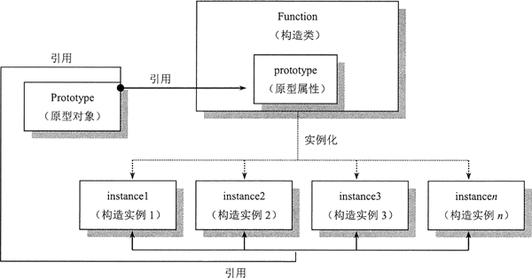

==转载-----原文地址：==[JS原型（prototype）和原型链完全攻略 (biancheng.net)](http://c.biancheng.net/view/5805.html)

# JS原型（prototype）和原型链完全攻略

在 JavaScript中，`每一个函数都有原型`，函数被实例化以后，`实例对象`通过 `prototype` 属性可以`访问原型`，实现`继承机制`。

## 定义原型

`原型`实际上就是一个`普通对象`，`继承于 Object 类`，由 JavaScript 自动创建并依附于每个函数身上，原型在 JavaScript 对象系统中的位置和关系如图所示。




Object 和 Function 是两个不同类型的构造函数，利用`运算符 new` 可以创建不同类型的实例对象。实例对象、类、Object 和 Function 之间的关系如图所示。


使用点语法，可以通过` function.prototype` `访问和操作`原型对象。、

#### 示例

在下面代码中为函数 P 定义原型。

```javascript
function P (x) {  //构造函数    
	this.x = x;  //声明私有属性，并初始化为参数x
}
P.prototype.x = 1;  //添加原型属性x，赋值为1
var p1 = new P (10);  //实例化对象，并设置参数为10
P.prototype.x = p1.x;  //设置原型属性值为私有属性值
console.log(P.prototype.x);  //返回10
```

## 访问原型

访问原型对象有 3 种方法，简单说明如下：

- obj.__proto__。
- obj.constructor.prototype。
- Object.getPrototypeOf(obj)。

其中，obj 表示一个实例对象，constructor 表示构造函数。__proto__（前后各两个下划线）是一个私有属性，可读可写，与 prototype 属性相同，都可以访问原型对象。Object.getPrototypeOf(obj) 是一个静态函数，参数为示例对象，返回值是参数对象的原型对象。

__proto__ 属性是一个私有属性，存在浏览器兼容性问题，以及缺乏非浏览器环境的支持。使用 obj.constructor.prototype 也存在一定风险，如果 obj 对象的 constructor 属性值被覆盖，则 obj.constructor.prototype 将会失效。因此，比较安全的用法是使用 Object.getPrototypeOf(obj)。

#### 示例

下面代码创建一个空的构造函数，然后实例化，分别使用上述三种方法访问实例对象的原型。

```javascript
var F = function () {};  //构造函数
var obj = new F();  //实例化
var proto1 = Object.getPrototypeOf(obj);  //引用原型var proto2 = obj.__proto__;  //引用原型，注意，IE暂不支持var proto3 = obj.constructor.prototype;  //引用原型
var proto4 = F.prototype;  //引用原型
console.log(proto1 === proto2);  //true
console.log(proto1 === proto2);  //true
console.log(proto1 === proto4);  //true
console.log(proto2 === proto3);  //true
console.log(proto2 === proto4);  //true
console.log(proto3 === proto4);  //true
```

## 设置原型

设置原型对象有 3 种方法，简单说明如下：

- obj.__proto__=prototypeObj.
- Object.setPrototypeOf(obj, prototypeObj)。
- Object.create(prototypeObj)。

其中，obj 表示一个实例对象，prototypeObj 表示原型对象。注意，IE 不支持前面两种方法。

#### 示例

下面代码简单演示利用上述三种方法为对象直接量设置原型。

```javascript
var proto = {name : "prototype"};  //原型对象
var obj1 = {};  //普通对象直接量
obj1.__proto__ = proto;  //设置原型
console.log(obj1.name);
var obj2 = {};  //普通对象直接量
Object.setPrototypeOf(obj2, proto);  //设置原型
console.log(obj2.name);
var obj3 = Object.create(proto);  //创建对象，并设置原型console.log(obj3.name);
```

## 检测原型

使用 isPrototypeOf() 方法可以判断该对象是否为参数对象的原型。isPrototypeOf() 是一个原型方法，可以在每个实例对象上调用。

#### 示例

下面代码简单演示如何检测原型对象。

```javascript
var F = function () {};  //构造函数
var obj = new F();  //实例化
var proto1 = Object.getPrototypeOf(obj);  //引用原型console.log(proto1.isPrototypeOf(obj));  //true
```


也可以使用下面代码检测不同类型的实例。

```javascript
var proto = Object.prototype;
console.log(proto.isPrototypeOf({}));  //true
console.log(proto.isPrototypeOf([]));  //true
console.log(proto.isPrototypeOf(//));  //true
console.log(proto.isPrototypeOf(function () {}));  //true
console.log(proto.isPrototypeOf(null));  //false
```

## 原型属性和私有属性

原型属性可以被所有实例访问，而私有属性只能被当前实例访问。

#### 示例1

在下面示例中，演示如何定义一个构造函数，并为实例对象定义私有属性。

```javascript
function f () {  //声明一个构造函数
    this.a = 1;  //为构造类型声明一个私有属性
    this .b = function () {  //为构造类型声明一个私有属性
        return this.a;
    };
}
var e = new F ();  //实例化构造函数
console.log(e.a);  //调用实例对象的属性a，返回1
console.log(e.b());  //调用实例对象的方法b，提示1
```

构造函数 f 中定义了两个私有属性，分别是属性 a 和 方法b()。当构造函数实例化后，实例对象继承了构造函数的私有属性。此时可以在本地修改实例对象的属性 a 和方法 b()。

```
e.a = 2;
console.log(e.a);
console.log(e.b());
```

如果给构造函数定义了与原型属性同名的私有属性，则私有属性会覆盖原型属性值。

如果使用 delete 运算符删除私有属性，则原型属性会被访问。在上面示例的基础上删除私有属性，则会发现可以访问原型属性。

#### 示例2

私有属性可以在实例对象中被修改，不同实例对象之间不会相互干扰。

```javascript
function f () {  //声明一个构造类型
    this.a = 1;  //为构造类型声明一个私有属性
}
var e = new f ();  //实例e
var g = new f ();  //实例g
console.log(e.a);  //返回值为1，说明它继承了构造函数的初始值
console.log(g.a);  //返回值为1，说明它继承了构造函数的初始值
e.a = 2;  //修改实例e的属性a的值
console.log(e.a);  //返回值为2，说明e的属性a的值改变了
console.log(g.a);  //返回值为1，说明g的属性a的值没有受影响
```

上面示例演示了如果使用私有属性，则实例对象之间就不会相互影响。但是如果希望统一修改实例对象中包含的私有属性值，就需要一个个的修改，工作量会很大。

#### 示例3

原型属性将会影响所有实例对象，修改任何原型属性值，则该构造函数的所有实例都会看到这种变化，这样就省去了私有属性修改的麻烦。

```javascript
function f () {};  //声明一个构造函数
f.prototype.a = 1;  //为构造类型声明一个私有属性
var e = new f ();  //实例e
var g = new f ();  //实例g
console.log(e.a);  //返回值为1，说明它继承了构造函数的初始值
console.log(g.a);  //返回值为1，说明它继承了构造函数的初始值
f.prototype.a = 2;  //修改原型属性值
console.log(e.a);  //返回值为2，说明实例e的属性a的值改变了
console.log(g.a);  //返回值为2，说明实例g的属性a的值改变了
```

在上面示例中，原型属性值会影响所有实例对象的属性值，对于原型方法也是如此。原型属性或原型方法可以在构造函数结构体内定义。

```javascript
function f () {};  //声明一个空的构造类型
f.prototype.a = 1;  //在结构体外为构造类型声明一个原型属性
f.prototype.b = function () {  //在结构体外为构造类型声明一个原型方法
    return f.prototype.a;  //返回原型属性值
}
```

prototype 属性属于构造函数，所以必须使用构造函数通过点语法来调用 prototype 属性，再通过 prototype 属性来访问原型对象。原型属性于私有属性之间的关系如图所示。


Object 和 Function 都可以定义原型，它们的属性与原型关系如图所示。


#### 示例4

利用对象原型与私有属性之间的这种特殊关系可以设计以下有趣的演示效果。

```javascript
function p (x, y, z) {  //构造函数
    this.x = x;  //声明私有属性x并赋值参数x的值
    this.y = y;  //声明私有属性y并赋值参数y的值
    this.z = z;  //声明私有属性z并赋值参数z的值
}
p.prototype.del = function () {  //定义原型方法
    for (var i in this) {  //遍历本地对象，删除实例内的所有属性和方法
        delete this[i];
    }
}
p.prototype.new p (1, 2, 3);  //实例化，并把实例对象传递给原型对象
var p1 = new p (10, 20, 30);  //实例化构造函数p为p1
console.log(p1.x);  //返回10，私有属性x的值
console.log(p1.y);  //返回20，私有属性y的值
console.log(p1.z);  //返回30，私有属性z的值
p1.del();  //调用原型方法删除所有私有属性
console.log(p1.x);  //返回1，原型属性x的值
console.log(p1.y);  //返回2，原型属性x的值
console.log(p1.z);  //返回3，原型属性x的值
```

上面示例定义了构造函数 p，声明了 3 个私有属性，并实例化构造函数，把实例对象赋值给构造函数的原型对象。同时定义了原型方法 del()，该方法将删除实例对象的所有私有属性和方法。最后，分别调用属性 x、y 和 z，返回的是私有属性值，调用方法 del()，删除所有私有属性，再次调用属性 x、y 和 z，则返回的是原型属性值。

## 应用原型

下面通过几个示例介绍原型在代码中的应用技巧。

#### 示例1

利用原型为对象设置默认值。当原型属性与私有属性同名时，删除私有属性之后，可以访问原型属性，即可以把原型属性值作为初始化默认值。

```javascript
function p (x) {  //构造函数
    if (x) {  //如果参数存在，则设置属性，该条件是关键
        this.x = x;  //使用参数初始化私有属性x的值
    }
}
p.prototype.x = 0;  //利用原型属性，设置私有属性x的默认值
var p1 = new p ();  //实例化一个没有带参数的对象
console.log(p1.x);  //返回0，即显示私有属性的默认值
var p2 = new p (1);  //再次实例化，传递一个新的参数
console.log(p2.x);  //返回1，即显示私有属性的初始化值
```

#### 示例2

利用原型间接实现本地数据备份。把本地对象的数据完全赋值给原型对象，相当于为该对象定义一个副本，也就是备份对象。这样当对象属性被修改时，就可以通过原型对象来恢复本地对象的初始值。

```javascript
function p (x) {  //构造函数
    this.x = x;
}
p.prototype.backup = function () {  //原型方法，备份本地对象的数据到原型对象中
    for (var i in this) {
        p.prototype[i] = this[i];
    }
}
var p1 = new p (1);  //实例化对象
p1.backup;  //备份实例对象中的数据
p1.x = 10;  //改写本地对象的属性值
console.log(p1.x);  //返回10，说明属性值已经被改写
p1 = p.prototype;  //恢复备份
console.log(p1.x);  //返回1，说明对象的属性值已经被恢复
```

#### 示例3

利用原型还可以为对象属性设置“只读”特性，这在一定程序上可以避免对象内部被任意修改的问题。下面示例演示了如何根据平面上两点坐标来计算它们之间的距离。构造函数 p 用来设置定位坐标，当传递两个参数值时，会返回以参数为坐标值的点。如果省略参数则默认点为原点（0,0）。而在构造函数 1 中通过传递的两点坐标对象计算它们的距离。

```javascript
function p (x, y) {  //求坐标点构造函数
    if (x) this.x = x;  //初始x轴值
    if (y) this.y = y;  //初始y轴值
    p.prototype.x = 0;  //默认x轴坐标
    p.prototype.y = 0;  //默认y轴坐标
}
function l (a, b) {  //求两点距离构造函数
    var a = a;  //参数私有化
    var b = b;  //参数私有化
    var w = function () {  //计算x轴距离，返回对函数引用
        return Math.abs(a.x - b.x);
    }
    var h = function () {  //计算y轴距离，返回对函数引用
        return Math.abs(a.y - b.y);
    }
    this.length = function () {  //计算两点距离，调用私有方法w()和h()
        return Math.sqrt(w() * w() + h() * h());
    }
    this.b = function () {  //获取起点坐标对象
        return a;
    }
    this.e = function () {  //获取终点坐标对象
        return b;
    }
}
var p1 = new P (1, 2);  //实例化p构造函数，声明一个点
var p2 = new P (10, 20);  //实例化p构造函数，声明另一个点
var l1 = new l (p1, p2);  //实例化l构造函数，传递两个对象
console.log(l1.length());  //返回20.12461179749811，计算两点距离
l1.b().x = 50;  //不经意改动方法b()的一个属性为50
console.log(l1.length());  //返回43.86342439892262，说明影响两点距离值
```

在测试中会发现，如果无意间修改了构造函数 1 的方法 b() 或 e() 的值，则构造函数 1 中的 length() 方法的计算值也随之发生变化。这种动态效果对于需要动态跟踪两点坐标变化来说，是非常必要的。但是，这里并不需要当初始化实例之后，随意的被改动坐标值。毕竟方法 b() 和 e() 与参数 a 和 b 是没有多大联系的。

为了避免因为改动方法 b() 的属性 x 值会影响两点距离，可以在方法 b() 和 e() 中新建一个临时性的构造类，设置该类的原型为 a，然后实例化构造类并返回，这样就阻断了方法 b() 与私有变量 a 的直接联系，它们之间仅是值得传递，而不是对对象 a 的引用，从而避免因为方法 b() 的属性值变化而影响私有对象 a 的属性值。

```javascript
this.b = function () {  //方法b()
    function temp () {};  //临时构造类
    temp.prototype = a;  //把私有对象传递给临时构造类的原型对象
    return new temp();  //返回实例化对象，阻断直接返回a的引用关系
}
this.e = function () {  //方法e()
    function temp () {};  //临时构造类
    temp.prototype = a;  //把私有对象传递给临时构造类的原型对象
    return new temp();  //返回实例化对象，阻断直接返回a的引用关系
}
```

还有一种方法是在给私有变量 w 和 h 赋值时，不是赋值函数，而是函数调用表达式，这样私有变量 w 和 h 存储的时值类型数据，而不是对函数结构的引用，从而就不再受后期相关属性值的影响。

```javascript
function l (a, b) {  //求两点距离构造函数
    var a = a;  //参数私有化
    var b = b;  //参数私有化
    var w = function () {  //计算x轴距离，返回函数表达式的计算值
        return Math.abs(a.x - b.x);
    } ()
    var h = function () {  //计算y轴距离，返回函数表达式的计算值
        return Math.abs(a.y - b.y);
    } ()
    this.length = function () {  //计算两点距离，直接使用私有变量 w 和 h 来计算
        return Math.sqrt(w() * w() + h() * h());
    }
    this.b = function () {  //获取起点坐标
        return a;
    }
    this.e = function () {  //获取终点坐标
        return b;
    }
}
```

#### 示例4

利用原型进行批量复制。

```javascript
function f (x) {  //构造函数
    this.x = x;  //声明私有属性
}
var a = [];  //声明数组
for (var i = 0; i < 100; i ++) {  //使用for循环结构批量复制构造类f的同一个实例
    a[i] = new f (10);  //把实例分别存入数组
}
```

上面代码演示了如何复制 100 次同一个实例对象。这种做法本无可非议，但是如果要在枸杞修改数组中每个实例对象时，就会非常麻烦。现在可以尝试使用原型来进行批量复制操作。

```javascript
function f (x) {  //构造函数
    this.x = x;  //声明私有属性
}
var a = [];  //声明数组
function temp () {}  //定义一个临时的空构造类temp
temp.prototype = new f (10);  //实例化，并传递给构造类temp的原型对象
for (var i = 0; i < 100; i ++) {  //使用for复制临时构造类temp的同一个实例
    a[i] = new temp();  //把实例分别存入数组
}
```

把构造类 f 的实例存储在临时构造类的原型对象中，然后通过临时构造类 temp 实例来传递复制的值。这样，要想修改数组的值，只需要修改类 f 的原型即可，从而避免逐一修改数组中每个元素。

## 原型链

在 JavaScript 中，实例对象在读取属性时总是先检查私有属性。如果存在，则会返回私有属性值；否则就会检索 prototype 原型；如果找到同名属性，则返回 prototype 原型的属性值。

prototype 原型允许引用其他对象。如果在 prototype 原型中没有找到指定的属性，则 JavaScript 将会根据引用关系，继续检索 prototype 原型对象的 prototype 原型，以此类推。

#### 示例1

下面示例演示了对象属性查找原型的基本方法和规律。

```javascript
function a (x) {  //构造函数a
    this.x = x;
}
a.prototype.x = 0;  //原型属性x的值为0
function b (x) {  //构造函数b
    this.x = x;
}
b.prototype = new a (1);  //原型对象为构造函数a的实例
function c (x) {  //构造函数c
    this.x = x;
}
c.prototype = new b (2);  //原型对象为构造函数b的实例
var d = new c (3);  //实例化构造函数c
console.log(d.x);  //调用实例对象d的属性x，返回值为3
delete d.x;  //删除实例对象的私有属性x
console.log(d.x);  //调用实例对象d的属性x，返回值为2
delete c.prototype.x;  //删除c类的原型属性x
console.log(d.x);  //调用实例对象d的属性x，返回值为1
delete b.prototype.x;  //删除b类的原型属性x
console.log(d.x);  //调用实例对象d的属性x，返回值为0
delete a.prototype.x;  //删除a类的原型属性x
console.log(d.x);  //调用实例对象d的属性x，返回值为undefined
```

原型链能够帮助用户更清楚的认识 JavaScript 面向对象的继承关系，如图所示。


#### 示例2

在 JavaScript 中，一切都是对象，函数是第一型。Function 和 Object 都是函数的实例。构造函数的父原型指向 Function 的原型，Function.prototype 的原型是 Object 的原型，Object 的原型也指向 Function 的原型，Object.prototype 是所有原型的顶层。

```javascript
Function.prototype.a = function () {  //Function原型方法
    console.log("Function");
}
Object.prototype.a = function () {  //Object原型方法
    console.log("Object");
}
function f () {  //构造函数f
    this.a = "a";
}
f.prototype = {  //构造函数f的原型方法
    w : function () {
        console.log("w");
    }
}
console.log(f instanceof Function);  //返回true，说明f是Function的实例
console.log(f.prototype instanceof Object);  //返回true，说明f的原型也是对象
console.log(Function instanceof Object);  //返回true，说明Function是Object的实例
console.log(Function.prototype instanceof Object);  //true，说明Function是Object的实例
console.log(Object instanceof Function);  //返回true，说明Object 是Function的实例
console.log(Object.prototype instanceof Function);  //false，说明Object.prototype是原型顶层
```

## 原型继承

原型继承是一种简化的继承机制，也是 JavaScript 原生支持的继承模式。在原型继承中，类和实例概念被淡化了，一切都从对象的角度来考虑。原型继承不再需要使用类来定义对象的结构，直接定义对象，并被其他对象引用，这样就形成了一种继承关系，其中引用对象被称为原型对象。JavaScript 能够根据原型链来查找对象之间的这种继承关系。

#### 示例

下面使用原型继承的方法设计类型继承。

```javascript
function A (x) {  //A类
    this.x1 = x;  //A的私有属性x1
    this.get1 = function () {  //A的私有方法get1()
        return this.x1;
    };
}
function B(x) {  //B类
    this.x2 = x;  //B的私有属性x2
    this.get2 = function () {  //B的私有方法get2()
        return this.x2 + this.x2;
    };
}
B.prototype = new A (1);  //原型对象继承A的实例
function C (x) {  //C类
    this.x3 = x;  //C的私有属性x3
    this.get3 = function () {  //C的私有方法get3()
        return this.x3 * this.x3;
    };
}
C.prototype = new B (2);  //原型对象继承B的实例
```

在上面示例中，分别定义了 3 个构造函数，然后通过原型链把它们串联在一起，这样 C 就能够继承 B 和 A 函数的成员，而 B 能够继承 A 的成员。

prototype最大的特点就是能够允许对象实例共享原型对象的成员。因此，如果把某个对象作为一个类型的原型，那么这个对象的类型也可以作为那些以这个对象为原型的实例的父类。

此时，可以在 C 的实例中调用 B 和 A 的成员。

```javascript
var b = new B (2);  //实例化B
var c = new C (3);  //实例化C
console.log(b.x1);  //在实例对象b中调用A的属性x1，返回1
console.log(c.x1);  //在实例对象c中调用A的属性x1，返回1
console.log(c.get3());  //在实例对象c中调用C的方法get3()，返回9
console.log(c.get2());  //在实例对象c中调用B的方法get2()，返回4
```

基于原型的编程是面向对象编程的一种特定形式。在这种编程模型中，不需要声明静态类，而是通过复制已经存在的原型对象来实现继承关系的。因此，基于原型的模型没有类的概念，原型继承中的类仅是一种模式，或者说是沿用面向对象编程的概念。

原型继承的优点是结构简练，使用简便，但是也存在以下几个缺点。

- 每个类型只能有一个原型，所以它不支持多重继承。
- 不能友好的支持带参数的父类。
- 使用不灵活。在原型声明阶段实例化父类，并把它作为当前类型的原型，这限制了父类实例化的灵活性，无法确定父类实例化的时机和场合。
- prototype 属性固有的副作用。

## 扩展原型方法

JavaScript 允许通过 prototype 为原生类型扩展方法，扩展方法可以被所有对象调用。例如，通过 Function.prototype 为函数扩展方法，然后为所有函数调用。

为 Function 添加一个原型方法 method，该方法可以为其他类型添加原型方法。

```javascript
Function.prototype.method = function (name, func) {
    this.prototype[name] = func;
    return this;
};
```

#### 示例1

下面利用 method 扩展方法为 Number 扩展一个 int 原型方法。该方法可以对浮点数进行取整。

```javascript
Number.method('int', function () {
    return Math[this < 0 ? 'ceil' : 'floor'] (this);
});
console.log((-10 / 3).int());  //-3
```

Number.method 方法能够根据数字的正负来判断是使用 Math.ceil 还是 Math.floor，这样就不需要每次都编写上面的代码。

#### 示例2

下面利用 method 扩展方法为 String 扩展一个 trim 原型方法。该方法可以清除字符串左右两侧的空字符。

```javascript
String.method('trim', function () {
    return this.replace(/^\s+|\s+$/g, '');
});
console.log('"' + "abc".trim() + '"');  //返回带引号的字符串“abc”
```

trim 方法使用了一个正则表达式，把字符串中的左右两侧的空格符清除掉。

通过为原生的类型扩展方法，可以大大提高 JavaScript 编程灵活性。但是在扩展基类时务必小心，避免覆盖原生方法。建议在覆盖之前先确定是否已经存在该方法。

```javascript
Function.prototype.method = function (name, func) {
    if (!this.prototype[name]) {  //检测是否已经存在同名属性
        this.prototype[name] = func;
        return this;
    }
};
```

另外，可以使用 hasOwnProperty 方法过滤原型属性或者私有属性。