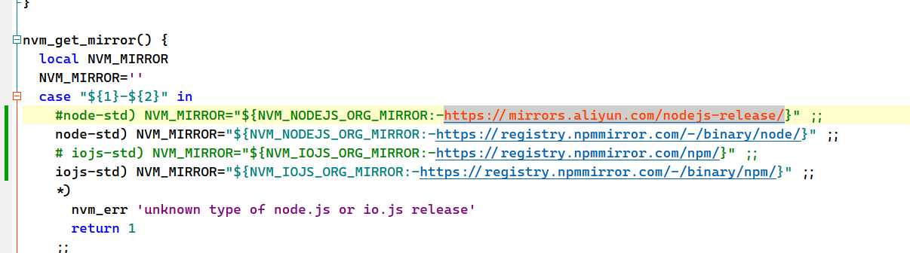
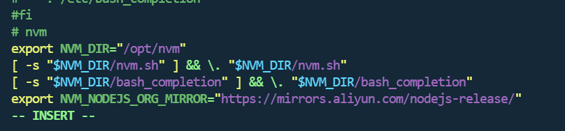

### 下载 NVM

在联网的机器上下载 NVM 的 tar 包。你可以在 [NVM 的 GitHub 页面](https://github.com/nvm-sh/nvm) 获取最新版本的网址。

使用以下命令下载：

```bash
curl -o nvm.tar.gz https://github.com/nvm-sh/nvm/archive/refs/tags/v0.39.5.tar.gz
```

请将 `v0.39.5` 替换为最新版本号。

### 将 tar 包转移到目标机器

将下载的 `nvm.tar.gz` 文件转移到你要安装 NVM 的 Ubuntu 机器上。你可以使用 USB 驱动器、scp 或其他文件传输工具。

### 解压 NVM

在目标机器上，打开终端并解压 tar 包：

```bash
tar -zxvf nvm.tar.gz
#或者
tar -xzf /path/to/nvm-v0.39.3.tar.gz -C ~/.nvm --strip-components=1
#这里的 --strip-components=1 参数用于去掉最外层的目录，确保 NVM 文件直接解压到 ~/.nvm 目录下
```

### 移动 NVM 到合适的位置

将解压后的目录移动到你希望安装 NVM 的位置，例如 `$HOME/.nvm`：

```bash
mv nvm-0.39.5 ~/.nvm
```

### 修改或添加 NVM 源

在 `nvm.sh` 文件中，找到 `NVM_NODEJS_ORG_MIRROR` 变量并修改其值为你想要使用的源。例如，要使用淘宝的 Node.js 镜像源，可以添加或修改以下行：

```bash
node_mirror: https://npmmirror.com/mirrors/node/
npm_mirror: https://npmmirror.com/mirrors/npm/

NVM_NODEJS_ORG_MIRROR="https://mirrors.aliyun.com/nodejs-release/"
NVM_IOJS_ORG_MIRROR="https://npmmirror.com/mirrors/npm/"
```



或者修改`.bashrc`文件

```bash
vim ~/.bashrc

#插入
export NVM_NODEJS_ORG_MIRROR="https://mirrors.aliyun.com/nodejs-release/"
```



NVM_NODEJS_ORG_MIRROR

### 配置环境变量

为了让你的 shell 知道 NVM 的位置，需要修改你的 shell 配置文件（例如 `.bashrc` 或 `.bash_profile` 或 `.zshrc`），添加以下内容：

```bash
export NVM_DIR="$HOME/.nvm"
[ -s "$NVM_DIR/nvm.sh" ] && \. "$NVM_DIR/nvm.sh"  # This loads nvm

# 示例：################################
# 指示nvm所在路径
export NVM_DIR="/opt/nvm"
# 加载nvm
[ -s "$NVM_DIR/nvm.sh" ] && \. "$NVM_DIR/nvm.sh" 
[ -s "$NVM_DIR/bash_completion" ] && \. "$NVM_DIR/bash_completion"
```

### 更新 shell 环境

使上述更改生效，可以执行以下命令：

```bash
source ~/.bashrc
```

或者，如果你使用的是 `.bash_profile` 或 `.zshrc`，请相应地替换文件名。

### 验证 NVM 是否安装成功

运行以下命令检查 NVM 是否已成功安装：

```bash
nvm --version
# 检查是否有node资源
nvm ls-remote
```

如果你看到版本号，那么 NVM 已成功安装。

### 安装 Node.js 版本（可选）

现在你可以使用 NVM 安装 Node.js。例如：

```bash
nvm install node   # 安装最新版本
nvm install 20.14.0     # 安装特定版本（如 14.x）
```

### 切换 Node.js 版本

安装完成后，你可以使用以下命令来查看和切换 Node.js 版本

```bash
nvm list
nvm use 20.14.0
```

### 默认 Node.js 版本

你可以设置一个默认的 Node.js 版本，这样**每次打开新的终端时都会自动使用这个版本**：

```
nvm alias default 20.14.0
```

### 注意事项

1. 如果在无网络环境中，需要先下载所需 Node.js 版本的 tar 包，并手动安装。
2. 确保在不同的 shell 会话中，NVM 配置正确。

### 修改npm配置

#### npm修改源

```shell
npm config set registry https://registry.npmmirror.com/

#检查
npm config get registry
```

#### npm查看各种全局路径的命令

- **查看当前npm包的全局安装路径**

```shell
npm prefix -g 
```

- **查看当前npm包的全局cache路径**

```shell
npm config get cache
```

- **查看配置列表**

```shell
npm config ls
```

- **查看配置列表的全部信息**

```shell
npm config ls -l
```

**【注】每次使用nvm切换node版本，最好都查看一下npm全局配置路径是否失效**

#### npm修改全局路径命令

- **修改npm的包的全局安装路径**

```shell
npm config set prefix "/opt/nvm/npm/global"
```

- **修改npm的包的全局cache位置**

```shell
npm config set cache "/opt/nvm/npm/cache"
```

#### 将npm的全局包注册到环境变量

编辑你的 shell 配置文件（如 `.bashrc` 或 `.zshrc`），添加以下内容：


```bash
vim ~/.bashrc
export PATH=$PATH:/opt/nvm/npm/global/bin
```

然后重新加载 shell 配置文件：

```
source ~/.bashrc
```

#### 测试

全局安装yarn

```shell
npm install -g yarn
```

测试yarn命令

```shell
y
```

