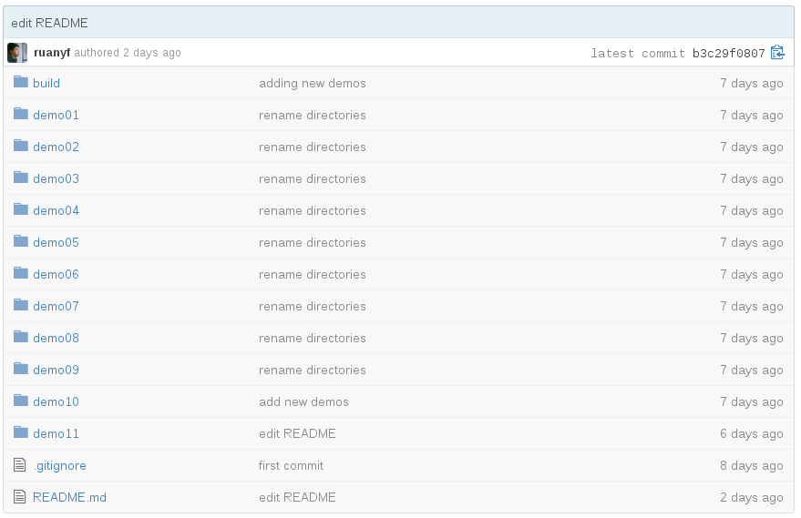

下面要讲解的12个例子在各个 `Demo` 子目录，每个目录都有一个 `index.html` 文件，在浏览器打开这个文件（大多数情况下双击即可），就能立刻看到效果。

需要说明的是，`React` 可以在`浏览器`运行，也可以在`服务器`运行，但是本教程`只涉及浏览器`。一方面是为了尽量保持简单，另一方面 React 的语法是一致的，服务器的用法与浏览器差别不大。[`Demo13`](https://github.com/ruanyf/react-demos/tree/master/demo13) 是服务器首屏渲染的例子，有兴趣的朋友可以自己去看源码。

## 一、HTML 模板

使用 `React` 的网页源码，结构大致如下。

```html
<!DOCTYPE html>
<html>
  <head>
    <script src="../build/react.js"></script>
    <script src="../build/react-dom.js"></script>
    <script src="../build/browser.min.js"></script>
  </head>
  <body>
    <div id="example"></div>
    <script type="text/babel">
      // ** Our code goes here! **
    </script>
  </body>
</html>
```

上面代码有两个地方需要注意。首先，最后一个 `<script>` 标签的 `type` 属性为 `text/babel` 。这是因为 `React` 独有的 `JSX` 语法，`跟 JavaScript 不兼容`。凡是使用 `JSX` 的地方，都要加上`type="text/babel"` 。

其次，上面代码一共用了三个库： `react.js` 、`react-dom.js` 和 `Browser.js` ，它们**必须首先加载**。其中，`react.js` 是 **React 的核心库**，`react-dom.js` 是**提供与 DOM 相关的功能**，`Browser.js` 的作用是**将 JSX 语法转为 JavaScript 语法**，这一步很消耗时间，实际上线的时候，应该将它放到服务器完成。

```shell
 babel src --out-dir build
```

上面命令可以将 `src` 子目录的 `js` 文件进行语法转换，转码后的文件全部放在 `build` 子目录。

## 二、ReactDOM.render()

`ReactDOM.render` 是` React` 的**最基本方法**，用于**将模板转为 HTML 语言，并插入指定的 DOM 节点**。

```react
ReactDOM.render(
  <h1>Hello, world!</h1>,
  document.getElementById('example')
);
```

上面代码将一个 `h1` 标题，插入 `example` 节点（查看 [`demo01`](https://github.com/ruanyf/react-demos/blob/master/demo01/index.html)），运行结果如下。


## 三、JSX 语法

上一节的代码， HTML 语言直接写在 JavaScript 语言之中，**不加任何引号**，这就是 `JSX` 的语法，它**允许 HTML 与 JavaScript 的混写**（查看 [`Demo02`](https://github.com/ruanyf/react-demos/blob/master/demo02/index.html) ）。

```react
var names = ['Alice', 'Emily', 'Kate'];

ReactDOM.render(
  <div>
  {
    names.map(function (name) {
      return <div>Hello, {name}!</div>
    })
  }
  </div>,
  document.getElementById('example')
);
```

上面代码体现了 `JSX` 的基本语法规则：遇到 `HTML` 标签（以 `<` 开头），就用` HTML `规则解析；遇到代码块（以 `{` 开头），就用` JavaScript `规则解析。上面代码的运行结果如下。


`JSX` 允许直接在模板插入` JavaScript 变量`。如果这个变量是一个数组，则会展开这个数组的所有成员（查看 [`demo03`](https://github.com/ruanyf/react-demos/blob/master/demo03/index.html) ）。

```react
var arr = [
  <h1>Hello world!</h1>,
  <h2>React is awesome</h2>,
];
ReactDOM.render(
  <div>{arr}</div>,
  document.getElementById('example')
);
```

上面代码的`arr`变量是一个数组，结果 JSX 会把它的所有成员，添加到模板，运行结果如下。


## 四、组件

`React` 允许将代码`封装成组件`（component），然后像插入普通 `HTML` 标签一样，在网页中插入这个组件。`React.createClass` 方法就用于`生成一个组件类`（查看 [`demo04`](https://github.com/ruanyf/react-demos/blob/master/demo04/index.html)）。

```react
var HelloMessage = React.createClass({
  render: function() {
    return <h1>Hello {this.props.name}</h1>;
  }
});

ReactDOM.render(
  <HelloMessage name="John" />,
  document.getElementById('example')
);
```

上面代码中，变量 `HelloMessage` 就是一个组件类。模板插入 `<HelloMessage />` 时，会自动生成 `HelloMessage` 的一个实例（下文的"组件"都指组件类的实例）。所有组件类都必须有自己的 `render` 方法，用于输出组件。

注意，**组件类的第一个字母必须大写**，否则会报错，比如`HelloMessage`不能写成`helloMessage`。另外，组件类**只能包含一个顶层标签**，否则也会报错。

```react
var HelloMessage = React.createClass({
  render: function() {
    return <h1>
      Hello {this.props.name}
    </h1><p>
      some text
    </p>;
  }
});
```

上面代码会报错，因为`HelloMessage`组件包含了两个顶层标签：`h1`和`p`。

组件的用法与原生的 HTML 标签完全一致，可以任意加入属性，比如 `<HelloMessage name="John">` ，就是 `HelloMessage` 组件加入一个 `name` 属性，值为 `John`。组件的属性可以在组件类的 `this.props` 对象上获取，比如 `name` 属性就可以通过 `this.props.name` 读取。上面代码的运行结果如下。


添加组件属性，有一个地方需要注意，就是 `class` 属性需要写成 `className` ，`for` 属性需要写成 `htmlFor` ，这是因为 `class` 和 `for` 是 JavaScript 的保留字。

## 五、this.props.children

`this.props` `对象的属性`与`组件的属性`**一一对应**，但是有一个例外，就是 `this.props.children` 属性。它**表示组件的所有子节点**（查看 [`demo05`](https://github.com/ruanyf/react-demos/blob/master/demo05/index.html)）。

```react
var NotesList = React.createClass({
  render: function() {
    return (
      <ol>
      {
        React.Children.map(this.props.children, function (child) {
          return <li>{child}</li>;
        })
      }
      </ol>
    );
  }
});

ReactDOM.render(
  <NotesList>
    <span>hello</span>
    <span>world</span>
  </NotesList>,
  document.body
);
```

上面代码的 `NoteList` 组件有两个 `span` 子节点，它们都可以通过 `this.props.children` 读取，运行结果如下。


这里需要注意， `this.props.children` 的值有三种可能：如果当前组件没有子节点，它就是 `undefined` ;如果有一个子节点，数据类型是 `object` ；如果有多个子节点，数据类型就是 `array` 。所以，处理 `this.props.children` 的时候要小心。

React 提供一个工具方法 [`React.Children`](https://facebook.github.io/react/docs/top-level-api.html#react.children) 来处理 `this.props.children` 。我们可以用 `React.Children.map` 来遍历子节点，而不用担心 `this.props.children` 的数据类型是 `undefined` 还是 `object`。更多的 `React.Children` 的方法，请参考[官方文档](https://facebook.github.io/react/docs/top-level-api.html#react.children)。

## 六、PropTypes

组件的属性可以接受任意值，字符串、对象、函数等等都可以。有时，我们需要一种机制，验证别人使用组件时，提供的参数是否符合要求。

组件类的`PropTypes`属性，就是用来验证组件实例的属性是否符合要求（查看 [`demo06`](https://github.com/ruanyf/react-demos/blob/master/demo06/index.html)）。

```react
var MyTitle = React.createClass({
  propTypes: {
    title: React.PropTypes.string.isRequired,
  },

  render: function() {
     return <h1> {this.props.title} </h1>;
   }
});
```

上面的`Mytitle`组件有一个`title`属性。`PropTypes` 告诉 React，这个 `title` 属性是必须的，而且它的值必须是字符串。现在，我们设置 `title` 属性的值是一个数值。

```react
var data = 123;

ReactDOM.render(
  <MyTitle title={data} />,
  document.body
);
```

这样一来，`title`属性就通不过验证了。控制台会显示一行错误信息。

```sh
Warning: Failed propType: Invalid prop `title` of type `number` supplied to `MyTitle`, expected `string`.
```

更多的`PropTypes`设置，可以查看[官方文档](https://facebook.github.io/react/docs/reusable-components.html)。

此外，`getDefaultProps` 方法可以用来设置组件属性的默认值。

```react
var MyTitle = React.createClass({
  getDefaultProps : function () {
    return {
      title : 'Hello World'
    };
  },

  render: function() {
     return <h1> {this.props.title} </h1>;
   }
});

ReactDOM.render(
  <MyTitle />,
  document.body
);
```

上面代码会输出"Hello World"。

## 七、获取真实的DOM节点

**组件并不是真实的 DOM 节点，而是存在于内存之中的一种数据结构，叫做虚拟 DOM （virtual DOM）**。只有当它插入文档以后，才会变成真实的 DOM 。根据 React 的设计，**所有的 DOM 变动，都先在虚拟 DOM 上发生，然后再将实际发生变动的部分，反映在真实 DOM上，这种算法叫做 [`DOM diff`](http://calendar.perfplanet.com/2013/diff/)** ，它可以极大提高网页的性能表现。

但是，有时需要从组件获取真实 DOM 的节点，这时就要用到 `ref` 属性（查看 [demo07](https://github.com/ruanyf/react-demos/blob/master/demo07/index.html) ）。

```react
var MyComponent = React.createClass({
  handleClick: function() {
    this.refs.myTextInput.focus();
  },
  render: function() {
    return (
      <div>
        <input type="text" ref="myTextInput" />
        <input type="button" value="Focus the text input" onClick={this.handleClick} />
      </div>
    );
  }
});

ReactDOM.render(
  <MyComponent />,
  document.getElementById('example')
);
```

上面代码中，组件 `MyComponent` 的子节点有一个文本输入框，用于获取用户的输入。这时就必须获取真实的 DOM 节点，虚拟 DOM 是拿不到用户输入的。为了做到这一点，文本输入框必须有一个 `ref` 属性，然后 `this.refs.[refName]` 就会返回这个真实的 DOM 节点。

需要注意的是，由于 `this.refs.[refName]` 属性**获取的是真实 DOM** ，所以**必须等到虚拟 DOM 插入文档以后，才能使用这个属性，否则会报错**。上面代码中，通过为组件指定 `Click` 事件的回调函数，确保了只有等到真实 DOM 发生 `Click` 事件之后，才会读取 `this.refs.[refName]` 属性。

React 组件支持很多事件，除了 `Click` 事件以外，还有 `KeyDown` 、`Copy`、`Scroll` 等，完整的事件清单请查看[官方文档](https://facebook.github.io/react/docs/events.html#supported-events)。

## 八、this.state

组件免不了要与用户互动，React 的一大创新，就是**将组件看成是一个状态机**，**一开始有一个初始状态，然后用户互动，导致状态变化，从而触发重新渲染 UI** （查看 [`demo08`](https://github.com/ruanyf/react-demos/blob/master/demo08/index.html) ）。

```react
var LikeButton = React.createClass({
  getInitialState: function() {
    return {liked: false};
  },
  handleClick: function(event) {
    this.setState({liked: !this.state.liked});
  },
  render: function() {
    var text = this.state.liked ? 'like' : 'haven\'t liked';
    return (
      <p onClick={this.handleClick}>
        You {text} this. Click to toggle.
      </p>
    );
  }
});

ReactDOM.render(
  <LikeButton />,
  document.getElementById('example')
);
```

上面代码是一个 `LikeButton` 组件，它的 `getInitialState` 方法用于定义初始状态，也就是一个对象，这个对象可以通过 `this.state` 属性读取。当用户点击组件，导致状态变化，`this.setState` 方法就修改状态值，每次修改以后，自动调用 `this.render` 方法，再次渲染组件。

由于 `this.props` 和 `this.state` 都用于描述组件的特性，可能会产生混淆。一个简单的区分方法是，`this.props` 表示那些一旦定义，就不再改变的特性，而 `this.state` 是会随着用户互动而产生变化的特性。

## 九、表单

用户在表单填入的内容，属于用户跟组件的互动，所以不能用 `this.props` 读取（查看 [`demo9`](https://github.com/ruanyf/react-demos/blob/master/demo09/index.html) ）。

```react
var Input = React.createClass({
  getInitialState: function() {
    return {value: 'Hello!'};
  },
  handleChange: function(event) {
    this.setState({value: event.target.value});
  },
  render: function () {
    var value = this.state.value;
    return (
      <div>
        <input type="text" value={value} onChange={this.handleChange} />
        <p>{value}</p>
      </div>
    );
  }
});

ReactDOM.render(<Input/>, document.body);
```

上面代码中，文本输入框的值，不能用 `this.props.value` 读取，而要定义一个 `onChange` 事件的回调函数，通过 `event.target.value` 读取用户输入的值。`textarea` 元素、`select`元素、`radio`元素都属于这种情况，更多介绍请参考[官方文档](https://facebook.github.io/react/docs/forms.html)。

## 十、组件的生命周期

组件的[生命周期](https://facebook.github.io/react/docs/working-with-the-browser.html#component-lifecycle)分成三个状态：

> - `Mounting`：已插入真实 DOM
> - `Updating`：正在被重新渲染
> - `Unmounting`：已移出真实 DOM

React 为**每个状态都提供**了两种处理函数，`will` 函数在**进入状态之前**调用，`did` 函数在**进入状态之后**调用，三种状态共计五种处理函数。

> - componentWillMount()
> - componentDidMount()
> - componentWillUpdate(object nextProps, object nextState)
> - componentDidUpdate(object prevProps, object prevState)
> - componentWillUnmount()

此外，React 还提供两种特殊状态的处理函数。

> - componentWillReceiveProps(object nextProps)：已加载组件收到新的参数时调用
> - shouldComponentUpdate(object nextProps, object nextState)：组件判断是否重新渲染时调用

这些方法的详细说明，可以参考[官方文档](https://facebook.github.io/react/docs/component-specs.html#lifecycle-methods)。下面是一个例子（查看 [`demo10`](https://github.com/ruanyf/react-demos/blob/master/demo10/index.html) ）。

```react
var Hello = React.createClass({
  getInitialState: function () {
    return {
      opacity: 1.0
    };
  },

  componentDidMount: function () {
    this.timer = setInterval(function () {
      var opacity = this.state.opacity;
      opacity -= .05;
      if (opacity < 0.1) {
        opacity = 1.0;
      }
      this.setState({
        opacity: opacity
      });
    }.bind(this), 100);
  },

  render: function () {
    return (
      <div style={{opacity: this.state.opacity}}>
        Hello {this.props.name}
      </div>
    );
  }
});

ReactDOM.render(
  <Hello name="world"/>,
  document.body
);
```

上面代码在`hello`组件加载以后，通过 `componentDidMount` 方法设置一个定时器，每隔100毫秒，就重新设置组件的透明度，从而引发重新渲染。

另外，组件的`style`属性的设置方式也值得注意，不能写成

```react
style="opacity:{this.state.opacity};"
```

而要写成

```react
style={{opacity: this.state.opacity}}
```

这是因为 [React 组件样式](https://facebook.github.io/react/tips/inline-styles.html)是一个对象，所以第一重大括号表示这是 JavaScript 语法，第二重大括号表示样式对象。

## 十一、Ajax

组件的数据来源，通常是通过 Ajax 请求从服务器获取，可以使用 `componentDidMount` 方法设置 Ajax 请求，等到请求成功，再用 `this.setState` 方法重新渲染 UI （查看 [`demo11`](https://github.com/ruanyf/react-demos/blob/master/demo11/index.html) ）。

```react
var UserGist = React.createClass({
  getInitialState: function() {
    return {
      username: '',
      lastGistUrl: ''
    };
  },

  componentDidMount: function() {
    $.get(this.props.source, function(result) {
      var lastGist = result[0];
      if (this.isMounted()) {
        this.setState({
          username: lastGist.owner.login,
          lastGistUrl: lastGist.html_url
        });
      }
    }.bind(this));
  },

  render: function() {
    return (
      <div>
        {this.state.username}'s last gist is
        <a href={this.state.lastGistUrl}>here</a>.
      </div>
    );
  }
});

ReactDOM.render(
  <UserGist source="https://api.github.com/users/octocat/gists" />,
  document.body
);
```

上面代码使用 jQuery 完成 Ajax 请求，这是为了便于说明。**React 本身没有任何依赖，完全可以不用jQuery，而使用其他库。**

我们甚至可以把一个Promise对象传入组件，请看[`Demo12`](https://github.com/ruanyf/react-demos/blob/master/demo12/index.html)。

```react
ReactDOM.render(
  <RepoList
    promise={$.getJSON('https://api.github.com/search/repositories?q=javascript&sort=stars')}
  />,
  document.body
);
```

上面代码从Github的API抓取数据，然后将Promise对象作为属性，传给`RepoList`组件。

如果Promise对象正在抓取数据（pending状态），组件显示"正在加载"；如果Promise对象报错（rejected状态），组件显示报错信息；如果Promise对象抓取数据成功（fulfilled状态），组件显示获取的数据。

```react
var RepoList = React.createClass({
  getInitialState: function() {
    return { loading: true, error: null, data: null};
  },

  componentDidMount() {
    this.props.promise.then(
      value => this.setState({loading: false, data: value}),
      error => this.setState({loading: false, error: error}));
  },

  render: function() {
    if (this.state.loading) {
      return <span>Loading...</span>;
    }
    else if (this.state.error !== null) {
      return <span>Error: {this.state.error.message}</span>;
    }
    else {
      var repos = this.state.data.items;
      var repoList = repos.map(function (repo) {
        return (
          <li>
            <a href={repo.html_url}>{repo.name}</a> ({repo.stargazers_count} stars) <br/> {repo.description}
          </li>
        );
      });
      return (
        <main>
          <h1>Most Popular JavaScript Projects in Github</h1>
          <ol>{repoList}</ol>
        </main>
      );
    }
  }
});
```

