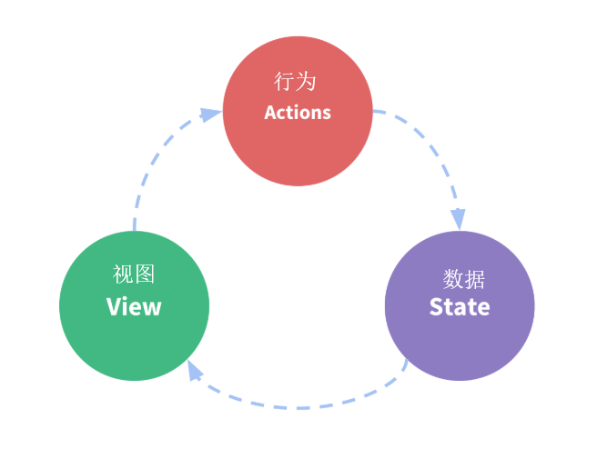

# VUEX

[toc]

## 介绍

### Vuex是什么？

简单的说：`Vuex是vue框架中状态管理`。

`Vuex` 是一个`专为` ` Vue.js` 应用程序开发的`状态管理模式`

`Vuex` — `状态管理器`，可以`管理你的数据状态`（类似于` React`的` Redux`）

一个`Vuex `应用的`核心`是 `store`（仓库，一个容器），`store`包含着`应用中大部分的状态 (state)`

`Vuex`可以`解决` `不同组件之间通信`的问题。比如两个组件同一级的情况下，数据可以进行通信

**简单的理解：**

在`state`中定义了一个`数据`之后，可以在所在`项目中的任何一个组件`里进行`获取`、`修改`，并且修改可以得到`全局的响应变更`

这里就又出现一个问题：那什么是“`状态管理模式`”？

### 什么是“状态管理模式”？

把`组件`的`共享状态`抽取出来，以一个`全局单例模式`管理。

在这种模式下，我们的组件树构成了一个巨大的“视图”，不管在树的哪个位置，`任何组件`都能`获取状态`或者`触发行为`！这就是“`状态管理模式`”。


### Vuex 和单纯的全局对象有何不同？

1. `Vuex` 的`状态`存储是`响应式`的

   > 当 `Vue 组件`从 `store` 中读取状态的时候，若` store` 中的状态`发生变化`，那么`相应的组件`也会相应地得到`高效更新`

2. `不`能`直接改变` `store` 中的状态

   > 改变 store 中的状态的`唯一途径`就是`显式地提交 (commit) mutation`，方便我们`跟踪` `每一个` `状态的变化` 

### 应用场景有： 

1. 适用于`中大型单页应用`

2. 复杂的页面，一个数据多个页面或路由共享（互相交互），`多层级数据交互`。

   ```js
   #min.js文件
   
   import Vue from 'vue'//引入vue依赖
   import App from './App.vue'//引入APP主组件
   import Store from './store/store'//引入store状态管理
   
   //创建一个vue实例
   new Vue({
       render:h => h(App),//渲染App组件
       store//将store仓库挂载Vue实例上
   }).$mount('#app')
   ```

   

   ```js
   #在store文件夹下创建一个store.js
   
   import Vue from 'vue';
   import Vuex from 'vuex';
   Vue.use(Vuex);//通过use使用Vuex
   
   new Vuex.Store({
       //方法里面传个对象
       //初始化状态的数据
       //当改变state时候就会改变试图
   
   })
   const state = {
       num: 0
   }
   const mutations = {
       add(state){
           state.num +=1;
       }
   }
   export default new Vuex.Store({
       store,
       mutations
   })
   ```

   

### 应用实例：

1. 购物车功能；
2.  下单页面有选择优惠券按钮，点击进入优惠券页面，选择后返回到下单页，数据会绑定回来，显示已选择的优惠券； 
3. 登录状态等等

### 🚩目录结构实例

```shell
├── index.html
├── main.js
├── api
│   └── ... # 抽取出API请求
├── components
│   ├── App.vue
│   └── ...
└── store
    ├── index.js          # 我们组装模块并导出 store 的地方
    ├── actions.js        # 根级别的 action
    ├── mutations.js      # 根级别的 mutation
    └── modules
        ├── cart.js       # 购物车模块
        └── products.js   # 产品模块
```


## 安装

### 直接下载 / CDN 引用

https://unpkg.com/vuex@4

[Unpkg.com](https://unpkg.com/) 提供了基于` npm` 的 `CDN 链接`。以上的链接会一直指向 `npm` 上发布的`最新版本`。您也可以通过 `https://unpkg.com/vuex@4.0.0/dist/vuex.global.js` 这样的方式`指定特定的版本`。

在 `Vue` 之后引入 `vuex` 会进行`自动安装`：

```html
<script src="/path/to/vue.js"></script>
<script src="/path/to/vuex.js"></script>
```

### 🚩npm

```sh
npm install vuex@next --save  #next为最新版本

#或
npm install vuex --save
```

### Yarn

```shell
yarn add vuex@next --save
```

### Promise

Vuex 依赖 [Promise (opens new window)](https://developer.mozilla.org/zh-CN/docs/Web/JavaScript/Guide/Using_promises)。如果你支持的浏览器并没有实现 Promise (比如 IE)，那么你可以使用一个 polyfill 的库，例如 [es6-promise (opens new window)](https://github.com/stefanpenner/es6-promise)。

你可以通过 CDN 将其引入：

```html
<script src="https://cdn.jsdelivr.net/npm/es6-promise@4/dist/es6-promise.auto.js"></script>
```

然后 `window.Promise` 会自动可用。

如果你喜欢使用诸如 npm 或 Yarn 等包管理器，可以按照下列方式执行安装：

```bash
npm install es6-promise --save # npm
yarn add es6-promise # Yarn
```

或者更进一步，将下列代码添加到你使用 Vuex 之前的一个地方：

```js
import 'es6-promise/auto'
```

### 自己构建

如果需要使用 dev 分支下的最新版本，您可以直接从 GitHub 上克隆代码并自己构建。

```sh
git clone https://github.com/vuejs/vuex.git node_modules/vuex
cd node_modules/vuex
yarn
yarn build
```

---

## 🚩使用vuex的步骤

### 🚩1、安装

```sh
npm install vuex --save


#vue2的项目如果直接安装vuex，不指定版本的话，就会直接安装最新的vuex的版本。所以会出现报错
#可以先运行 npm view vuex versions --json，看看有哪些适合的版本的vuex
#然后安装特定的版本，就这样：npm install vuex@3.6.2
```

### 🚩2、引包（store文件夹 store.js下）

```js
#引入vue 和 vuex

import Vue from 'vue';
import Vuex from 'vuex';
```

### 🚩3、use使用(store.js)

```js
Vue.use(Vuex)
```

### 🚩4、new Vuex.Store实例(store.js)

```js
new Vuex.Store({
/*
    想要哪些数据被所有组件直接拿到
    就把这个数据放在state下
*/
    state:{
        //初始化的状态
    },
    mutations:{
        //改变数据的方法
        add(state){//传入state初始化状态
            此处为改变state.xx数据的代码
        }
        //括号内为mutations中函数名，可以跟若干参数
        this.$store.commit(add)
    }
})

/*
    注意：改变state中的复合类型数据必须让数据直接发生变化（地址发生变化）
    比如
    arr:[{id:xx,num:123}]
    要改变它的数字，首先找到这组，改变外面的arr
    {id:xx,num:1234}
    state.arr = [...state.arr]//把新地址赋给ta
*/

```

### 🚩5、将store挂载到vue（min.js）

```js
new Vue({
  render: h => h(App),
  store//将store挂载 vue实例上
}).$mount('#app')
```

### 完整示例

```js
#store文件夹 store.js
#vuex没有this

import Vue from 'vue'; 
import Vuex from 'vuex';

Vue.use(Vuex); 

//const store的store必须小写，main.js挂载不能识别大小，会报错
export const store = new Vuex.Store({ 
    state: { 
        counter: 0,
        isTest: "我是测试文字",
		num: 10
    }, 
    // 展示内容, 无法改变状态 
    getters: { 
        tripleCounter: state => {
            return state.counter * 3; 
        } ,
        getF(state) {
			console.log(state);
		}
    }, 
    // 改变状态 
    //mutations 永远是同步的 
    mutations: { 
        // 显示传递的载荷 payload, 用 num 表示 
        increment: (state, num) => { 
            state.counter += num; 
        } ,
        addNum(state) {
			state.num++;
		},
		add(state, addP) {
			state.num += addP;
		}
    }, 
    // 提交 mutation, 这是异步的 
    actions: { 
        // 显示传递的载荷 payload, 用 asynchNum ( 一个对象 )表示 
        asyncDecrement: ({ commit }, asyncNum) => { 
            setTimeout(() => { 
                // asyncNum 对象可以是静态值 
                commit('decrement', asyncNum.by); 
            }, asyncNum.duration); 
        } 
    } 
});

```

```js
#main.js

import Vue from 'vue'; 
import App from './App.vue'; 
import { store } from './store/store'; 

new Vue({ 
    el: '#app', 
    store: store, 
    template: '<App/>', 
    components: { App } 
});
```

```vue
#app.vue 

<template>
	<div id="App">
		
		{{this.$store.state.isTest}}
		<br>
		<br>
		<button v-on:click="addNum">数字加1</button>
		{{this.$store.state.num}}
		<br>
		<br>
		<button v-on:click="addNumP(5)">数字加</button>
		<br>
		<br>
		<button v-on:click="vuexGetterF">VUEX_Getter</button>
	</div>
</template>

<script>
	export default {
		name: 'App',
		data() {
			return {
				asss: this,
			}
		},
		methods: {
			vuexGetterF(){
				this.$store.getters.getF;
			},
			addNum(){
				this.$store.commit("addNum");
			},
			addNumP(p){
				this.$store.commit("add",p);
			}，
            increment() { 
        		this.$store.dispatch('increment', 2) 
   	 		} 
		}，
        computed: { 
            value() { 
                return this.$store.getters.value; 
            }, 
		}
	}
</script>


```

#### **状态管理模式**

单向数据流的示意图

（`只能从一个方向来修改状态`）



改变数据只有通过`Actions`（actions又通过mutations）更改

`状态进行更改`之后会`影响视图`，`视图`要通过`actions`发起一个`行为`，才能`更改数据`

---

## 🚩Vuex的几个核心模块

1. `State`：访问状态对象
2. `Mutation`：修改状态(只限同步任务)
3. `Getter`：计算过滤操作
4. `Action`：异步修改状态(加强版Mutation)
5. `Module`：模块组

**每个核心都有相对应的`辅助函数`（用来简化操作）**

`mapState`、`mapMutation`、`mapGetter`、`mapAction`

**使用之前需要引入**下，比如

```js
import {mapState,mapMutation} from 'vuex'
```

### 🚩State

即Vuex中的`基本数据`

Vuex使用`单一状态树`，即用`一个对象`就`包含了全部的状态数据`

```js
//可以通过Vue的Computed获得Vuex的state
const store = new Vuex.Store({
    state: {
        count:0
    }
})
const app = new Vue({
    //..
    store,
    computed: {
        count: function(){
            return this.$store.state.count
        }
    },
    //..
})
//每当 $store.state.count 变化时, 都会重新计算，并且触发更新DOM
```

```cjs
//通过 $store.state 来获取状态对象
//通过 $store.commit 方法触发状态变更
```

### 🚩Mutations

`mutations`下的操作`都是同步`，`action`可以`包含任意异步操作`

只有`mutations`才能改变`vuex`中的`数据状态state`

什么时候让`mutations`改变，使用<font>this.$store.commit('函数名称')</font>

每个 `mutation` 都有一个`字符串`的 `事件类型` (type) 和 一个 `回调函数` (handler)

这个`回调函数`就是我们`实际进行状态更改的地方`，并且它会`接受` `state` 作为`第一个参数`

### 🚩Action

`Action` 类似 `mutation`

#### 与`mutation`的区别：

1. `Action`可以`包含任意异步操作`，而`mutation是同步`的
2. `Action`  `提交`的是 `mutation`，而`不是直接更改状态`（==只有`mutation`才能更改==）

#### 示例

**`Action` 通过 <font>store.dispatch</font> 方法触发**

```js
actions:{
    actionsName($store,可以跟参数){
    //异步环境之后使用
        $store.commit('add,参数')
    }
}
```

**view层使用**

```js
this.$store.dispatch('actionsName,传参')
```

#### 应用场景

**只要是这个数据状态需要很多组件时间，并且还是后台请求的数据（异步数据）就要使用Action**

### 🚩Getter

他可以从`store` 中的` state` 中`派生出一些状态`

`getters`接收`state`作为其`第一个参数`，接受`其他 getters `作为`第二个参数`，如`不需要`，`第二个参数可以省略`

与`state`一样，也可以通过`Vue`的`computed`获得`Vuex`的`getters`

`getters`等同于`vue`的`computed(计算属性)`，也是`上来就会执行一次`

#### 应用场景：

**当数据发生变化时去做（派生）另一个事物**

### 🚩Modules

使用`单一状态树`，会`导致` `应用的所有状态集中到一个很大的对象，造成臃肿`。

`Vuex` 允许我们将 `store` `分割到模块`（module），从而解决臃肿问题

==每个模块拥有自己的 state、mutation、action、getters==

```js
const moduleA = {
  state: { ... },
  mutations: { ... },
  actions: { ... },
  getters: { ... }
}

const moduleB = {
  state: { ... },
  mutations: { ... },
  actions: { ... }
}

const store = new Vuex.Store({
  modules: {
    a: moduleA,
    b: moduleB
  }
})

store.state.a // -> moduleA 的状态
store.state.b // -> moduleB 的状态
```

#  详细案例

## 1、src 下新建文件

我们在项目（vue-cli 脚手架）下 `src 文件夹下`新建一个` store`，在这个`store下`新建 `index.js 文件`，如下面完整的内容：

```js
import Vue from 'vue'
import Vuex from 'vuex'
Vue.use(Vuex)

const state = {
 	blogTitle: '迩伶贰blog',
 	views: 10,
 	blogNumber: 100,
 	total: 0,
 	todos: [
 		{id: 1, done: true, text: '我是码农'},
 		{id: 2, done: false, text: '我是码农202号'},
 		{id: 3, done: true, text: '我是码农202号'}
 	]
}

const actions = {
	 addViews ({commit}) {
		 commit('addViews')
	 },
	clickTotal ({commit}) {
 		commit('clickTotal')
 	},
 	blogAdd ({commit}) {
 		commit('blogAdd')
 	}
}

const mutations = {
 	addViews (state) {
 		state.views++
 	},
	blogAdd (state) {
 		state.blogNumber++
 	},
 	clickTotal (state) {
 		state.total++
 	}
}

const getters = {
	 getToDo (state) {
 		return state.todos.filter(item => item.done === true)
 		// filter 迭代过滤器 将每个item的值 item.done == true 挑出来， 返回的是一个数组
 	}
}

export default new Vuex.Store({
	state,
 	actions,
 	mutations,
 	getters
})

// 将四大金刚挂载到 vuex的Store下
```

## 2、main.js 导入文件

```js
import Vue from 'vue'
import App from './App'
import router from './router/router.js'
// 引入 状态管理 vuex
import store from './store'
// 引入elementUI
import ElementUI from 'element-ui'
// 引入element的css
import 'element-ui/lib/theme-chalk/index.css'
// 引入font-awesome的css
import 'font-awesome/css/font-awesome.css'
// 引入自己的css
import './assets/css/custom-styles.css'
Vue.config.productionTip = false
Vue.use(ElementUI)
/* eslint-disable no-new */
new Vue({
 	el: '#app',
 	router,
 	store,
 	template: '',
 	components: { App }
})
```

## 3、组件中使用

```vue
<template>
	<p>
	<h4>vuex的状态管理数据</h4>
	<h5>博客标题</h5>
	<i>
		{{this.$store.state.blogTitle}}
	</i>
	<h5>todos里面的信息</h5>
	<u1>
		<li v-for="item in todosALise" :key="item.id">
			<span>{{item.text}}</span>
			<br>
			<span>{{item.done}}</span>
			</1i>
	</u1>
	<h5>初始化访问量</h5>
	<p>
		mapState方式{{viewsCount}}; <br>
		直接使用views {{this.$store.state.views}}
	</p>
	<h4>blogNumber数字</h4>
	<span>state中blogNumber:{{this.$store.state.blogNumber}}</ span>
		<h4>总计</h4>
		<span>state中total:{{this.$store.state.total}}</span>
		<p>
			<button @click="totalAlise">点击增加total</button>
		</p>
</template>

<script>
	import {
		mapState,
		mapGetters,
		mapActions,
		mapMutations
	} from ' vuex'
	export default {
		data() {
			return {
				checked: true
			}
		},
		created() {
			// this. $store . dispatch('addViews') //直接通过store的方法触发action,改变views 的值
			this.blogAdd() //通过mapActions触发mutation从而commit，改变state的值
		},
		computed: {
			...mapState({
				viewsCount: 'views '
			}),
			...mapGetters({
				todosALise: 'getToDo' // getToDo 不是字符串，对应的是getter里面的一个方法名字然后将这个方法名字重新取一个别名todosALise 
			})
		},
		methods: {
			...mapMutations({
				totalAlise: 'clickTotal' // clickTotal 是mutation 里的方法，totalAlise是 重新定义的一个别名组件直接调用这个方法
			})，
			...mapActions({
				blogAdd: 'blogAdd' //第一个blogAdd是定义的一个函数别名称，挂载在到this(vue)实例上，后面一个才是actions里面函数方法名称
			})
		}
	}
</script>
<style>
</style>

```

