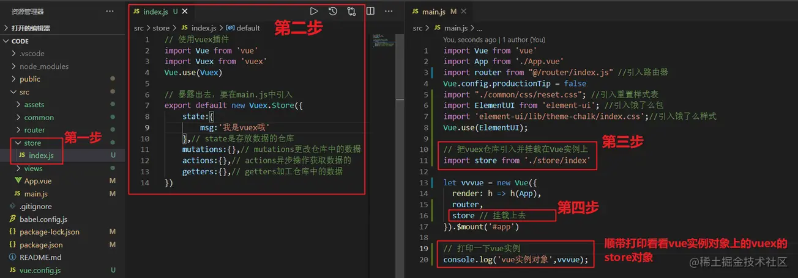
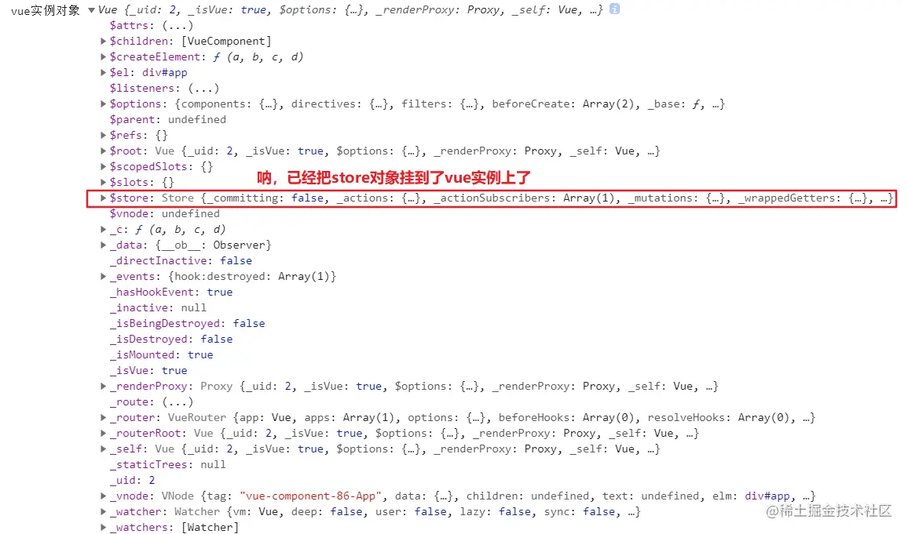
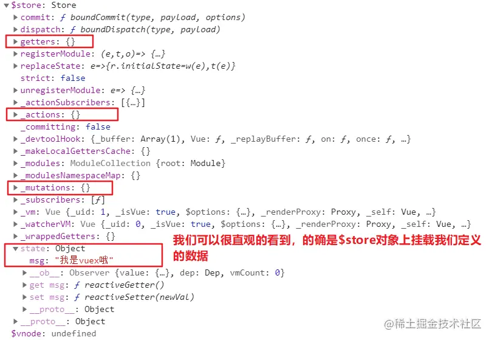
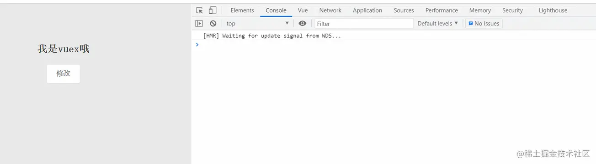
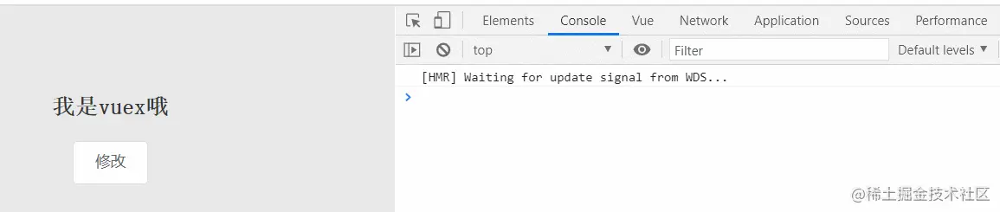
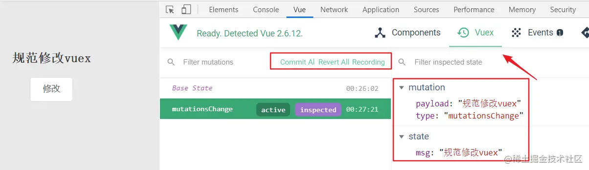
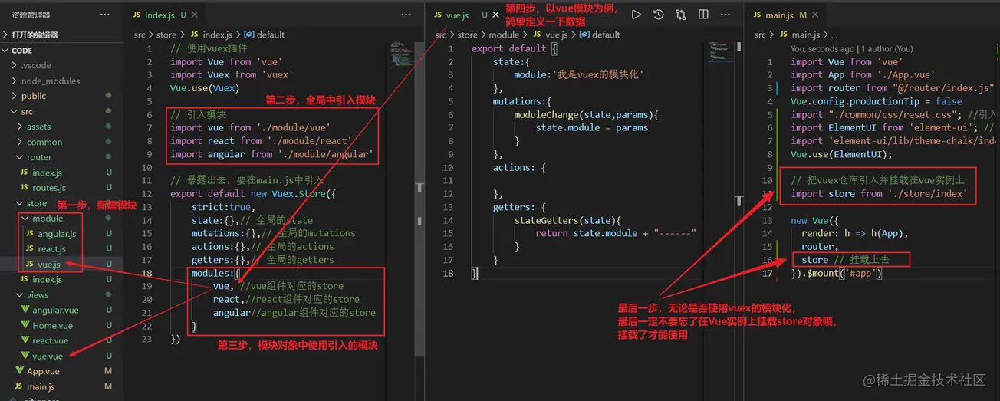
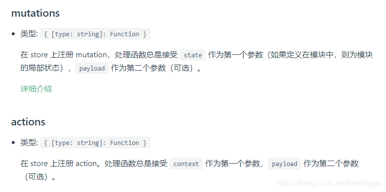

## 什么是vuex

### 官方定义

`Vuex `是一个`专为 Vue.js 应用程序开发的状态管理模式`。它采用集中式存储管理应用的所有组件的状态，并以相应的规则保证状态以一种可预测的方式发生变化。

> 初学vuex，读完这段官方定义以后，黑人问号，感觉每个字都认识，但是合在一块了，好像就不理解了。好叭，让我们用大白话翻译一下。补充：官方文档定义一个概念的时候，的确是要做到表述凝练简洁，所以就会出现这样的定义概念略有晦涩的情况

### 大白话讲解

- Vuex 是一个专为 Vue.js 应用程序开发的**状态管理模式**

  > vuex是为vue.js项目开发的一个插件（包），这个插件（包）主要就是用来做`状态管理`的。
  >
  > 问：什么是状态管理，状态管理就管理状态的（好像是废话），其实在开发中，有一个比较常听到的词就是状态，何为状态？我们知道灯泡开和关分别是一种固定状态，我们可用1代表开，0代表关。这样的话，用数字就可以代表状态了，那反过来说，状态就是数据的具体表现形式，所以我们可以这样理解：状态管理就是数据管理，进一步而言，vuex就是去管理vue中的数据的

- 它采用集中式存储管理应用的所有组件的状态

  > 鲁迅说：vue是组件化开发，就是把一个页面拆分成一小块一小块。每一小块都要有自己的数据用来呈现。比如下拉框有下拉框供选择的数据，表格有表格要呈现的数据。那么这些数据可以直接放在.vue文件中的data里面去管理，但是如果是大项目的话，数据放在.vue中的data去管理略有欠缺。所以：可以使用vuex去统一存放管理各个组件的数据。vuex就像一个仓库，用来存放组件中需要用到的数据，至于管理，就是增删改查，往vuex中存取、修改、删除等操作

- 并以相应的规则保证状态以一种可预测的方式发生变化

  > 这句话的意思就是，想要存取、修改、删除vuex仓库中的状态数据，需要按照一定的语法规则，比如按照**action**-->**mutaion**-->**state**的规则去增删改查，比如使用辅助函数如增删改查vuex中的数据。这个具体的规则下文中的vuex使用步骤中会逐一讲解

所以`vuex就是一个仓库，用来存放数据的`。所以我们使用`vuex`一般会新建一个`store文件夹`，store单词的中文意思就是商店、仓库的意思

### vuex的应用场景

- `正常数据`放到`data`里面就行了，免得麻烦，一般小项目都很少用到vuex，毕竟vuex的步骤稍微多一点
- 一般`公共数据`放到`vuex`中会比较好，毕竟组件有自己的data可以存放数据，`公共的变量`如`用户信息`、`token等`。`vuex存一份`，`localstorage再存一份`，取数据`直接从vuex里面取`，`取不到`再从`localstorage里面去取`。
- `跨很多组件层级的数据通信`，也可以通过`vuex`去做管理，毕竟vuex就像一个对象一个，好多组件都指向这个对象，当这个vuex对象发生了变化，所有的组件中对应的内容都会发生变化，这样就能做到实时响应，一个变，大家都变

## 使用步骤

> 首先要搭建好项目，搭建项目的过程不赘述，项目搭建好了，我们就可以按照如下步骤使用vuex了

### 第一步 npm下载安装vuex插件

因为`vuex`是特定的用来`管理vue中的数据`的一款插件，所以按照可插拔框架的思想，想要使用vuex就下载安装，不想用的时候就卸载即可

```shell
npm install vuex --save
```

### 第二步 新建store文件夹注册使用vuex插件

如下图： 

> 把`store`对象`挂载到vue对象上`面的话，那么`每个组件都可以访问到这个store对象`了，那么每个组件都能去使用vuex了

#### 打印的vue实例对象如下图



#### 看一下$store的上具体内容



既然`vue`的总实例上挂载的`vuex`的 `$store`对象中有我们定义的`state`、`mutations`、`actions`、`getters`，那么我们通过`this.$store...`就可以在各个组件上访问、使用`vuex`中数据了。这么一来，就验证了`vuex`文档中的那句话：`vuex采用集中式存储管理应用的所有组件的状态`是啊，都集中在`vue实例上`了，所有组件的状态都可以访问到了。

> 其实学习vuex就是学习两点：
>
> 1. 如何读取`vuex`中仓库的数据
> 2. 如何修改`vuex`中仓库的数据

### 第三步 `读取`vuex中仓库的数据

在上述代码中，我们已经在`vuex`中的`state`里面定义了一个`msg`属性，再贴一下代码

```js
export default new Vuex.Store({
    state:{
        msg:'我是vuex哦'
    },
    // 等...
})
```

接下来我们在组件中使用这个数据，并呈现在页面上

#### 方式一 双括号表达式直接使用（不推荐）

`<h2>{{this.$store.state.msg}}</h2>` 

方式一不太优雅，一般不用，主要用方式二或方式三

#### 方式二 `mounted`中去取用`vuex`中的数据

```vue
<template>
  <div class="box">
      <h2>{{msg}}</h2>
  </div>
</template>
<script>
export default {
    data() {
        return { msg:'' }
    },
    mounted() {
        this.msg = this.$store.state.msg
    },
}
</script>
```

#### 方式三 使用`computed`去取`vuex`中的数据

```vue
<template>
  <div class="box">
      <h2>{{msg}}</h2>
  </div>
</template>
<script>
export default {
    computed: {
        msg(){ return this.$store.state.msg }
    }
}
</script>
```

### 第四步 修改vuex中的数据

一般是在事件的`回调函数`中去修改`vuex`中的数据，比如我们点击一个按钮，去修改`vuex`中的数据

#### 方式一 直接修改（不推荐）

```vue
<template>
  <div class="box">
      <h2>{{msg}}</h2>
      <el-button @click="changeVuex">修改</el-button>
  </div>
</template>

<script>
export default {
    methods: {
        // 直接赋值修改vuex中的state的数据
        changeVuex(){
            this.$store.state.msg = '修改vuex'
        },
    },
    computed: {
        msg(){ return this.$store.state.msg }
    }
}
</script>
```

这种方式`勉强能用`，不过`vuex`当开启了`严格模式`的时候，就会报错，开启严格模式代码如下：

```js
export default new Vuex.Store({
    strict:true, // 开启严格模式
    state:{
        msg:'我是vuex哦'
    },
    // 等...
})
```

报错信息图如下：

 **报错信息含义**

```shell
#Error:[vuex] do not mutate vuex store state outside mutation handlers.
不要不通过mutation的操作就去修改vuex中store里面的state状态值
```

所以由此我们就想到了`vuex`定义的那句话：`并以相应的规则保证状态以一种可预测的方式发生变化`这里的`相应的规则`就是指，==想要修改vuex中的数据，就要按照vuex中操作数据的步骤流程规则来==，嘿嘿，要不然就给你报错。那么`vuex`定义的`修改state的规则`是什么呢？请看下图

#### 方式二 `action`-->`mutation`-->`state`

我们先看一下官方给到的图解

 看完上图以后，我们可以总结`vuex`的使用规则如下

- 组件想要去更改vuex中的数据，但是组件自己只是口头传唤一下actions干活，即：`dispatch`一下`actions` (组件说：嘿，`actions`，我要更改`vuex中的数据`了，你发个`请求`，从`后端接口`中拿到我要的`数据`去更改一下)
- `action`得到消息后，就会向`后端发请求`，获取到后端返回的数据，`action`拿到`后端返回的数据`以后，就把数据`commit`提交给`mutations`，即：`commit`一下`mutations` （`actions`拿到数据以后，但是也比较`懒`，把数据交给`仓库管理员mutations`，告知要更改对应数据以后，就撤了）
- `mutations`相当于`最终的仓库管理员`，由这个`仓库管理员`去修改`vuex`仓库中的数据，即：`mutate`一下`state` (`mutations`任劳任怨，就去更改`vuex`中`state`的数据，更改完以后，就等待下一次的干活，==mutations修改数据的过程，会被仓库的监控，也就是vue的开发工具devTool记录下来==)
- 而`vue数据是响应式`的，仓库数据一改变，对应使用仓库数据的组件就会`重新render渲染`，所以页面效果也就改变了

> 组件中如果`不是异步发请求`去更改数据，也可以`直接跳过actions`，`直接让仓库管理员mutations去修改数据`，不过这种方式不是太多

代码如下

```vue
// 组件
<template>
  <div class="box">
      <h2>{{msg}}</h2>
      <el-button @click="changeVuex">修改</el-button>
  </div>
</template>

<script>
export default {
    methods: {
        changeVuex(){
            this.$store.dispatch('actionsChange')
        },
    },
    computed: {
        msg(){ return this.$store.state.msg }
    }
}
</script>
```

```js
// vuex
export default new Vuex.Store({
    strict:true,
    state:{
        msg:'我是vuex哦'
    },
    mutations:{
        // 这里第一个形参state就是仓库state，是可以访问到state里的msg的值，即 可以修改state
        // 第二个形参params是actions中传过来的数据
        mutationsChange(state,params){
            console.log(state,params);
            state.msg = params
        }
    },
    actions:{
        // 这里的形参store对象下面有commit方法
        // 可以去告知对应的mutations中的函数执行
        actionsChange(store){
            console.log(store);
            setTimeout(() => {
                store.commit('mutationsChange', '规范修改vuex')
            }, 500);
        }
    }
})
```


效果图如下

 `devtool`记录`mutations`的操作



#### 补充`getter`加工

`getter`中我们可以`定义一个函数`，这个函数我们用来`修改state中的值`的，函数`接收一个参数state`，这个state参数`就是当前的state对象`，通过这个参数可以`加工state中的数据`，加工好`return`出去，以供组件中使用

```js
// vuex
export default new Vuex.Store({
    strict:true,
    state:{
        msg:'我是vuex哦'
    },
    getters:{
        gettersChange(state){
            return state.msg + '---getter修改state中的数据'
        }
    },
})
复制代码
```

组件中使用的时候，就直接使用`getter`中的数据即可，如下：

```js
this.$store.getters.gettersChange
```

> 当然也可以不用`getter`，就是在`组件`中取到`vuex`中的数据以后，我们再进行加工。不过能在`getter`中加工的最好就在`getter`中加工，因为这样写代码，比较优雅

## 辅助函数

函数函数的出现，就是为了`让我们能少写几行代码`，我们以获取`vuex`中`state`为例，假设我们在一个组件中需要获取多个state中的值，这样的话这个语句就要写多次，`this.$store.state.msg1、this.$store.state.msg2、this.$store.state.msg3等`。为了简化，`vuex`内部封装了`四个辅助函数`，`分别用来对应` `state`，`mutations`，`actions`，`getters`的操作。 `辅助函数，简而言之，就是尤大佬封装的语法糖`

> 辅助函数一般搭配`计算属性`和`方法`使用

### `mapState`辅助函数

第一步，假设`vuex`仓库中有三个数据，我们需要在`组件`上使用这三个数据

```js
// store.js
export default new Vuex.Store({
    state:{
            msg1:'辅助函数一',
            msg2:'辅助函数二',
            msg3:'辅助函数三',
          },
}
```

第二步，从`vuex`插件中引入辅助函数 `import { mapState, mapMutations, mapActions, mapGetters } from 'vuex'` 第三步，在`计算属性`中使用`辅助函数mapstate`取到`state`中的数据

```js
// 方式一，数组形式
computed: {
        ...mapState(['msg1','msg2','msg3'])
},
    
// 方式二， 对象形式（vuex模块化比较常用）
computed: {
    ...mapState({
        msg1: state=>state.msg1,
        msg2: state=>state.msg2,
        msg3: state=>state.msg3,
    })
},
```

第四步，在`组件`中直接就可以在`差值表达式`中使用了

```html
<template>
    <div>
        <h1>{{msg1}}</h1>
        <h2>{{msg2}}</h2>
        <h3>{{msg3}}</h3>
    </div>
</template>
```

第五步，页面效果图如下


### `mapGetters`辅助函数

使用方法和`mapState`基本一样

```js
computed:{
  ...mapGetters(['msg']),
}
```

### `mapMutations`辅助函数

比如，我们在按钮点击事件的回调函数中去触发`mutations`，对比一下，不用辅助函数和用辅助函数的语法书写区别 `vuex`结构

```js
mutations:{
    kkk(state,params){
        state.msg = params
    }
},
```

**html结构**

```vue
<template>
  <div>
    <h2>{{ msg }}</h2>
    <el-button @click="kkk('我是参数')">辅助函数mapActions</el-button>
  </div>
</template>
```

**js代码**

```vue
<script>
import { mapState, mapMutations } from "vuex";
export default {
  computed: {
    ...mapState(["msg"]),
  },
  methods: {
    // 不使用辅助函数的写法
    kkk(params) {
      this.$store.commit("kkk", params);
    },
      
    // 使用辅助函数的写法
    ...mapMutations(["kkk"]),
  },
};
</script>
```

注意：使用辅助函数，貌似没有地方传参，实际是辅助函数帮我们默默的传递过去了，这个参数需要写在html结构中的点击语句中，如上述代码：`<el-button @click="kkk('我是参数')">辅助函数mapActions</el-button>`

### `mapActions`辅助函数

`mapActions`的用法和`mapMutations`的用法基本上一样，就换个单词即可，在此不赘述

```
...mapActions(["sss"])
```

意思是：去触发Actions中的sss函数

> **使用vuex中的函数mapState、mapAction,需要注意mapState、mapGetter这两个需要数据实时更新的书写在computed计算属性中，mapAction等方法写在methods方法中。**

## `vuex`的`module`模块化

提起模块化，思想还是那句话，`大而化小，便于管理`。很多语言都有模块化的应用，`vuex`也是一样。试想，如果所有的状态数据都写在一起，看着容易眼花缭乱，不便于管理。所以尤大老对于`vuex`的设计中，就做了模块化`module`的处理

### 图解步骤



### 在组件中使用vuex模块化

#### 获取vuex模块中的数据

这里以获取`state`中的数据为例，获取`getters`中的数据写法基本一样，不赘述

```vue
<template>
  <div>
    <h2>{{ msg }}</h2>
  </div>
</template>

<script>
import { mapState } from 'vuex'
export default {
  name: "CodeVue",
  computed: {
    // 正常方式
    msg(){
      return this.$store.state.vue.module// 找state里的vue模块下的module的值
    },
      
    // 使用辅助函数方式，这里用对象的写法
    ...mapState({
      msg:state=>state.vue.module// 找state里的vue模块下的module的值
    })
  }
};
</script>	
```

打印`store`对象，就可以看到对应的值


#### 修改vuex模块中的数据

这里以触发`mutations`为例，`actions`写法基本一致，不赘述

- **不使用辅助函数**

  ```vue
  <template>
    <div>
      <h2>{{ msg }}</h2>
      <el-button @click="moduleChange">模块化修改值</el-button>
    </div>
  </template>
  
  <script>
  export default {
    name: "CodeVue",
    computed: {
      ...mapState({
        msg:state=>state.vue.module
      })
    },
    methods: {
      moduleChange(){
        // 注意，直接提交对应模块的方法即可，commit会自动找到对应vuex下的方法
        this.$store.commit('moduleChange','我是参数')
      }
    },
  };
  </script>
  ```

- **使用辅助函数**

  ```vue
  <template>
    <div>
      <h2>{{ msg }}</h2>
      <!-- 我们在点击事件的语句中，把data中定义的参数带过去，去提交mutations -->
      <el-button @click="moduleChange(canshu)">模块化修改值</el-button>
    </div>
  </template>
  
  <script>
  import { mapState, mapMutations } from 'vuex'
  export default {
    name: "CodeVue",
    data() {
      return {
        canshu:'我是参数'
      }
    },
    computed: {
      ...mapState({
        msg:state=>state.vue.module
      })
    },
    methods: {
      ...mapMutations(['moduleChange'])
    },
  };
  </script>
  ```

> 注意，上述我使用`vuex`的模块化`module`的时候，没有加上`命名空间` `namespace`，所以去提交对应模块下的`mutations`的时候，可以直接写`this.$store.commit('moduleChange','我是参数')`或`...mapMutations(['moduleChange'])`这样的话，`vuex`会去自己所有模块下去找`moduleChange`这个函数，然后去修改。这样的话，略微浪费性能，因为，`默认情况下`，`vuex`模块内部的 `action`、`mutation` 和 `getter` 是`挂载注册`在**`全局命名空间`**的，这样使得`多个模块`能够对`同一 mutation 或 action`去操作，就`不停的找，直到找到为止`。但是一般情况下，我们使用`vuex`模块化的时候都会`加上命名空间`，`做到独立、复用`。接下来我们说一下，`vuex模块化`的标准用法，即加上`命名空间`的用法

### 命名空间

- 不加命名空间，所有的都找一遍。
- 加了的话，只去特定的模块找
- 所以使用命名空间的话，提交`mutations`写法就变了

#### 写法如下

```js
// 不使用辅助函数
moduleChange(){
    this.$store.commit('vue/moduleChange'); // 以斜杠分割，斜杠前写对应模块名，斜杠后写对应mutations中的方法名
}
    
// 使用辅助函数
...mapMutations('vue',['moduleChange']) // 以逗号分割，逗号前写模块名，逗号后是个数组，数组中放置对应mutations中的方法名

//3.别名状态下
...mapMutations({
    anotherName:'vue/moduleChange' // 和不使用辅助函数一样
}),
```

## Vuex中的传递参数

### 说明：

因为**`mutations`**和**`actions `    **`不支持传递多个参数`的，这里的`参数`又称**`载荷(Payload)`**。

例如：function(state, arg1, arg2, arg3) {} 是不支持的。下面是官方文档的截图。



**为了使函数能够传递多个参数，可以通过传递一个`对象`或者`数组`的方式，变相实现需求。**

下面循序渐进的介绍。

### 1.官方例子

```js
const store = new Vuex.Store({
  state: {
    count: 0
  },
  mutations: {
    increment (state) {
      state.count++
    }
  },
  actions: {
    increment (context) {
      context.commit('increment')
    }
  }
})
```

### 2.变体写法（传递一个参数）

```js
const store = new Vuex.Store({
  state: {
    count: 0
  },
  mutations: {
    increment: (state, param) => {
      console.log(param);
      state.count++;
    }
  },
  actions: {
    increment: ({ commit }, param) {
      commit('increment', param)
    }
  }
})
```

### 3.传递多个参数（传递一个数组）

```js
const store = new Vuex.Store({
  state: {
    count: 0
  },
  mutations: {
    increment: (state, [param1, param2, param3]) => {
      console.log(param1);
      console.log(param2);
      state.count++
    }
  },
  actions: {
    increment: ({ commit }, [param1, param2, param3]) {
      commit('increment', [param1, param2, param3])
    }
  }
})
 
// 调用
this.$store.commit('increment', [1, 2, 3]);
```

### 4.传递多个参数（传递一个对象）

```js
const store = new Vuex.Store({
  state: {
    count: 0
  },
  mutations: {
    increment: (state, data) => {// data = {param1: param1, param2: param2}
      console.log(data.param1);
      console.log(data.param2);
      state.count++
    }
  },
  actions: {
    increment: ({ commit }, data) {// data = {param1: param1, param2: param2}
      commit('increment', data)
    }
  }
})
// 调用
this.$store.commit('increment', {param1: 1, param2: 2});
```

### `actions`的参数     -->     `context`

```js
//一般在使用`actions`方法时我们会像下面的书写方式：

actions:{
    add_num({commit}){
        console.log({commit})
        setTimeout(() => {
            commit('change',100);
        },2000)
    }
}
```

而很多人都会疑惑`{commit}`是代表了什么，又是怎么来的。下面就来说一下，`action`函数可以接收一个与`store实例`具有`相同方法`的属性`context`，这个属性中包括下面几部分：

```js
 context:{
		state,   		//等同于store.$state，若在模块中则为局部状态
		rootState,      //等同于store.$state,只存在模块中
		commit,   		//等同于store.$commit
		dispatch,   	//等同于store.$dispatch
		getters   		//等同于store.$getters
}

//常规写法调用的时候会使用context.commit，但更多的是使用es6的变量解构赋值，也就是直接在参数的
//位置写自己想要的属性，如：{commit}。
```

---

> ==注：==
>
> **Mutations：**接受`state` 作为`第一个参数`；
>
> **Actions：**接受`context` 作为`第一个参数`；
>
> **getters：**接收`state`作为其`第一个参数`，接受`其他 getters `作为`第二个参数`，如`不需要`，`第二个参数可以省略`；

---

## 总结

让我们还回到vuex官网下定义的那句话：

```markdown
Vuex 是一个专为 Vue.js 应用程序开发的状态管理模式。它采用集中式存储管理应用的所有组件的状态，并以相应的规则保证状态以一种可预测的方式发生变化
```

貌似这样定义还挺好的，科学严谨...

