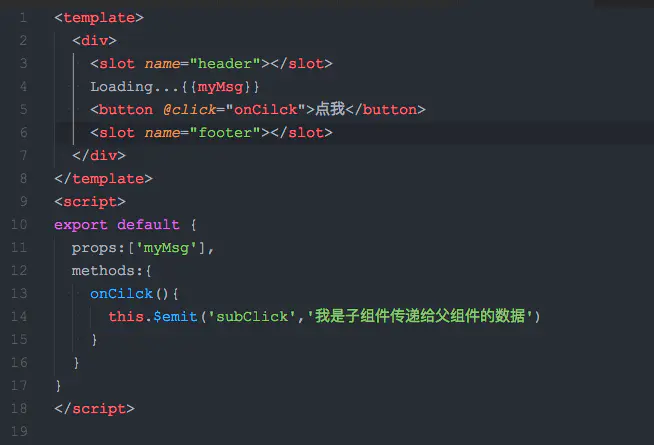

# 自定义组件

[toc]

## 理解

`组件`：简言之就是将一些`共性`的内容做一个`封装`，`方便`以后`重复使用`。

在`vue`中`组件`包括：`全局组件`和`局部组件`。`组件`都具有`复用性`，自定义的组件拥有`vue`的全部特性，包括`生命周期`、`template`、`data`、`methods`、`script`、`style`等。

### 组件的命名：

（1）组件名称`官方规定`使用`小写字母`且用‘`-`’连接

（2）组件可以使用`驼峰命名法`，但是在`使用时`必须`大写转小写`，且用‘`-`’连接，因为`html` `不识别`大小写，全部会被认为`小写`。

#### 组件名大小写

 `定义组件名`的方式有两种：
 **① 使用 `kebab-case`**
 当使用 kebab-case (`短横线分隔命名`) 定义一个组件时，你也`必须`在`引用这个自定义元素时`使用 `kebab-case`，例如 `<my-component-name>`。

```js
Vue.component('my-component-name', { /* ... */ })
```

**② 使用 `PascalCase`**
 当使用 PascalCase (`首字母大写命名`) 定义一个组件时，你在`引用`这个自定义元素时`两种命名法都可以`使用。也就是说 `<my-component-name>` 和 `<MyComponentName>` 都是可接受的。`注意`，尽管如此，直接在 DOM (即`非字符串的模板`) 中使用时`只有 kebab-case 是有效`的。

```csharp
 Vue.component('MyComponentName', { /* ... */ })
```

## 一、局部组件

通过一个`对象`的方式`直接定义`，在`vue实例`中`注册`后使用

`对象`中包含一个`template`属性，表示`组件使用的模板`html。另外在`组件`中定义的`data` `必须`是一个`function`，需要一个`对象定义的返回值`

### 案例一

```vue
<div id="app">
	<abc></abc>
</div>

<script>    
var c={    
   template:`<div>    
				<p>我是用来展示组件嵌套的</p>             
    		</div>`     
}
var h={
    template:`<div>
    			<h5>hello world</h5>
   				<button @click='clickHandle'>{{count}}</button>
       		 </div>`,
data(){
    return{
    	count:0
     }
 },
compoents:{   
    c,   
},
methods:{
     clickHandle(){
    	this.count+=1;
        }
   }
}

var app=new vue({
    el:'#app',
    components:{
        abc:h,
      }
})
</script>
```

### 案例二

**1、先将组件写好，放在一个文件中**
组件的写法和正常的`.vue文件`相同，如果需要`接收参数`，可使用`props`传值，以`封装`一个`标题组件`举例。

**以下为项目目录**


**以下为组件内容**

```vue
<template>
  <div class="title-small">
    <ul class="al-cen">
      <li class="icon"></li>
      <li class="text left-10">{{ content }}</li>
    </ul>
  </div>
</template>

<script>
export default {
  name: "",
  data() {
    return {};
  },
  props: {
    content: "",//接收参数
  },
  components: {},
  created() {},
  mounted() {},
  methods: {},
};
</script>
<style lang="scss" scoped>
.title-small {
    background-color: rgb(231, 231, 231);
    padding: 8px 16px;
    width: 500px;
    border-radius: 2px;
  .icon {
    width: 16px;
    height: 16px;
    border-radius: 8px;
    border: 2px solid rgb(19, 180, 230);
  }
  .text {
    font-size: 16px;
  }
}
</style>

```

**2、局部引入组件并使用**

局部引入可在需要引入的项目中单独引入

```js
import titleSmall from "./form/titleSmall.vue";
components: {titleSmall},
```

**以下为完整代码**

```vue
<template>
  <div>
  	//直接使用注册的标签即可，content内容为传给组件的值
     <titleSmall class="top-30" content="标题"></titleSmall>
  </div>
</template>

<script>
import titleSmall from "./form/titleSmall.vue";//引入组件
import "../style/form.scss";
export default {
  name: "",
  data() {
    return {
      content: "",
      bat: "",
    };
  },
  components: {titleSmall},//注册组件
  created() {},
  mounted() {},
  methods: {},
};
</script>
<style lang="scss" scoped>
</style>
```

## 二、全局组件

> **不常用的写法**
>
> 定义方式示例：
>
> ```javascript
> Vue.component("hello-component", {
>     props: ["message"],
>     template: "<div ><h5>组件定义之全局组件</h5><h4>{{message}}</h4></div>"
> });
> ```
>
> 使用：
>
> ```html
> <hello-component message="global component"></hello-component>
> ```
>
> 属性介绍：
> `Vue.component()`：是`vue.js`内部封装方法
> “`hello-component`”：是使用时候的组件名称
> `props`：组件内的属性，供给组件内部传值
> `template`：组件内部DOM元素组成
> 全局组件定义方式，是`直接给全局对象Vue` `注册了一个组件`。在本页内`已挂载Vue 实例`的`DOM目标元素` 都可以使用（区别于`局部组件只能是挂载哪一个DOM，哪个才能使用`）。

### 注册组件：

打开创建的项目，在`component文件夹`中新建一个`Loading文件夹`，在`Loading文件夹下`新建两个`文件`，`Loading.vue`和`index.js`。


其中`Loading.vue`为`子组件模板`，`index.js文件`是用来把`子组件模块导出`。

`Loading.vue`只是简单显示一下`Loading文字`，如下：


接下来需要将组件`注册并导出`，`index.js`代码如下：


上面代码`第一行`是`导入组件Loading`

`3-7行`就是`注册组件`，需要`注意`的是`Vue.component方法`的`第一个参数`是组件`使用时`的`名字`，比如我上面定义的是`fire-loading`,那么在`使用`的时候就用`<fire-loading><fire-loading/>`，`第二个参数`就是`所要注册的组件`。

`最后一行`则是将`内容导出`

**最后一步在`main.js文件`中引入**


现在你可以在`任何想用这个组件的地方插入`了，组件相应的样式和js代码可以直接写在第一步中的文件之中！

比如我们在项目自动生成的`Hello.vue`中使用，


### 父组件传值给子组件

首先在`子组件` `loading.vue`中声明`props`,然后就可以像`vue data`中的数据一样使用`两个大括号(插值)`来使用它


接下来在`父组件`中引用`子组件`的地方添加在上面`props`中声明的属性，`属性名需要保持一致`


如果需要`动态绑定`到`父组件`的`数据` 只需要使用`v-bind `,简写使用`冒号: `


### 子组件给父组件传递数据

`父组件`可以使用` props`给`子组件` `传递数据`，那么`反过来`呢？该`自定义事件`出场了！

#### 实现思路

使用` v-on` 绑定`自定义事件`

每个` Vue 实例`都实现了`事件接口 Events interface`，即：

使用` $on(eventName)`  `监听事件`

使用` $emit(eventName)`  `触发事件`

另外，`父组件`可以在`使用子组件的地方`直接用 `v-on` 来`监听子组件触发的事件`。

#### **下面我们写个例子**

首先我们在`子组件`中添加一个`button`，定义一个`v-on:click`事件，在`事件的处理函数`中将该事件`分发给父组件`


然后在`父组件`中`插入子组件的地方`使用`v-on:(子组件分发的事件名称)`来获取`子组件传递的数据`


## 其他说明

### 获取当前vue对象_vue获取当前点击元素的dom对象

`$event`：当前触发的是什么事件

`$event.target`：触发事件的元素对象(不一定是绑定事件的对象，会因为[事件冒泡](https://so.csdn.net/so/search?q=事件冒泡&spm=1001.2101.3001.7020)变化)

`$event.currentTarget`：绑定事件的元素对象

`e.currentTarget.previousElementSibling.innerHTML`：获得点击元素的前一个元素

`e.currentTarget.firstElementChild `：获得点击元素的第一个子元素

`e.currentTarget.nextElementSibling` ：获得点击元素的下一个元素

`e.currentTarget.getElementById("string") `：获得点击元素中id为string的元素

`e.currentTarget.getElementsByClassName("string")` ：获得点击元素中class为string的元素集合

`e.currentTarget.getAttributeNode('class')` ：获得点击元素的class属性

`e.currentTarget.parentElement` ： 获得点击元素的父级元素

`e.currentTarget.previousElementSibling.firstElementChild.innerHTML`：获得点击元素的前一个元素的第一个子元素的HTML值

```js
toggleList: function (event) {
  $("p.boxItem.selected").removeClass("selected");
  //获取点击对象
  var toggle = event.currentTarget;
  $(toggle).addClass("selected");
}

//$为jQuery里的$
```

### vue实现自定义组件的v-model

#### 一、v-model的实际意义

```shell
#使用input输入框打比方
<input  type="text"  v-model="inputValue"/>

#相当于：
<input type="text" :value="inputValue" @input="inputValue = $event.target.value"/>
```

#### 二、通过model配置实现v-model的prop属性与event事件的自定义

```sh
#例如这样定义：
model: {
    prop: "value",
    event: "change"
},

#实际上就相当于自定义组件
<custom-comp v-model="inputValue"  />

#相当于
<custom-comp :value="inputValue" @change="inputValue" />
```

#### 三、实际例子（封装一个分类筛选组件）

**1.组件实现代码**

```vue
<template>
  <div class="sort-filter-wrap" v-if="sortList.length">
    <div
      v-for="(item, index) in sortList"
      class="item-type"
      :class="{ 'item-type-selected': item[format.key] === currentKey }"
      :key="index"
      @click="selectSort(item[format.key])"
    >
      {{ item[format.title] }}
    </div>
  </div>
</template>

<script>
export default {
  //分类筛选组件
  name: "sortFilter",
  //定义实现v-modal的属性与事件
  model: {
    prop: "value",
    event: "change"
  },
  props: {
    //绑定的值
    value: {
      type: [String, Number],
      default: ""
    },
    //格式
    format: {
      type: Object,
      default() {
        return {
          key: "type",
          title: "title"
        };
      }
    },
    //分类列表
    sortList: {
      type: Array,
      default: []
    }
  },
  data() {
    return {
      //当前选择的key值
      currentKey: ""
    };
  },
  watch: {
    //监听用户的值
    value(newValue) {
      this.currentKey = newValue;
    }
  },
  //创建组件的时候设置默认值
  created() {
    this.currentKey = this.value;
  },
  methods: {
    //选择分类
    selectSort(value) {
      #1.此处发送change事件是为了事先v-model，
      #2.父组件会自动将监听接收到的值赋值给父组件定义的变量
      #3.在父组件也可以“显示地”监听change事件做一些额外的处理操作
      this.$emit("change", value);
    }
  }
};
</script>

<style lang="scss" scoped>
.sort-filter-wrap {
  display: flex;
  align-items: center;
  .item-type {
    min-width: 68px;
    height: 24px;
    border-radius: 12px;
    text-align: center;
    line-height: 24px;
    color: #515a6e;
    font-size: 13px;
    font-weight: 500;
    border: 1px solid transparent;
    margin-right: 5px;
    cursor: pointer;
    padding: 0px 12px;
  }
  .item-type-selected,
  .item-type:hover {
    border: 1px solid rgba(71, 152, 255, 0.3);
    background: rgba(24, 144, 255, 0.1);
    color: #4798ff;
  }
}
</style>
```

**2.在父组件使用该组件**

```vue
<template>
<yd-sortfilter
     v-model="filterParams.state"
     :format="{ key: 'state', title: 'title' }"
     :sort-list="stateList"
 />
</template>
<script>
//导入分类筛选组件
import sortFilterManage from "@components/tools/sortfilter";
export default {
  components: {
    sortFilterManage
  },
  data() {
    return {
        //筛选参数
        filterParams:{
            state:''
        },
        //状态列表
        stateList:[
             {
                state: "",
                title: "全部"
             },
             {
                state: 1,
                title: "待审核"
             },
             {
                state: 2,
                title: "已发布"
             },
             {
                state: 3,
                title: "已打回"
             }
        ]
    }
  }
}
</script>
```

**3.实际效果**


## slot（插槽）的用法

> 自定义组件一遍都建议保留一个插槽位置，不管你要不要用到它，这样方便用户对其自定义扩展
>
> 一般的自定义组件不可能完全完成到百分百，基本上都是完成80%功能，预留20%可选功能让用户有足够的自主

### 单个 Slot 

除非`子组件模板`中，包含`至少一个插口`，否则`父组件`的`内容`将会被**`丢弃`**。

当`子组件模板`中只有一个`没有属性的 slot` 时，`父组件`的`内容片段`将会`整个插入`到`子组件中 slot 所在`的 DOM 位置，并`替换掉 slot 标签本身`。

最初在`标签中的任何内容`，都被视为**`备用内容`**。`备用内容`在`子组件作用域内编译`，并且`只有`在`宿主元素`为`空`，且`没有`要`插入的内容`时才`显示`备用内容。

> 插槽 `slot`在组件化开发中非常实用，能够适应很多个性化的业务场景。通俗来讲，我们写一个自定义组件，未来可能你期望在这个组件标签的中间区域插入一些内容；默认情况下，如果你不预先挖一个坑的话，那么你插入的东西都将被抛弃。
>
> - 默认坑位
>
>   默认情况下，如果你什么都不做，坑都不挖。那么不好意思，Vue不会理睬你～。如果你在定义组件的时候写了一个特殊的标签 `<slot></solt>`,那么vue就把他当成了默认坑位，后面在使用的时候位于自定义标签内部的元素都会默认放在这个坑位的位置。当然如果你期望给一个默认值，你可以把默认内容丢在`slot`内部，这样将来你在使用自定义组件的时候，可以不用填坑，而是使用默认值。
>
> - 插槽作用域
>
>   虽说坑位现在有了，但是现在有个问题就是坑位是在自定义组件中占住的，然而实际入坑的内容却是在使用组件的时候在组件标签内部插入的。默认情况下，父级模板里的所有内容都是在父级作用域中编译的；子模板里的所有内容都是在子作用域中编译的。
>
> - 命名坑位
>
>   有很多时候可能不只一个坑，你可能需要多个坑，那么此时很明显默认坑位已经满足不了你的需求了。需要做的是在挖坑的时候给每个坑取一个漂亮的名字`<slot name="坑名"></slot>`，后面填坑的时候可以给你想填的内容的最外层元素（一般会写个`template`），然后通过`v-slot:坑名`的方式开始填坑。这样你填的内容将会插入到指定名称的坑位中去。
>
> - 作用域坑位（开放坑位）
>
>   有时候你可能需要在填坑的内容中期望使用自定义组件里面的状态，此时如果坑位不给你提供这样的一个接口，你是无法使用其内部的状态的。组件内部在写`slot`的时候通过数据绑定的方式将其内部变量暴露出来，而使用者在使用的时候需要接收，通过`<template v-slot:坑名="slotPorps"></template>`的形式使用。注意暴露出来的数据会挂载到你接收的这个变量上。

**下面我们来个例子**

在`子组件`原有代码的基础上在`button`的下面添加一对`slot标签`


在`父组件`中的`子组件`使用的地方插入一对`p标签`


那么就会显示如下效果


如果我把`slot标签`移动到`button标签`的上面


那么大家就应该能猜到会有什么效果了吧


**`所以slot又会被叫做插槽`**

### 具名 Slot

元素有一个特殊的`name属性`，可以用于`深度定制` `如何分发内容`。可以给`多个 slot `分配`不同的名字`。一个`具有名称的 slot`，会`匹配内容片段`中有`对应slot属性`的元素。

我们再来做个例子，我们在`子组件模板`中定义`两个插槽slot`，一个位于`顶部`，一个位于`底部`



在`父组件`定义两个p标签


显示如下效果


## 总结

在日常使用中应该尽量`避免使用` `全局引入`，这会大大`增加项目体积`，在组件`复用性不高`的情况下，应该`使用局部引入`，只有在`组件复用性非常高`的时候才应该`考虑使用全局引入`。

> 关于插槽的其他知识，请看`关于v-slot指令的详细了解`

