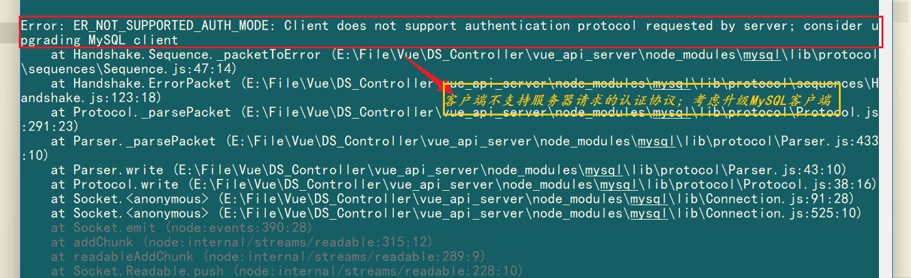
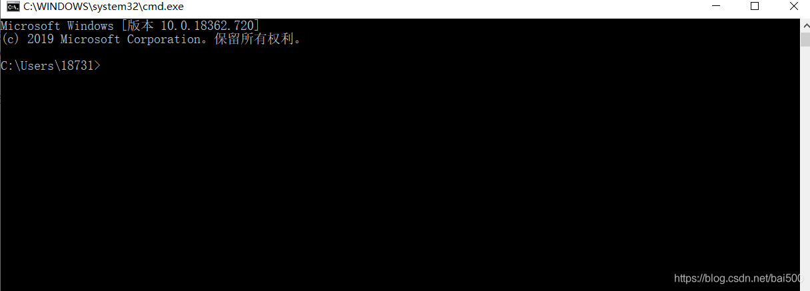
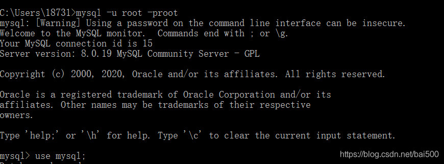
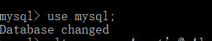
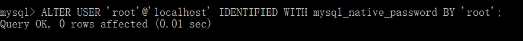
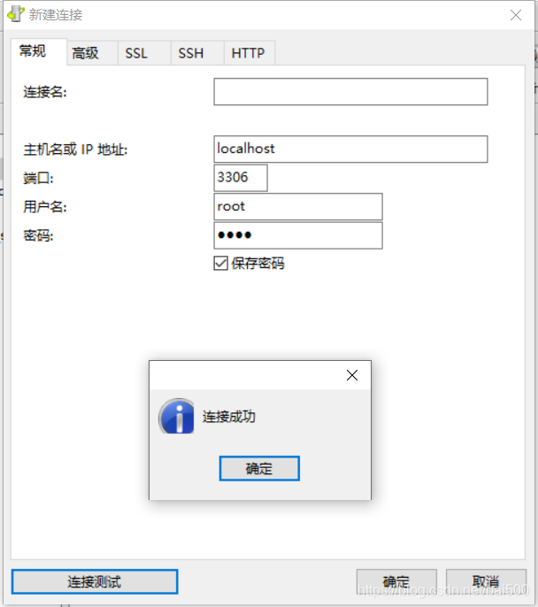

## 解决`Node.js` `mysql`客户端`不支持认证协议`引发的“ER_NOT_SUPPORTED_AUTH_MODE”问题

### 出错原因

导致这个错误的原因是，目前，`最新的mysql模块`并`未完全支持MySQL 8`的“`caching_sha2_password`”加密方式，而“`caching_sha2_password`”在`MySQL 8`中是`默认的加密方式`。因此，下面的方式命令是默认已经使用了“caching_sha2_password”加密方式，该账号、密码无法在mysql模块中使用。

### 解决办法

**第一步：打开CMD命令界面**

**第二步：使用安装MySQL8.0时填写的密码进行登录**

**第三步：切换库 USE mysql;**

**第四步：`ALTER USER ‘root’@‘localhost’ IDENTIFIED WITH mysql_native_password BY ‘root’;`**

root是用户名，localhost是ip地址127.0.0.1都是特指本机，mysql_native_password是旧的密码验证机制，

`第二个root是密码，最后别忘了分号；`

**第五步：FLUSH PRIVILEGES; 刷新**

**最后在Navicat测试**

