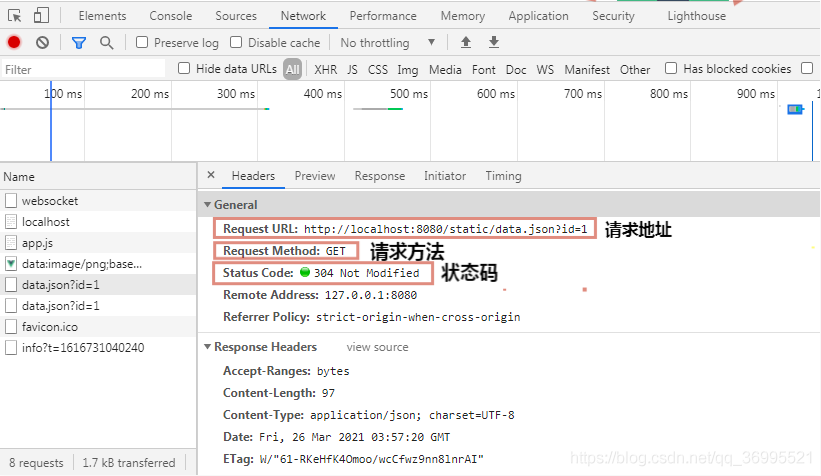
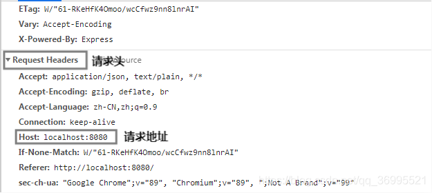
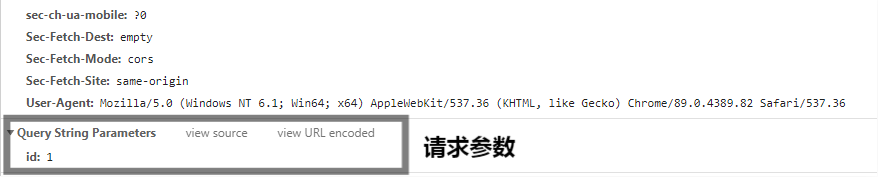
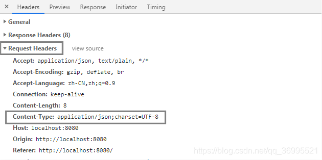
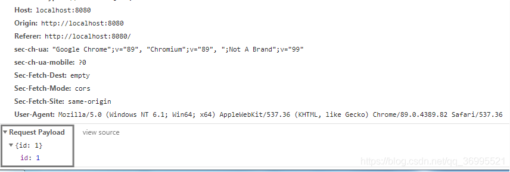
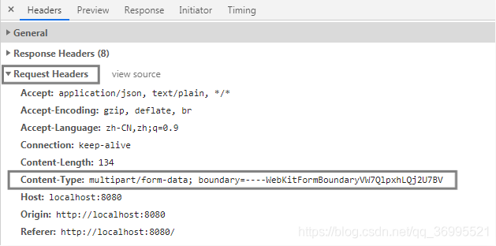
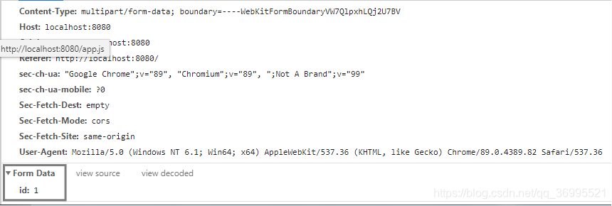
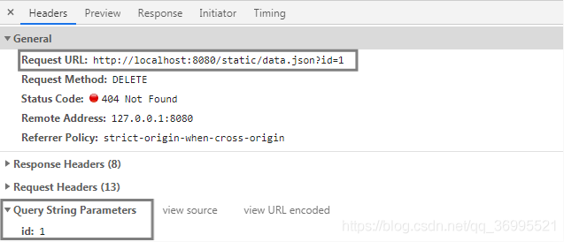
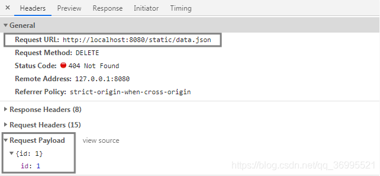
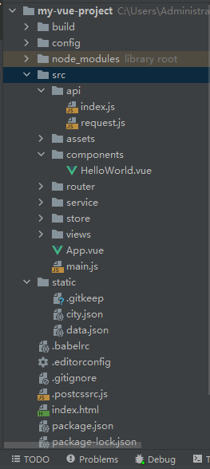

# Axios

[toc]


## axios简介

Axios 是一个基于 *[promise ](https://javascript.info/promise-basics)*网络请求库，作用于[`node.js` ](https://nodejs.org/)和浏览器中。 它是 *[isomorphic ](https://www.lullabot.com/articles/what-is-an-isomorphic-application)*的(即同一套代码可以运行在浏览器和node.js中)。在服务端它使用原生 node.js `http` 模块, 而在客户端 (浏览端) 则使用 XMLHttpRequests。

> `Axios` 是一个基于 `promise` 的 `HTTP` 库，可以用在浏览器和 `node.js` 中。
>
> 
>
> 在axios达到 `1.0` 版本之前，破坏性更改将以新的次要版本发布。 例如 `0.5.1` 和 `0.5.4` 将具有相同的 API，但 `0.6.0` 将具有重大变化
>
> 
>
> axios 依赖`原生的ES6 Promise`实现而被支持。 如果你的环境`不支持` ES6 Promise，你可以使用`polyfill` 。
>
> 
>
> axios 包含` TypeScript `类型定义。
>
> ```typescript
> import axios from 'axios';
> axios.get('/user?ID=12345');
> ```


### axios的优势：

- 从浏览器中创建 `XMLHttpRequests`
- 从 `node.js` 创建 `http` 请求
- 支持 `Promise`  API   => (返回对象为一个promise对象)
- 拦截`请求`和`响应`
- 转换`请求数据`和`响应数据`
- 取消`请求`
- 自动转换 `JSON 数据`
- 客户端支持防御` XSRF`

## axios的基本使用

### 如何引入axios

#### 使用 `npm`:

```bash
npm install axios
```

#### 使用 `bower`:

```bash
bower install axios
```

#### 使用 `yarn`:

```bash
yarn add axios
```

#### 使用 jsDelivr `CDN`:

```html
<script src="https://cdn.jsdelivr.net/npm/axios/dist/axios.min.js"></script>
```

#### 使用 unpkg `CDN`:

```html
<script src="https://unpkg.com/axios/dist/axios.min.js"></script>
```

### 如何应用axios

当我们引入了axios之后，接下来我们就要开始正式的使用axios了，对于axios的使方法比较多：

> **Axios常用的几种请求方法有哪些：`get`、`post`、`put`、`patch`、`delete`**
>
> > **`get`：（一般用于）获取数据**
> >
> > **`post`：提交数据（表单提交+文件上传）**
> >
> > **`put`：更新（或编辑）数据（所有数据推送到后端（或服务端））**
> >
> > **`patch`：更新数据（只将修改的数据推送到后端）**
> >
> > **`delete`：删除数据**
>
> > **题外话，一般公司在实际开发项目过程中：**
> >
> > （1）`post`：一般用于新建
> >
> > （2）`put`：一般用于更新（适合数据量比较少的更新）
> >
> > （3）`patch`：一般用于数据量比较大；假如一个表单的数据量很大，有很多项，使用put的话，全部数据推送一次是比较耗性能的，这个时候可以考虑用patch，只将修改的数据推送到后端
> >
> > 以上这些题外话，只是一般的常规用法，不能代表一定要这样用；当然了，你可能会说我用post来获取数据，行不行？这个当然行了，绝对没问题！具体怎么用还是前后端一起商量着决定，以免发生不愉快的肢体冲突！
> >


#### 1、可以通过向 axios 传递相关配置来创建请求：**`axios(config)`**

```js
// 发送 POST 请求
axios({
  method: 'post',
  url: '/user/12345',
  data: {
    firstName: 'Fred',
    lastName: 'Flintstone'
  }
});
```

#### 2、在上面的方法的基础上，我们还可以将`url`作为第一个参数传递给axios方法：**`axios(url,[config])`**

对于这样来说，如果我们没有传`config`，或者`config`中的`method`没有传的情况下，`axios`会`默认`使用`get请求`方法来进行请求：

```js
// 发送 GET 请求（默认的方法）
axios('/user/12345');
```

#### 3、针对于`get`类的请求（`get`，`delete`，`head`，`options`）我们还可以使用`axios[method](url, [config])`

这样的形似其实和我们所熟知的`jquery`中的`ajax`的很`类似`，但是还是有区别的

**对于`jquery`的来说**

我们的针对`ajax`的请求的`传参`都是使用`data`这样的字段来进行传递的

**但是对于`ajax`来说**

1. 针对于`get类`的请求这样的请求，传递的数据，要么我们放在`url上`面，要么通过`config`中的`params`这个参数来进行配置。
2. 针对与`post`类的请求（`post`，`put`，`patch`），这样的请求来说，我们可以通过上面的`config`中的`data`来进行传递参数,除此之外，我们还可以通过过用以下的形式来进行传递参数：`axios[method](url, data,[config])`。下面是几个例子：

##### get请求：

```js
// 为给定 ID 的 user 创建请求
axios.get('/user?ID=12345')			//通过？和&的方式在地址拼接参数传参
  .then(function (response) {
    console.log(response);
  })
  .catch(function (error) {
    console.log(error);
  });


// 可选地，上面的请求可以这样做
axios.get('/user', {
    params: {				//通过params属性传参
      ID: 12345
    }
  })
  .then(function (response) {
    console.log(response);
  })
  .catch(function (error) {
    console.log(error);
  });
```

```js
const axios = require('axios');

// 支持async/await用法
async function getUser() {
  try {
    const response = await axios.get('/user?ID=12345');
    console.log(response);
  } catch (error) {
    console.error(error);
  }
}

/* 注意: 由于async/await 是ECMAScript 2017中的一部分，而且在IE和一些旧的浏览器中不支持，所以使用时务必要小心。 */
```


##### post 请求

```js
axios.post('/user', {
    firstName: 'Fred',
    lastName: 'Flintstone'
  })
  .then(function (response) {
    console.log(response);
  })
  .catch(function (error) {
    console.log(error);
  });
```

#### 具体的使用方法

为方便起见，为所有支持的请求方法提供了`别名`

- `axios.request(config)`
- `axios.get(url[, config])`
- `axios.delete(url[, config])`
- `axios.head(url[, config])`
- `axios.post(url[, data[, config]])`
- `axios.put(url[, data[, config]])`
- `axios.patch(url[, data[, config]])`

> ==注意：==在使用别名方法时， `url`、`method`、`data` 这些属性都不必在配置中指定。

当然，我们也重新创建一个新的`axios实例`来进行使用axios,然后通过实例来使用，其使用的方法，和以上三种使用方法类似。

```js
var instance = axios.create({
  baseURL: 'https://some-domain.com/api/',   //基准地址
  timeout: 1000,							 //超市
  headers: {'X-Custom-Header': 'foobar'}	 //请求消息头
});

instance.get('helloword.api')
```

**具体参考后文Axios进阶用法**

##### 1.**`get 请求`**

```vue
<template>
  <div>
    <div>mmmm</div>
  </div>
</template>
 
<script>
import axios from 'axios'
 
// get 请求
export default {
  name: "get",
  created() {
 
    //第一种写法叫做get别名请求方法
    //http://localhost:8080/static/data.json?id=1
    axios.get('../../static/data.json', {
      params: {//有参数时,若无参数时直接省略不写
        id: 1
      }
    }).then((res) => {
      console.log('数据：', res);
    })
 
    //第二种写法
    axios({
      method: 'get',
      url: '../../static/data.json',
      params: {
        id: 1
      }
    }).then((res) => {
      console.log('数据：', res)
    })
  }
}
</script>
 
<style scoped>
 
</style>
```

###### **下面了解一下请求信息**







`Status Code:304 Not Modified---304`是`重定向`；正常情况下，`第一次访问接口`的时候返回的 都是`200`；当你`第二次访问接口`的时候，如果`数据没有变化`， 那么`浏览器会自动识别返回`一个状态`304`，代表`数据没有更改 、重定向`；相当于重定向到你刚刚访问的资源，这样的话会加载 更快！ 

##### **2. `post 请求`**

```vue
<template>
  <div>
    <div>mmmm</div>
  </div>
</template>
 
<script>
import axios from 'axios'
 
// post 请求
export default {
  name: "post",
  created() {
 
    /*
    post常用的请求数据（data）格式有两种：
    （1）applicition/json
    （2）form-data 表单提交（图片上传，文件上传）
     */
 
    //第一种写法叫做post别名请求方法
    // http://localhost:8080/static/data.json?id=1
    // applicition/json 请求
    let data = {
      id: 1
    }
    axios.post('../../static/data.json', data)
      .then((res) => {
        console.log('数据：', res);
      })
      
    //第二种写法
    axios({
      method: 'post',
      url: '../../static/data.json',
      data: data,
    }).then((res) => {
      console.log('数据：', res)
    })
      
    // form-data 请求
    let formData = new FormData()
    for (let key in data) {
      formData.append(key, data[key])
    }
    axios.post('../../static/data.json', formData)
      .then((res) => {
        console.log('数据：', res);
      })
  }
}
</script>
 
<style scoped>
 
</style>
```

###### `post`两种请求方式的`Content-Type`和`参数`有哪些不同

> **`applicition/json`：如下图**





> **`form-data`：如下图**





##### 3.**`put、patch 请求`**

说明一下，`put`和`patch`请求与`post`请求用法一样类似，同样有a`pplicition/json`和`form-data`，为了节省时间就不过多赘述了，简单写一下！

```vue
<template>
  <div>
    <div>mmmm</div>
  </div>
</template>
 
<script>
import axios from 'axios'
 
// put、patch 请求
export default {
  name: "put，patch",
  created() {
 
    let data = {
      id: 1
    }
    
    // put 请求
    axios.put('../../static/data.json', data)
      .then((res) => {
        console.log('数据：', res);
      })
      
    // patch 请求
    axios.patch('../../static/data.json', data)
      .then((res) => {
        console.log('数据：', res);
      })
  }
}
</script>
 
<style scoped>
 
</style>
```

##### 4.**`delete 请求`**

`delete`请求与前四种请求稍有一点不同：`delete`请求`有时`候需要把`参数`拼接到`URL上`，`有时`候`像post`请求那样把`参数`放在`请求体`里面。**至于具体怎么调用，需要和`后端`商量好！**

```vue
<template>
  <div>
    <div>mmmm</div>
  </div>
</template>
 
<script>
import axios from 'axios'
 
// delete 请求
export default {
  name: "delete",
  created() {
 
    // delete 请求
    axios.delete('../../static/data.json', {
      params: {// 把参数拼接到URL上
        id: 1
      }
    })
      .then((res) => {
        console.log('数据：', res);
      })
 
    axios.delete('../../static/data.json', {
      data: {// 把params改成data，把参数放在请求体里面
        id: 1
      }
    })
      .then((res) => {
        console.log('数据：', res);
      })
      
    // 不用别名方法
    axios({
      method: 'delete',
      url: '../../static/data.json',
      //params: {id: 1},// 把参数拼接到URL上
      data: {id: 1}// 把参数放在请求体里面
    }).then((res) => {
      console.log('数据：', res)
    })
  }
 
}
</script>
 
<style scoped>
 
</style>
```

###### 把`参数`拼接到`URL`上和放在`请求体`里面有什么不同

> **`params`（把参数拼接到URL上），如下图：**



> **`data`（把参数放在请求体里面），如下图：**



##### 5.**`并发请求`**

并发请求：**同时进行多个请求，并统一处理返回值。**

```vue
<template>
  <div>
    <div>mmmm</div>
  </div>
</template>
 
<script>
import axios from 'axios'
 
// 并发请求
export default {
  name: "get",
  created() {
 
    // 并发请求用到了axios的两个方法：axios.all('参数是一个数组')、axios.spread('回调函数')
    axios.all([
      axios.get('../../static/data.json'),
      axios.get('../../static/city.json')
    ]).then(axios.spread((dataRes, cityRes) => {
      console.log(dataRes, cityRes)
    }))
  }
}
</script>
 
<style scoped>
 
</style>
```

```js
function getUserAccount() {
  return axios.get('/user/12345');
}

function getUserPermissions() {
  return axios.get('/user/12345/permissions');
}

Promise.all([getUserAccount(), getUserPermissions()])
  .then(function (results) {
    const acct = results[0];
    const perm = results[1];
  });
```

## Axios进阶用法（`实例`、`配置`、`拦截器`、`取消请求`等）

### 请求的配置说明

/*
  	例如一个项目的主地址 http://127.0.0.1:8080/demo
  	
  	baseURL:"http://127.0.0.1:8080/demo"
  	
  	设置url地址
  	url:"/index.html"
  	
  	则实际的请求地址为http://127.0.0.1:8080/demo/index.html
  */   
  // 基准地址

```js
{
  // `url` 是用于请求的服务器 URL
  url: '/user',

  // `method` 是创建请求时使用的方法
  method: 'get', // 默认值

  // `baseURL` 将自动加在 `url` 前面，除非 `url` 是一个绝对 URL。
  // 它可以通过设置一个 `baseURL` 便于为 axios 实例的方法传递相对 URL
  baseURL: 'https://some-domain.com/api/',

  // `transformRequest` 允许在向服务器发送前，修改请求数据
  // 它只能用于 'PUT', 'POST' 和 'PATCH' 这几个请求方法
  // 数组中最后一个函数必须返回一个字符串， 一个Buffer实例，ArrayBuffer，FormData，或 Stream
  // 你可以修改请求头。
  transformRequest: [function (data, headers) {
    // 对发送的 data 进行任意转换处理

    return data;
  }],

  // `transformResponse` 在传递给 then/catch 前，允许修改响应数据
  transformResponse: [function (data) {
    // 对接收的 data 进行任意转换处理

    return data;
  }],

  // 自定义请求头
  headers: {'X-Requested-With': 'XMLHttpRequest'},

  // `params` 是与请求一起发送的 URL 参数
  // 必须是一个简单对象或 URLSearchParams 对象
  params: {
    ID: 12345
  },

  // `paramsSerializer`是可选方法，主要用于序列化`params`
  // (e.g. https://www.npmjs.com/package/qs, http://api.jquery.com/jquery.param/)
  paramsSerializer: function (params) {
    return Qs.stringify(params, {arrayFormat: 'brackets'})
  },

  // `data` 是作为请求体被发送的数据
  // 仅适用 'PUT', 'POST', 'DELETE 和 'PATCH' 请求方法
  // 在没有设置 `transformRequest` 时，则必须是以下类型之一:
  // - string, plain object, ArrayBuffer, ArrayBufferView, URLSearchParams
  // - 浏览器专属: FormData, File, Blob
  // - Node 专属: Stream, Buffer
  data: {
    firstName: 'Fred'
  },
  
  // 发送请求体数据的可选语法
  // 请求方式 post
  // 只有 value 会被发送，key 则不会
  data: 'Country=Brasil&City=Belo Horizonte',

  // `timeout` 指定请求超时的毫秒数。
  // 如果请求时间超过 `timeout` 的值，则请求会被中断
  timeout: 1000, // 默认值是 `0` (永不超时)

  // `withCredentials` 表示跨域请求时是否需要使用凭证
  withCredentials: false, // default

  // `adapter` 允许自定义处理请求，这使测试更加容易。
  // 返回一个 promise 并提供一个有效的响应 （参见 lib/adapters/README.md）。
  adapter: function (config) {
    /* ... */
  },

  // `auth` HTTP基本身份验证
  auth: {
    username: 'janedoe',
    password: 's00pers3cret'
  },

  // `responseType` 表示浏览器将要响应的数据类型
  // 选项包括: 'arraybuffer', 'document', 'json', 'text', 'stream'
  // 浏览器专属：'blob'
  responseType: 'json', // 默认值

  // `responseEncoding` 表示用于解码响应的编码 (Node.js 专属)
  // 注意：忽略 `responseType` 的值为 'stream'，或者是客户端请求
  // Note: Ignored for `responseType` of 'stream' or client-side requests
  responseEncoding: 'utf8', // 默认值

  // `xsrfCookieName` 是 xsrf token 的值，被用作 cookie 的名称
  xsrfCookieName: 'XSRF-TOKEN', // 默认值

  // `xsrfHeaderName` 是带有 xsrf token 值的http 请求头名称
  xsrfHeaderName: 'X-XSRF-TOKEN', // 默认值

  // `onUploadProgress` 允许为上传处理进度事件
  // 浏览器专属
  onUploadProgress: function (progressEvent) {
    // 处理原生进度事件
  },

  // `onDownloadProgress` 允许为下载处理进度事件
  // 浏览器专属
  onDownloadProgress: function (progressEvent) {
    // 处理原生进度事件
  },

  // `maxContentLength` 定义了node.js中允许的HTTP响应内容的最大字节数
  maxContentLength: 2000,

  // `maxBodyLength`（仅Node）定义允许的http请求内容的最大字节数
  maxBodyLength: 2000,

  // `validateStatus` 定义了对于给定的 HTTP状态码是 resolve 还是 reject promise。
  // 如果 `validateStatus` 返回 `true` (或者设置为 `null` 或 `undefined`)，
  // 则promise 将会 resolved，否则是 rejected。
  validateStatus: function (status) {
    return status >= 200 && status < 300; // 默认值
  },

  // `maxRedirects` 定义了在node.js中要遵循的最大重定向数。
  // 如果设置为0，则不会进行重定向
  maxRedirects: 5, // 默认值

  // `socketPath` 定义了在node.js中使用的UNIX套接字。
  // e.g. '/var/run/docker.sock' 发送请求到 docker 守护进程。
  // 只能指定 `socketPath` 或 `proxy` 。
  // 若都指定，这使用 `socketPath` 。
  socketPath: null, // default

  // `httpAgent` 和 `httpsAgent` 分别在 node.js 中用于定义在执行 http 和 https 时使用的自定义代理。允许像这样配置选项：
  // `keepAlive` 默认没有启用
  httpAgent: new http.Agent({ keepAlive: true }),
  httpsAgent: new https.Agent({ keepAlive: true }),

  // `proxy` 定义了代理服务器的主机名，端口和协议。
  // 您可以使用常规的`http_proxy` 和 `https_proxy` 环境变量。
  // 使用 `false` 可以禁用代理功能，同时环境变量也会被忽略。
  // `auth`表示应使用HTTP Basic auth连接到代理，并且提供凭据。
  // 这将设置一个 `Proxy-Authorization` 请求头，它会覆盖 `headers` 中已存在的自定义 `Proxy-Authorization` 请求头。
  // 如果代理服务器使用 HTTPS，则必须设置 protocol 为`https`
  proxy: {
    protocol: 'https',
    host: '127.0.0.1',
    port: 9000,
    auth: {
      username: 'mikeymike',
      password: 'rapunz3l'
    }
  },

  // `cancelToken` 指定用于取消请求的 cancel token
  cancelToken: new CancelToken(function (cancel) {
  }),

  // ' decompress '表示是否应该解压响应体  
  //自动。 如果设置为' true '，也会删除'content-encoding'头  
  //解压后的所有响应的响应对象  
  // - Node only (XHR不能关闭解压)  
  decompress: true // 默认值

}
```

#### 案例

```vue
<template>
  <div>
    <div>mmmm</div>
  </div>
</template>
 
<script>
import axios from 'axios'
// axios 实例
// 后端接口地址有多个，并且超时时长不一样
export default {
  name: "get",
  created() {
    //创建axios实例
    let instance = axios.create({//参数配置
      baseURL: 'http://localhost:8080',//请求的域名(或基本地址)
      timeout: 3000,//请求的超时时长(默认：1000毫秒(ms)，超过这个时长会报401超时)
      //url: '../../static/data.json',//请求的路径
      //method: 'get',//请求方法
      headers: {//设置请求头(给请求头添加一些参数)
        token: ''
      },
      //params: {id: 1},//请求参数拼接在URL上
      //data: {id: 1}//请求参数放在请求体
    })
    instance.get('../../static/data.json', {
      params: {
        id: 1
      }
    })
      .then((res) => {
        console.log(res)
      })
    //假如有两个域名或设置超时时长不一样，你可以再创建一个axios实例
    let instance2 = axios.create({
      baseURL: 'http://localhost:9090',
      timeout: 5000
    })
    instance2.get('../../static/data.json', {
      params: {
        id: 1
      }
    })
      .then((res) => {
        console.log(res)
      })
 
    //1.axios全局配置
    axios.defaults.baseURL = 'http://localhost:8080';
    axios.defaults.timeout = 3000;
    //2.axios实例配置
    let instance = axios.create();
    instance.defaults.timeout = 4000;
    //3.axios请求配置
    instance.get('../../static/data.json', {
      timeout: 6000
    })
      .then((res) => {
        console.log(res)
      })
    //优先级从低到高：1.axios全局配置 < 2.axios实例配置 < 3.axios请求配置
  }
}
</script>
 
<style scoped>
 
</style>
```


### 请求的响应信息

```js
{
  // `data` 由服务器提供的响应
  data: {},

  // `status` 来自服务器响应的 HTTP 状态码
  status: 200,

  // `statusText` 来自服务器响应的 HTTP 状态信息
  statusText: 'OK',

  // `headers` 是服务器响应头
  // 所有的 header 名称都是小写，而且可以使用方括号语法访问
  // 例如: `response.headers['content-type']`
  headers: {},

  // `config` 是 `axios` 请求的配置信息
  config: {},

  // `request` 是生成此响应的请求
  // 在node.js中它是最后一个ClientRequest实例 (in redirects)，
  // 在浏览器中则是 XMLHttpRequest 实例
  request: {}
}
```

**当使用 `then` 时，您将接收如下响应:**

```js
axios.get('/user/12345')
  .then(function (response) {
    console.log(response.data);
    console.log(response.status);
    console.log(response.statusText);
    console.log(response.headers);
    console.log(response.config);
  });
```

当使用 `catch`，或者传递一个[rejection callback ](https://developer.mozilla.org/en-US/docs/Web/JavaScript/Reference/Global_Objects/Promise/then)作为 `then` 的第二个参数时，响应可以通过 `error` 对象被使用，正如在[错误处理](https://getaxios.cn/zh/docs/handling_errors)部分解释的那样。

### 默认配置

==您可以指定默认配置，它将作用于`每个`请求。==

#### 全局 axios 默认值

```js
axios.defaults.baseURL = 'https://api.example.com';
axios.defaults.headers.common['Authorization'] = AUTH_TOKEN;
axios.defaults.headers.post['Content-Type'] = 'application/x-www-form-urlencoded';
```

#### 自定义实例默认值

```js
// 创建实例时配置默认值
const instance = axios.create({
  baseURL: 'https://api.example.com'
});

// 创建实例后修改默认值
instance.defaults.headers.common['Authorization'] = AUTH_TOKEN;
```

#### 配置的优先级

配置将会按优先级进行合并。它的顺序是：在[lib/defaults.js ](https://github.com/axios/axios/blob/master/lib/defaults.js#L28)中找到的库默认值，然后是实例的 `defaults` 属性，最后是请求的 `config` 参数。后面的优先级要高于前面的。下面有一个例子。

```js
// 使用库提供的默认配置创建实例
// 此时超时配置的默认值是 `0`
const instance = axios.create();

// 重写库的超时默认值
// 现在，所有使用此实例的请求都将等待2.5秒，然后才会超时
instance.defaults.timeout = 2500;

// 重写此请求的超时时间，因为该请求需要很长时间
instance.get('/longRequest', {
  timeout: 5000
});
```

### 拦截器

#### 请求拦截器和响应拦截器的的使用场景

##### **请求拦截器**：

1. 在我们发送的请求中，我们每次都需要向后端传递的内容，比如说，用户登陆认证的token等相关的内容
2. 如果我们需要对请求数据进行加密的情况下我们可以在请求拦截器中添加
3. 请求链接的处理
4. 统一添加版本号等相关的内容

##### **响应拦截器**：

1. 我们对相应结果需要进行统一处理的
2. 我们对相应中的错误进行统一处理，
3. 我们对相应的数据进行统一处理

#### 添加拦截器

**在`请求`或`响应`被 then 或 catch `处理前`拦截它们。**

```js
// 添加请求拦截器
axios.interceptors.request.use(function (config) {
    // 在发送请求之前做些什么
    return config;			 // 有且必须有一个config对象被返回
  }, function (error) {
    // 对请求错误做些什么
    return Promise.reject(error);
  });

// 添加响应拦截器
axios.interceptors.response.use(function (response) {
    // 2xx 范围内的状态码都会触发该函数。
    // 对响应数据做点什么
    return response;			 // 有且必须有一个response对象被返回
  }, function (error) {
    // 超出 2xx 范围的状态码都会触发该函数。
    // 对响应错误做点什么
    return Promise.reject(error);
  });
```

#### 移除拦截器

**如果你稍后需要移除拦截器，可以这样：**

```js
const myInterceptor = axios.interceptors.request.use(function () {/*...*/});

//移除拦截器
axios.interceptors.request.eject(myInterceptor);
```

#### 给自定义的 axios 实例添加拦截器

```js
const instance = axios.create();

instance.interceptors.request.use(function () {/*...*/});
```

#### 案例

```vue
<template>
  <div>
    <div>mmmm</div>
  </div>
</template>
 
<script>
import axios from 'axios'
// 拦截器：在请求或响应被处理前拦截它们
// 请求拦截器、响应拦截器
export default {
  name: "get",
  created() {
    //请求拦截器
    axios.interceptors.request.use(config => {
      //在发送请求前做些什么
      return config;
    }, err => {
      //在请求错误的时候做些什么
      return Promise.reject(err);
    })
 
    //响应拦截器
    axios.interceptors.response.use(res => {
      //请求成功对响应数据做处理
      return res;
    }, err => {
      //响应错误做些什么
      return Promise.reject(err);
    })
 
    //取消拦截器(了解)
    let interceptors = axios.interceptors.request.use(config => {
      config.headers = {
        auth: true
      }
      return config;
    })
    axios.interceptors.request.eject(interceptors);
 
    //例子：登录状态（token:''） 需要登录的接口
    let instance = axios.create({});
    instance.interceptors.request.use(config => {
      config.headers.token = '';
      // config.headers = {//这种写法会覆盖掉headers中的其他参数，导致headers中只包含token这一个参数，所以不建议这种写法
      //   token: ''
      // }
      return config;
    }, err => {
      return Promise.reject(err);
    })
 
    //移动端弹窗
    let instance_phone = axios.create({});
    instance_phone.interceptors.request.use(config => {
      $('#modal').show();
      return config;
    })
    instance_phone.interceptors.response.use(res => {
      $('#modal').hide();
      return res;
    })
  }
}
</script>
 
<style scoped>
 
</style>
```


### 错误处理

```js
axios.get('/user/12345')
  .catch(function (error) {
    if (error.response) {
      // 请求成功发出且服务器也响应了状态码，但状态代码超出了 2xx 的范围
      console.log(error.response.data);
      console.log(error.response.status);
      console.log(error.response.headers);
    } else if (error.request) {
      // 请求已经成功发起，但没有收到响应
      // `error.request` 在浏览器中是 XMLHttpRequest 的实例，
      // 而在node.js中是 http.ClientRequest 的实例
      console.log(error.request);
    } else {
      // 发送请求时出了点问题
      console.log('Error', error.message);
    }
    console.log(error.config);
  });
```

#### validateStatus

使用 `validateStatus` 配置选项，可以自定义抛出错误的` HTTP code`。

```js
axios.get('/user/12345', {
  validateStatus: function (status) {
    return status < 500; // 处理状态码小于500的情况
  }
})
```

#### toJSON

使用 `toJSON` 可以获取更多关于HTTP错误的信息。

```js
axios.get('/user/12345')
  .catch(function (error) {
    console.log(error.toJSON());
  });
```

### 取消请求

#### AbortController

从 `v0.22.0` 开始，Axios 支持以 `fetch API` 方式 ---> [`AbortController` ](https://developer.mozilla.org/en-US/docs/Web/API/AbortController)取消请求：

```js
const controller = new AbortController();

axios.get('/foo/bar', {
   signal: controller.signal
}).then(function(response) {
   //...
});
// 取消请求
controller.abort()
```

#### CancelToken `deprecated`

您还可以使用 *`cancel token`* 取消一个请求。

> Axios 的 `cancel token API `是基于`被撤销` [cancelable promises proposal ](https://github.com/tc39/proposal-cancelable-promises)。

> 此 API 从 `v0.22.0` 开始已被弃用，不应在新项目中使用。

可以使用 `CancelToken.source` 工厂方法创建一个 `cancel token` ，如下所示：

```js
const CancelToken = axios.CancelToken;
const source = CancelToken.source();

axios.get('/user/12345', {
  cancelToken: source.token
}).catch(function (thrown) {
  if (axios.isCancel(thrown)) {
    console.log('Request canceled', thrown.message);
  } else {
    // 处理错误
  }
});

axios.post('/user/12345', {
  name: 'new name'
}, {
  cancelToken: source.token
})

// 取消请求（message 参数是可选的）
source.cancel('Operation canceled by the user.');
```

也可以通过传递一个 `executor` 函数到 `CancelToken` 的构造函数来创建一个 `cancel token`：

```js
const CancelToken = axios.CancelToken;
let cancel;

axios.get('/user/12345', {
  cancelToken: new CancelToken(function executor(c) {
    // executor 函数接收一个 cancel 函数作为参数
    cancel = c;
  })
});

// 取消请求
cancel();
```

> 注意: 可以使用`同一个` `cancel token` 或 `signal` 取消`多个`请求。

在过渡期间，您可以使用这两种取消 API，即使是针对同一个请求：

```js
const controller = new AbortController();

const CancelToken = axios.CancelToken;
const source = CancelToken.source();

axios.get('/user/12345', {
  cancelToken: source.token,
  signal: controller.signal
}).catch(function (thrown) {
  if (axios.isCancel(thrown)) {
    console.log('Request canceled', thrown.message);
  } else {
    // 处理错误
  }
});

axios.post('/user/12345', {
  name: 'new name'
}, {
  cancelToken: source.token
})

// 取消请求 (message 参数是可选的)
source.cancel('Operation canceled by the user.');
// 或
controller.abort(); // 不支持 message 参数
```

#### 案例1

```vue
<template>
  <div>
    <div>mmmm</div>
  </div>
</template>
 
<script>
import axios from 'axios'
// 取消请求
export default {
  name: "get",
  created() {
    
    //取消请求：用于取消正在进行的http请求（作为了解）
    let rource = axios.CancelToken.source();
    axios.get('../../static/data.json', {
      cancelToken: rource.token
    })
      .then((res) => {
        console.log(res)
      })
    .catch((err) => {
      console.log(err)
    })
    //取消请求（message可选）
    rource.cancel('cancel http');
 
  }
}
</script>
 
<style scoped>
 
</style>
```

#### 案例2

```js
import axios from 'axios'

// 第一种取消方法
axios.get(url, {
  cancelToken: new axios.CancelToken(cancel => {
    if (/* 取消条件 */) {
      cancel('取消日志');
    }
  })
});

// 第二种取消方法
const CancelToken = axios.CancelToken;
const source = CancelToken.source();
axios.get(url, {
  cancelToken: source.token
});
source.cancel('取消日志');
```


### 请求体的编码

默认情况下，`axios`将 `JavaScript 对象`序列化为 `JSON` 。 要以`application/x-www-form-urlencoded`格式发送数据，您可以使用以下选项之一。

#### 浏览器

**在浏览器中，可以使用[`URLSearchParams` ](https://developer.mozilla.org/en-US/docs/Web/API/URLSearchParams)API，如下所示：**

```js
const params = new URLSearchParams();
params.append('param1', 'value1');
params.append('param2', 'value2');
axios.post('/foo', params);
```

> 请注意，不是所有的浏览器(参见 [caniuse.com ](http://www.caniuse.com/#feat=urlsearchparams))都支持 `URLSearchParams` ，但是可以使用[polyfill ](https://github.com/WebReflection/url-search-params)(确保 polyfill 全局环境)

**或者, 您可以使用[`qs` ](https://github.com/ljharb/qs)库编码数据:**

```js
const qs = require('qs');
axios.post('/foo', qs.stringify({ 'bar': 123 }));
```

**或者用另一种方式 (ES6),**

```js
import qs from 'qs';
const data = { 'bar': 123 };
const options = {
  method: 'POST',
  headers: { 'content-type': 'application/x-www-form-urlencoded' },
  data: qs.stringify(data),
  url,
};
axios(options);
```

#### Node.js

##### querystring

在 node.js 中， 可以使用 [`querystring` ](https://nodejs.org/api/querystring.html)模块，如下所示:

```js
const querystring = require('querystring');

axios.post('http://something.com/', querystring.stringify({ foo: 'bar' }));
```

或者从['url module' ](https://nodejs.org/api/url.html)中使用['URLSearchParams' ](https://nodejs.org/api/url.html#url_class_urlsearchparams)，如下所示:

```js
const url = require('url');

const params = new url.URLSearchParams({ foo: 'bar' });
axios.post('http://something.com/', params.toString());
```

您也可以使用 [`qs` ](https://github.com/ljharb/qs)库。

> 注意：如果需要对`嵌套对象`进行`字符串化`处理，则最好使用 `qs` 库，因为 querystring 方法在该用例中存在已知问题(https://github.com/nodejs/node-v0.x-archive/issues/1665)。

##### Form data

在 node.js, 您可以使用 [`form-data` (opens new window)](https://github.com/form-data/form-data)库，如下所示:

```js
const FormData = require('form-data');
 
const form = new FormData();
form.append('my_field', 'my value');
form.append('my_buffer', new Buffer(10));
form.append('my_file', fs.createReadStream('/foo/bar.jpg'));

axios.post('https://example.com', form, { headers: form.getHeaders() })
```

**或者, 使用一个拦截器:**

```js
axios.interceptors.request.use(config => {
  if (config.data instanceof FormData) {
    Object.assign(config.headers, config.data.getHeaders());
  }
  return config;
});
```

## **Axios进一步封装，在项目中的实际应用**

- 在`vue项目`中，和`后台交互`获取数据这块，我们通常使用的是`axios库`，它是`基于promise`的`http库`，可运行在`浏览器端`和`node.js`中。axios有很多优秀的特性，例如`拦截请求和响应`、`取消请求`、`转换json`、`客户端防御XSRF`等。
- 在一个完整的项目中，和服务端的交互会很频繁，一个项目会有很多请求，冗余代码很多。所以将请求封装，统一管理还是很有必要的。
- 本文介绍的axios的封装主要目的就是在帮助我们简化项目代码和利于后期的更新维护。



### **（1）第一步：src/api/request.js**

```js
import axios from 'axios'
// import Vue from 'vue';
// import store from '../store';
// import {router} from '../router/index';
 
// let vm = new Vue();
 
const instance = axios.create({
  baseURL: 'http://localhost:8080',
  timeout: 3000,
  // headers: {
  //   post: {
  //     'Content-Type': 'application/x-www-form-urlencoded;charset=UTF-8'
  //   }
  // }
})
 
// 请求拦截
instance.interceptors.request.use(config => {
  // 自定义header，可添加项目token
  // if (store.state.app.token) {
  //   config.headers.token = store.state.app.token;
  //   config.headers.timestamp = new Date().getTime();
  // }
  return config;
}, error => {
  return Promise.reject(error);
})
 
// 响应拦截
instance.interceptors.response.use(response => {
  // const resCode = response.status;
  // if (resCode === 200) {
  //   return Promise.resolve(response);
  // } else {
  //   return Promise.reject(response);
  // }
  return response;
}, error => {
  // const resCode = error.response.status;
  // switch (resCode) {
  //   case 401:
  //     vm.$Message.error(error.response.data.message);
  //     store.commit('logout', this);
  //     store.commit('clearOpenedSubmenu');
  //     // console.log('token-0', store.state.app.token);
  //     router.replace({
  //       name: 'login'
  //     });
  //     break;
  //   case 404:
  //     vm.$Message.error('网络请求不存在');
  //     break;
  //   case 500:
  //     vm.$Message.error('服务器连接错误');
  //     break;
  //   // 其他状态码错误提示
  //   default:
  //     vm.$Message.error(error.response.data.message);
  // }
  return Promise.reject(error);
})
 
/*
 *封装get方法
 *@param{String} url [请求地址]
 *@param{Object} params 请求参数
 */
export function Get(url, params) {
  return new Promise((resolve, reject) => {
    instance.get(url, {
      params: params
    }).then((res) => {
      resolve(res.data);
    }).catch((error) => {
      reject(error.data);
    })
  })
}
 
/**
 *封装post方法
 *@param{String} url 请求地址
 *@param{Object} params 请求参数
 */
export function Post(url, params) {
  return new Promise((resolve, reject) => {
    instance.post(url, params).then((res) => {
      resolve(res.data);
    }).catch((error) => {
      reject(error.data);
    })
  })
}
 
/**
 *封装put方法
 *@param{String} url 请求地址
 *@param{Object} params 请求参数
 */
export function Put(url, params) {
  return new Promise((resolve, reject) => {
    instance.put(url, params).then((res) => {
      resolve(res.data);
    }).catch((error) => {
      reject(error.data);
    })
  })
}
 
/**
 *封装patch方法
 *@param{String} url 请求地址
 *@param{Object} params 请求参数
 */
export function Patch(url, params) {
  return new Promise((resolve, reject) => {
    instance.put(url, params).then((res) => {
      resolve(res.data);
    }).catch((error) => {
      reject(error.data);
    })
  })
}
 
/**
 *封装delete方法
 *@param{String} url [请求地址]
 *@param{Object} params [请求参数]
 */
export function Delete(url, params) {
  return new Promise((resolve, reject) => {
    instance.delete(url, {
      params: params
    }).then((res) => {
      resolve(res.data);
    }).catch((error) => {
      reject(error.data);
    })
  })
}
```

### **（2）第二步：src/api/index.js**

```js
import {Get,Post,Put,Patch,Delete} from "@/api/request";
 
export default {
  getListData: (params) => {
    return Get('../../static/data.json',params);
  },
  postListData: (params) => {
    return Post('../../static/data.json',params);
  },
  deleteListData: (params) => {
    return Delete('../../static/data.json',params);
  }
}
```

### **（3）第三步：src/main.js**

```js
// The Vue build version to load with the `import` command
// (runtime-only or standalone) has been set in webpack.base.conf with an alias.
import Vue from 'vue'
import App from './App'
import router from './router'
import store from './store/store'
import Api from './api/index';
 
Vue.config.productionTip = false
Vue.prototype.$axios = Api;
 
/* eslint-disable no-new */
new Vue({
  el: '#app',
  router,
  store,
  components: { App },
  template: '<App/>'
})
```


### **（4）第四步：src/components/HelloWorld.vue**

```vue
<template>
 
</template>
 
<script>
export default {
  name: 'HelloWorld',
  data() {
    return {}
  },
  methods: {
    getData() {
      let data = {
        id: 1
      }
      this.$axios.getListData(data)
        .then((res) => {
          console.log(res);
        })
    },
    postData() {
      let data = {
        id: 1,
        msg: 2
      }
      this.$axios.postListData(data)
        .then((res) => {
          console.log(res);
        })
    },
    postFormData() {
      let data = {
        id: 1,
        msg: 2
      }
      let formData = new FormData();
      for (let key in data) {
        formData.append(key, data[key]);
      }
      this.$axios.postListData(formData)
        .then((res) => {
          console.log(res);
        })
    },
    deleteData() {
      let data = {
        id: 1
      }
      this.$axios.deleteListData(data)
        .then((res) => {
          console.log(res);
        })
    },
  },
  created() {
    this.getData();
    this.postData();
    this.postFormData();
    this.deleteData();
  }
}
</script>
 
<!-- Add "scoped" attribute to limit CSS to this component only -->
<style scoped>
 
</style>
```


