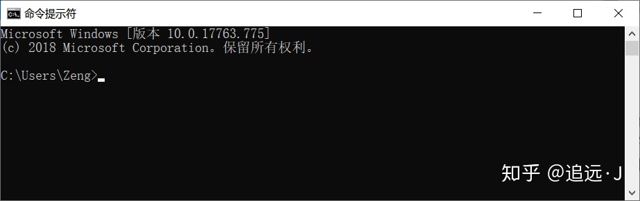
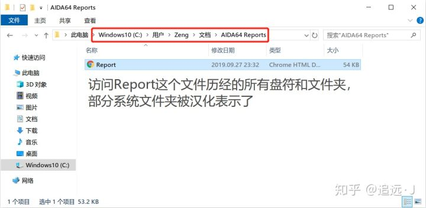
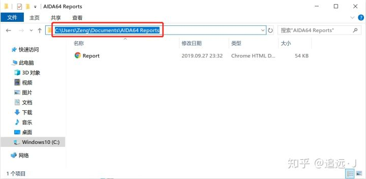
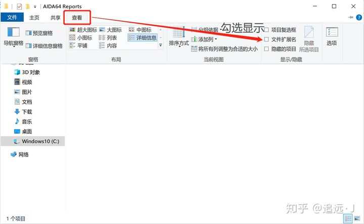
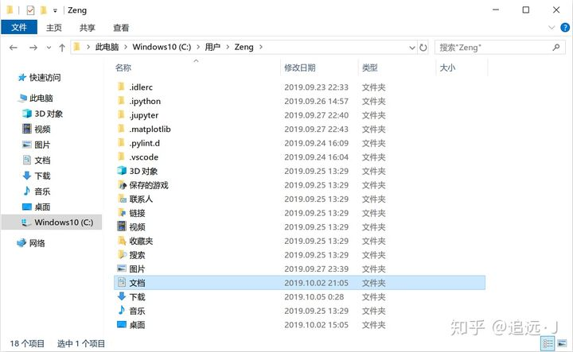
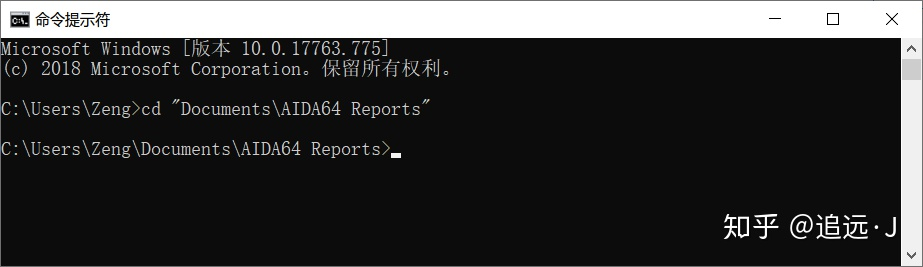

# NPM

`npm`的全称是(Node Package Manager)，是随同`NodeJS`一起安装的`包管理和分发工具`，它很方便让JavaScript开发者**下载、安装、上传以及管理已经安装的包**。

**使用场景：**

- 允许用户从NPM服务器下载别人编写的第三方包到本地使用。
- 允许用户从NPM服务器下载并安装别人编写的命令行程序到本地使用。
- 允许用户将自己编写的包或命令行程序上传到NPM服务器供别人使用。

## windows命令提示符

### 命令行是什么？

`命令行` (command line) 是各种操作系统（包括Windows、macOS、Linux）为用户提供的**一种相对原始的交互界面**，也经常被称作shell (壳子) 或terminal (终端)。它**通过读取用户输入的命令，来执行一个或一组对应的操作**。在图形用户界面 (GUI) 出现以前，这是系统基本的交互方式。时至今日，这项功能仍在各大操作系统中以不同形式保留着。

以Windows为例，系统预装了一个经典的命令解释程序**`cmd`** (C:\Windows\System32\cmd.exe) 和一个新式的**`PowerShell`** (C:\Windows\System32\WindowsPowerShell\v1.0\powershell.exe)，作为命令行界面的提供程序。

> 还有一个更新款但没有预安装的PowerShell Core（这玩意儿不止支持Windows，可前往[https://github.com/PowerShell/PowerShell/releases](https://link.zhihu.com/?target=https%3A//github.com/PowerShell/PowerShell/releases)下载你需要的版本）。

通过快捷键Win+S或者点击任务栏上的搜索框/按钮，输入cmd或者powershell就能直接找到这两个程序了。以cmd为例，启动后就是如下界面，

最上方标题栏可能是中文字样“命令提示符”也可能是`程序路径`“C:\Windows\System32\cmd.exe”。窗口中首先打印出的是`系统版本信息`，然后**单起一行的类似`C:\Users\Zeng>`的提示符和它后面闪烁的光标，就是提示你输入命令的地方**。

### 命令解释方式

无论是`cmd`还是`PowerShell`，严格来讲都是所谓“`命令解释程序`”，它们是命令行这种交互方式概念的具体实现。不同的解释程序在支持的命令和一些具体细节上可能会有所不同，但`基本的逻辑应该无差`。

首先，在你敲下回车之后，**你输入在提示符之后的所有文字，将按照`空格分割`成一个个块 (token)，用一对`英文双引号`括起来的部分视为一个块，`不进行分割`**。

然后**第一个块，将作为要执行的命令进行解释**——

1. 如果它是**系统命令**，则执行相应的命令；
2. 如果不是，将从**环境变量Path**列举的路径中搜索与其`同名`的程序，如果`匹配到`就`执行`相应的程序；
3. 如果`没匹配`到，就`判断`它是否是一个`合法`的**程序文件路径**（可能是`相对路径`或者`绝对路径`），如果是就执行相应的程序。
4. 如果以上匹配`全部失败`，`命令解释程序应该就会提示你该命令或程序不存在`。这**一般是命令名称敲错了、或者没有添加相应的Path，又或者要执行程序的路径搞错了**。

无论执行的是系统命令还是某个程序，**后面其他的块都会作为该命令或程序的参数传入，这些参数的合法性和作用则由相应的命令或程序来决定**。

> **系统命令：**命令解释程序预定义的命令，在`cmd`中输入命令`help`，就会显示出所有系统命令和它们的简介；`PowerShell`预定义的命令就更多更复杂，但大体能兼容`cmd`的常用系统命令。
> **环境变量Path：**可以简单理解为系统的一个`设置项`，里面包含了一条条`路径`，作为`常用程序`的`搜索位置`。将常用程序所在的目录添加进来，就能在命令行中直接以程序名执行该程序而无需输入完整路径。
> **程序文件：**`Windows`中就是`后缀名.exe`的文件。在命令行中如果`不会引起歧义`，程序文件的`.exe`后缀`可以省略`。

### 工作目录与文件路径

前面多次提到了“`路径`”这一概念，这里就有必要详解一下`操作系统是如何看待系统内的诸多文件`的，这是多少新手小白踩坑的地方。

基本能熟练操作电脑 (`Windows`) 的人，必然知道系统里有很多的“`盘`”(C、D、E等等)，每个盘下面可以有很多“`文件夹`”，里面可以放更多文件夹和我们的文件。对于一个具体的文件或文件夹，我们**把从“`此电脑`”开始访问到它所需点击的所有盘符和文件夹按照特定方式连接起来，就构成了它的`路径`**。



上图给出了一个例子，为了看清文件路径的真面目，我们在红框标记的地址栏再单击一下，



这时规范的文件路径显现出来。**`盘符用英文字母加英文冒号表示`**，我这里就是`C:`，它一定出现在`最前面`；**盘符和诸文件夹用反斜杠`\`分隔，这也就意味着文件夹内部是不能出现`\`的（事实上`/:\*?"<>|`等特殊符号也都不能出现在文件夹或文件名中，它们有特殊作用）**。

**还有几个点需要特别注意**

- **文件路径中是允许空格的**（上面的最后一级文件夹`AIDA64 Reports`中就包含空格），而上面提到过`命令解释程序会用空格分割不同的块`，这就意味着**如果需要在`命令行`中使用`带空格的路径`（无论是作为要执行的程序还是程序的参数），`必须`使用一对双引号`"`将它括起来**。

> “空格分割”这种方式不仅在命令解释中，在系统和很多程序底层机制中都广泛存在，所以很多特殊的程序（比如编译器）不宜被放在含空格的路径下。

- **Windows的文件路径中不区分大小写**！尽管`文件资源管理器`会在形式上记住你建立文件夹或文件时使用的大小写，但实际使用时你写成大小写都是无所谓的。
- `文件路径`可以以`文件夹`或者`文件`收尾。**文件夹末尾可以再跟一个反斜杠`\`显式表明它是个文件夹**，也可以省略末尾的`\`；**文件一般来讲都有`扩展名`（文件名中最后一个`.`和它之后的部分）**，文件资源管理器可能不显示已知类型文件的扩展名，但你心里得清楚它的存在。

> **上面的例子里文件扩展名就是隐藏的**，可以按如下方式显示出来，建议不熟悉不同类型文件扩展名的、或者电脑里流氓软件多甚至还有病毒的，把扩展名显示出来比较好，毕竟文件图标和类型标识都是可以被篡改的。



- `文件资源管理器地址栏`里显示的`路径`都是`当前文件夹`的，要获取其中`某个文件的路径`，请把`完整的文件名`加在后面，并用`\`与前面分隔。比如上面那个文件夹的路径就是地址栏中的

```text
C:\Users\Zeng\Documents\AIDA64 Reports\
```

而那个文件的完整路径则为

```text
C:\Users\Zeng\Documents\AIDA64 Reports\Report.htm
```

介绍完文件路径的基本概念，下一个重要概念就是**相对路径**，与此对应，之前介绍的就是**绝对路径**。而相对路径的使用，显然是要`依赖`于一个“`基础路径`”（不然它“相对”谁呢），这就引出了**工作目录**的概念。

上面启动cmd后，我们说到`C:\Users\Zeng>`是你输入命令的提示符。了解了文件路径之后，你会发现这**`>`前面的部分**就是一个`合法的文件夹路径`。这个路径，**就是我们当前的工作目录**。就好像你打开了系统中相应的文件夹一样，我们可以`直接访问`这个`目录下`的`文件`和`子文件夹`。

> 这里的`Zeng`是我的用户名，你的应该是其他名字。

Windows中，`绝对路径`由`盘符`（比如`C:`）引导，而**相对路径，则直接从`当前目录下`的`某个文件夹`或者`文件`开始，到你的`目标文件夹`或`文件`为止**。就以cmd的默认启动目录为例（这个目录下的文件夹大都比较特殊，这里看到的都只是被汉化显示了，其实都是英文文件夹），假设我们要用`相对路径`表示那个“文档”文件夹，直接使用`Documents\`即可；如果你还记得上面那个`Report.htm`文件的位置，它则可以用`Documents\AIDA64 Reports\Report.htm`表示。这就更加方便。



有时，**相对路径也可以以`.\`开头，显式地表明`路径从当前目录开始`；也可以以n个连续的`..\`开头，表示`从上n级父目录开始`**。

### 命令行的具体用法

使用`命令行`，`实质`是使用`一些没有图形界面的命令或者程序`。上面其实介绍过最简单的`help`命令了，这里再举几个例子。

#### cd命令

`cd`命令是一个`系统命令`，作用是`更改当前工作目录` (**c**hange **d**irectory)。其后可以`紧跟一个合法的文件夹路径`（`系统中已存在`且`有访问权限`的，`绝对`、`相对`均可，当然相对更常用），比如



你可以清楚地看到工作目录已经被更改了。

注意`cd`命令`默认`状态下`只能在当前驱动器（盘符）下更改目录`

**要想更改工作目录至其他盘，比如D盘，有两种方法:**

1. 增加一个`/d`参数，即类似下面这样

   ```shell
   cd /d 你的目标绝对路径
   ```

2. 直接利用盘符名先切换到D盘，再切到指定目录，即先输入

   ```shell
   D:
   
   #回车后就切到了D盘根目录，再利用cd切换工作目录。
   ```

   

#### 「-」和「--」

简单来说，「`-`」和「`--`」是两种不同的`命令行选项`的`风格`。前者是`传统的Unix风格`的，后者是`GNU风格`的。

---

具体点来讲，起初`Unix`设计命令行程序时，需要将一个`命令`的『`选项`』（Options）和『`参数`』（Arguments）`区分开来`，就`引入`了「`-`」。`凡是以「-」开头的，就是选项`。选项用一个`单独的字母`作为`标志`，**通常也是一个选项英语的缩写**。例如，「`-a`」表示所有（`all`），「`-c`」表示命令（`command`），「`-f`」表示文件（`file`），「`-V`」表示版本（`version`）。`多个选项`也可以`连写`，如「`ls -A -l`」可以写成「`ls -Al`」。

但是，**单独字母的数量毕竟有限，会不够用，而且表达的意思不够明确**。于是就有了之后的`GNU风格`来完善上述的不足，使用「`--`」作为`前缀`，后面可以跟`一串单词`，如「`--version`」，「`--all`」。选项自己的`参数`即可以放在`后面用空格隔开`，可以使用「`=`」，如「`--file foobar.out`」等价于「`--file=foobar.out`」。这种`GNU风格`的选项常被称之为『`长选项`』（Long Options），而`Unix风格`的为『`短选项`』（Short Options）。**通常来说`短选项`都有与之对应的`长选项`**，如「-a，--all」、「-V，--version」。

#### 「/」和「\」

window系统有的程序从 `Unix `那里移植过来的，包括微软亲自移植过来的。

`Unix` 的程序都是用连字符 '`-`' 来用作`参数`的。
`DOS的程序`都是用 '`/`' 斜杠用作`参数`的。这就是为什么 `DOS` 的`文件目录`用 `\ 反斜杠`，`避免和斜杠冲突`。现在 Windows 沿用了 \ 用于文件目录，但是实际上 / 和 \ 可以混用。

`Unix`使用`斜杠/`作为`路径分割符`，而`Web应用`最先是使用在`Unix系统`上面，所以目前`所有`的`网络地址`都采用`斜杠/`作为`分隔符`。`Linux`又称`升级版的Unix`，所以路径这方面跟Unix是大同小异的。

> Windows由于**使用斜杠/作为DOS命令提示符的参数标志了**，为了不混淆，所以采用反斜杠\作为路径分隔符。所以目前**Windows系统上的文件浏览器都是用反斜杠\作为路径分隔符**。随着发展，DOS系统已经被淘汰了，命令提示符也用得很少，**斜杠和反斜杠在大多数情况下可以互换**，没有影响。
> DOS命令提示符示例：dir /a (列出当前目录所有文件和目录)

##### 总结

1. **统一用正斜杠"/"，Windows和Linux都能识别**。

2. 网络路径（浏览器地址栏网址）使用 正斜杠/；

3. Windows文件浏览器上使用 反斜杠\；

4. Windows本地路径既能使用正斜杠，也能使用反斜杠。

5. 出现在htm url()属性中的路径，指定的路径是网络路径，所以必须使用 正斜杠/；

   ```html
   <div 
    style="
        background-image:url(/Image/Control/title.jpg); 
        background-repeat:repeat-x; 
        padding:10px 10px 10px 10px
    ">
    </div>
   // 如果url后面用反斜杠，就不会显示任何背景
   ```

   

6. 出现在普通字符串的路径，如果代表的是Windows文件路径，则使用 正斜杠/和 反斜杠\是一样的；如果代表的是网络文件路径，则必须使用 正斜杠/；

   ```html
    // 本地文件路径，/ 和 \ 是等效的
     
    
   
    // 网络文件路径，一定要使用 斜杆/
     
   ```

   

7. 单独的一个反斜杠"\"在编程中通常用于转义字符，如\0表示“空字符”\r表示“回车”，\n表示“换行”等；所有通常要用到反斜杠时，要**用两个反斜杠"\\"来表示一个反斜杠“\”的含义**。

8. 而"\\"则表示反斜杠\的转义字符，在编程中常用于表示反斜杠\不是普通的字符，而是路径的分隔符。如用一个字符串存储保存文件的路径时，路径为F:\caffe\Temp\image.jpg;则用字符串存储时，应该写为str=F:\caffe\Temp\image.jpg;因为若不这样表示，则反斜杠\将会当作普通字符，而非路径的分隔符，可能与后面的字母对应上，发生了转义字符的作用。

## npm install `-S` `-D` `-g` 有什么区别

```shell
  --save       // 将模块依赖关系写入到package.json文件的dependencies参数中
  -dev         // 将模块依赖关系写入到package.json文件的devDependencies参数中
  -g           // 表示全局
  @+version    // 安装指定版本
```

1. **npm install module_name `-S`**  即  **npm install module_name `--save`**  写入`dependencies`
2. **npm install module_name `-D`**  即  **npm install module_name `--save-dev`** 写入`devDependencies`
3. **npm install module_name `-g`** `全局安装`(命令行使用)
4. **npm install module_name** `本地安装`(将安装包放在 ./`node_modules` 下)

### dependencies与devDependencies有什么区别呢？

**`devDependencies`** 里面的插件只用于`开发环境`，不用于生产环境

**`dependencies`** 是需要发布到`生产环境`的

#### 举个例子：

你开发一个前端项目，在项目中你需要使用`gulp`构建你的`开发和本地运行环境`,这时你就要放到`dependencies`里。`gulp`是你用来`压缩代码`，`打包`等需要的工具，**程序实际运行的时候并不需要**，所以放到`dev`里就ok了。

你写程序要用`element-ui`,`生产环境`运行项目时`肯定要用`到element-ui,这时element-ui就应该安装到`dependencies`中去。

## NPM常用命令

**创建vue项目时文件夹内容要为空不然无法创建**

cmd切换盘符：E：回车。

**切换淘宝镜像：** <span alt="underline"> **npm install -g cnpm --registry=https://registry.npm.taobao.org**</span>

**更新npm版本：**  <span alt="underline">**npm install -g npm**</span>

### VUE

#### 1、安装vue2脚手架

（1）、在`cmd命令行`中输入脚手架安装命令；
（2）、**`全局`安装vue脚手架：**<span alt="underline">**npm install -g vue-cli** </span>或者`指定版本`：<span alt="underline">**npm i vue-cli@2.9.6 -g**</span>；
（3）、安装以后，输入：`vue -V` 出现相应的`版本号`，则表示安装成功；
（4）、**卸载脚手架：**  <span alt="underline">**npm uninstall -g vue-cli；**</span>

#### 2、搭建项目

**选择你要安装到那个文件夹**
（1）、**初始化项目：**  <span alt="underline">**vue init webpack myProject；**</span>
（2）、**进入项目：**  <span alt="underline">**cd myProject;**</span>
（3）、**启动项目：**  <span alt="underline">**npm run dev** </span>（如果下载的别人的项目，需要先安装依赖 npm install）;
（4）、**打包上线：**  <span alt="underline">**npm run build**</span>
如果项目没有自动打开浏览器，将`config文件夹`里面的`index.js`文件中`autoOpenBrowser`设置为`true`;
`路由`有`hash`和`history`模式，在`new Router`的对象里面`mode`来设置;`默认是hash`模式

#### 3、vue-cli3脚手架安装

（1）、如果安装了1.x或者2.x版本的脚手架，需要先卸载；
（2）、**安装脚手架：**  <span alt="underline">**npm install -g @vue/cli**</span>
（3）、安装以后，输入 ：`vue -version`查看版本，出现相应版本3.x则表示安装成功；
（4）、**初始化项目：**  <span alt="underline">**vue create myApp；**</span>
（5）、选择配置，一般选择手动配置，根据自己需要来选择，不选择默认配置；
（6）、**进入项目：** <span alt="underline">**cd myApp；**</span>
（7）、**启动项目：**  <span alt="underline">**npm run serve（yarn serve）；**</span>
（8）、**打包上线：**  <span alt="underline">**npm run build**；</span>

### **npm常用命令**

#### npm基本命令

##### 查看npm版本

```shell
npm -v
```

##### 查看npm帮助

```shell
npm help
```

##### 查看npm使用的所有文件夹

```shell
npm help folders
```

##### 查看模块列表

```shell
npm list
```

##### 查看node模块的package.json文件夹

```shell 
npm view moduleNames
```

##### 查看包的依赖关系

```shell
npm view moudleName dependencies
```

##### 查看包的源文件地址

```shell
npm view moduleName repository.url
```

##### 查看包所依赖的Node的版本

```shell
npm view moduleName engines
```

##### 查看包的安装路径

###### 查看当前包

```shell 
npm root
```

###### 查看全局包

```shell 
npm root -g
```

##### 更改包内容后进行重建

```shell
npm rebuild moduleName
```

##### 检查包是否已经过时

此命令会列出所有已经过时的包，可以及时进行包的更新

```sh
npm outdated
```

##### 访问npm的json文件夹

一个npm包是包含了package.json的文件夹，package.json描述了这个文件夹的结构。访问npm的json文件夹的方法如下

```sh
npm help json
```

此命令会以默认的方式打开一个网页，如果更改了默认打开程序则可能不会以网页的形式打开。

#####  检验包名是否已存在

发布一个npm包的时候，需要检验某个包名是否已存在

```sh
npm search packageName
```

##### 创建package.json

会引导你创建一个package.json文件，包括名称、版本、作者这些信息等

```shell
npm init
```

 name（名称）和version（版本）时必须的，main（入口文件）默认为index.js。

#### npm管理命令

##### 更新 npm

###### 更新至最新的版本：

```shell
npm install npm@latest -g
```

###### 更新至即将发布的版本：

```shell
npm install npm@next -g
```

##### npm配置项

###### 安装位置配置

更改npm全局模块默认安装位置

```sh
npm config set prefix "...\nodejs\node_global"
```

更改cache默认安装位置 

```sh
npm config set cache "...\nodejs\node_cache"
```

##### registry 配置

###### 查看当前registry 配置

```sh
npm config get registry
```

###### 镜像设置

设置淘宝镜像：

```sh
npm config set registry https://registry.npm.taobao.org
```

设置官方镜像：

```sh
npm config set registry https://registry.npmjs.org
```

##### 淘宝npm配置

```sh
npm install -g cnpm --registry=https://registry.npm.taobao.org
```

#### 本地模块管理

##### 安装本地模块

如果你自己的模块依赖于某个包，并通过 node.js 的 require 加载，那么你应该选择本地安装，这种方式也是`npm install` 命令的`默认行为`

```sh
npm install 模块名

#如果这个模块是用户会使用到的，这个命令后面需要加上--save，这样package.json中的dependencies会自动添加这个模块依赖
npm install 模块名 --save

#如果这个模块仅仅是开发者使用，后面加上--save-dev就可以了，这样package.json中的devDependencies会自动添加这个模块依赖
npm install 模块名 --save-dev

#如果安装指定版本，模块名需要加版本号
npm install 模块名@1.0.0
```

##### 更新本地模块

更新前需要做的事：

- 在 `package.json` `文件所在的目录`中执行 `npm update`命令。
- 执行 `npm update` 命令。不应该有任何输出。

```sh
npm outdated <package>
```

更新：

```sh
npm update 模块名
```

#####  卸载本地模块

如需删除 `node_modules` 目录下面的`包`（package）：

```sh
npm uninstall 模块名
```

**从package.json文件中删除依赖：**

 `生产环境（dependencies）`

```sh
npm uninstall --save <package>
```

` 开发环境（devDependencies）`

```sh
npm uninstall --save-dev <package>
```

> >  `开发环境（devDependencies）`：
> >  `devDependencies`下列出的模块，是我们开发时用的依赖项，像一些模块打包器，比如webpack，我们用它打包js文件，它们只用于开发环境，不会被部署到生产环境。
>
> > `生产环境（dependencies）`：
> >  `dependencies`下列出的模块，则是我们生产环境中需要的依赖，即正常运行该包时所需要的依赖项，是需要部署到生产环境的。

#### 全局模块管理

##### 安装全局模块

如果你想将其作为一个命令行工具，那么你应该将其安装到全局。这种安装方式后可以让你在任何目录下使用这个包。比如 grunt 就应该以这种方式安装。

```sh
npm install 模块名 -g 
```

##### 更新全局模块

###### 基本用法：

```sh
npm update 模块名 -g 

#更新模块到指定版本
npm update 模块名@1.0.0
```

###### 更新全部全局模块：

```sh
npm update -g
```

##### 卸载全局模块

```sh
npm uninstall 模块名 -g
```

## **模块版本管理**

npm init -y执行后会产生默认的package.json文件，里面默认填写了项目名称，版本号，描述等信息。这里使用cnpm install moment --save安装了moment库，文件里自动生成了dependencies字段，填入了"moment": "^2.29.1"这行内容。

```json
{
  "name": "project",
  "version": "1.0.0",
  "description": "",
  "main": "index.js",
  "scripts": {
    "test": "echo "Error: no test specified" && exit 1"
  },
  "keywords": [],
  "author": "",
  "license": "ISC",
  "dependencies": {
    "moment": "^2.29.1"
  }
}
```

**`package.json`的版本号管理有自己的规范，有些版本号前面是`^`，有些版本号前面是`~`，他们之间有什么区别呢？**

先明确下版本号管理规范，2.29.1这个版本号，我们分为三个部分，2代表主版本号，29代表次版本号，1代表修订号。

### 版本号管理规范内容

**主版本号：**当你做了不兼容的 API 修改，
**次版本号：**当你做了向下兼容的功能性新增，
**修订号：**当你做了向下兼容的问题修正。

### 再来看波浪符号和插入符号两个符号之间的区别

#### 波浪符号(~)

它只会更新最后一个数字，也就是修订号。比如~1.5.0，它会更新到1.5.x版本，但不会更新到1.6.x版本

#### 插入符号(^)

它会更新中间这个数字和最后一个数字，也就是次版本号和修订号。比如^1.5.0，它会更新到1.x.x版本，但不会更新到2.x.x版本


