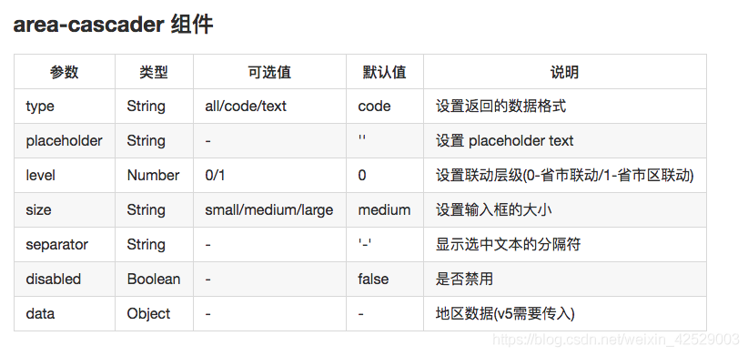
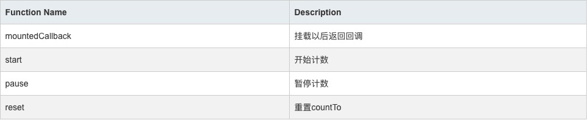
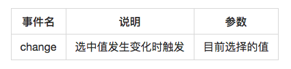

# Vue常用组件

[toc]


## 注：

大部分组件，使用了`vue.use()`方法。
这里解释一下为什么使用`vue.use()`。因为，当插件是一个`方法`的时候，
我们只需要把该`方法`定义到`vue`的`prototype`上就可以使用：

```js
import axios from 'axios'
Vue.prototype.axios = axios
```

但是如果插件是一个`对象`，我们就需要通过`vue.use()`来`引入`该`对象`：

```js
import Vue from 'vue'
import Router from 'vue-router'

Vue.use(Router)
```

## [路由(这是点击超链接)](./6_1_路由.md)

route的存在证明我们做的是一个SPA单页应用，而不是一大堆静态html页面。

那么到底什么是route呢？我们抛开服务端。换个说法，你知道什么是响应式吧。响应式布局，通过媒体查询出对方的手机型号和屏幕的分辨率， 为其切换展示的样式。

route你可以理解它就是url的“媒体查询”。通过在url输入不同的路径，可以响应不同的vue页面。

首先，我们打开vuecli中的main.js文件，可以发现route在这里被引入并且配置到vue上了。

```js
//第一步引入route，form后面是你的route文件地址
import router from './router'

//加载route
new Vue({
  el: '#app',
  render: h => h(App), //h=createElement 即渲染app中所有节点
  router, //route是在这一步装载到vue中的
  store,
  components: {
    App
  },
  template: '<App/>',
})
```

我们顺藤摸瓜找到这个route的index.js配置文件，就可以发现里面都是为访问url做的配置。

```js
import Vue from 'vue'
import Router from 'vue-router'
import index from '@/components/index'

Vue.use(Router)

export default new Router({
    mode: 'history',
    routes: [{
        path: '/',
        name: 'index',
        component: index
    }]
})
```

如果你嫌麻烦你可以直接在这个routes中多复制几个path这一段，然后把路径修改成你自己的。

这里需要注意的是，route还涉及到了子路由和路由拆分的功能，这里不做过多阐述，

## [异步数据请求：axios（这是点击链接）](./7_1_Axios.md)

还记得jquery中的这个方法吗？

```jsx
$.ajax()
```

它实际上是对javascript中原生ajax方法的一个封装。

`axios`也是，只不过它`作用于vue中`。它的引入方法跟route不太一样，因为`它仅仅是一套方法`，所以我们直接`定义到vue的prototype上`即可。
 **首先，我们通过npm进行安装：**

```bash
npm install axios -s-d
```

**然后打开main.js：**

```jsx
import axios from 'axios'
Vue.prototype.axios = axios
```

调用的时候，你可以写在`methods`或者`mounted`等生命周期中。

```jsx
let that = this;
this.axios({
  method: 'get',//请求方式
  url: 'URL',//请求地址
  params: {
    id: this.$route.query.id//发送的参数
  }
}).then(function(response) {
  //请求成功后获得的内容进行哪些操作
  that.title = response.data.result[0].title
})
```

另外，你还可以通过`axios`在`打包`时`区分` `线上`和`线下`环境

```csharp
//配置axios区别线上和测试环境
if (location.hostname === 'localhost') {
  axios.defaults.baseURL = process.env.API_PATH_TEST;
  //配置本地webSocketIO地址
  Vue.use(new VueSocketIO({
    debug: false,
    connection: 'localhost',
  }))
} else if (location.hostname === 'www.dangyunlong.com') {
  //配置线上webSocketIO地址
  Vue.use(new VueSocketIO({
    debug: false,
    connection: 'www.dangyunlong.com',
  }))
  axios.defaults.baseURL = process.env.API_PATH_PROD
}
```

## vuex 状态管理

------

### 首先使用npm进行安装：

```sh
npm i vuex --save
```

在使用`vuex`的时候，我们需要在`src目录下`新建一个`store文件夹`，然后在里面创建我们的`状态树js`。

并且在`main.js中引入`它

```jsx
//加载vue store
import store from './store'

new Vue({
  el: '#app',
  render: h => h(App),
  router,
  store,
  components: {
    App
  },
  template: '<App/>'
})
```

从这里我们不难看出，`vuex`是`基于store`的。并且，`vuex`还是`单一状态树`。那么store状态树又怎么来配置呢？

**打开`store`中的这个`index.js`**

```jsx
export default new Vuex.Store({
  state: {
    name: "dangyunlong",
    age: 30,
    index: {} //首页信息
  },
  getters:{
    //getters 相当于是vuex的计算属性,主要作用是对state中的值进行处理
    jia(state,num){
      return state.age + 1;
    },
    jian(state,num){
      return state.age - 1;
    }
  },
  mutations: {
    //vuex用于修改state中数据的方法
    gaiming(state, name) {
      state.name = name
    },
    getIndex(state, indexData) {
      state.index = indexData
    }
  },
  actions:{
      //actions 用于异步执行vuex mutations中的方法 它不会直接修改state而是作用于mutations
      //actions 中的方法可以接收一个context参数,这里的context就指vuex
      increment (context) {
        setTimeout(function(){
          //调用方式跟在.vue中一样
          context.commit('gaiming',"abc")
          //1秒后调用mutations中的gaiming方法,名字已经修改了
          console.log(context.state.name);
        }, 1000)
      }
  },
  modules: {
    // 子状态树
    a: model1
  }
});
```

我们可以发现`store`其实主要就是依靠这5个参数在发会作用：

| 参数名称  | 作用                                                        |
| --------- | ----------------------------------------------------------- |
| state     | 数据                                                        |
| getters   | 相当于vuex的计算属性，主要用于对值进行计算处理              |
| mutations | 用于修改vuex值的方法                                        |
| actions   | 用于异步调用mutations中的方法                               |
| modules   | 当你准备把状态树分为多个模块的时候，modules用于储存子状态树 |

**`子状态树`的写法也完全一样：**

```cpp
const model1 = {
  state: {
    name: "longge",
    age:31
  },
  getters:{

  },
  mutations: {

  },
  actions:{

  }
};

export default model1;
```

### 混入其中的高手冷门知识(mapState)

`vuex`有一个鲜为人知的辅助方法：`mapState`

```kotlin
computed:mapState({
  ageadd (state) {
    return state.count + this.localCount
  }
}),
```

有很多同学不知道这个函数是干啥用的，简单的介绍一下，这里涉及到了`computed`这个比较常用的`vue属性`，这个东西就是`计算属性`，它主要是`在不改变原始值的情况下对值做一些处理`。

如果，你一个一个通过

```js
this.$store.state.xx
```

的去调用`store`的`值`放到这个`计算属性`里面，你不是老得写这个`this.$store`吗。于是`vuex官方`就提供了一个让你可以省略前面这一段的方法。你可以通过这个方式`一次获得所有store中的state中的数据`，然后传入`state`直接用就行了。

这里面还有一个混入写法`...mapState`。

## `vue-countTo` (它是一个vue组件，将在指定的持续时间内计入目标数)

### 安装使用:

		npm install vue-count-to    
### 例子:

```vue
<template>
  <countTo :startVal='startVal' :endVal='endVal' :duration='3000'></countTo>
</template>
<script>
  import countTo from 'vue-count-to';
  export default {
    components: { countTo },
    data () {
      return {
        startVal: 0,
        endVal: 2017
      }
    }
  }
</script>
```

### 属性:



### 功能:



## `vue-area-linkage `(省市区三级联动PC端插件)

### 安装 :

```sh
npm i –save-dev vue-area-linkage area-data 
```

### 全局注册 :

```js
import Vue from 'vue';
area-data组件提供数据（不建议全局注册这个,在页面里引用）
// import { pca, pcaa } from 'area-data';
import 'vue-area-linkage/dist/index.css'; // v2 or higher
import VueAreaLinkage from 'vue-area-linkage';
	
Vue.use(VueAreaLinkage)
```

### 例子1 :

```vue
<template>
	<div class="area">
	  <area-select type="text" :data="pcaa" :placeholders="placeholders" :level="2" v-model="selected" placeholder="请选择" ></area-select>
	</div>
</template>
<script>
  // 根据需要按需引入数据
  import { pca, pcaa } from "area-data";
  export default {
    data() {
      return {
        pcaa: pcaa,//最多省市区三级，结合:level='2'选择，0省、1省市、2省市区
    	placeholders: ['选择省','选择市','选择区'],
        selected: [],
      }
    }
  }
</script>
```

### 例子2 :

```vue
<template>
	 <area-cascader :level="1" v-model="selected" :data="pcaa" placeholder="请选择地区"/>
</template>
<script>
  // 根据需要按需引入数据
  import { pca, pcaa } from "area-data";
  export default {
    data() {
      return {
        pcaa: pcaa,//最多省市区三级和省市二级联动，结合:level='1'选择，0省市、1省市区
        selected: [],
      }
    }
  }
</script>
```

### 属性:


### 事件:



## UI库

### Element UI

依然使用npm进行安装，当然如果你有cnpm就更好了：

```bash
cnpm install element-ui -s-d
```

element作为你必须掌握的ui库，它和iview的区别再于用户量更大，研发团队人员更多，发现错误的机率更高，在组件支持项中也超过iview。更屌的是element还支持Sketch和Axure，让产品经理和设计师也能从容参与到开发中来。所以element成为了本文首选。

引入element ui的方式也非常简单，通过npm安装后，打开main.js

```jsx
import ElementUI from 'element-ui';
import 'element-ui/lib/theme-chalk/index.css';

Vue.use(ElementUI);
```

调用的时候也非常简单：

```jsx
<el-menu default-active="1" class="el-menu-vertical-demo">
    <el-submenu index="1">
      <template slot="title">
        
        <span></span>
      </template>
      <el-menu-item-group>
        <template slot="title"></template>
        <el-menu-item index="1-1"></el-menu-item>
        <el-menu-item index="1-2"></el-menu-item>
        <el-menu-item index="1-3"></el-menu-item>
      </el-menu-item-group>
    </el-submenu>
</el-menu>
```

直接把这种el开头的标签插入到你的.vue文件中即可。

element支持的组件非常多，你可以查看[这里](https://links.jianshu.com/go?to=https%3A%2F%2Felement.eleme.cn%2F%23%2Fzh-CN%2Fcomponent%2Finstallation)，里面的组件代码已经写的非常清楚了，直接复制粘贴到你的.vue中即可。

### 焦点图 / 轮播图

#### swiper

你可能会问了，轮播图组件多了去了，为什么就介绍swiper呢？因为龙哥过去在制作非spa页面的时候，对swiper可以说是情有独钟，无论是兼容性还是在移动/非移动端，swiper的表现都可圈可点。官方提供完整的api手册，让扩展修改也非常得心应手。

使用cnpm安装

```undefined
cnpm install swiper -S -d
```

安装完毕以后，我们需要把swiper封装成一个组件。这个是非常简单的，新建一个swiper.vue即可。

```xml
<template>
    <div>
        <div class="swiper-container">
            <div class="swiper-wrapper">
                <div class="swiper-slide">Slide 1</div>
                <div class="swiper-slide">Slide 2</div>
                <div class="swiper-slide">Slide 3</div>
            </div>
        </div>
    </div>
</template>

<script>
    import Swiper from "swiper";
    export default{
        name:"swiper",
        mounted(){
            var mySwiper = new Swiper ('.swiper-container', {

            })
        }
    }
</script>
<style>
    @import 'swiper/css/swiper.css';
    .swiper-container {
        width: 600px;
        height: 300px;
    }
</style>
```

因为是局部的，我们甚至都不需要再main中去引入它。用的时候直接定义到components上即可。

```undefined
components: {
  swiper
},
```

然后把标签写到你的项目中：

```xml
<swiper></swiper>
```

### 图表

#### vue-echarts

vue-echarts是echarts的一个封装，它和百度echarts的区别在于，它是基于vue的一个对象..操作上更加的简单，如果你仅仅是为了展示图表，建议你使用vue-echarts。但是如果你的项目中含有对echarts的深度定制，例如改变了原始图表的展示方式或者点击事件和较为复杂的逻辑，还是建议你使用百度echarts。

安装方式跟其他vue组件一样：

```undefined
npm install echarts vue-echarts
```

然后打开main.js输入

```jsx
import ECharts from 'vue-echarts';
import 'echarts/lib/chart/line';
Vue.component('chart', ECharts);
```

这样vue-echarts就变成了一个全局组件，我们直接在页面中调用即可。

```ruby
<chart ref="chart1" :options="orgOptions" :auto-resize="true"></chart>
```

另外在data中添加一个配置文件的变量，再mounted生命周期中注入内容即可。

```tsx
export default {
    name: 'index',
    data() {
        return {
            orgOptions: {},
        }
    },
    mounted: function() {
          //echarts
          this.orgOptions = {
              xAxis: {
                  type: 'category',
                  data: ['Mon', 'Tue', 'Wed', 'Thu', 'Fri', 'Sat', 'Sun']
              },
              yAxis: {
                  type: 'value'
              },
              series: [{
                  data: [820, 932, 901, 934, 1290, 1330, 1320],
                  type: 'line',
                  smooth: true
              }]
          }
    },
}
```

其中具体图表设置请查看[这里](https://links.jianshu.com/go?to=https%3A%2F%2Fgithub.com%2Fecomfe%2Fvue-echarts%2Fblob%2Fmaster%2FREADME.zh_CN.md)。
 你可以下载其中的例子然后打开[http://localhost:8080/demo](https://links.jianshu.com/go?to=http%3A%2F%2Flocalhost%3A8080%2Fdemo)查看。

### 视频播放

#### vue-video-player

vue-video-player是一个视频播放解决方案，功能非常全。

使用cnpm命令安装，可以加快安装速度。

```undefined
cnpm install vue-video-player -S -d
```

然后老规矩打开main.js填入以下内容：

```jsx
import VideoPlayer from 'vue-video-player'
require('video.js/dist/video-js.css')
require('vue-video-player/src/custom-theme.css')
Vue.use(VideoPlayer)
```

然后在我们要使用的页面上：

```csharp
<video-player  class="video-player vjs-custom-skin"
ref="videoPlayer"
:playsinline="true"
:options="playerOptions"
></video-player>
```

最后增加一个配置变量：

```go
playerOptions : {
    playbackRates: [0.7, 1.0, 1.5, 2.0], //播放速度
    autoplay: false, //如果true,浏览器准备好时开始回放。
    muted: false, // 默认情况下将会消除任何音频。
    loop: false, // 导致视频一结束就重新开始。
    preload: 'auto', // 建议浏览器在<video>加载元素后是否应该开始下载视频数据。auto浏览器选择最佳行为,立即开始加载视频（如果浏览器支持）
    language: 'zh-CN',
    aspectRatio: '16:9', // 将播放器置于流畅模式，并在计算播放器的动态大小时使用该值。值应该代表一个比例 - 用冒号分隔的两个数字（例如"16:9"或"4:3"）
    fluid: true, // 当true时，Video.js player将拥有流体大小。换句话说，它将按比例缩放以适应其容器。
    sources: [{
      type: "",//这里的种类支持很多种：基本视频格式、直播、流媒体等，具体可以参看git网址项目
      src: "" //url地址
    }],
    poster: "../../static/images/test.jpg", //你的封面地址
    // width: document.documentElement.clientWidth, //播放器宽度
    notSupportedMessage: '此视频暂无法播放，请稍后再试', //允许覆盖Video.js无法播放媒体源时显示的默认信息。
    controlBar: {
      timeDivider: true,
      durationDisplay: true,
      remainingTimeDisplay: false,
      fullscreenToggle: true  //全屏按钮
    }
}
```

每次要切换视频的时候，修改src即可。

### 相册

#### vue-photo-preview

有的时候，我们会遇到一个需求，就是把小图放大或者多个图片方大后轮播的情况，这个时候用element ui中自带的组件已经没办法满足我们的使用了。这里推荐一个相册插件：vue-photo-preview。

安装：

```undefined
cnpm install vue-photo-preview -S -d
```

添加main.js中

```jsx
//加载图片查看工具
import preview from 'vue-photo-preview'
import 'vue-photo-preview/dist/skin.css'
var options={
  fullscreenEl:false //关闭全屏按钮
}
Vue.use(preview,options)
```

使用方法非常简单，只要再img中添加两个属性即可。

```xml
//在img标签添加preview属性 preview值相同即表示为同一组

//分组
  
```

### 安全性

#### 传输加密：sha256、md5、base64

前端进行she256，md5和base64非常的简单，只需要下载一套算法即可：

```undefined
cnpm install js-md5 -S -d
cnpm install js-sha256 -S -d
cnpm install js-base64 -S -d
```

然后把下载好的算法全部定义到vue到prototype上：

```jsx
//3种加密方式
import md5 from 'js-md5';
Vue.prototype.$md5 = md5;

import sha256 from 'js-sha256';
Vue.prototype.$sha256 = sha256;

import base64 from 'js-base64';
Vue.prototype.$base64 = base64;
```

使用方法：

```jsx
console.log("md5加密方式："+this.$md5('holle'));
console.log("sha256加密方式："+this.$sha256('holle'));
console.log("base加密方式："+this.$sha256('holle'));
```

### 交互数据模拟

#### mockjs

大部分时候，我们可能需要根据设计图做一个静态页面，因为我们不知道好多地方填上数据以后是什么样子的。这个时候我们肯定不能等着后端开发人员的接口开发完了再去填数据，这样效率太低了。

这里推荐使用mockjs。mock是一个可以拦截http请求生成一个微数据短的插件，让我们不用等着后端人员就可以自己先填入一部分数据。

使用cnpm命令安装，可以加快安装速度。

```undefined
cnpm install mockjs --save-dev
```

使用上是非常方便的，因为mock会自动拦截http请求。
 首先，我们再src中创建一个mock文件夹，并且再里面创建index.js：

```jsx
//引入mockjs
const Mock = require('mockjs')

//响应模拟数据
Mock.mock('http://api.com', {
    "user|5-100": [{
        'name': '@cname',   //中文名称
        'age|1-100': 100,   //100以内随机整数
        'birthday': '@date("yyyy-MM-dd")',  //日期
        'city': '@city(true)'   //中国城市
    }]
});
```

你可以理解这个mock就是你的数据端，这里面配置的url，就是你获取虚拟数据要使用到的url。

然后打开main.js把这个js给引用上。

```jsx
require('./mock/index')
```

最后我们再组件中请求这个地址即可获得数据：

```jsx
//mock
this.axios({
    method: 'get',
    url: 'http://api.com'
}).then(function(response) {
    console.log(response);
})
```

### 动态标题

#### vue-meta-info

spa有一个非常大的问题就是，它实际上没有那么多页面，我们所有的页面逻辑关系都是通过route完成的。

可是，这样就诞生了一个问题，页面的title部分并没有切换掉。我们就需要动态的去处理这个titile了。这里推荐使用vue-meta-info来解决这个问题，说实话，我曾经一度认为这个东西是一个核心组件。因为你的title不切换的话，总感觉好像少点什么一样。

安装：

```undefined
cnpm i vue-meta-info -S -d
```

main.js中

```jsx
import MetaInfo from 'vue-meta-info'
Vue.use(MetaInfo)
```

使用方法

```css
metaInfo: {
    title: '生活随记—党云龙个人博客',
    meta: [{
        name: '党云龙个人博客',
        content: '党云龙,web前端开发,vue,vuecli,webpack,canvas,html5,css3'
    }]
}
```

### 优化篇

#### 图片懒加载 vue-lazyload

vue-lazyload的作用就是：当你滚动条还没有滚动到这一片区域的时候，就不加载一片区域中的图片，会用loading中的gif图去代替。

使用npm安装方式：

```undefined
npm install vue-lazyload   --save
```

然后在main.js中加入

```jsx
//图片懒加载 ----------------------------------------
import VueLazyload from 'vue-lazyload';
//初始化
Vue.use(VueLazyload, {
  preLoad: 1.3,
  //loading: ‘../static/loading.gif',
  loading: require('./assets/loading.gif'),
  attempt: 1
})
```

注意，loading的图片在static和assets中路径的写法稍微有点区别。

#### 上传图片压缩 lrz

在图片上传的时候，我们肯定不能直接把一张大图给传上去，这里我们需要限制一下大小。然后，可能更好的方法就是，进行压缩。
 这里推荐使用lrz插件。
 安装：

```undefined
cnpm install lrz -S -d
```

然后再main中加载lrz:

```jsx
import lrz from 'lrz'
```

使用的时候:

```xml
<template>
  <div>
    <div @click.stop="addPic" ref="upload" class="btn">
      <input type="file" accept="image/*" @change="onFileChange" style="display: none" multiple />chooseImg
    </div>
    <p v-if="!isNaN(before)">压缩前:{{before|number}}kb</p>
    <p v-if="!isNaN(after)">压缩后:{{after|number}}kb</p>
  </div>
</template>
```

```jsx
import lrz from "lrz";
export default {
  data() {
    return {
      imgUrl: [],
      before: NaN,
      after: NaN
    };
  },
  methods: {
    onFileChange(e) {
      // 获取文件对象
      var file = e.target.files[0];
      // 压缩前文件大小
      this.before = file.size / 1024;
      this.imgUrl = URL.createObjectURL(file, { quality: 0 });
      lrz(this.imgUrl).then(rst => {
        // 压缩后文件大小
        this.after = rst.fileLen / 1024;
      });
    }
  }
}
```

## 其他

### Vue-chart.js

- 绘制图标
- https://vue-chartjs.org/

### Vue-fa

- 可以使用fontAwesome5 的各种插件
- [https://cwe](https://cwe/);o.github.io/vue-fa/

### Vee-validate

- 基于模板的Vue校验框架
- https://baianat.github.io/vee-validate/'

### eslint-plugin-vue

- vue语法检查工具，可以快速的定位出错位置
- https://eslint.vuejs.org/

### vue——lazyload

- 图片懒加载处理组件
- https://github.com/hlongjw/vue-lazyload

### axios

- HTTP通信组件，可以远程获取各种REST-API服务
- https://github.com/axios/axios

### vuedraggable

- 网页对象拖动组件，可以实现页面对象的拖动排序
- https://github.com/SortableJS/Vue.Draggable

### Vue-Socket.io

- 对于Socket.io 库的封装，可以和Vuex 状态管理 配合使用
- https://github.com/MetinSeylan/Vue-Socket.io

### Vue-multiselect 

- 多选框的解决方案，包括状态管理，下拉框，Ajax，检索框等功能。
- https//vue-multiselect.js.org/

### Vuejs - datepicker

- vue的日期选择组件
- https://github.com/charliekassei/vuejs-datepicker

### Vue-editor

- vue的markdown插件使用
- https://github.com/hinesboy/mavonEditor

### Vue-typer

- 内容显示打印机
- http://github.com/cngu/vue-typer/

### Vue-rare-it

- 五星评价组件
- https://craigh411.github.io/vue-rate-it/

### Vue-good-table

- vue的表格操作，支持排序, 内容过滤 ， 分页等操作
- https://xaksis.github.io/vue-good-table/

### Vuex

- 状态管理
- https://vuex.vuejs.org/

### Vuetify

- vue 的 ui 框架
- https://vuetifyjs.com/zh-Hans/

### vue-material

- Google 设计风格的UI组件库
- https://material-ui.com/

### Nuxt.js

- Vue 服务器端渲染框架，解决客户端渲染的诸多问题。（例如，客户端首次加载页面时，会请求大量的js，从而导致  首页加载慢，SEO 等问题），用Nuxt.js 可以解决这些问题
- https://nuxtjs.org/

### Bootstrap

- 响应式布局 

- https://v3.bootcss.com/

```sh
npm install bootstrap --save
```

### DataV

- 数据可视化 

- http://datav.jiaminghi.com/guide/

```sh
npm i element-ui -S
```

