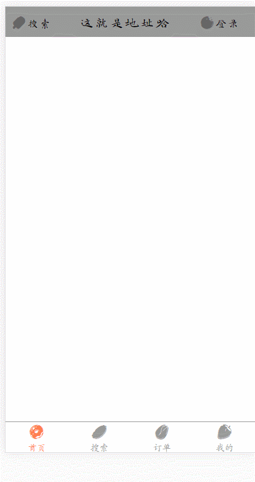
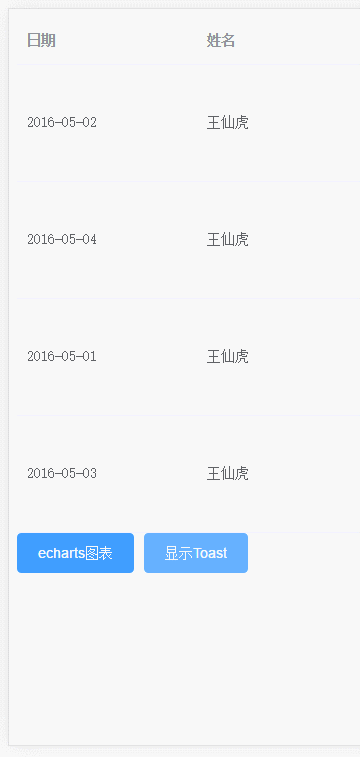
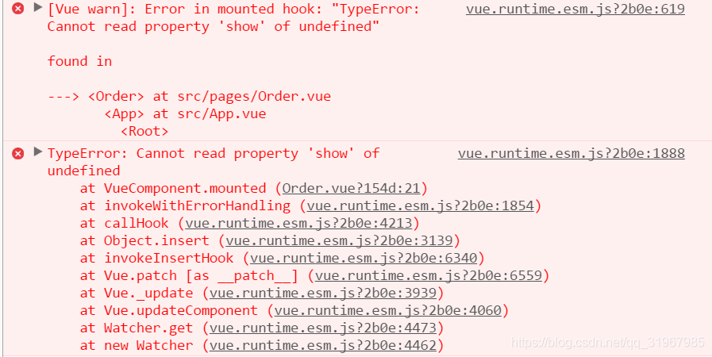
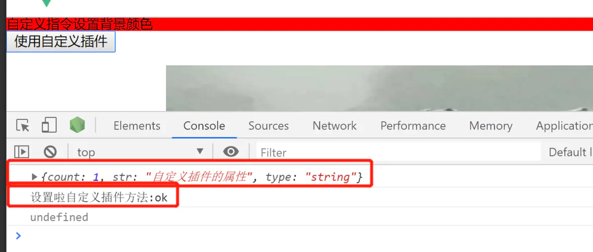

# 自定义插件

[toc]

## 什么是插件

其实我们已经用过的很多插件如：`axios`，`vue-router`等都是`自定义的插件`，然后被开发者普遍运用被熟知。

**这些插件中也可以分为两类：**

1. 基于`Vue.js基础`开发的插件；
2. 其他插件（`非Vue.js语法`），
3. 而我们`自己开发`的插件属于第一类，`基于Vue.js`开发。

> 根据官网的定义，`Vue.js 的插件`应当有一个`公开方法` ` install `。这个方法的`第一个参数`是 `Vue 构造器` , `第二个参数`是一个`可选的选项对象`

## 插件作用:

1. 添加`全局` `方法`或者 `property`。如：`vue-custom-element`	
2. 添加`全局资源`：`指令`/`过滤器`/`过渡`等。如 `vue-touch`
3. 通过`全局混入`来`添加`一些`组件选项`。如 `vue-router`
4. 添加 `Vue 实例方法`，通过把它们添加到` Vue.prototype `上实现。
5. 一个库，提供自己的` API`，同时提供上面提到的`一个`或`多个功能`。如 `vue-router`

## 1.使用:

`Vue.use(对象,{传递参数})`;    //对象必须提供`.install`方法

- **参数：**
  - `{Object | Function} plugin`    ==>  `Vue.use(obj[,function()])`
- **用法：**
  1. 安装 `Vue.js` 插件。如果插件是一个`对象`，必须提供 `install` 方法。如果插件是一个`函数`，它会被作为` install 方法`。`install` 方法调用时，会将` Vue `作为参数传入。
  2. 该方法需要在调用 `new Vue()` 之前被调用。
  3. 当 `install `方法被同一个插件多次调用，插件将`只会被安装一次`。

### Node等环境使用插件必须显示调用:

1. 官方提供的一些插件(例如` vue-router`)在检测到`Vue`是`可访问`的`全局变量`时会`自动调用` `Vue.use()`。

2. 然而在像`CommonJS`这样的模块环境中,

   `var Vue = require('vue')`

   `var VueRouter = require('vue-router')`

   > `Vue.use(VueRouter)`	不要忘了调用此方法

## 2.语法

```js
let x={
	install:function(Vue,传递参数)
	{
		Vue为由Vue的createApp生成的app对象
		
		1. 添加全局方法或 property
		  Vue.myGlobalMethod = function () {
		    ...
		  }
		
		2.5 添加全局provide
			Vue.provide('i18n', options)
		 
		2. 添加全局指令
		  Vue.directive('my-directive', {
		    bind (el, binding, vnode, oldVnode) {
		      ...
		    }
		    ...
		  })
		3. 混入
		  Vue.mixin({
		    created: function () {
		     ...
		    }
		    ...
		  })
		4. 添加实例方法
		  Vue.prototype.$myMethod = function (methodOptions) {
		    ...
		  }
		  
			如:自定义一个组件,并挂载到html上
				1、import导入组件
				
					该组件不具有$mount和$el方法,无法获取到组件dom并挂载到html
					
				2、Vue.extend(组件对象),返回组件构造器
				
					Vue.extend(),接收一个组件对象作为参数,返回其构造器
					
				3、通过new 返回的构造器,获取到组件实例
				
					(1)这时的组件实例具有了$mount和$el方法
					(2)Vue实例在实例化时没有收到el选项,则它处于“未挂载”状态,没有关联的 DOM 元素,所以$el为undefined
					(3)$mount手动地挂载一个未挂载的实例
					
				4、组件实例.$mount(选择器/dom对象),将组件挂载到dom对象上
				
					实例.$mount(),会替换挂载的dom对象,所以不能直接用html内已有对象,
					document.createElement创建一个任意dom或者不传参数(即文档之外的的元素)即可
				
				5、将组件的dom元素,插入到html内
					document.body.appendChild(实例.$el)
					
					此时组件已经被插入到了html内
				
				6、将该组件放在Vue原型上，使得在项目内任意位置可调用该实例及其内部属性/方法
					Vue.prototype.$x=组件实例
			
			5、注册全局组件
				Vue.component(组件名称,组件对象)
			
	}
	
}

```

### 实例

```html
<!DOCTYPE html>
<html>
	<head>
		<meta charset="utf-8" />
		<title></title>
		<script src='js/vue.js'></script>
	</head>
	<body>
		<div id='app'> 
			
			//使用插件内的指令、方法、变量
			<div v-my-directive >
				{{this.$my()}}
			</div>
			
			{{this.$color}}
			
		</div>
		<script>

			let lcPlugin={
				install:function(Vue)
				{
					console.log('安装插件')
					//添加全局方法
					Vue.myGlobalMethod=function(){
						console.log(1);
						document.body.style.color='red';
					};
					//添加全局属性
					Vue.prototype.$color='red';
					//添加全局指令
					Vue.directive('my-directive',{
						bind(el,binding,vnode,oldnode){
							
							el.innerHTML='哈哈';
						}
					});
					//注入混合属性
					Vue.mixin({
						created:function(){
							console.log('生命周期');
						}
					});
					//添加示例对象方法
					Vue.prototype.$my=function(){
						console.log(this);
						console.log(2);
						Vue.myGlobalMethod()
					}
					
					//自定义插件,Toast为import导入的组件
					
					//创建组件构造器
				    let Profile=Vue.extend(Toast);
				
				    //创建组件对象,具有了$el获取组件内部dom
				    let toast=new Profile()
				    console.log(toast);
				    //将组件对象挂载到任意元素,不能是文档流已有元素,因为会替换
				    toast.$mount(document.createElement('div'));
				    
				    //会替换挂载的元素,所以$el为当前组件dom
				    document.body.appendChild(toast.$el)
				
				    Vue.prototype.$toast=toast;
					
				}
			}
			
			Vue.use(lcPlugin);
			
			let app=new Vue({
				el:'#app'
			})
			

		</script>
	</body>
</html>
```

## 实例解说

本人在学习和查阅相关资料的过程中，总结出`两种不同的实现方式`：

**1.明确暴露install方法开发的自定义插件；**

**2.直接引用Vue开发的自定义插件。**

### 1.明确暴露install方法开发的自定义插件

#### 1）新建MyToast.vue文件

在`项目目录`下新建组件`MyToast.vue`并且定义好`toast`的样式，并且用两张`png`做`不同参数`的`显示`，当传`入参`数为`’S’`和`‘F’`时`显示不同图片`，`css`样式使用`less`格式，需要`安装`和`导入` `less`和`less-loader`第三方插件：

```vue
<template>
  <div v-if="isShowToast" class="toastStyle">
    
    
    <span class="toastText">{{ msg }}</span>
  </div>
</template>

<script>
export default {
  data(){
    return{
      isShowToast: false,
      showType: 'S',
      msg: ''
    }
  }
}
</script>

<style lang="less" scoped>
.toastStyle{
  position: fixed;
  display: flex;
  flex-direction: column;
  top: 40%;
  left: 50%;;
  text-align: center;
  width: 30%;
  border-radius: 5%;
  z-index: 100;
  background: rgba(0, 0, 0, 0.5);
  transform: translate(-50%,-50%);
  .toastImg{
    width: 100%;
    height: 30%;
  }
  .toastText{
    font-size: 25px;
    font-weight: bold;
    color: #000;
  }
}
</style>
```

#### 2）为`MyToast.vue`创建`js文件`封装组件（代码详解）

```js
//引入写好的MyToast.vue组件
import MyToast from './MyToast.vue'

//声明一个变量用来存放构造器
let $vm

export default{
  //调用暴露的install函数  ----------注意：此处的Vue是一个传入的形参，与第二中方法中要区分----------
  install(Vue){
    //变量为空执行
    if(!$vm){
      //调用Vue的extend方法生成一个构造器myToastConstructor继承MyToast
      const myToastConstructor = Vue.extend(MyToast);
      
      //构造器实例化
      $vm = new myToastConstructor({
        //在构造器内部调用document生成一个div元素用来存放MyToast.vue中写好的模板template
        el: document.createElement('div')
      });
      
      //调用document将构造器和生成的div元素添加到DOM中使其能够被渲染
      document.body.appendChild($vm.$el);
    }
    
	//首先赋值MyToast.vue中的，也就是构造器继承的是否显示toast组件的字段isShowToast 为false
    $vm.isShowToast = false;
    
    //声明toast并为其声明两个方法，显示和隐藏toast
    let toast = {
      //show方法传入两个参数分别为显示成功或者失败，显示的信息（与MyToast.vue中的数据对应）
      show(showType, msg){
        $vm.isShowToast = true;
        $vm.showType = showType;
        $vm.msg = msg
      },
      //定义隐藏toast的方法
      hide(){
        $vm.isShowToast = false;
      }
    };
    
	//判断Vue中是否有toast属性，没有就将上面定义好的toast赋值给Vue的属性
    if(!Vue.toast){
      Vue.$toast = toast;
    }
    
	//通过调用添加 Vue 实例方法，通过把它们添加到 Vue.prototype 上实现全局注册
    Vue.prototype.$toast = Vue.$toast
  }
}

```

#### 3）自定义插件调用和实现

在`main.js`中引入上面写好的js文件，并`注册到Vue`中：

```js
import toast from './plugins/myToast/index.js'
Vue.use(toast)
```

在`Vue项目`的`任何组件`中可以调用定义好的`组件toast`：

```js
  //假如在某个组件的mounted生命周期函数中调用
  mounted(){
    //通过this.$toast.show掺入参数调用显示函数
    this.$toast.show('S','成功')
    
    //设置计时器2秒中后调用this.$toast.hide()隐藏toast
    setTimeout(() => {
      this.$toast.hide()
    }, 2000);
  }

```

#### 4）效果如图

**切换到订单后在其mounted中执行toast并且2秒后自动隐藏。**




### 2.直接引用Vue开发的自定义插件

#### 1）新建`MyToast.vue`文件

在`项目目录`下新建`组件MyToast.vue`并且定义好`toast`的样式，同样用`两张png`做不同`参数`的`显示`（图片与二中不一样哟，做一个小小的区分），当传`入参`数`type`为`’S’`和`‘F’`时`显示不同图片`，`css`样式使用`less`格式，需要`安装和导入` `less`和`less-loader`第三方插件：


```vue
<template>
  <div id="toast" v-if="isShow" class="toast">
    
    
    <span>{{msg}}</span>
  </div>
</template>

<script>
export default {
  data(){
    return{
      isShow: false,
      msg: '',
      type: ''
    }
  }
}
</script>
<style lang="less" scoped>
.toast{
  position: fixed;
  display: flex;
  flex-direction: column;
  top: 40%;
  left: 50%;
  padding: 2vw;
  width: 35;
  text-align: center;
  border-radius: 5%;
  z-index: 100;
  background: rgba(0,0,0,0.5);
  transform: translate(-52%,50%);
  font-size:16px;
}
</style>

```

#### 2）为`MyToast.vue`创建`js文件`封装组件（代码详解）

```js
//------注意：此处导入了Vue组件，与第一种方法中的形参Vue要区分-------
import Vue from 'vue'
//引入写好的MyToast.vue组件
import ToastComponent from './MyToast.vue'

//定义构造器继承导入的ToastComponent
const toastConstructor = Vue.extend(ToastComponent)

//定义方法showToast
function showToast(text, t, duration=2000){
  //在方法中实例化构造器定添加div元素和对ToastComponent的数据进行赋值
  const toastDom = new toastConstructor({
    el: document.createElement('div'),
    data(){
      return{
        msg: text,
        isShow: true,
        type: t
      }
    }
  })

  //将构造器添加的元素放入DOM中使其能够被渲染
  document.body.appendChild(toastDom.$el)
  
  //方法中设置定时器2秒后重新赋值sShow为false达到关闭toast的效果
  setTimeout(() => {
    toastDom.isShow =false
  }, duration);
}

//定义注册方法registryToast，通过把它们添加到 Vue.prototype 上实现全局注册
function registryToast(){
  Vue.prototype.$toast = showToast
}

//最后将注册方法作为导出项
export default registryToast

```

#### 3）自定义插件调用和实现

在`main.js`中`引入`上面写好的js文件，并`注册到Vue`中：

```js
import toastPlugin from './plugins/MyToast/index.js'
Vue.use(toastPlugin)
```

在`Vue项目`的`任何组件`中可以调用定义好的`组件toast`：
在组件的`template`中定义一个`按钮元素`：

```vue
<el-button type="primary" @click="showToast">显示Toast</el-button>
```

对按钮事件进行完善：

```js
   methods:{
    /**显示全局的Toast自定义组件 */
    showToast(){
      this.$toast("显示成功", 'S')
    }
  },

```

#### 4）效果如图



### 两种区分与比较

上诉的两种方是大家开发插件时所用到的，现在网上的博客和资料中也都是这两种方法及一些微小的变形，但是对于两种方法的区分和详细说明并没有写道。因此上述两种方法也只是我个人的理解。现在具体说下两种方法的区别：

#### 明确暴露install方法开发的自定义插件

这与官方文档一致，按照其`暴露的install方法`，并在`install方法`中完成`组件`的`封装`和`注册`；其中`inastll方法`传入`两个参数`：`Vue为必选`，`options为可选`；并且根据方法的了解，`Vue为形参`。本人试着将`install方法`改为其他名字,如`inst`等,其他的不变，再次`运行报错`：`mounted函数中的show方法未定义`


说明`toast`在`Vue`中找不到，并`没有`被`赋值`到`Vue.prototype 属性上`，所以`install`可以`看作`是`Vue` `开发插件注册`的`默认“入口”`，修`改名`字后`Vue`就`无法识别`或者`找不到对应的函数`，所以`install`必须给出,且`插件`的`封装`和`注册`在其方法中完成！

#### 直接引用Vue开发的自定义插件。

对于该方法，我们发现并`没有使用install方法`，但是他`却能执行`，你说奇怪不奇怪！

**于是冲代码上面进行分析**：在`第二`和`第三`部分代码详解时已经有过交代，调用`暴露的install函数`时“`Vue`”是一个`传入的形参`，而此方法中注意是`导入了Vue组件`import Vue from 'vue'，与第一种`方法中的形参Vue`要区分。本人没有看过Vue的源码，所以一不知道个所以然，因此只能猜测在此方法中引入了`Vue`，`vue`中已经`默认调用`了`insatll方法`，然后在：

```js
function registryToast(){
  Vue.prototype.$toast = showToast
}
```

中将`自定义`的`showToast方法`赋值给`Vue.prototype.的属性`，然后再放入`默认调用`的`Vue的install`中！

#### 小总结

**这只是一个猜测，或许上述的两种方法其实就是一种方法，第二种方法是第一种方法的变形形式，**

## 案例

首先要新建插件目录，新建插件文件
在我这里是放在 `src` 的目录下，新建了一`message.js文件`

目录如图所示：



编辑`message.js`插件文件：

```js
export default {
    install(Vue, options) {
        //设置属性和方法
        const ShowMessage = (res) => {
        console.log("设置啦自定义插件方法:"+res)
        }
        const content = {
            count : 1,
            str:"自定义插件的属性",
            type:"string",
        }
        //添加全局混入
        Vue.mixin({
            mounted(){
                console.log("这里设置全局混入,这会在每个组件的mounted生命周期里面")
            }
        })

        //添加全局指令
        Vue.directive('bg',{
            inserted:function(e){
                e.style.background="red"
            }
        })

//把新建的方法和属性绑定到全局
   Vue.ShowMessage = Vue.prototype.$ShowMessage = ShowMessage
   Vue.content = Vue.prototype.$content = content
    }
}
```

在`main.js`里面引入，然后`use()`方法即可

```js
import Vue from 'vue'
import App from './App.vue'
import router from './router'
import store from './store/index.js'
//先import引入
import message from '../src/plugins/message'
//然后使用use()方法
Vue.use(message)
new Vue({
  store,
  router,
  render: h => h(App),
}).$mount('#app')
```

在组件中使用

```vue
<template>
  <div class="wrap">
  //使用v-bg指令，检测效果
    <div v-bg>自定义指令设置背景颜色</div>
    <button @click="getplugin">使用自定义插件</button>
   
  </div>
</template>
<script>
export default {
  name: "index",
  components: {},
  props: {},
  data() {
    return {};
  },
  watch: {},
  computed: {},
  methods: {
//设置getplugin方法
    getplugin(){
    console.log(this.$content)  
    console.log(this.$ShowMessage('ok'))
    },
  }
```

结果如图所示


