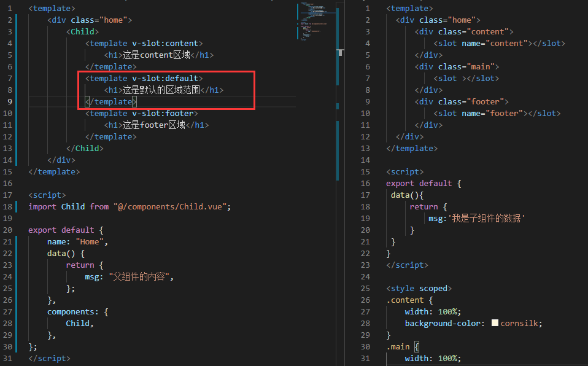
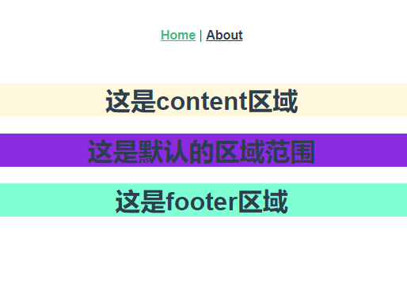
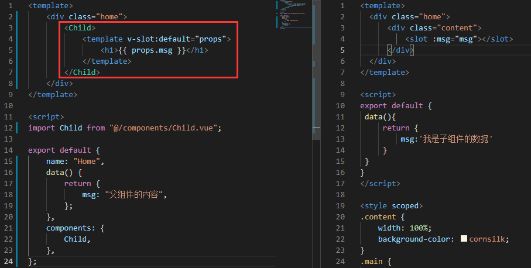
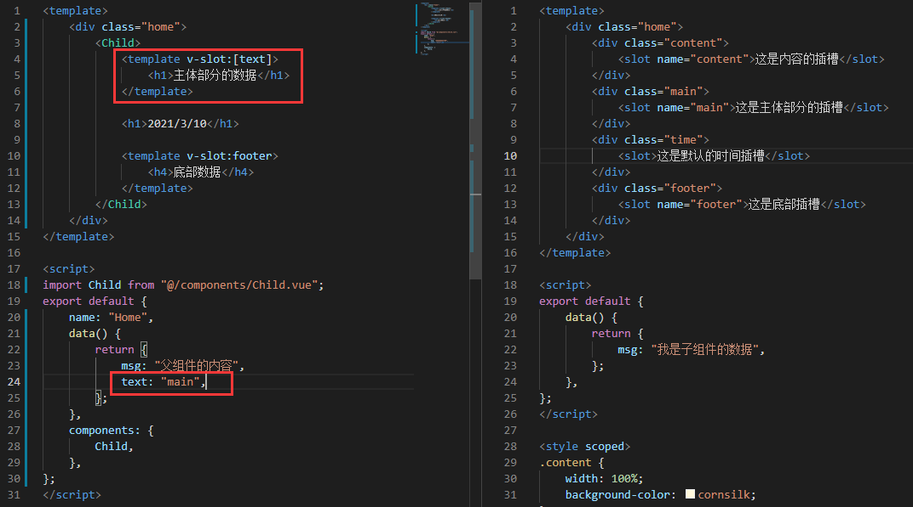
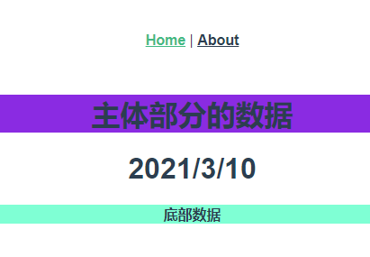
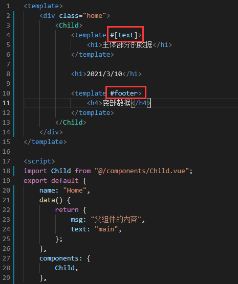
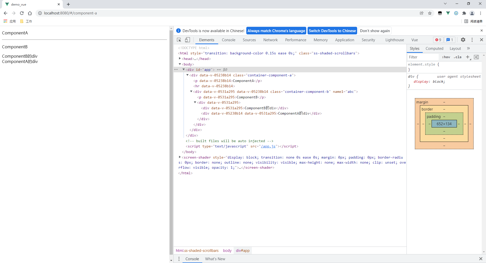
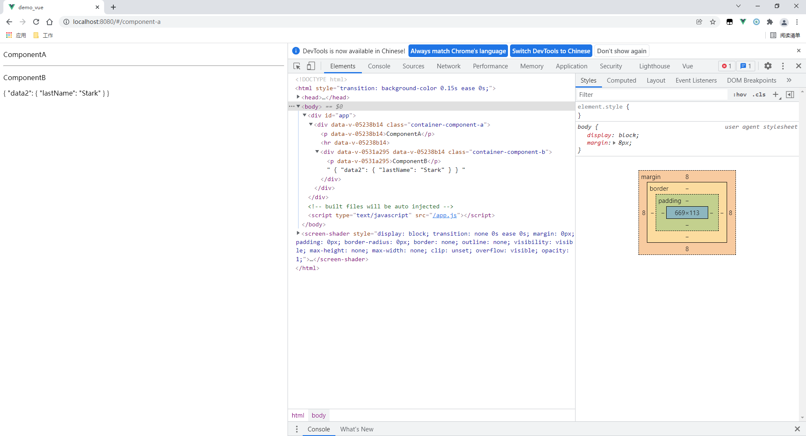
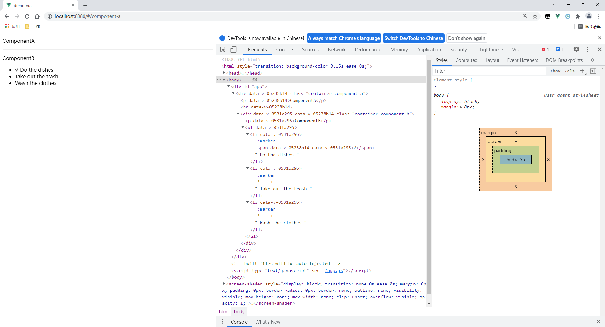

# v-slot的使用与详解

[toc]

## 关于v-slot指令的详细了解

相对于`v-slot指令`，对大家来说都应该不是很陌生，在 `2.6.0` 中，`vue`为`具名插槽`和`作用域插槽`引入了一个新的`统一的语法` (即 `v-slot 指令`)。它`取代`了` slot `和 `slot-scope` 在`新版`中的应用，当然`vue`官方暂时还`木有删除` `老版本`中`具名插槽`和`作用域插槽` `slot-scope`，也就是说，还`可以用`，但是`不推荐`，在`vue-cli 3.0`将`不能使用`

## **插槽分类**

插槽一共就三大类

1. `匿名插槽`(也叫`默认插槽`): 没有命名,有且只有一个
2. `具名插槽`: 相对匿名插槽组件`slot标签`带`name命名`的
3. `作用域插槽`: `子组件内数据`可以被`父页面拿到`(解决了数据只能从父页面传递给子组件)


==注意:`v-slot`只能添加在`<template>`上==

## 匿名()插槽

 `父组件 ` `所有`  `不带插槽名字`的`<template>`或者`不在<template>中`的内容，都会被放到`子组件` `默认插槽`中：`<slot></slot>`。

实际上，这`两种都会带有隐含的名字`：`default`


**默认作用域插槽写法**

默认插槽 可以写成` v-slot='xxx'`。也就是：`<template v-slot:default="xxx"> `

注意：`<template #="xxx"> `这样写是`不对`的，`#之后必须带参数`。 


**slot与v-slot区别**

|    项    |                             用法                             |                     使用位置                     |
| :------: | :----------------------------------------------------------: | :----------------------------------------------: |
|  `slot`  | `父组件`：`<template slot="test"><template>`<br />`子组件`：`<slot name="test"></slot>` | 可用在`任意标签`，如：<br />`<p slot="test"><p>` |
| `v-slot` | `父组件`：`<template v-slot:test><template>`<br />`子组件`：`<slot name="test"></slot>` |   只能用在 `组件component` 或者 `template `上    |



## 具名插槽新的改变

> 父组件：`<template v-slot:name1> ` 
>
> 简写方式：`<template #name1="data1">`
>
> 子组件：对应：`<slot name='name1'><slot>`

关于`v-slot`的指令，可以让我们不用再写过多的代码就可以做出`slot具名插槽`和`slot-scope作用域插槽`的功能，而且`v-slot`指令更加强大，提高了代码效率

**写个组件模板：**

```vue
<div>
	<h1>slot具名插槽</h1>
    <slot name="header">
    		<h2>插槽的默认值，当没有插入内容时将会渲染该元素</h2>
	</slot>
</div>
```

**使用`slot`将信息插入到插槽中**

```vue
<自定义组件>
<!-- 注意：组件中如果没有插槽将不能放入任何元素，且插槽在哪里元素就会被插入到那个位置 -->
<div slot="header">
		<h1>插入到插槽中的元素需要设置根标签，template或div都可</h1>
</div>
</自定义组件>
```

如果我们想要`插入元素`到`指定的位置`需要借助`slot`,`不然`的话将`插入失败`，当一个`组件`中具有`多个插槽`的时候，如果`没有借助slot属性`会`默认`把`元素插入到没有设置name属性值的slot组件`中，当然，会把`元素`在`每一个` `没有name属性`的`插槽`中`都插入一遍`




**使用`v-slot`将信息插入到插槽中:**

```vue
<自定义组件>
	<template v-slot:header>
			<h1>v-slot需要放置在template中</h1>
	</temaplate>
</自定义组件>
```

如果相比较`slot`,`v-slot`在`没有设置name属性`的`插槽` `出口`也会带有`隐含的名字“default”`，当然这里先埋下伏笔，如果想用`v-slot`指令`不插入` `具名的插槽`，v-slot`不带参数`就可以

## 插槽[作用域](https://so.csdn.net/so/search?q=作用域&spm=1001.2101.3001.7020)的改变

> 父组件：`<template v-slot:name1="data1"> `
>
>  简写方式：`<template #name1="data1">`
>
> 子组件：对应：`<slot name='name1' :data2="childData"><slot>`

同样的写个组件模板：

```vue
<div>
	<h1>slot具名插槽</h1>
    <slot name="header" :prop_herder="prop_herder_arg">
    		<h2>插槽的默认值，当没有插入内容时将会渲染该元素</h2>
	</slot>
</div>
```

使用`slot-scope`将想要传入的`值传入到父组件`中使用

```vue
<自定义组件>
<!-- 注意：slot-scope会把插槽中的属性都传入prop中，如果没有slot默认会是default的属性 -->
		<div slot="header"  slot-scope="prop">
				<h1>插入到插槽中的元素需要设置根标签，template或div都可</h1>
				{{prop.prop_herder_arg}}
		</div>
</自定义组件>
```

**使用`v-slot`将想要传入的`值传入到父组件`中使用**

```vue
例一：
<自定义组件>
		<template  v-slot:header>
				<h1>v-slot需要放置在template中</h1>
				{{header.prop_herder_arg}}
		</div>
</自定义组件>
```

```vue
例二：
<自定义组件>
		<template v-slot:header="prop">
		<!-- 注意：  v-slot:header="prop"意思是把具名插槽header的属性赋值给prop，如果不写值则可以使用具名插槽的name来使用属性-->
				<h1>v-slot需要放置在template中</h1>
				{{prop.prop_herder_arg}}
		</div>
</自定义组件>
```



## 独占默认插槽的缩写语法

对于`默认插槽`，`v-slot`具有一个单独的`缩写语句`，`不带参数`的 `v-slot` 被`假定对应默认插槽`

例如：

```vue
<!-- 只有默认插槽时,组件的标签才可以被当作插槽的模板来使用,这样我们就可以把 v-slot 直接用在组件上,
不然必须放在template标签内 -->
<自定义组件 v-slot:default="slotProps">
  {{ slotProps.user.firstName }}
</自定义组件>

缩写语法：
<自定义组件 v-slot="slotProps">
  {{ slotProps.user.firstName }}
</自定义组件>

```

注意`默认插槽`的单独写法`不能`和`带参数的v-slot` `混合使用`否则会`可能造成作用域混乱`：

```vue
<!-- 无效，会导致警告 -->
<自定义组件 v-slot="parent">
  {{ parent.user.firstName }}
  <template v-slot:header="children">
     parent is NOT available here
  </template>
</自定义组件>
```

## 解构插槽的属性（prop）

可以使用 ES2015 `解构`来传入`具体的插槽 prop`
例如：

```vue
<!-- 这样可以把插槽的user属性传过来 -->
<自定义组件 v-slot="{ user }">
  {{ user.Name }}
</自定义组件>

还可以给属性起别名
<!-- 这样可以把插槽的user属性传过来 -->
<自定义组件 v-slot="{ user:person }">
  {{ person.Name }}
</自定义组件>

<!-- 当没有要接受的属性没有定义时（undefine），我们可以自己设置值 -->
<自定义组件 v-slot="{ user = { Name: '小明' } }">
  {{ user.Name }}
</自定义组件>
```

`父组件`：`<template v-slot="{data2}"> `   

这个名字（`prop`）`必须对应`下方`:data2`的名字

`子组件`：对应：`<slot name='name1' :data2="childData"><slot>`

**说明：**

可以对`父组件prop重命名`：`<template v-slot="{data2 : person}">`
可以`设置默认内容`：`<template v-slot="{data2 : {name: "Tony"}}">`
以上边为例，获取的`data2`是`childData`对应的对象。

> #### `prop`名字问题
>
> 在使用时，`父组件`的`取值的名字` `必须`与`子组件返回`的`相同`，如：
>
> `父组件`：`<template #test="data1"> {{data1.data2}} </template>`
> `子组件`：`<slot name="test" :data2="testData"></slot>`
>
> **说明：**`父组件`的`data1`里边包含的就是这样的数据：`{"data2": testData绑定的对象}`，所以通过`data1`已经可以获取到数据了。

## 动态插槽名：

`动态指令参数`也可以用在` v-slot` 上，来定义`动态的插槽名`

```vue
<自定义标签>
  <template v-slot:[slotName]>
    ...
  </template>
</自定义标签>
```





此时`template 标签`上的`v-solt`指令`参数是一个中括号`, `中括号里的值`将是一个`变量`,为`当前父组件的数据`

## 具名插槽的缩写

跟` v-on` 和` v-bind` 一样，`v-slot `也有缩写，即把`参数之前`的`所有内容` (`v-slot:`) 替换为`字符 #`。例如 `v-slot:header` 可以被重写为 `#header`
例如：

```vue
<自定义标签>
  <template #header>
    <h1>Here might be a page title</h1>
  </template>
</自定义标签>
```

同样的，和其它指令一样，`该缩写只在其有参数的时候才可用`。这意味着以下语法是无效的
例如：

```vue
<自定义标签>
<!-- 会报错 -->
  <template #=user>
    <h1>{{user.name}}</h1>
  </template>
</自定义标签>

```

如果希望`使用缩写`，则`必须带参数`，也就是`默认插槽`的`缩写`和这个插槽缩写`不能够连用`
例如：

```vue
<自定义标签>
<!-- 会报错 -->
  <template #defalut=user>
    <h1>{{user.name}}</h1>
  </template>
</自定义标签>
```



## 实例1：子获取父的值

**router/index.js**

```js
import Vue from 'vue'
import Router from 'vue-router'
import ComponentA from "../components/ComponentA";
 
Vue.use(Router)
 
export default new Router({
  routes: [
    {
      path: '/component-a',
      name: 'ComponentA',
      component: ComponentA
    }
  ]
})
```

**components/ComponentA.vue（父组件）** 

```vue
<template>
  <div class="container-component-a">
    <p>ComponentA</p><hr>
    <component-b name1="abc">
      <div>ComponentA的div</div>
    </component-b>
  </div>
</template>
 
<script>
import ComponentB from "./ComponentB";
export default {
  components: {ComponentB},
}
</script>
 
<style scoped>
 
</style>
```

**components/ComponentB.vue（子组件）**

```vue
<template>
  <div class="container-component-b">
    <p>ComponentB</p>
    <div>
      <div>ComponentB的div</div>
      <slot></slot>
    </div>
  </div>
</template>
 
<script>
export default {
}
</script>
 
<style scoped>
 
</style>
```

**测试**



## 实例2：父子相互取值

**router/index.js**

```js
import Vue from 'vue'
import Router from 'vue-router'
import ComponentA from "@/components/ComponentA";
 
Vue.use(Router)
 
export default new Router({
  routes: [
    {
      path: '/componentA',
      name: 'ComponentA',
      component: ComponentA
    }
  ]
})
```

**components/ComponentA.vue（父组件）**

```vue
<template>
  <div class="container-component-a">
    <p>ComponentA</p>
    <hr>
    <component-b>
      <template v-slot:name1="data1">
        {{ data1 }}
      </template>
    </component-b>
  </div>
</template>
 
<script>
import ComponentB from "./ComponentB";
export default {
  components: {ComponentB},
}
</script>
 
<style scoped>
 
</style>
```

**components/ComponentB.vue（子组件）**

```vue
<template>
  <div class="container-component-b">
    <p>ComponentB</p>
    <slot name="name1" :data2="user"></slot>
  </div>
</template>
 
<script>
export default {
  data() {
    return {
      user: {
        lastName: 'Stark'
      }
    }
  }
}
</script>
 
<style scoped>
 
</style>
```

**测试**



## 实例3：todo列表

**简介**

​    本处在子组件中有要做的事情（包括已完成的和未完成的），然后父组件对其进行显示，如果已经完成，就在前边打个“√”。

**router/index.js**

```js
import Vue from 'vue'
import Router from 'vue-router'
import ComponentA from "../components/ComponentA";
 
Vue.use(Router)
 
export default new Router({
  routes: [
    {
      path: '/component-a',
      name: 'ComponentA',
      component: ComponentA
    }
  ]
})
```

**components/ComponentA.vue（父组件）**

```vue
<template>
  <div class="container-component-a">
    <p>ComponentA</p><hr>
    <component-b>
      <template v-slot:name1="data1">
        <span v-if="data1.data2.isCompleted">√</span>
        {{data1.data2.title}}
      </template>
    </component-b>
  </div>
</template>
 
<script>
import ComponentB from "./ComponentB";
export default {
  components: {ComponentB},
}
</script>
 
<style scoped>
 
</style>
```

**components/ComponentB.vue（子组件）**

```vue
<template>
  <div class="container-component-b">
    <p>ComponentB</p>
    <ul>
      <li v-for="todo in todoLists" v-bind:key="todo.id">
        <slot name="name1" :data2="todo"></slot>
      </li>
    </ul>
  </div>
</template>
 
<script>
export default {
  data() {
    return {
      todoLists: [
        {
          id: 1,
          title: 'Do the dishes',
          isCompleted: true,
        },
        {
          id: 2,
          title: 'Take out the trash',
        },
        {
          id: 3,
          title: 'Wash the clothes'
        }
      ]
    }
  }
}
</script>
 
<style scoped>
 
</style>
```

**测试**



