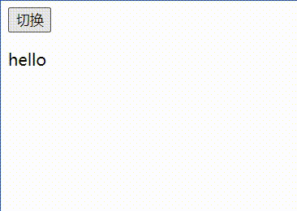
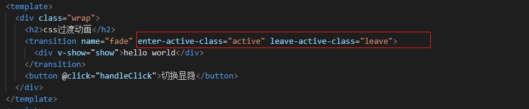
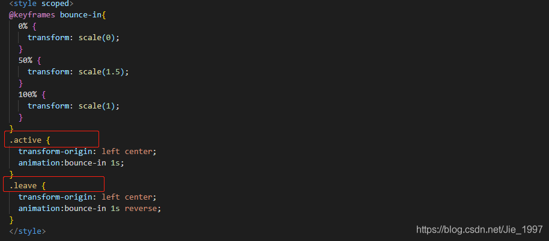
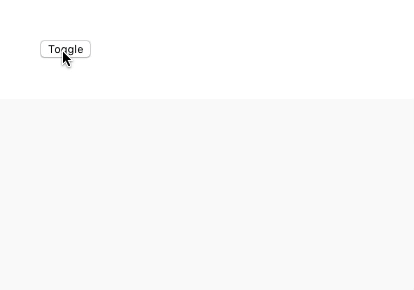

# Vue transition动画

- **transition 标签包裹的内容会有一个过渡的动画效果**
- 使用 transition 过渡组件需要满足的条件：
  1. 条件渲染（`v-if`）
  2. 条件展示（`v-show`）
  3. 动态组件
- 可以使用 `name` 属性给 transition 标签起名字
  1. class选择器名字和 `name` 属性有关系，这里 `name` 属性名为 `fade`, 则class选择器名称前缀都已`fade`开头，
  2. 如果不写`name`属性，则class选择器名称前缀默认以 `v` 开头
- transition 标签包裹的内容从隐藏变为显示时候动画原理
  1. 在动画即将被执行的一瞬间（动画执行的第一帧），会向transition内部的标签上增加两个class选择器名字，分别是`v-enter`、`v-enter-active`
  2. 在动画运行到第二帧的时候，会把 `v-enter` 的class选择器名称移除，然后增加一个`v-enter-to`的选择器名称
  3. 在动画执行结束的时候(动画执行的最后一帧），会把添加`v-enter-active`、`v-enter-to`的class选择器名称移除
- transition 标签包裹的内容从隐藏变为显示时候动画原理
  1. 在隐藏的第一个瞬间（动画执行的第一帧），会向transition内部的标签上增加两个class选择器名字，分别是`v-leave`、`v-leave-active`
  2. 在动画运行到第二帧的时候，会把 `v-leave` 的class选择器名称移除，然后增加一个`v-leave-to`的选择器名称
  3. 在动画执行结束的时候(动画执行的最后一帧），会把添加`v-leave-active`、`v-leave-to`的class选择器名称移除

## **过渡CSS类名**

`<transition>`中的name属性用于 替换 vue钩子函数中的类名 `v` ,默认为 `v`

1. `v-enter`: 定义进入动画之前，元素的起始状态。在元素被插入时生效，在下一个帧移除。
2. `v-enter-active`: 定义进入动画的状态。在元素被插入时生效，在transition/animation完成之后移除。
3. `v-leave`:定义离开之后动画的终止状态。在离开过渡被触发时生效，在下一个帧移除。
4. `v-leave-active`: 定义离开动画的结束状态。在离开过渡被触发时生效，在transition/animation完成之后移除。

> 在进入/离开的过渡中，会有 6 个 class 切换。

|      Class       |                      定义                      |                             说明                             |
| :--------------: | :--------------------------------------------: | :----------------------------------------------------------: |
|    `v-enter`     |          定义`进入过渡`的`开始`状态。          |     在元素被插入之前生效，在元素被插入之后的下一帧移除。     |
| `v-enter-active` |          定义`进入过渡生效`时的状态。          | 在整个进入过渡的阶段中应用，在元素被插入之前生效，在过渡/动画完成之后移除。这个类可以被用来定义进入过渡的过程时间，延迟和曲线函数。 |
|   `v-enter-to`   | `Vue 2.1.8`版及以上定义`进入过渡的结束`状态。  | 在元素被插入之后下一帧生效 (与此同时 `v-enter` 被移除)，在过渡/动画完成之后移除。 |
|    `v-leave`     |          定义``离开过渡的开始`状态。           |          在离开过渡被触发时立刻生效，下一帧被移除。          |
| `v-leave-active` |          定义`离开过渡生效`时的状态。          | 在整个离开过渡的阶段中应用，在离开过渡被触发时立刻生效，在过渡/动画完成之后移除。这个类可以被用来定义离开过渡的过程时间，延迟和曲线函数。 |
|   `v-leave-to`   | `Vue 2.1.8 `版及以上定义`离开过渡的结束`状态。 | 在离开过渡被触发之后下一帧生效 (与此同时 `v-leave` 被删除)，在过渡/动画完成之后移除。 |

> 对于这些在过渡中切换的类名来说，如果你使用一个没有名字的 `<transition>`，则 `v-` 是这些类名的默认前缀。如果你使用了 `<transition name="my-transition">`，那么 `v-enter` 会替换为 `my-transition-enter`

```html
<!DOCTYPE html>
<html>
<head>
	<meta charset="utf-8">
	<meta name="viewport" content="width=device-width, initial-scale=1">
	<script src="https://cdn.jsdelivr.net/npm/vue@2.6.14/dist/vue.js"></script>
	<title></title>
	<style type="text/css">
		/* 设置持续时间和动画函数 */
		.v-enter-active,.v-leave-active {
		  transition: all .8s ease;
          }
		.v-enter, .v-leave-to{
		  transform: translatey(100px);
		  opacity: 0;
		}
	</style>
</head>
<body>
	<div id="app">
		  <button @click="show = !show">切换</button>
		  <transition>
		    <p v-show="show">hello</p>
		  </transition>

	</div>

	<script type="text/javascript">
		let vue  = new Vue({
			el:'#app',
			data:{
				show:true,
			},
		})

	</script>
</body>
</html>
```



## 过渡的钩子函数

另外，`transition`元素还会发出JS钩子函数，因此我们可以捕获它们并使用 JS 来执行动画。 可用的钩子有：

**1、入场钩子**

- `before-enter`进入过渡前
- `enter`过渡运行时
- `after-enter`过渡完成后
- `enter-cancelled`过渡被打断时

**2、出场钩子**

- `before-leave`离开过渡运行前
- `leave`离开过渡运行时
- `after-leave`离开过渡运行后
- `leave-cancelled`离开过渡被打断时

#### 案例

```vue
<transition   @before-enter='beforeEnter'>
    <!-- ... -->
</transition>
```

然后，我们可以在 JS 中处理它们。

```js
beforeEnter(el, done) {
   done()
}
```

## @keyframes 的使用

1. `style` 中设置@keyframes
2. `transition` 标签 class样式中使用 @keyframes样式名称，这里为 **`bounce-in`**

```vue
<template>
  <div class="wrap">
    <transition name="fade">
      <div v-show="show">hello world</div>
    </transition>
    <button @click="handleClick">切换显隐</button>
  </div>
</template>
<script>
export default {
  data() {
    return {
      show: true,
    };
  },
  methods: {
    handleClick() {
      this.show = !this.show;
    },
  },
};
</script>
<style scoped>
@keyframes bounce-in{
  0% {
    transform: scale(0);
  }
  50% {
    transform: scale(1.5);
  }
  100% {
    transform: scale(1);
  }
}
.fade-enter-active {
  transform-origin: left center;
  animation:bounce-in 1s;
}
.fade-leave-active {
  transform-origin: left center;
  animation:bounce-in 1s reverse;
}
</style>
```

#### 自定义 transition 标签的 class 名字，使用 @keyframes

1. 设置 transition 自定义 class 名
   

2. 设置 class 的过渡样式
   

3. 一个实例

   ```html
   <template>
     <div class="wrap">
       <h2>css过渡动画</h2>
       <transition name="fade" enter-active-class="active" leave-active-class="leave">
         <div v-show="show">hello world</div>
       </transition>
       <button @click="handleClick">切换显隐</button>
     </div>
   </template>
   <script>
   export default {
     data() {
       return {
         show: true,
       };
     },
     methods: {
       handleClick() {
         this.show = !this.show;
       },
     },
   };
   </script>
   <style scoped>
   @keyframes bounce-in{
     0% {
       transform: scale(0);
     }
     50% {
       transform: scale(1.5);
     }
     100% {
       transform: scale(1);
     }
   }
   .active {
     transform-origin: left center;
     animation:bounce-in 1s;
   }
   .leave {
     transform-origin: left center;
     animation:bounce-in 1s reverse;
   }
   </style>
   ```

## Vue Transition 高级用法

### 让组件在加载下过渡

这个很简单就能实现了， 只需将`appear` 属性添加到`transition` 元素中，如下所示：

```vue
<transition name="fade" appear>
...
</transition>
```

#### 在多个元素之间过渡

假设有两个这样交替的`div`。

```vue
<transition name="fade" appear>
  <div v-if="visible">
    Option A
  </div>
  <div v-else>
    Option B
  </div>
</transition>
```

我们要做的就是将它们包在`transition`中，这样过渡样式将同时适用于两者。

要使代码按我们希望的方式起作用，需要注意以下几点：

1. **绝对定位元素**

   当Vue在两个元素之间过渡时，有时会同时显示两个元素并进行进去/离开的过渡。 如果要获得平滑的效果，则可能需要将它们绝对定位在彼此的顶部。

   否则，将元素添加到DOM中或从DOM中删除时，这些元素可能只是在各处跳跃。

2. **如果元素是一样的，则必须向该组件添加一个`key`属性**

   如果元素是一样的，Vue 会尝试优化内容，仅替换元素的内容。 根据[文档](https://link.segmentfault.com/?enc=C%2FwO0YYXUsoVpw%2FVTeIWQw%3D%3D.zJSFEG9de5MR0tmJ%2BBSvTxrFkVh3pvbufmU4kYMA1dyCZcwSip466BLqp2FcLt80EYh8L803yJzsT878oENxcRjptDvhuYzxiCZgpMlUC6o%3D)，如果要在多个元素之间进行过渡，最好始终添加 `key`。

### 更改过渡时间

Vue 可以检测到过渡/动画何时结束，但是如果我们想设置确切的持续时间，可以通过 `duration  `属性设置 。

我们可以为`enter`和`leave`过渡都传递一个值，也可以传有两个值的对象。

```vue
<transition :duration="500">...</transition> 
...
<transition :duration="{ enter: 1000, leave: 200 }">...</transition>
```

### 动态组件之间的转换

我们要做的就是将动态组件包装在`transition `元素中。

```vue
 <transition name="fade" appear>
     <component :is='componentType' />
 </transition> 
```

### 创建一个可重用的 transition 组件

在开发过程中，尝试设计可重用组件是一个很好的习惯。

封装一个可重用的 `transition` 很简单，在 transition 里放个 `slot`，如下所示：

```vue
 <template>
   <transition name="fade" appear>
     <slot></slot>
   </transition>
 </template> 
```

现在，我们就不必担心将过渡样式，名称和所有内容添加到每个组件中，而只需使用此组件即可。

目前为止，我们已经了解了`<transition>`元素，现在就可以使用它来制作动画。

### 案例

```vue
<template>
  <div class='main-content'>
    <transition name='rotate'>
       
    </transition>
  </div>
</template>

<script>
export default {
  data () {
    return {
      show: true
    }
  }
}
</script>
```

接下来，我们添加一个按钮，通过切换变量的值来切换元素的显示。

```vue
<button @click='show = !show'> Toggle </button>
```

设置了元素的条件渲染后，我们使用两个类来设置动画的样式：`rotate-enter-active`和`rotate-leave-active`，因为我们将过渡命名为`rotate`。

一个技巧是让离开和进入使用相同动画，只是它们的**方向相反。**

```css
@keyframes rotate {
    0% { opacity: 0; transform: scale(0) rotate(-180deg); }
    100% { opacity: 1; transform: scale(1) rotate(0deg); }
}

.rotate-enter-active {
    animation: rotate 0.2s;
}

.rotate-leave-active {
    animation: rotate 0.2s reverse;
}
```

现在，切换我们的组件时，我们应该看到类似这样的内容。



# Vue 中使用[Animate.css](https://so.csdn.net/so/search?q=Animate.css&spm=1001.2101.3001.7020)库

> Animate.css 官网：https://animate.style/

## 使用Animate.css库，设置动画

1. 项目中引入 Animate.css 库
   使用教程：https://animate.style/#documentation

2. 使用 Animate.css 库
   

3. 一个实例

   ```html
   <template>
     <div class="wrap">
       <h2>css过渡动画</h2>
       <transition name="fade" enter-active-class="animate__animated animate__bounceInDown" leave-active-class="animate__animated animate__bounceOut">
         <div v-show="show">hello world</div>
       </transition>
       <button @click="handleClick">切换显隐</button>
     </div>
   </template>
   <script>
   export default {
     data() {
       return {
         show: true,
       };
     },
     methods: {
       handleClick() {
         this.show = !this.show;
       },
     },
   };
   </script>
   <style scoped>
   </style>
   ```

## 页面刷新，展示Animate.css库动画效果

上面设置的动画效果，在刷新的时候是没有效果的；如果需要在页面刷新时，也展示动画效果，需要添加以下设置：


## 同时使用 transition 动画，和Animate.css 库动画效果

1. 增加 class 名
   

2. style 中编写对应的样式
   

3. 同时使用 transition 动画，和 Animate.css 库动画，动画时长不一致时，手动设置动画时长基准。设置 `type` 属性
   Animate.css 库动画默认为一秒结束，这里 transition 动画设置的时 3 秒结束，所以以 transition 动画为基准，三秒结束动画
   `type="transition"`
   

4. 自定义动画时长
   为 transition 标签添加绑定 `duration` 属性，值为毫秒数
   `:duration="10000"`
   

5. 自定义动画时长，分别设置显示和隐藏的动画时长
   为 transition 标签添加绑定 `duration` 属性，值为一个对象
   `:duration="{enter:5000,leave:10000}"`
   

6. 一个实例

   ```vue
   <template>
     <div class="wrap">
       <h2>css过渡动画</h2>
       <transition
         :duration="{enter:5000,leave:10000}"
         name="fade"
         appear
         enter-active-class="animate__animated animate__bounce fade-enter-active"
         leave-active-class="animate__animated animate__shakeX fade-leave-active"
         appear-active-class="animate__animated animate__bounceInDown"
       >
         <div v-show="show">hello world</div>
       </transition>
       <button @click="handleClick">切换显隐</button>
     </div>
   </template>
   <script>
   export default {
     data() {
       return {
         show: true,
       };
     },
     methods: {
       handleClick() {
         this.show = !this.show;
       },
     },
   };
   </script>
   <style scoped>
   .fade-enter,
   .fade-leave-to {
     opacity: 0;
   }
   .fade-enter-active,
   .fade-leave-active {
     transition: opacity 3s;
   }
   </style>
   ```