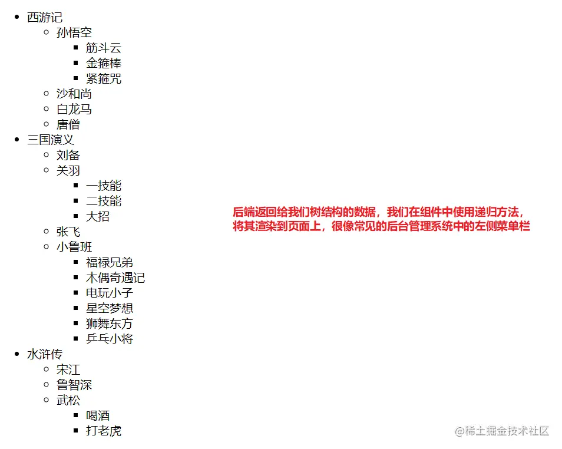
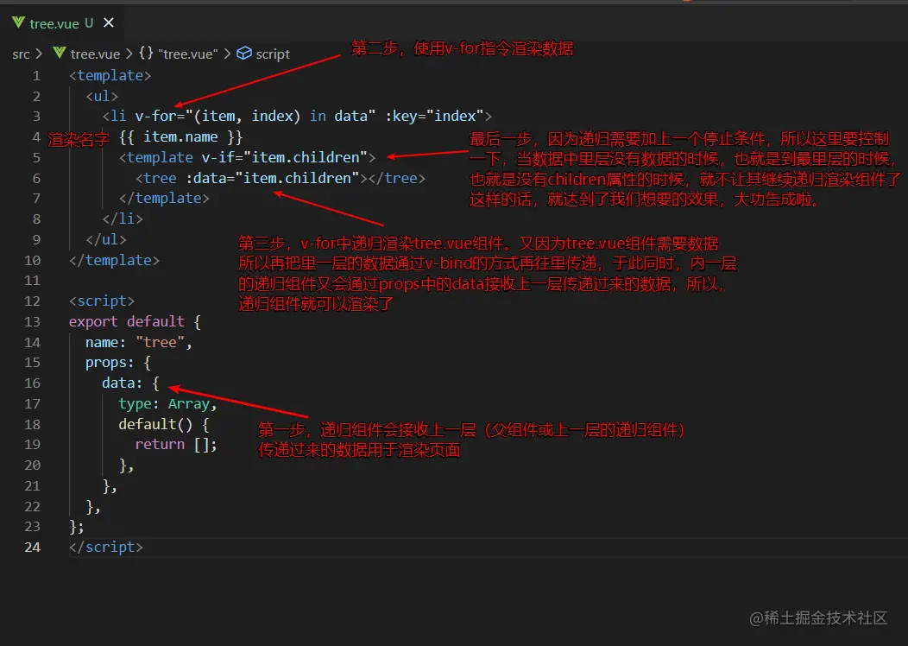
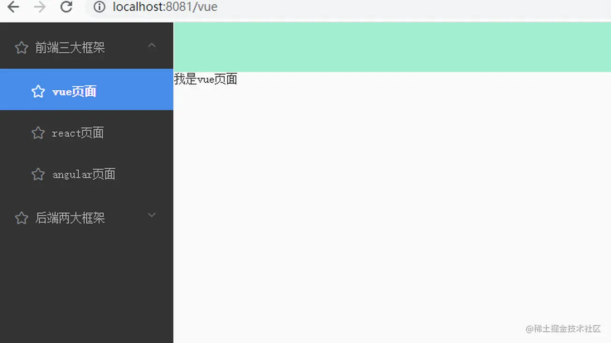
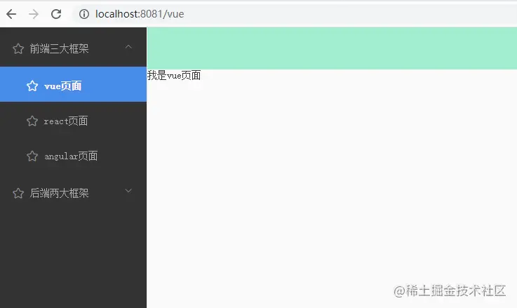

# 组件的递归

[toc]


## 问题描述

在我们使用vue开发项目时，有时候需要用到递归思想去书写代码。在一些UI组件中，我们也可以看到其中运用了递归的思想。比如：饿了么UI中的el-tree组件、el-menu组件（动态菜单栏）、el-Cascader组件。所以本文就举个简单的例子，来记录一下递归思想，在vue组件中的使用。

## 什么是递归

我们知道，一个函数可以调用别的函数，让别的函数执行；而递归就是：

**`某个函数不去调用别的函数了，只调用自己，让自身函数一直执行。`**

当然如果一直执行的话，会导致栈溢出问题，所以递归需要有一个结束的条件，当达到这个条件的时候，就让函数不再调用自身，就停下来即可。感觉和循环有点类似

### 递归、循环、死循环的区别理解

- 递归：无限套娃，当找到某个娃娃时，就不套了
- 循环：一直套娃，要把所有的娃娃都套了一遍，才停止下来不套了
- 死循环：一直套娃，但是娃娃一直套不完

> 这里是我个人的简单理解，具体区别，以官方为准

## vue组件中使用递归

### 效果图



### 代码部分

#### App.vue组件入口页面代码

```vue
<template>
  <div>
    <!-- 传递数据到用来做递归的组件 -->
    <tree :data="data"></tree>
  </div>
</template>

<script>
// 引入递归组件
import tree from "./tree.vue";
export default {
  name: "App",
  components: { tree }, // 注册递归组件
  data() {
    return {
      /*  
        假设data是我们向后端发请求获取的数据，
        我们需要把这个数据通过props的方式传递给用来做递归组件的.vue文件
        这里要注意一下数据字段结构（实际工作中这里需要和后端商量定规则）
      */ 
      data: [
        {
          name: "西游记",
          children: [
            {
              name: "孙悟空",
              children: [
                {
                  name: "筋斗云",
                },
                {
                  name: "金箍棒",
                },
                {
                  name: "紧箍咒",
                },
              ],
            },
            { name: "沙和尚" },
            { name: "白龙马" },
            { name: "唐僧" },
          ],
        },
        {
          name: "三国演义",
          children: [
            { name: "刘备" },
            {
              name: "关羽",
              children: [
                { name: "一技能" },
                { name: "二技能" },
                { name: "大招" },
              ],
            },
            {
              name: "张飞",
            },
            {
              name: "小鲁班",
              children: [
                { name: "福禄兄弟" },
                { name: "木偶奇遇记" },
                { name: "电玩小子" },
                { name: "星空梦想" },
                { name: "狮舞东方" },
                { name: "乒乓小将" },
              ],
            },
          ],
        },
        {
          name: "水浒传",
          children: [
            { name: "宋江" },
            { name: "鲁智深" },
            {
              name: "武松",
              children: [
                {
                  name: "喝酒",
                },
                {
                  name: "打老虎",
                },
              ],
            },
          ],
        },
      ],
    };
  },
};
</script>
```

#### tree.vue递归组件中的代码

注释如下图：



代码如下：

```vue
<template>
  <ul>
    <li v-for="(item, index) in data" :key="index">
      {{ item.name }}
      <!-- 在遍历时递归调用组件自身，当然，要有children，有数据的时候才去递归调用自身(递归需要有一个结束条件) -->
      <template v-if="item.children">
        <tree :data="item.children"></tree>
        <!-- 因为组件调用渲染，需要有数据，而这个tree.vue组件是的数据是通过props接收的，
        所以需要把子内容数据再传递给子组件，子组件用props接收，就能够一层一层的渲染了 -->
      </template>
    </li>
  </ul>
</template>

<script>
export default {
  name: "tree",
  props: {
    data: {
      type: Array,
      default() {
        return [];
      },
    },
  },
};
</script>

```

## 总结

递归还是比较耗费性能的，所以要妙用，不能滥用。


# el-menu导航菜单的二次封装



## 问题描述

在后台管理项目中，牵涉到权限的东西多数是后端传递过来的数据，前端去展示（当然前端也会做一些控制）。就导航菜单而言，也不能写死了，需要在用户登录了以后，发请求获取用户的对应菜单数据，根据对应的数据去展示对应的菜单。

本文记录一下使用组件递归的方式，封装一个动态的、多级的导航菜单，从而实现动态效果。

## 效果图

我们先看一下效果图：



## 思路分析

- 首先，我们要和后端沟通返回的数据格式，我们知道前端的el-menu菜单的核心数据属性有四个：
  - 菜单的名字name
  - 点击菜单进行路由跳转的路径path
  - 菜单上小图标icon
  - 菜单是不是最内层的菜单，即children是否是空数组，当children为空的时候，就说明到菜单最里层了。（最里层的菜单children为空数组的时候，点击的时候，做路由跳转）
- 所以需要有name、path、icon、children属性，且得是一个树结构的格式，和左侧导航菜单保持一致。
- 这里我们模拟一下后端返回的代码

### 后端返回的el-menu菜单数据

```js
menuArr: [
    {
// 注意！注意！有children的菜单项，path不会使用的，所以path为什么都无所谓；没children的，即children的length等于0的，才会使用path属性做路由跳转
      name: "前端三大框架",
      path: "前端三大框架", 
      icon: "el-icon-star-off",
      children: [
        {
          name: "vue页面",
          path: "/vue",
          icon: "el-icon-star-off",
          children: [],
        },
        {
          name: "react页面",
          path: "/react",
          icon: "el-icon-star-off",
          children: [],
        },
        {
          name: "angular页面",
          path: "/angular",
          icon: "el-icon-star-off",
          children: [],
        },
      ],
    },
    {
      name: "后端两大框架",
      path: "后端两大框架",
      icon: "el-icon-star-off",
      children: [
        {
          name: "Spring Boot页面",
          path: "/springBoot",
          icon: "el-icon-star-off",
          children: [],
        },
        {
          name: "Spring页面",
          path: "Spring页面", 
          icon: "el-icon-star-off",
          children: [
            {
              name: "MySql页面",
              path: "/mysql",
              icon: "el-icon-star-off",
              children: [],
            },
            {
              name: "Redis页面",
              path: "/redis",
              icon: "el-icon-star-off",
              children: [],
            },
          ],
        },
        {
          name: "Mybatis页面",
          path: "/mybatis",
          icon: "el-icon-star-off",
          children: [],
        },
      ],
    },
  ]
```

> 我们先看一下非动态多级菜单的写法，然后再看一下递归组件动态多级菜单的写法

### 非动态多级菜单（写死了，不灵活，不建议使用）

```vue
<el-menu
  :default-active="activeIndex"
  class="elMenu"
  background-color="#333"
  text-color="#B0B0B2"
  active-text-color="#fff"
  :unique-opened="true"
  router
  ref="elMenu"
  @select="menuSelect"
>

  <el-submenu index="非叶子节点也需要index属性">
    <template slot="title">
      <i class="el-icon-star-off"></i>
      <span>前端三大框架</span>
    </template>
    <!-- 这个是没子节点的 没有子内容，用el-menu-item结构 -->
    <el-menu-item index="/vue">
      <i class="el-icon-star-off"></i>
      <span slot="title">vue页面</span>
    </el-menu-item>
    <el-menu-item index="/react">
      <i class="el-icon-star-off"></i>
      <span slot="title">react页面</span>
    </el-menu-item>
    <el-menu-item index="/angular">
      <i class="el-icon-pear"></i>
      <span slot="title">angular页面</span>
    </el-menu-item>
  </el-submenu>
  
  <el-submenu index="非叶子节点也需要index属性哦">
    <template slot="title">
      <i class="el-icon-star-off"></i>
      <span>后端两大框架</span>
    </template>
    <el-menu-item index="/springBoot">
      <i class="el-icon-star-off"></i>
      <span slot="title">Spring Boot页面</span>
    </el-menu-item>

      <!-- 注意看这里有子节点的无子节点的html标签的区别 -->

      <!-- 这个是有子节点的 还有子内容，用el-submenu结构-->
      <el-submenu index="非叶子节点也需要index属性哈">
          <template slot="title">
            <i class="el-icon-star-off"></i>
            <span>Spring页面</span>
          </template>
          <el-menu-item index="/mysql">
            <i class="el-icon-star-off"></i>
            <span slot="title">MySql页面</span>
          </el-menu-item>
          <el-menu-item index="/redis">
            <i class="el-icon-star-off"></i>
            <span slot="title">Redis页面</span>
          </el-menu-item>
      </el-submenu>

      <!-- 这个是没子节点的 没有子内容，用el-menu-item结构 -->
      <el-menu-item index="/mybatis">
          <i class="el-icon-star-off"></i>
          <span slot="title">Mybatis页面</span>
      </el-menu-item>

  </el-submenu>
</el-menu>
```

### 发现规律

通过上述代码，我们发现，el-menu代码大致分为两类，有子集和没有子集的

- **有子集：`用的是el-submenu标签包template标签指定名字跟很多个el-menu-item标签`**
- **没子集：`直接用很多个el-menu-item标签`**

> 得出上述规律，我们就能使用递归组件方式去封装一个动态菜单

## 动态菜单代码

### 外层菜单部分

#### html部分

```vue
<el-menu
  :default-active="activeIndex"
  class="elMenu"
  background-color="#333"
  text-color="#B0B0B2"
  active-text-color="#fff"
  :unique-opened="true"
  router
  ref="elMenu"
  @select="menuSelect"
>

  <!-- 递归动态菜单 -->
  <myitem :data="menuArr"></myitem>

</el-menu>
```

#### js部分

```js
import myitem from "./components/myitem.vue"; // 引入递归菜单组件
export default {
  name: "Home",
  components: {
    myitem, // 注册一下
  },
  data() {
    return {
      activeIndex: this.$route.path,
      menuArr: [...] // 数据是上述我们模拟的数据，#后端返回的el-menu菜单数据#
    };
  }
};
```

### 内层递归菜单项部分

```vue
<template>
  <div>
    <template v-for="(item, index) in data">
      <!-- 因为有子集和无子集渲染html标签不一样，所以要分为两种情况
           情况一：有子集的情况：                         -->
      <el-submenu
        :key="index"
        :index="item.path"
        v-if="item.children.length > 0"
      >
        <template slot="title">
          <i :class="item.icon"></i>
          <span>{{ item.name }}</span>
        </template>
        <myitem :data="item.children"></myitem>
      </el-submenu>
      <!-- 情况二：没子集的情况： -->
      <el-menu-item :key="index" v-else :index="item.path">
        <i :class="item.icon"></i>
        <span slot="title">{{ item.name }}</span>
      </el-menu-item>
    </template>
  </div>
</template>

<script>
export default {
  name: "myitem",
  props: {
    data: {
      type: Array,
      default: [],
    },
  },
  // 注意： 在template标签上使用v-for，:key="index"不能写在template标签上，因为其标签不会被渲染，会引起循环错误
};
</script>
```