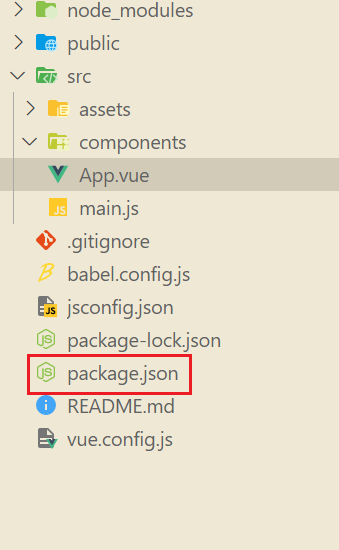

## 模式

**模式**是 Vue CLI 项目中一个重要的概念。默认情况下，一个 Vue CLI 项目有三个模式：

- `development` 模式用于 `vue-cli-service serve`
- `test` 模式用于 `vue-cli-service test:unit`
- `production` 模式用于 `vue-cli-service build` 和 `vue-cli-service test:e2e`

你可以通过传递 `--mode` 选项参数为命令行覆写默认的模式。例如，如果你想要在构建命令中使用开发环境变量：

```shell
vue-cli-service build --mode development
```

---

当运行 `vue-cli-service` 命令时，所有的环境变量都从对应的`环境文件`中载入。如果文件内部不包含 `NODE_ENV` 变量，它的值将取决于`模式`，例如，在 `production` 模式下被设置为 `"production"`，在 `test` 模式下被设置为 `"test"`，`默认`则是 `"development"`。

---

`NODE_ENV` 将决定您的`应用运行的模式`，是`开发`，`生产`还是`测试`，因此也决定了创建哪种 `webpack` 配置。

例如通过将 `NODE_ENV` 设置为 `"test"`，`Vue CLI `会创建一个优化过后的，并且旨在用于`单元测试`的 webpack 配置，它并不会处理`图片`以及一些`对单元测试非必需`的其他资源。

---

同理，`NODE_ENV=development` 创建一个 webpack 配置，该配置启用`热更新`，`不会`对资源进行 `hash` 也不会打出` vendor bundles`，目的是为了`在开发的时候能够快速重新构建`。

当你运行 `vue-cli-service build` 命令时，`无论`你要部署到哪个环境，应该始终把 `NODE_ENV` 设置为 `"production"` 来获取可用于部署的应用程序。

> **NODE_ENV**
>
> 如果在环境中有默认的 `NODE_ENV`，你应该移除它或在运行 `vue-cli-service` 命令的时候明确地设置 `NODE_ENV`。

## 环境变量

你可以在你的`项目根目录`中放置下列`文件`来`指定环境变量`：

```sh
.env                # 在`所有`的环境中被载入
.env.local          # 在所有的环境中被载入，但会被 git 忽略
.env.[mode]         # 只在`指定`的模式中被载入
.env.[mode].local   # 只在指定的模式中被载入，但会被 g


#.env  开发
#.env.development 是在npm run serve读取里面的变量
#.env.production 是在npm run build
```

一个`环境文件`只包含`环境变量`的`“键=值”`对：

```sh
NODE_ENV='test'
VUE_APP_BaseURL='http://48.56.173.44/shopdemo/public/index.php/addons/xshop';
```

<details style="background:yellow">
    <summary>警告</summary>
    不要在你的应用程序中存储任何机密信息（例如私有 API 密钥）！
    <br>
    环境变量会随着构建打包嵌入到输出代码，意味着任何人都有机会能够看到它。
</details>

请注意，只有 `NODE_ENV`，`BASE_URL` 和以 `VUE_APP_` 开头的变量将通过 `webpack.DefinePlugin` 静态地嵌入到*客户端侧*的代码中。这是为了避免意外公开机器上可能具有相同名称的私钥。

想要了解解析环境文件规则的细节，请参考 [dotenv](https://github.com/motdotla/dotenv#rules)。我们也使用 [dotenv-expand](https://github.com/motdotla/dotenv-expand) 来实现变量扩展 (Vue CLI 3.5+ 支持)。例如：

```sh
FOO=foo
BAR=bar

CONCAT=$FOO$BAR # CONCAT=foobar
```

被载入的变量将会对 `vue-cli-service` 的所有命令、插件和依赖可用。

> **环境文件加载优先级**
>
> 为一个特定模式`准备`的环境文件 (例如 `.env.production`) 将会比一般的环境文件 (例如 `.env`) 拥有`更高`的`优先级`。
>
> 此外，Vue CLI 启动时`已经存在的环境变量`拥有`最高`优先级，并不会被 `.env` 文件覆写。
>
> `.env` 环境文件是通过运行 `vue-cli-service` 命令载入的，因此环境文件发生`变化`，你需要`重启服务`。

## 示例：test模式

假设我们有一个应用根目录下包含以下 `.env文件`：

```txt
VUE_APP_TITLE=My App
```

和 `.env.test` 文件：


```sh
NODE_ENV='test'
VUE_APP_BaseURL='http://50.56.173.44/shopdemo/public/index.php/addons/xshop';
VUE_APP_TITLE=My App (test)
```

- `vue-cli-service build` 会加载可能存在的 `.env`、`.env.test` 和 `.env.test.local` 文件然后构建出生产环境应用。

- `vue-cli-service build --mode test` 会在 test 模式下加载可能存在的 `.env`、`.env.test` 和 `.env.test.local` 文件然后构建出生产环境应用。

这两种情况下，根据 `NODE_ENV`，构建出的应用都是生产环境应用，但是在 test版本中，`process.env.VUE_APP_TITLE` 被覆写成了另一个值。

> `vue-cli-service build --mode test` 中的 `--mode`表示将要指定环境，`test`即为根目录`.env.test`里的`test`，代表运行环境

## 在客户端侧代码中使用环境变量

只有以 `VUE_APP_` 开头的变量会被 `webpack.DefinePlugin` 静态嵌入到客户端侧的包中。你可以在应用的代码中这样访问它们：

> $console.log(process.env.VUE\_APP\_SECRET)$


上述案例可以在vue`项目的`根目录`下的`backpack.json`文件内配置npm快捷语句来进行运行环境的切换




如上，当在终端输入:

```shell
npm run test
```

即可执行test环境

**结果**


在构建过程中，`process.env.VUE_APP_SECRET` 将会被相应的值所取代。在 `VUE_APP_SECRET=secret` 的情况下，它会被替换为 `"secret"`。

除了 `VUE_APP_*` 变量之外，在你的应用代码中始终可用的还有两个特殊的变量：

- `NODE_ENV` - 会是 `"development"`、`"production"` 或 `"test"` 中的一个。具体的值取决于应用运行的[模式](https://cli.vuejs.org/zh/guide/mode-and-env.html#模式)。
- `BASE_URL` - 会和 `vue.config.js` 中的 `publicPath` 选项相符，即你的应用会部署到的基础路径。

所有解析出来的环境变量都可以在 `public/index.html` 中以 [HTML 插值](https://cli.vuejs.org/zh/guide/html-and-static-assets.html#插值)中介绍的方式使用。

> **提示**
>
> 你可以在 `vue.config.js` 文件中计算环境变量。它们仍然需要以 `VUE_APP_` 前缀开头。这可以用于版本信息:
>
> ```js
> process.env.VUE_APP_VERSION = require('./package.json').version
> 
> module.exports = {
>   // config
> }
> ```

## 只在本地有效的变量[#](https://cli.vuejs.org/zh/guide/mode-and-env.html#只在本地有效的变量)

有的时候你可能有一些不应该提交到代码仓库中的变量，尤其是当你的项目托管在公共仓库时。这种情况下你应该使用一个 `.env.local` 文件取而代之。本地环境文件默认会被忽略，且出现在 `.gitignore` 中。

`.local` 也可以加在指定模式的环境文件上，比如 `.env.development.local` 将会在 development 模式下被载入，且被 git 忽略。

