# 体验vite + vue3 + ts搭建项目的全过程

> vite:https://cn.vitejs.dev/guide/

### 环境准备

`Node.js`版本 >= `12`

```js
# 查看Node版本：
node -v
```

建议将`Node.js`升级到最新的稳定版本

```bash
# 使用 nvm 安装最新稳定版 Node.js
nvm install stable
```

### 使用 Vite 快速搭建

- 使用 Npm

    `npm create vite@latest`

- Yarn

    `yarn create vite`按照提示完成如下步骤

1. 输入项目名称

    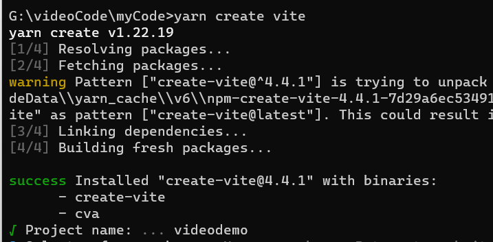

2. 选择 Framework + 模板

    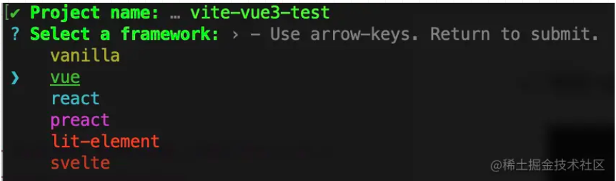

    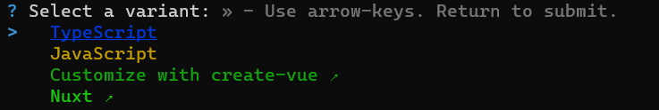

    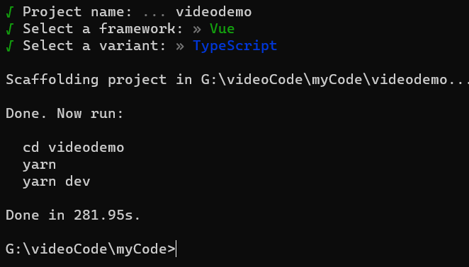

    ```shell
    #你还可以通过附加的命令行选项直接指定项目名称和你想要使用的模板。
    #例如，要构建一个 Vite + Vue 项目，运行:
    
    # npm 6.x
    npm create vite@latest my-vue-app --template vue
    
    # npm 7+, extra double-dash is needed:
    npm create vite@latest my-vue-app -- --template vue
    
    # yarn
    yarn create vite my-vue-app --template vue
    
    # pnpm
    pnpm create vite my-vue-app --template vue
    ```

3. 进入项目 安装依赖

    ```shell
    #进入项目
    cd videodemo
    
    npm install 
    #或者 
    yarn
    ```

4. 启动项目

    ```bash
    npm run dev
    #或者
    yarn run dev
    ```

    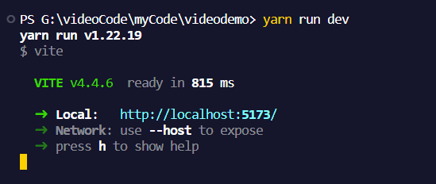

    > 如果想要打印出 `IP + port` ，use `--host`
    >
    > 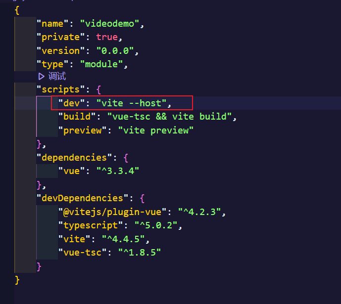
    >
    > 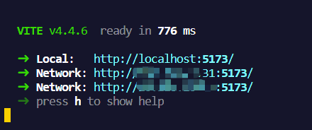

​	

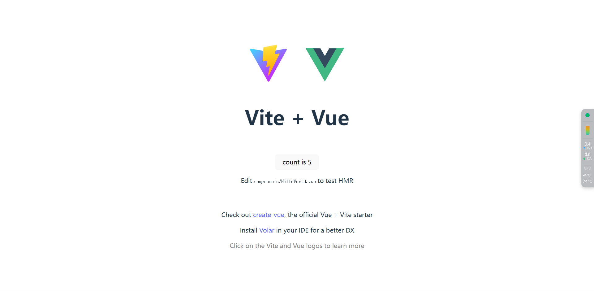

> `Vite` 创建项目后 `eslint` 提示错误 `HelloWorld.vue has no default export`
>
> 
>
> 禁用插件 `Vetur` 和 `Vetur E`，`Vetur` 默认使用 `eslint-plugin-vue` ，并且强制 `export default` 语法
>
> 
>
> 安装 `Vue` 官方推荐的两款插件：
>
> `Vue Language Features (Volar)`代替 `Vetur `的语法高亮等功能
> `TypeScript Vue Plugin` 使得写法为` lang=ts` 的组件能用 `*.vue `引入

接下来集成 `Vue Router`、`Vuex`、`Axios`、`Stylus/Sass/Less`

### 修改 Vite 配置文件

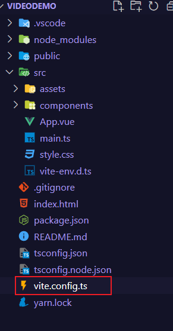

Vite配置文件 `vite.config.ts` 位于项目的根路径，项目的全局配置文件，启动时会自动读取该文件。 本次咱们就配置 `@` 指向 `src` 目录、服务端口、打包路径、代理等。 如果要了解更多关于vite的配置请查阅 `官网`

```tsx
import { defineConfig } from 'vite'
import vue from '@vitejs/plugin-vue'
import { resolve } from 'path'
// https://vitejs.dev/config/
export default defineConfig({
  plugins: [vue()],
  resolve: {
    alias: {
      '@': resolve('./src')
    }
  },
  base: './', // 打包路径
  server: {
    port: 4000, // 服务端口号
    open: true, // 服务启动时是否自动打开浏览器
    cors: true // 允许跨域
  }
})
```

> 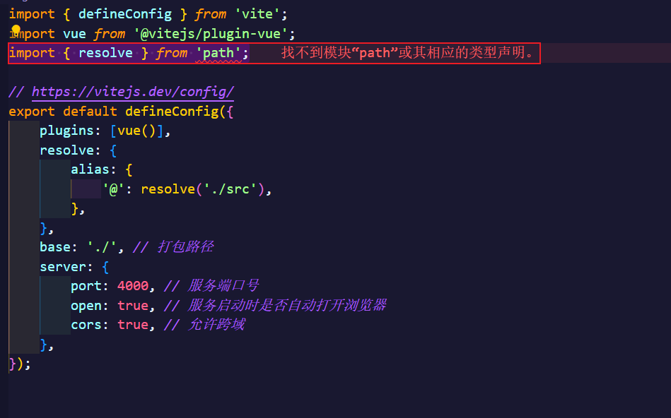
>
> **原因分析：**path模块是`node.js`内置的功能，但是`node.js`本身并不支持`typescript`，所以直接在`typescript`项目里使用是不行的
>
> **解决方法：**安装`@types/node`
>
> ```bash
> npm install @types/node --save-dev
> #或者
> yarn add @types/node --save-dev
> ```

### 集成路由

1. 安装支持vue3的路由（`vue-router@4`）

    ```bash
    npm i vue-router@4
    #或者
    yarn add vue-router@4
    ```

2. 创建 `src/router/index.ts` 文件

    ```js
    import { createRouter, createWebHashHistory, RouteRecordRaw } from 'vue-router';
    
    const routes: Array<RouteRecordRaw> = [
        {
            path: '/home',
            name: 'Home',
            component: () => import('@/components/HelloWorld.vue'),
        },
        { path: '/', redirect: { name: 'Home' } },
    ];
    
    const router = createRouter({
        history: createWebHashHistory(),
        routes,
    });
    
    export default router;
    
    ```

    > 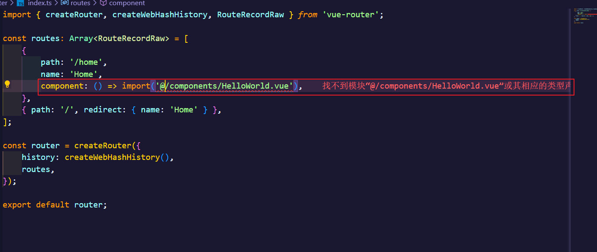
    >
    > **报错原因：**typescript 只能理解 .ts 文件，无法理解 .vue文件
    >
    > **解决方法：**在项目根目录或 src 文件夹下创建一个后缀为 .d.ts(存在则忽略) 的文件，并写入以下内容：
    >
    > ```js
    > declare module '*.vue' {
    >   import { ComponentOptions } from 'vue'
    >   const componentOptions: ComponentOptions
    >   export default componentOptions
    > }
    > ```
    >
    > 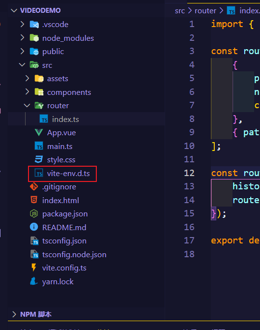
    >
    > 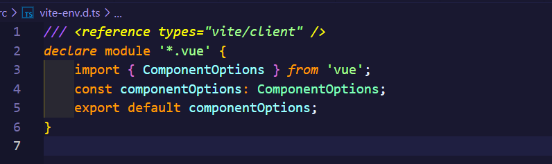
    >
    > 添加完文件之后，可能还会出现报错的红色波浪线，需要把`xxx.d.ts文件`打开一下，报错就没有了！
    >
    > 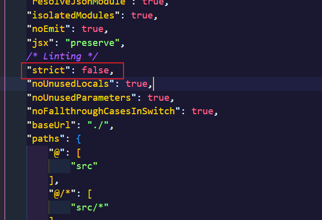
    >
    > 在`tsconfig.json`文件设置`strict：false`就可以！

3. main.ts 文件中挂载

    ```js
    import { createApp } from 'vue'
    import App from '@/App.vue'
    
    import router from '@/router/index'
    
    createApp(App).use(router).mount('#app')
    ```

    > 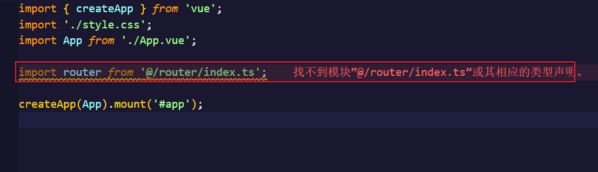
    >
    > 原因：此时是`tsconfig.json`文件还要进行文件系统路径别名设置
    >
    > ```json
    > "baseUrl": "./",
    > "paths": {
    > 	"@": [
    > 		"src"
    > 	],
    > 	"@/*": [
    > 		"src/*"
    > 	]
    > }
    > 
    > 
    > "*.ts"
    > ```
    >
    > 
    >
    > 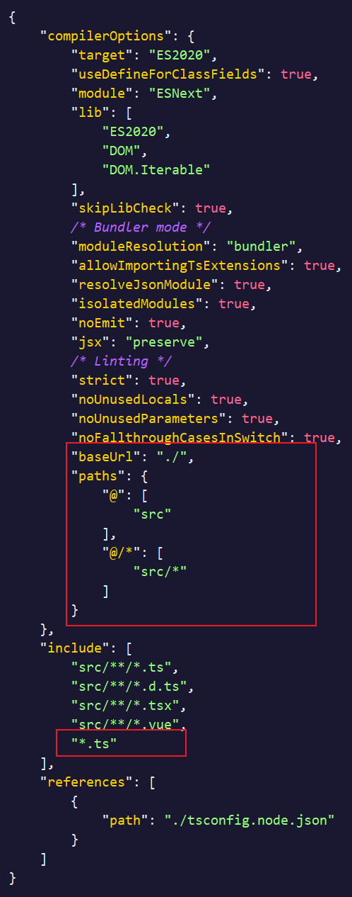

### 集成Vuex

1. 安装支持Vue3的状态管理工具 `vuex@next`

    ```bash
    npm i vuex@next
    #或者
    yarn add vuex@next
    ```

2. 创建 `src/store/index.ts` 文件

    ```js
    import { createStore } from 'vuex'
    
    const defaultState = {
      count: 0
    }
    
    // Create a new store instance.
    export default createStore({
      state() {
        return defaultState
      },
      mutations: {
        increment(state: typeof defaultState) {
          state.count += 1
        }
      },
      actions: {
        increment(context) {
          context.commit('increment')
        }
      },
      getters: {
        double(state: typeof defaultState) {
          return 2 * state.count
        }
      }
    })
    ```

3. `main.ts` 文件挂载

    ```js
    import { createApp } from 'vue'
    import App from '@/App.vue'
    
    import router from '@/router/index'
    import store from '@/store/index'
    
    createApp(App).use(router).use(store).mount('#app')
    ```

### 集成HTTP工具 Axios

1. 安装 `Axios` (跟vue版本无关，安装最新即可)

    ```BASH
    npm i axios
    #或
    yarn add axios
    ```

2. 配置 `Axios` `根据常规规范，axios封装的方法放在 src/http/conf.ts`

    ```js
    import axios from 'axios';
    // import Vue from 'vue';
    // import store from '../store';
    // import {router} from '../router/index';
    
    // let vm = new Vue();
    
    const instance = axios.create({
        // baseURL: 'http://localhost:8080',
        timeout: 3000,
        // headers: {
        //   post: {
        //     'Content-Type': 'application/x-www-form-urlencoded;charset=UTF-8'
        //   }
        // }
    });
    
    // 请求拦截
    instance.interceptors.request.use(
        (config) => {
            // 自定义header，可添加项目token
            // if (store.state.app.token) {
            //   config.headers.token = store.state.app.token;
            //   config.headers.timestamp = new Date().getTime();
            // }
            return config;
        },
        (error) => {
            return Promise.reject(error);
        }
    );
    
    // 响应拦截
    instance.interceptors.response.use(
        (response) => {
            // const resCode = response.status;
            // if (resCode === 200) {
            //   return Promise.resolve(response);
            // } else {
            //   return Promise.reject(response);
            // }
            return response;
        },
        (error) => {
            // const resCode = error.response.status;
            // switch (resCode) {
            //   case 401:
            //     vm.$Message.error(error.response.data.message);
            //     store.commit('logout', this);
            //     store.commit('clearOpenedSubmenu');
            //     // console.log('token-0', store.state.app.token);
            //     router.replace({
            //       name: 'login'
            //     });
            //     break;
            //   case 404:
            //     vm.$Message.error('网络请求不存在');
            //     break;
            //   case 500:
            //     vm.$Message.error('服务器连接错误');
            //     break;
            //   // 其他状态码错误提示
            //   default:
            //     vm.$Message.error(error.response.data.message);
            // }
            return Promise.reject(error);
        }
    );
    
    /*
     *封装get方法
     *@param{String} url [请求地址]
     *@param{Object} params 请求参数
     */
    export function Get(url, params) {
        return new Promise((resolve, reject) => {
            instance
                .get(url, {
                    params: params,
                })
                .then((res) => {
                    resolve(res.data);
                })
                .catch((error) => {
                    reject(error.data);
                });
        });
    }
    
    /**
     *封装post方法
     *@param{String} url 请求地址
     *@param{Object} params 请求参数
     */
    export function Post(url, params) {
        return new Promise((resolve, reject) => {
            instance
                .post(url, params)
                .then((res) => {
                    resolve(res.data);
                })
                .catch((error) => {
                    reject(error.data);
                });
        });
    }
    
    /**
     *封装put方法
     *@param{String} url 请求地址
     *@param{Object} params 请求参数
     */
    export function Put(url, params) {
        return new Promise((resolve, reject) => {
            instance
                .put(url, params)
                .then((res) => {
                    resolve(res.data);
                })
                .catch((error) => {
                    reject(error.data);
                });
        });
    }
    
    /**
     *封装patch方法
     *@param{String} url 请求地址
     *@param{Object} params 请求参数
     */
    export function Patch(url, params) {
        return new Promise((resolve, reject) => {
            instance
                .put(url, params)
                .then((res) => {
                    resolve(res.data);
                })
                .catch((error) => {
                    reject(error.data);
                });
        });
    }
    
    /**
     *封装delete方法
     *@param{String} url [请求地址]
     *@param{Object} params [请求参数]
     */
    export function Delete(url, params) {
        return new Promise((resolve, reject) => {
            instance
                .delete(url, {
                    params: params,
                })
                .then((res) => {
                    resolve(res.data);
                })
                .catch((error) => {
                    reject(error.data);
                });
        });
    }
    ```

3. 配置api请求，创建`api.ts`

    ```js
    import { Get, Post, Put, Patch, Delete } from '@/http/conf';
    
    export default {
        //api
        getListData: (params) => {
            return Post('/vod', {
                params: {
                    ac: 'type',
                    tab: 'vod',
                    vodtype: '1,2',
                },
                data: params,
            });
        },
    };
    ```

4. 导出api，创建`index.ts`

    ```ts
    import defaultApi from '@/http/api';
    
    export { defaultApi };
    ```

5. main挂载

    ```js
    import { createApp } from 'vue';
    import App from './App.vue';
    const app = createApp(App);
    
    import { defaultApi as api } from '@/http/index';
    app.config.globalProperties.$request = api; //方法挂载到全局
    ```

6. 使用

```vue
<script setup lang="ts">
import {  ref, getCurrentInstance } from "vue";

defineProps<{ msg: string }>();

const count = ref(0);

const instance: any = getCurrentInstance();
instance.proxy.$request.getListData({}).then(( res : Object) =>{
    console.log(res);
})
</script>

<template>
    <h1>{{ msg }}</h1>

    <div class="card">
        <button type="button" @click="count++">count is {{ count }}</button>
        <p>
            Edit
            <code>components/HelloWorld.vue</code> to test HMR
        </p>
    </div>

</template>

<style scoped>
.read-the-docs {
    color: #888;
}
</style>
```

