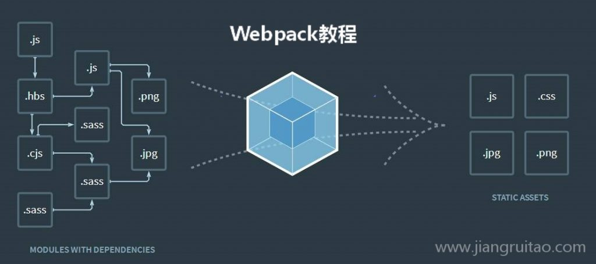
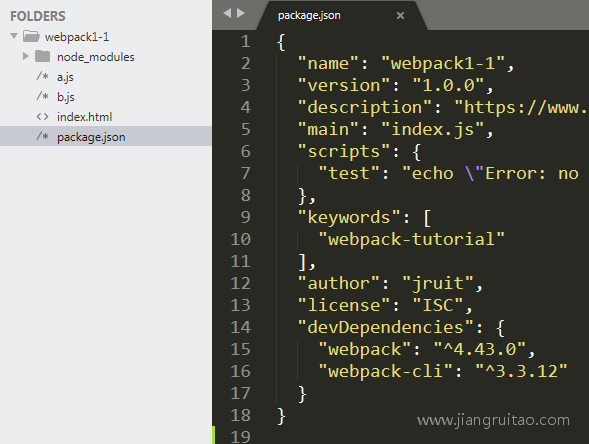
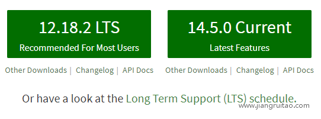
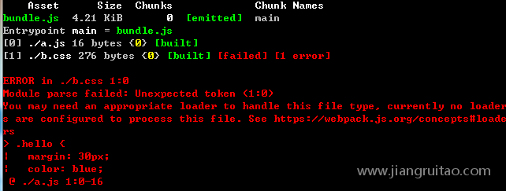

# 入门

[toc]

## webpack是什么？

Webpack是什么？

`Webpack`是一个`模块打包工具`(module bundler)，因为平常多用来`对前端工程打包`，所以也是一个`前端构建工具`。其最`主要的功能就是模块打包`，官方对这个打包过程的描述不太容易理解。

**模块打包**，通俗地说就是：`找出模块之间的依赖关系，按照一定的规则把这些模块组织合并为一个JavaScript文件`。

`Webpack认为一切都是模块`，`JS`文件、`CSS`文件、`jpg/png`图片等等都是模块。Webpack会把所有的这些模块`都合并为一个JS文件`，这是它`最本质的工作`。当然，我们可能并不想要它把这些合并成一个JS文件，这个时候我们可以通过一些规则或工具来改变它。

Webpack官网示意图，从一个js文件开始构建，打包成一个js文件，最后又拆分出需要的4种文件

## Webpack的安装与命令行打包

配套代码是github仓库 https://github.com/jruit/webpack-tutorial 的webpack1-1例子

`Webpack依赖Node.js`，没有安装的话，去[官网](https://nodejs.org/en/)下载安装LTS稳定版本的Node.js。

在本地新建一个文件夹webpack1-1，在该文件夹下执行命令行

```sh
npm init -y
```

该命令会`初始化`一个`npm项目`并`使用默认参数`创建`package.json`文件。

> 若不加  -y需要手动配置
>
> -y即为-yes

```sh
 npm install --save-dev webpack@4.43.0    webpack-cli@3.3.12   
```

该命令`安装了指定版本的webpack与webpack-cli`。这两个npm包作用如下，`webpack`是`webpack核心包`，`webpack-cli`是`命令行工具包`，在用命令行执行webpack的时候需要安装。详细的安装过程会在Webpack安装一节进行讲解，请尽量安装与教程版本一致的包。

我们代码逻辑很简单，**在一个`JS文件`里定义一个字符串，然后在`另外一个JS文件`引入该文件并把字符串内容输出在浏览器控制台里。**

项目下的主要文件如下：



**a.js内容**

```js
  // ES6的模块化语法
  import { name } from './b.js';  
  console.log(name);
```

**b.js内容**

```js
  // ES6的模块化语法
  export var name = 'Jack';
```

HTML文件更简单，只是用来引入JS文件。

如果我们`直接在本地HTML文件里引入a.js，浏览器会报错`，一方面是**浏览器对原始的ES6模块默认引入方式不支持**而报错，另一方面**即使使用支持的方式引入也会因本地JS引入的安全问题而报错**。

所以，我们可以通过`Webpack`把这`两个文件`打包成`一个JS文件`来解决这个问题。`Webpack打包后，代码里就没有这种模块化语法了`。

我们执行命令

```sh
 npx webpack a.js -o bundle.js   
```

**上面命令的作用：**从`a.js`文件`开始`，按照`模块引入的顺序`把所有代码打包到`bundle.js`文件里。`Webpack`会自动处理打包后代码的顺序与依赖关系。`-o`是`out`的意思，表示`输出`。注意，`webpack`是打包命令，后面的是打包参数。

现在我们在`HTML文件`里引入`bundle.js`，打开浏览器控制台，正常输出字符串'Jack'。（如果你觉得HTML还是会从a.js和b.js读取内容，你可以把这两个文件删除试一下，你会发现这两个文件已经没有作用了。）

上面就是一个最简单的`Webpack`打包过程。打包后的bundle.js代码目前是压缩后的，后面会讲解怎样不压缩打包后的代码。

我们在执行上面命令的时候，命令行控制台会出现警告信息，告诉我们没有设置'`mode`'项，`Webpack`将会使用`默认的'production'`。我们可以在上面的命令后面配上'`mode`'项，但当命令参数过长的时候，使用起来就会不方便。此时，我们可以选择使用`Webpack`的配置文件。

## Webpack的配置文件

`Webpack`默认的配置文件是`项目根目录下的webpack.config.js`，在我们执行下方命令的时候，

```sh
npx webpack  
```

`Webpack`会`自动寻找该文件`并使用其配置信息进行打包。

现在我们在文件夹下新建`webpack.config.js`文件，里面的代码如下

```js
 var path = require('path');  
  module.exports = {
    entry: './a.js',
    output: {
      path: path.resolve(__dirname, ''),
      filename: 'bundle.js'
    },
    mode: 'none'
  };
```

配套代码是github仓库 https://github.com/jruit/webpack-tutorial 的webpack1-2例子

命令行执行`npx webpack`后，`Webpack`就开始打包了。配置文件里的代码解释：

因为`Webpack`是基于`Node.js`执行的，所以可以使用`Node`的功能。`path`是`Node.js里的路径解析模块`，你可以将其看成是一个`JS普通对象`，该对象有一些方法可以供我们使用。我们现在使用了其`resolve方法`，该方法的`作用是将方法参数解析成一个绝对路径返回`。`__dirname`是`Node.js`的一个`全局变量`，表示`当前文件的路径`。这样，`path.resolve(__dirname, '')`表示的其实就是`当前文件夹根目录的绝对路径`。

`module.exports`是`CommonJS`模块导出语法，导出的是一个`对象`，该对象的属性就是`Webpack`打包要使用的参数。`entry`是`Webpack`构建的`入口文件`，我们的入口文件是`a.js`。`output`是`打包后资源输出文件`，其中`path`表示`输出的路径`，`filename`表示`输出的文件名`，现在我们把打包后的文件输出在当前目录的`bundle.js`。

`mode`是`Webpack`的`打包模式`，`默认是'production'`，表示给`生产环境`打包的。现在我们设置成'`none`'，这样`代码就不会压缩了`。

现在，我们就学会了`Webpack` `命令行参数打包`与`配置文件打包`两种打包方法。

在我们实际项目中，我们都是使用`配置文件`打包的。

简单的项目我们使用默认的`webpack.config.js`文件，

复杂的项目可能会`区分开发环境`、`测试环境`与`线上环境`分别使用不同的配置文件，这些后续章节再讲。

> 后续章节，我们将学习`预处理器loader`和`插件`等相关知识。
>
> #### 注
>
> **1.如果安装`npm`包慢的话，通过以下命令`设置npm镜像源为淘宝npm`后再安装**
>
> ```sh
>  npm config set registry https://registry.npm.taobao.org
> ```
>
> **2.`npx webpack a.js -o bundle.js`命令里`npx`是`新版Node`里附带的命令。它运行的时候`默认`会找到`node_modules/.bin/`下的路径执行。分别与下面的命令`等效`。**
>
> linux/unix命令行：
>
> ```sh
> node_modules/.bin/webpack a.js -o bundle.js
> ```
>
> windows的cmd命令行(webpack1-1在D:\jiangruitao\路径下):
>
> ```sh
> D:\jiangruitao\webpack1-1\node_modules\.bin\webpack a.js -o bundle.js 
> ```
>
> 3.要真正掌握`path.resolve的解析规则`需要一些时间来练习，但这份Webpack教程只会用于解析简单的资源出口路径，也就是把两个路径参数用字符串连接起来就行了。如果你不想深入Node项目开发，暂时没必须要去研究path.resolve。

## Webpack 安装

`Webpack`的安装分为`全局安装`与`本地安装`，上一节我们使用的是`本地安装`，我们也`推荐使用本地安装`。

**那么全局安装的Webpack与本地安装的有何不同呢？**

1. `全局安装`的Webpack，在`任何目录`执行webpack命令都可以进行打包。
2. 而`本地安装`的Webpack，`必须要找到对应node_modules下的webpack命令`才能执行（在使用`npx`或`package.json`的`scripts`的时候，会`自动帮助我们寻找`）。

**那为何推荐本地安装呢？**

主要是考虑`Webpack版本不一致`的问题，看完下面的内容就更容易理解了。

`Webpack`需要先安装`Node.js`，没有安装的话，先去`[Node官网](https://nodejs.org/en/)`安装最新稳定LTS版本的Node。



下载左边标有`LTS`的Node

接下来开始安装Webpack。

### 一、Webpack全局安装

1.下方第一个命令是`全局安装` `Webpack`及其命令行工具`webpack-cli`，安装的版本是最新稳定版本。如果要安装`指定版本`，可以`在安装的包名后面加上@x.x.x`这种形式的版本号。

`webpack包`是`webpack核心npm包`，`webpack-cli是命令行运行webpack需要的npm包。

```sh
 # 全局安装最新稳定版本
  npm install webpack webpack-cli -g
```

```sh
 # 全局安装指定版本
  npm install webpack@4.43.0  webpack-cli@3.3.12 -g
```

我们安装的是`webpack4`，目前对应的`webpack-cli版本是3`，在我们使用的时候，这`两个包都必须安装`。在`webpack3`时代，我们`不需要安装webpack-cli`。

2.如果想安装最新的体验版本，可以使用下面的命令安装

```sh
 # 全局安装指体验版本，目前(2020-7-10)体验版本是webpack5
  npm install webpack@next webpack-cli -g
```

### 二、Webpack本地安装

本地安装最新稳定版本的命令如下

```sh
 # 本地安装最新稳定版本，该命令是npm install webpack webpack-cli --save-dev的缩写
  npm i webpack webpack-cli -D
```

`本地安装`指定版本的方式与`全局安装`的一样，都是`包名后面加@x.x.x`这种形式的版本号。

在学习本教程的时候，建议安装与教程里一致的版本，便于学习。

`全局安装`与`本地安装`的`Webpack`是`可以共存`的。在`大多数前端项目开发`的时候，是`需要本地安装`的。**因为只进行`全局安装`的话，可能因为`版本不一致`的问题导致本地项目跑不起来。**

1. `全局安装`的Webpack，在`任何目录`执行webpack命令都可以进行打包。
2. 而`本地安装`的Webpack，`必须`要找到对应`node_modules`下的`webpack命令`才能执行，因此`一般需要拼接路径`。

`本地安装`的Webpack，如果`不想拼接路径`，我们可以`使用命令npx webpack`，或者在`package.json`文件里写入下面的命令并执行`npm run dev`。这两种方式**都会自动执行node_modules下的webpack命令，不需要我们把路径拼接上。**

```js
// ...
  "scripts": {
    "dev": "webpack"
  },
  // ...
```

> 本节讲了`Webpack`的`全局安装`与`本地安装`。本教程`推荐本地安装`Webpack，以`避免版本不一致`导致的问题，使用`npx webpack`既可进行`打包`。

## Webpack loader

### Webpack loader简介

`Loader`是`Webpack生态`里一个重要的组成，我们一般称之为`预处理器`。

`Webpack`在`进行打包`的时候，对`所有引入`的资源文件，都当作`模块`来处理。

但`Webpack`自身`只支持`对`JS文件处理`（`现在的版本`也支持对`JSON文件`处理），如果你引入了一个`CSS文件`或`图片文件`，那么`Webpack`在处理该模块的时候，会在控制台`报错`：Module parse failed…You may need an appropriate loader to handle this file type.

控制台告诉你`模块解析失败`，你需要你个合适的`loader`来处理该文件类型。

当`Webpack`自身`无法处理`某种类型的文件的时候，我们就可以通过`配置特定的loader`，`赋予Webpack来处理该类型文件的能力`。

### Webpack loader使用

我们来看一个例子。

配套代码是github仓库 https://github.com/jruit/webpack-tutorial 的webpack1-3例子

新建项目文件夹名是`webpack1-3`，然后执行下面的命令`初始化项目`

```sh
npm init -y
```

新建相应的文件，目录结构如下。

```sh
|--a.js
|--b.css
|--index.html
|--package.json
|--webpack.config.js
```

`b.css`声明了.hello类，该类的文字颜色是蓝色;

`a.js`引入了`b.css`;

`webpack.config.js`是`Webpack`的配置文件，从`a.js`入口打包，输出`bundle.js`文件；

`index.html`引入了`打包后`的`bundle.js`文件，并且有一个`clss`为`hello`，内容是`Hello, Loader`的div。

**a.js**

```js
import './b.css'
```

**b.css**

```css
.hello {
    margin: 30px;
    color: blue;
  }
```

**index.html**

```html
<!DOCTYPE html>
  <html lang="en">
  <head>
    <script src="bundle.js"></script>
  </head>
  <body>
    <div class="hello">Hello, Loader</div>
  </body>
  </html>
```

**webpack.config.js**

```js
const path = require('path');
  module.exports = {
    entry: './a.js',
    output: {
      path: path.resolve(__dirname, ''),
      filename: 'bundle.js'
    },
    mode: 'none'
  };
```

与[快速入门](https://www.jiangruitao.com/webpack/quick-start/)一节一样，我们安装webpack

```sh
npm install --save-dev webpack@4.43.0    webpack-cli@3.3.12    
```

然后执行npx webpack打包，这个时候报错了，提示我们需要安装相应的loader来处理CSS文件。



这里我们安装两个`loader`，分别是`css-loader`与`style-loader`。

其中`css-loader是必需`的，它的作用是`解析CSS文件`，包括解析`@import`等`CSS自身的语法`。它的作用也`仅仅是解析CSS文件`，它会把`CSS`文件`解析后`，以`字符串的形式`打包到`JS文件`中。不过，此时的CSS样式并`不会生效`，因为我们需要把`CSS插入到html`里`才会生效`。

此时，`style-loader`就来发挥作用了，它可以把`JS`里的`样式代码插入到html文件`里。它的原理很简单，就是通过`JS动态生成style标签插入到html文件的head标签里`。

我们来安装这两个`loader`

```sh
npm install css-loader@3.6.0 style-loader@1.2.1   
```

`webpack.config.js`里`配置`上这两个`loader`

```js
const path = require('path');
  module.exports = {
    entry: './a.js',
    output: {
      path: path.resolve(__dirname, ''),
      filename: 'bundle.js'
    },
    module: {
      rules: [{
        test: /\.css$/,
        use: ['style-loader', 'css-loader']
      }]
    },
    mode: 'none'
  };
```

可以看到，我们需要对`配置项`新增`module`，该项是一个`对象`，其`rules`里是我们对`各个类型文件的处理规则配置`。

`test`值是一个`正则表达式`，表示`当文件名后缀是.css的时候，我们使用对应use项里的loader`。

`use`值是一个`数组`，`每一项是一个loader`。loader的执行顺序是`从后向前执行`，先执行`css-loader`，然后把`css-loader`执行的`结果`交给`style-loader`执行。

现在我们执行`npx webpack`来完成打包，然后在浏览器打开`index.html`，发现CSS生效了，文字颜色变成蓝色。

> `loader`就是帮助`Webpack`来`处理各种类型文件`的，其执行顺序是`从后向前`。后续章节我们会学习到前端开发中必用的loader；
>
> ### 注
>
> 你也许想问，`css-loader`为何不增加功能，完成对CSS解析后，自动插入到html里？这是因为在`线上环境`里，我们一般需要把`CSS`提取到`单独的CSS文件`里，如果`css-loader`把样式插入到了`html`，反而坏事了。在对线上环境打包的时候，我们就不需要style-loader了，而是通过插件把CSS提取处理。

