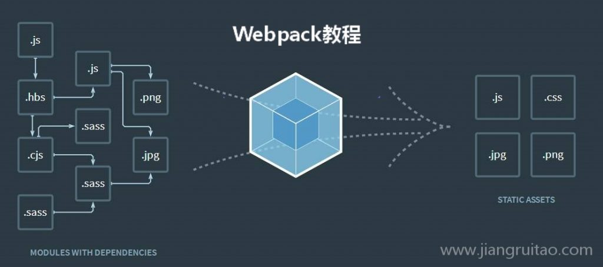
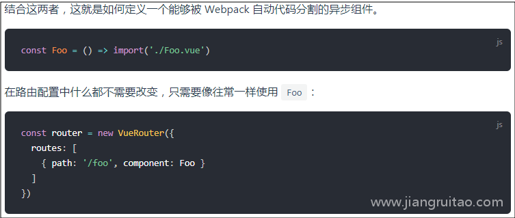

# Webpack 入口与出口

[toc]

## 引言

关于`Webpack`资源入口和出口。

我们还是以[Webpack官网](https://webpack.github.io/)的构建示意图来讲解。



图片里`箭头开始`的`.js文件`就是`Webpack`构建的`资源入口`，然后根据这个`.js文件`依赖的文件，把`相关联的文件模块`打包到`一个.js文件`，本质上来说，这个`打包后`得到的`.js文件`就是Webpack打包构建的`资源出口`。

当然，这个`.js文件`**通常不是我们最终希望打包出来的资源**，我们希望可以拆分成`JS`、`CSS`和`图片`等资源。

`Webpack`当然提供了这样的方法。在构建的时候，我们可以通过`Webpack的预处理器loader`和`插件plugin`等进行干预，把`一个.js文件`变成`JS`、`CSS`和`图片`等资源。

我们可以把`Webpack`的打包流程看作计算机厂家组装电脑。

组装电脑需要从选定CPU开始，找出配套的主板、内存条和硬盘等等。

这些电脑配件就是`Webpack`的`文件模块`。`CPU`是`资源入口文件`，计算机厂家需要根据CPU型号来选定配套的主板和内存等，`配套的主板和内存`就是打包过程中``依赖的模块`。

主板、内存和CPU等最终组装好的电脑，就是打包好的资源`bundle文件`，电脑送往的物流仓库就是`资源出口路径`。

## 模块化import与require及区别

本节主要介绍`webpack`中的模块方法，包括`ES6的import`以及`CommonJS的require`等。

Webpack是一个`模块打包工具`，对`一切文件都视为模块`。它本身支持非常多的模块化方法，包括本节中出现的所有模块化方法。

### 一、JavaScript模块化历史

在`JavaScript`这门语言最初的阶段，是没有模块化方法的，因为这门语言设计出来的`初衷是作为web小脚本使用`的。后来随着其在`web应用`的增长，不能模块化开始限制了其应用。

这个时候社区出现了一些模块化规范，比较著名的有`CommonJS`、`AMD`和`CMD`等。

社区的模块化规范可以解决一些JS模块化的问题，但各种模块化规范还是不统一的，有学习和兼容成本。

于是，JavaScript在制订ES6语言标准的时候，提出了自己的模块化，也就是我们现在一般叫做的`ES6 Module（ES6模块化）`。

`ES6 Module`经过五年的发展后，已经广泛应用在JS开发领域。目前，JS模块化使用的主要是`ES6 Module`和`CommonJS`这两种。

### 二、ES6 Module

`ES6`的模块化语法主要用`import进行模块导入`，`export进行模块导出`。

#### 1.export模块导出

```js
// 导出的模块有两个变量name和age，一个函数add
  // a.js
  export var name = 'Jack';
  export var age = 18;
  export function add(a, b) {
    return a + b;
  }
```

上面的导出也可以换一个写法

```js
// 导出的模块有两个变量name和age，一个函数add
  // b.js
  var name = 'Jack';
  var age = 18;
  function add(a, b) {
    return a + b;
  }
  export { name, age, add };
```

export还可以`导出匿名模块`，方便在导入的时候使用

```js
 // 使用匿名(default)导出模块，这里导出的是一个对象
  // c.js
  export default {
    price: 285,
    id: 12,
  }
```

#### 2.import模块导入

我们使用`import … from '…'`方式导入模块。

对于`匿名(default)导出`的模块，我们`自定义一个变量`代表其导出值。

```js
  // 对于匿名(default)导出的模块c.js，我们自定义一个变量moduleC代表其导出值
  // d.js
  import moduleC from './c.js'
  console.log(moduleC)   // 控制台输出一个对象｛price: 285, id: 12｝
```

对于`非default导出`的模块，我们可以使用`大括号`方式导出模块

```js
// 对于模块a.js或b.js，我们使用大括号方式导出模块
  // e.js
  import { name, age, add } from './b.js'
  console.log(name, age);   // 控制台输出'Jack'和18
  console.log(add(1, 8));   // 控制台输出9
```

除了使用`import … from '…'`方式导入模块，也可以使用`import '…'`。使用这种方式，`导入模块后会执行模块内容，但是并不使用其对外提供的接口`。

#### 3.import()函数

注意`import()函数`与上面的`import模块导入`语法的区别。

`import()函数`是`ES2020`提案里提出来的。

**它与普通的import模块导入语法的区别**，

- 外观上是它的import后面跟的是一个括号()，而普通的import最后是一个引号''。

- import()函数虽然是ES2020提案里的，但`Webpack`早已经支持该模块导入语法了

```js
 // import()函数导入模块
  import('./f.js')
```

除了外观上的区别，`import()`与`引号形式import`的**核心区别**是，`import()可以动态导入模块`。

在`Vue-Router`的`路由懒加载`中，我们就是通过使用`import()`来实现的，下图是Vue官方文档的截图



简单解释一下`import()`的原理。`Webpack`在打包的时候，碰到`import()`引入的模块的时候并`不会立刻`把该模块内容打包到`当前文件`里。`Webpack`会使用`动态生成JS`的方式，在`运行代码`的时候生成`script标签`，`script标签`引入的就是`import()`里导入的内容。`import()`导入模块后是一个`Promise对象`，我们可以通过`import().then()`的方式来`处理后续异步`的工作。

### 三、CommonJS

`CommonJS`是目前比较流行的`JS模块化规范`，它主要在`Node.js`中使用。`Node.js`对`CommonJS`的实现并不完全与其规范一致，教程不会涉及这些细微差别。

`CommonJS`主要使用`module.exports导出模块`，`require('…')导入模块`。

```js
// g.js
  module.exports = {
    name: 'Gola',
    age: 25
  }
```

```js
  // h.js
  var person = require('./g.js')
  console.log(person)  // 输出{name: 'Gola',age: 25}
```

`Webpack`对`CommonJS`也支持`动态模块`。如果你用过`旧版本的Webpack`，可以发现`require.ensure`导入模块的语法。注意该语法是`Webpack特有`的，现在`推荐使用import()函数`做`动态导入`模块。

```js
// dependencies是一个数组，数组项是需要导入的模块;
//callback是成功回调函数；
//errorCallback是失败回调函数；
//chunkName是自定义的chunk名；
  require.ensure(dependencies, callback, errorCallback, chunkName)
```

> 1. `Webpack`支持`ES6 Module`、`CommonJS`和`AMD`等模块化方法，目前`常用`的是`ES6 Module`和`CommonJS。`
> 2. `ES6 Module`通过`export导出`模块，`import … from '…'`或`import '…'导入`模块。
> 3. `CommonJS`通过`module.exports导出`模块，`require('…')导入`模块。
> 4. `ES6 Module`通过`import()函数动态导入`模块，`CommonJS`通过`require.ensure动态导入`模块，现在`推荐使用import()函数动态导入`模块。

## Webpack 入口entry

本节主要讲解`Webpack`的`资源入口entry`以及`基础目录context`。

在之前的[Webpack快速入门](https://www.jiangruitao.com/webpack/quick-start/)一节，我们已经学习了简单的资源入口知识，我们的配置文件如下

```js
 var path = require('path');  
  module.exports = {
    entry: './a.js',
    output: {
      path: path.resolve(__dirname, ''),
      filename: 'bundle.js'
    },
    mode: 'none'
  };
```

上述配置表示`从当前根目录`下的`a.js`开始打包，打包得到`bundle.js`。`entry`表示的就是`资源入口文件`，我们可以看到它是一个`相对路径`。

