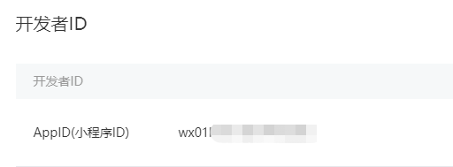

# 微信小程序

[toc]

## 一、从注册开始

> 若只是学习使用，该步骤可跳过

要开发小程序自然要申请注册一个小程序，我们先进入*[微信公众平台](https://mp.weixin.qq.com/)*注册账号(若有账号则直接登录)。


因为微信公众号同时管理着订阅号，公众号以及小程序等多种账号，所以这里要选择小程序账号类型；记住，不同公众号服务之间账号不通用，所以使用注册的邮箱不能被其它公众号服务或者自己微信绑定过。

可以看到上图中我最后注册的邮箱是新浪邮箱，因为我的QQ邮箱被自己微信绑定过了，无法再次使用。


注册完成后登陆，就可以创建 自己的小程序了，这里不累赘，请按照提示依次填写小程序信息；在填写完成创建小程序后，我们可以得到一个小程序ID，就像每个人的身份证ID是独一无二一样，每个小程序也有独一ID，我们在后期小程序开发工具中会利用此ID开发你的小程序，所以这里需要留意一下这个东西。



## 二、安装开发者工具

> [官方开发文档](https://developers.weixin.qq.com/miniprogram/dev/framework/)

前往*[官网下载](https://developers.weixin.qq.com/miniprogram/dev/devtools/download.html)*微信小程序开发者工具，这里提供了三个版本，我下载了稳定版。双击安装，还是别建议默认装在C盘，强迫症。安装完成后双击启动软件，选择小程序；界面顶端有新建项目和导入项目两种，这里我们选择新建来到如下界面：


**`项目名称`**：项目的名字，取个好听的，最好还是别取中文，这里我就叫demo-wechat。

**`目录`：**项目存放目录，这里我就在D盘新建一个空的demo-wechat文件夹存放此项目。

**`AppID`：**如果是开发我们创建的小程序这里就需要填写此ID，很明显我们处于学习阶段怎么上手就玩自己的小程序，这里使用测试号。

**`开发模式`**：选择小程序。

`后端服务`：暂时不会用到，选择不使用云服务。

**`语言`：**这里我选择JavaScript，如果你习惯typescript，也可以换成此项。

好了，点击创建按钮！正式开启我们第一个小程序。

## 三、简单了解界面与基本文件

### **1.界面入门介绍**


整个微信开发工具很像我们使用谷歌打开调试栏的状态，有很多熟悉的影子，我们一一说。

在编辑器左上角可以看到`模拟器`、`编辑器`、`调试器`三个绿色按钮。它们分别对应了开发者工具的左侧，也就是实时`预览区域`；右上侧区域，我们日常开发写代码管理`项目目录`的地方；以及右下侧，`调试区域`。

再往右一点，可以看到一个`预览`按钮，点击会提供了一个有效期限的二维码，我们可以通过微信扫码在手机端真实预览项目；以及右边的`真机调试`，也就是在手机上调试我们的项目。


再往右边可以看到一个`版本管理`。如果我们的项目想多人同时开发，开发者工具这点就比较贴心，直接提供了`初始化git仓库`等功能，便于多人维护。


再往下一栏，可以看到`机型模型`，`网络模拟`等选项，这些在谷歌控制台调试移动端使用也比较频繁。


### **2.文件类型与部分文件说明**

我们通过开发者工具快速创建了一个项目。你可以留意到这个项目里边生成了不同类型的文件:

1. `.json `后缀的 JSON 配置文件
2. `.wxml `后缀的 WXML 模板文件
3. `.wxss `后缀的 WXSS 样式文件
4. `.js `后缀的 JS 脚本逻辑文件

接下来我们分别看看这4种文件的作用。


---

#### 文件结构

小程序包含 `一个` `描述整体程序的 app `和`多个` `描述各自页面的 page`。

一个小程序`主体`部分由`三个文件`组成，`必须`放在`项目的根目录`，如下：

|                             文件                             | 必填 |       作用       |
| :----------------------------------------------------------: | :--: | :--------------: |
| [app.js](https://developers.weixin.qq.com/miniprogram/dev/framework/app-service/app.html) |  是  |    小程序逻辑    |
| [app.json](https://developers.weixin.qq.com/miniprogram/dev/framework/config.html) |  是  |  小程序公共设置  |
| [app.wxss](https://developers.weixin.qq.com/miniprogram/dev/framework/view/wxss.html) |  否  | 小程序公共样式表 |

一个小程序`页面`由`四个文件`组成，分别是：

|                           文件类型                           | 必填 |    作用    |
| :----------------------------------------------------------: | :--: | :--------: |
| [js](https://developers.weixin.qq.com/miniprogram/dev/framework/app-service/page.html) |  是  |  页面逻辑  |
| [wxml](https://developers.weixin.qq.com/miniprogram/dev/framework/view/wxml/) |  是  |  页面结构  |
| [wxss](https://developers.weixin.qq.com/miniprogram/dev/framework/view/wxss.html) |  否  | 页面样式表 |
| [json](https://developers.weixin.qq.com/miniprogram/dev/framework/config.html#pagejson) |  否  |  页面配置  |

**注意：为了方便开发者减少配置项，描述页面的`四个文件`必须具有`相同`的`路径`与`文件名`。**

##### 小程序配置 `app.json`

`app.json` 文件用来对微信小程序进行`全局配置`，决定`页面文件`的`路径`、`窗口表现`、`设置网络超时时间`、`设置多 tab` 等。

以下是一个包含了所有配置选项的 `app.json` ：

```json
{
  "pages": [
    "pages/index/index",
    "pages/logs/index"
  ],
  "window": {
    "navigationBarTitleText": "Demo"
  },
  //底部导航栏 组少2个对象，最多5个
  "tabBar": {
    "list": [{
      "pagePath": "pages/index/index",//导航页面
      "text": "首页"//显示的文字
    }, {
      "pagePath": "pages/logs/logs",
      "text": "日志"
    }]
  },
  "networkTimeout": {
    "request": 10000,
    "downloadFile": 10000
  },
  "debug": true
}
```

`app.json` 配置项列表：

|                             属性                             |     类型     | 必填 |          描述           |
| :----------------------------------------------------------: | :----------: | :--: | :---------------------: |
| [`pages`](https://developers.weixin.qq.com/miniprogram/dev/framework/config.html#pages) | String Array |  是  |      设置页面路径       |
| [`window`](https://developers.weixin.qq.com/miniprogram/dev/framework/config.html#window) |    Object    |  否  | 设置默认页面的窗口表现  |
| [`tabBar`](https://developers.weixin.qq.com/miniprogram/dev/framework/config.html#tabbar) |    Object    |  否  |   设置底部 tab 的表现   |
| [`networkTimeout`](https://developers.weixin.qq.com/miniprogram/dev/framework/config.html#networktimeout) |    Object    |  否  |    设置网络超时时间     |
| [`debug`](https://developers.weixin.qq.com/miniprogram/dev/framework/config.html#debug) |   Boolean    |  否  | 设置是否开启 debug 模式 |

###### **`pages`**

接受一个`数组`，每一项都是`字符串`，来指定小程序由哪些页面组成。每一项代表对应页面的【路径+文件名】信息，**数组的第一项代表小程序的初始页面。小程序中新增/减少页面，都需要对 pages 数组进行修改。**

文件名`不需要写文件后缀`，因为框架会自动去寻找路径下 `.json`, `.js`, `.wxml`, `.wxss` 四个文件进行整合。

**如果开发目录为：**

```js
pages/

pages/index/index.wxml

pages/index/index.js

pages/index/index.wxss

pages/logs/logs.wxml

pages/logs/logs.js

app.js

app.json

app.wxss
```

**则需要在 `app.json` 中写**

```json
{
  "pages":[
    "pages/index/index",
    "pages/logs/logs"
  ]
}
```

> Tips:
>
> - 数组的`第一项`为小程序`初始页面`
> - 不属于` tabBar `的页面`不会显示 tabBar`

###### `window`

用于设置小程序的`状态栏`、`导航条`、`标题`、`窗口背景色`。

|             属性             |   类型   | 默认值  |                             描述                             |    最低版本     |
| :--------------------------: | :------: | :-----: | :----------------------------------------------------------: | :-------------: |
| navigationBarBackgroundColor | HexColor | #000000 |                 导航栏背景颜色，如”#000000”                  |                 |
|    navigationBarTextStyle    |  String  |  white  |              导航栏标题颜色，仅支持 black/white              |                 |
|    navigationBarTitleText    |  String  |         |                      导航栏标题文字内容                      |                 |
|       navigationStyle        |  String  | default | 导航栏样式，仅支持 default/custom。custom 模式可自定义导航栏，只保留右上角胶囊状的按钮 | 微信版本 6.6.0  |
|       backgroundColor        | HexColor | #ffffff |                         窗口的背景色                         |                 |
|     backgroundTextStyle      |  String  |  dark   |            下拉 loading 的样式，仅支持 dark/light            |                 |
|      backgroundColorTop      |  String  | #ffffff |                顶部窗口的背景色，仅 iOS 支持                 | 微信版本 6.5.16 |
|    backgroundColorBottom     |  String  | #ffffff |                底部窗口的背景色，仅 iOS 支持                 | 微信版本 6.5.16 |
|    enablePullDownRefresh     | Boolean  |  false  | 是否开启下拉刷新，详见[页面相关事件处理函数](https://developers.weixin.qq.com/miniprogram/dev/framework/app-service/page.html#页面相关事件处理函数) |                 |
|    onReachBottomDistance     |  Number  |   50    |        页面上拉触底事件触发时距页面底部距离，单位为px        |                 |

**注：HexColor（十六进制颜色值），如”#ff00ff”**

**注：`navigationStyle` 只在` app.json `中生效。开启 `custom `后，低版本客户端需要做好兼容。开发者工具基础库版本切到 1.7.0（不代表最低版本，只供调试用） 可方便切到旧视觉**

如 `app.json` ：

```json
{
  "window":{
    "navigationBarBackgroundColor": "#ffffff",
    "navigationBarTextStyle": "black",
    "navigationBarTitleText": "微信接口功能演示",
    "backgroundColor": "#eeeeee",
    "backgroundTextStyle": "light"
  }
}
```

###### `tabBar`

如果小程序是一个多 tab 应用（客户端窗口的底部或顶部有 tab 栏可以切换页面），可以通过 tabBar 配置项指定 tab 栏的表现，以及 tab 切换时显示的对应页面。

> **Tips:**
>
> - 当设置 position 为 top 时，将不会显示 icon
> - tabBar 中的 list 是一个数组，**只能配置最少2个、最多5个 tab**，tab 按数组的顺序排序。
> - 不属于 tabBar 的页面不会显示 tabBar

**属性说明：**

|      属性       |   类型   | 必填 | 默认值 |                         描述                         |
| :-------------: | :------: | :--: | :----: | :--------------------------------------------------: |
|      color      | HexColor |  是  |        |                 tab 上的文字默认颜色                 |
|  selectedColor  | HexColor |  是  |        |               tab 上的文字选中时的颜色               |
| backgroundColor | HexColor |  是  |        |                     tab 的背景色                     |
|   borderStyle   |  String  |  否  | black  |       tabbar上边框的颜色， 仅支持 black/white        |
|      list       |  Array   |  是  |        | tab 的列表，详见 list 属性说明，最少2个、最多5个 tab |
|    position     |  String  |  否  | bottom |                  可选值 bottom、top                  |

其中 `list` 接受一个`数组`，数组中的每个项都是一个对象，其属性值如下：

|       属性       |  类型  | 必填 |                             说明                             |
| :--------------: | :----: | :--: | :----------------------------------------------------------: |
|     pagePath     | String |  是  |               页面路径，必须在 pages 中先定义                |
|       text       | String |  是  |                        tab 上按钮文字                        |
|     iconPath     | String |  否  | 图片路径，icon 大小限制为40kb，建议尺寸为 81px * 81px，当 postion 为 top 时，此参数无效，不支持网络图片 |
| selectedIconPath | String |  否  | 选中时的图片路径，icon 大小限制为40kb，建议尺寸为 81px * 81px ，当 postion 为 top 时，此参数无效 |

```json
{
  "tabBar": {
    "custom": true,
    "color": "#000000",
    "selectedColor": "#000000",
    "backgroundColor": "#000000",
    "list": [{
      "pagePath": "page/component/index",
      "text": "组件"
    }, {
      "pagePath": "page/API/index",
      "text": "接口"
    }]
  },
  "usingComponents": {}
}
```

###### `networkTimeout`

可以设置各种网络请求的超时时间。

**属性说明：**

|     属性      |  类型  | 必填 |                             说明                             |
| :-----------: | :----: | :--: | :----------------------------------------------------------: |
|    request    | Number |  否  | [wx.request](https://developers.weixin.qq.com/miniprogram/dev/api/network-request.html)的超时时间，单位毫秒，默认为：60000 |
| connectSocket | Number |  否  | [wx.connectSocket](https://developers.weixin.qq.com/miniprogram/dev/api/network-socket.html)的超时时间，单位毫秒，默认为：60000 |
|  uploadFile   | Number |  否  | [wx.uploadFile](https://developers.weixin.qq.com/miniprogram/dev/api/network-file.html#wxuploadfileobject)的超时时间，单位毫秒，默认为：60000 |
| downloadFile  | Number |  否  | [wx.downloadFile](https://developers.weixin.qq.com/miniprogram/dev/api/network-file.html#wxdownloadfileobject)的超时时间，单位毫秒，默认为：60000 |

###### `debug`

可以在开发者工具中开启 `debug` 模式，在开发者工具的控制台面板，调试信息以` info` 的形式给出，其信息有`Page的注册`，`页面路由`，`数据更新`，`事件触发` 。 可以帮助开发者快速定位一些常见的问题。

##### `页面配置 page.json`

`每一个小程序页面`也可以使用 `.json` 文件来对`本页面的窗口表现进行配置`。 页面的配置比`app.json`全局配置简单得多，只是设置 `app.json` 中的 `window `配置项的内容，页面中配置项会`覆盖` ` app.json` 的 `window `中`相同的配置项`。

页面的 `.json` 只能设置 `window` 相关的配置项，以决定本页面的窗口表现，所以无需写 `window` 这个键，如：

|             属性             |   类型   | 默认值  |                             描述                             |
| :--------------------------: | :------: | :-----: | :----------------------------------------------------------: |
| navigationBarBackgroundColor | HexColor | #000000 |                 导航栏背景颜色，如”#000000”                  |
|    navigationBarTextStyle    |  String  |  white  |              导航栏标题颜色，仅支持 black/white              |
|    navigationBarTitleText    |  String  |         |                      导航栏标题文字内容                      |
|       backgroundColor        | HexColor | #ffffff |                         窗口的背景色                         |
|     backgroundTextStyle      |  String  |  dark   |            下拉 loading 的样式，仅支持 dark/light            |
|    enablePullDownRefresh     | Boolean  |  false  | 是否开启下拉刷新，详见[页面相关事件处理函数](https://developers.weixin.qq.com/miniprogram/dev/framework/app-service/page.html#页面相关事件处理函数)。 |
|        disableScroll         | Boolean  |  false  | 设置为 true 则页面整体不能上下滚动；只在 page.json 中有效，无法在 app.json 中设置该项 |
|    onReachBottomDistance     |  Number  |   50    |        页面上拉触底事件触发时距页面底部距离，单位为px        |

```json
{
  "navigationBarBackgroundColor": "#ffffff",
  "navigationBarTextStyle": "black",
  "navigationBarTitleText": "微信接口功能演示",
  "backgroundColor": "#eeeeee",
  "backgroundTextStyle": "light"
}
```

##### 工具配置 `project.config.json`

通常大家在使用一个工具的时候，都会针对各自喜好做一些个性化配置，例如界面颜色、编译配置等等，当你换了另外一台电脑重新安装工具的时候，你还要重新配置。

考虑到这点，小程序开发者工具在每个项目的根目录都会生成一个 project.config.json，你在工具上做的任何配置都会写入到这个文件，当你重新安装工具或者换电脑工作时，你只要载入同一个项目的代码包，开发者工具就自动会帮你恢复到当时你开发项目时的个性化配置，其中会包括编辑器的颜色、代码上传时自动压缩等等一系列选项。

其他配置项细节可以参考文档 [开发者工具的配置](https://developers.weixin.qq.com/miniprogram/dev/devtools/edit.html#项目配置文件) 。

## Q&A

1. `app.json `文件是干嘛的？
   - 小程序全局配置文件`app.json` 
2. 文件中的` pages `是用来配置什么的 
   - 用来配置小程序页面，也就是说小程序中出现的所有页面都必须配置在` pages `选项中
3. 小程序如何添加页面？
   - 只需要在` pages `中增加一个页面路径即可
4. 配置规则？
   - 字符串数组
   - 字符串存储一个以 `pages/` 开头的路径
5. `app.json` 文件中的` window `选项可以做什么？
   - 用于设置小程序的状态栏、导航条、标题、窗口背景色。
6. 除了` app.json `全局配置文件之外，每个页面都有一个可选的` json `配置文件
7. 页面自己的 `JSON` 文件只能用来配置当前页面的 `Window` 窗口效果
   - 页面自己的 `Window` 会覆盖掉 `app.json` 的 `Window` 配置

