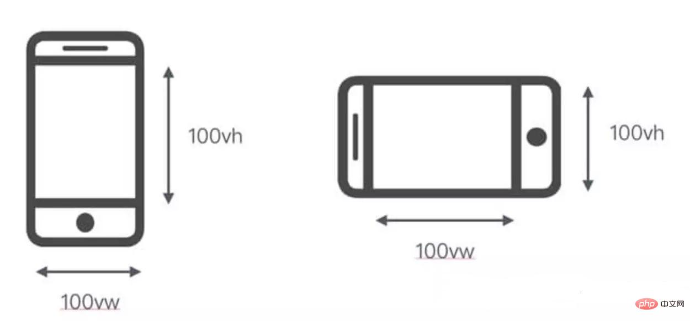

# 

[toc]

## 小程序组件

### 概念及语法

框架为开发者提供了一系列`基础组件`，开发者可以通过组合这些基础组件进行快速开发。

==什么是组件：==

- `组件`是`视图层`的`基本组成单元`。

- `组件`自带一些`功能`与`微信风格`的样式`。

- 一个组件通常包括`开始标签`和`结束标签`，`属性`用来修饰这个组件，`内容`在两个标签之内。

  ```html
  <tagname property="value"> 
  	Content goes here ...
  </tagname>
  ```

  **注意：所有组件与属性都是`小写`，以连字符`-`连接**

#### 属性类型

|     类型     |      描述      | 注解                                                         |
| :----------: | :------------: | :----------------------------------------------------------- |
|   Boolean    |     布尔值     | 组件写上该属性，不管该属性等于什么，其值都为`true`，只有组件上没有写该属性时，属性值才为`false`。如果属性值为变量，变量的值会被转换为Boolean类型 |
|    Number    |      数字      | `1`, `2.5`                                                   |
|    String    |     字符串     | `"string"`                                                   |
|    Array     |      数组      | `[ 1, "string" ]`                                            |
|    Object    |      对象      | `{ key: value }`                                             |
| EventHandler | 事件处理函数名 | `"handlerName"` 是 [Page](https://developers.weixin.qq.com/miniprogram/dev/framework/app-service/page.html)中定义的事件处理函数名 |
|     Any      |    任意属性    |                                                              |

#### 共同属性类型

**所有组件都有的属性：**

|     属性名     |     类型     |      描述      |                             注解                             |
| :------------: | :----------: | :------------: | :----------------------------------------------------------: |
|      `id`      |    String    | 组件的唯一标示 |                       保持整个页面唯一                       |
|    `class`     |    String    |  组件的样式类  |                 在对应的 WXSS 中定义的样式类                 |
|    `style`     |    String    | 组件的内联样式 |                    可以动态设置的内联样式                    |
|    `hidden`    |   Boolean    |  组件是否显示  |                       所有组件默认显示                       |
|    `data-*`    |     Any      |   自定义属性   |           组件上触发的事件时，会发送给事件处理函数           |
| `bind / catch` | EventHandler |   组件的事件   | 详见[事件](https://developers.weixin.qq.com/miniprogram/dev/framework/view/wxml/event.html) |

#### 特殊属性

`几乎` `所有组件`都有各自定义的属性，可以对该组件的`功能`或`样式`进行修饰，请参考各个[组件](https://developers.weixin.qq.com/miniprogram/dev/component/#组件列表)的定义。

#### 组件列表

基础组件分为以下`七大类`：

##### **视图容器(View Container)：**

|                            组件名                            |      说明      |
| :----------------------------------------------------------: | :------------: |
| [view](https://developers.weixin.qq.com/miniprogram/dev/component/view.html) |    视图容器    |
| [scroll-view](https://developers.weixin.qq.com/miniprogram/dev/component/scroll-view.html) | 可滚动视图容器 |
| [swiper](https://developers.weixin.qq.com/miniprogram/dev/component/swiper.html) |  滑块视图容器  |

##### **基础内容(Basic Content)：**

|                            组件名                            |  说明  |
| :----------------------------------------------------------: | :----: |
| [icon](https://developers.weixin.qq.com/miniprogram/dev/component/icon.html) |  图标  |
| [text](https://developers.weixin.qq.com/miniprogram/dev/component/text.html) |  文字  |
| [progress](https://developers.weixin.qq.com/miniprogram/dev/component/progress.html) | 进度条 |

##### **表单(Form)：**

|                            标签名                            |      说明      |
| :----------------------------------------------------------: | :------------: |
| [button](https://developers.weixin.qq.com/miniprogram/dev/component/button.html) |      按钮      |
| [form](https://developers.weixin.qq.com/miniprogram/dev/component/form.html) |      表单      |
| [input](https://developers.weixin.qq.com/miniprogram/dev/component/input.html) |     输入框     |
| [checkbox](https://developers.weixin.qq.com/miniprogram/dev/component/checkbox.html) |   多项选择器   |
| [radio](https://developers.weixin.qq.com/miniprogram/dev/component/radio.html) |   单项选择器   |
| [picker](https://developers.weixin.qq.com/miniprogram/dev/component/picker.html) |   列表选择器   |
| [picker-view](https://developers.weixin.qq.com/miniprogram/dev/component/picker-view.html) | 内嵌列表选择器 |
| [slider](https://developers.weixin.qq.com/miniprogram/dev/component/slider.html) |   滚动选择器   |
| [switch](https://developers.weixin.qq.com/miniprogram/dev/component/switch.html) |   开关选择器   |
| [label](https://developers.weixin.qq.com/miniprogram/dev/component/label.html) |      标签      |

##### **导航(Navigation)：**

|                            组件名                            |   说明   |
| :----------------------------------------------------------: | :------: |
| [navigator](https://developers.weixin.qq.com/miniprogram/dev/component/navigator.html) | 应用链接 |

##### **多媒体(Media)：**

|                            组件名                            | 说明 |
| :----------------------------------------------------------: | :--: |
| [audio](https://developers.weixin.qq.com/miniprogram/dev/component/audio.html) | 音频 |
| [image](https://developers.weixin.qq.com/miniprogram/dev/component/image.html) | 图片 |
| [video](https://developers.weixin.qq.com/miniprogram/dev/component/video.html) | 视频 |

##### **地图(Map)：**

|                            组件名                            | 说明 |
| :----------------------------------------------------------: | :--: |
| [map](https://developers.weixin.qq.com/miniprogram/dev/component/map.html) | 地图 |

##### **画布(Canvas)：**

|                            组件名                            | 说明 |
| :----------------------------------------------------------: | :--: |
| [canvas](https://developers.weixin.qq.com/miniprogram/dev/component/canvas.html) | 画布 |

### 基础内容

#### icon

图标。

##### 属性

| 属性名  |  类型  | 默认值 | 说明                                                         |
| :-----: | :----: | :----: | :----------------------------------------------------------- |
| `type`  | String |        | icon的类型，`有效值`：==success==,  ==success_no_circle==,    ==info==, ==warn==, ==waiting==, ==cancel==, ==download==, ==search==, ==clear== |
| `size`  | Number |   23   | icon的大小，单位`px`                                         |
| `color` | Color  |        | icon的颜色，同css的color                                     |

##### 示例

[在开发者工具中预览效果](https://www.bookstack.cn/read/miniprogram-tutorial/$docs-guide-wechatide:--minicode-LK9tzcmM6QYj)

```html
<view class="group">
  <block wx:for="{{iconSize}}">
    <icon type="success" size="{{item}}"/>
  </block>
</view>
<view class="group">
  <block wx:for="{{iconType}}">
    <icon type="{{item}}" size="40"/>
  </block>
</view>
<view class="group">
  <block wx:for="{{iconColor}}">
    <icon type="success" size="40" color="{{item}}"/>
  </block>
</view>
```

```js
Page({
  data: {
    iconSize: [20, 30, 40, 50, 60, 70],
    iconColor: [
      'red', 'orange', 'yellow', 'green', 'rgb(0,255,255)', 'blue', 'purple'
    ],
    iconType: [
      'success', 'success_no_circle', 'info', 'warn', 'waiting', 'cancel', 'download', 'search', 'clear'
    ]
  }
})
```


#### text

文本。

##### 属性

|    属性名    |  类型   | 默认值 |     说明     |                           最低版本                           |
| :----------: | :-----: | :----: | :----------: | :----------------------------------------------------------: |
| `selectable` | Boolean | false  | 文本是否可选 | [1.1.0](https://developers.weixin.qq.com/miniprogram/dev/framework/compatibility.html) |
|   `space`    | String  | false  | 显示连续空格 | [1.4.0](https://developers.weixin.qq.com/miniprogram/dev/framework/compatibility.html) |
|   `decode`   | Boolean | false  |   是否解码   | [1.4.0](https://developers.weixin.qq.com/miniprogram/dev/framework/compatibility.html) |

**space 有效值：**

|   值   |          说明          |
| :----: | :--------------------: |
| `ensp` |  中文字符空格一半大小  |
| `emsp` |    中文字符空格大小    |
| `nbsp` | 根据字体设置的空格大小 |

> ==Tips:==
>
> - `decode`可以解析的有 `&nbsp;`、`&lt;`、`&gt;`、`&amp;`、`&apos;`、`&ensp;`、`&emsp;`
> - 各个操作系统的空格标准并不一致。
> - `<text/>` 组件内只支持 `<text/>` 嵌套。
> - 除了`文本节点`以外的其他节点都`无法长按选中`。
> - `文本换行`可以使用转义符 `\n`

##### 示例

[在开发者工具中预览效果](https://www.bookstack.cn/read/miniprogram-tutorial/$docs-guide-wechatide:--minicode-Egao9cm46gY6)

```html
<view class="btn-area">
  <view class="body-view">
    <text>{{text}}</text>
    <button bindtap="add">add line</button>
    <button bindtap="remove">remove line</button>
  </view>
</view>
```

```js
var initData = 'this is first line\nthis is second line'
var extraLine = [];
Page({
  data: {
    text: initData
  },
  add: function(e) {
    extraLine.push('other line')
    this.setData({
      text: initData + '\n' + extraLine.join('\n')
    })
  },
  remove: function(e) {
    if (extraLine.length > 0) {
      extraLine.pop()
      this.setData({
        text: initData + '\n' + extraLine.join('\n')
      })
    }
  }
})
```


#### rich-text

#### progress

### 视图容器

#### view

#### scroll-view

#### swiper

#### movable-view

#### cover-view

### 表单组件

#### button

#### checkbox

#### form

#### input

#### label

#### picker

#### picker-view

#### radio

#### slider

#### switch

#### textarea

### 导航

#### navigator

### 媒体组件

#### audio

.

#### image

图片。

##### 属性

|   属性名    |    类型     |    默认值     | 说明                                                         | 最低版本                                                     |
| :---------: | :---------: | :-----------: | :----------------------------------------------------------- | :----------------------------------------------------------- |
|    `src`    |   String    |               | 图片`资源地址`                                               |                                                              |
|   `mode`    |   String    | ‘scaleToFill’ | 图片`裁剪`、`缩放`的模式                                     |                                                              |
| `lazy-load` |   Boolean   |     false     | 图片`懒加载`。只针对`page`与`scroll-view`下的`image`有效     | [1.5.0](https://developers.weixin.qq.com/miniprogram/dev/framework/compatibility.html) |
| `binderror` | HandleEvent |               | 当`错误发生时`，发布到 `AppService` 的事件名，事件对象event.detail = {errMsg: ‘something wrong’} |                                                              |
| `bindload`  | HandleEvent |               | 当图片`载入完毕`时，发布到 `AppService` 的事件名，事件对象event.detail = {height:’图片高度px’, width:’图片宽度px’} |                                                              |

**注：image组件`默认宽度300px`、`高度225px`**

**`mode `有效值：**

mode 有` 13 种模式`，其中 `4 种是缩放`模式，`9 种是裁剪`模式。

| 模式 |       值       | 说明                                                         |
| :--- | :------------: | :----------------------------------------------------------- |
| 缩放 | `scaleToFill`  | 不保持纵横比缩放图片，使图片的宽高完全拉伸至填满 image 元素  |
| 缩放 |  `aspectFit`   | 保持纵横比缩放图片，使图片的长边能完全显示出来。也就是说，可以完整地将图片显示出来。 |
| 缩放 |  `aspectFill`  | 保持纵横比缩放图片，只保证图片的短边能完全显示出来。也就是说，图片通常只在水平或垂直方向是完整的，另一个方向将会发生截取。 |
| 缩放 |   `widthFix`   | 宽度不变，高度自动变化，保持原图宽高比不变                   |
| 裁剪 |     `top`      | 不缩放图片，只显示图片的顶部区域                             |
| 裁剪 |    `bottom`    | 不缩放图片，只显示图片的底部区域                             |
| 裁剪 |    `center`    | 不缩放图片，只显示图片的中间区域                             |
| 裁剪 |     `left`     | 不缩放图片，只显示图片的左边区域                             |
| 裁剪 |    `right`     | 不缩放图片，只显示图片的右边区域                             |
| 裁剪 |   `top left`   | 不缩放图片，只显示图片的左上边区域                           |
| 裁剪 |  `top right`   | 不缩放图片，只显示图片的右上边区域                           |
| 裁剪 | `bottom left`  | 不缩放图片，只显示图片的左下边区域                           |
| 裁剪 | `bottom right` | 不缩放图片，只显示图片的右下边区域                           |

##### 示例

[在开发者工具中预览效果](https://www.bookstack.cn/read/miniprogram-tutorial/$docs-guide-wechatide:--minicode-8Mc01cmS6WYi)

```html
<view class="page">
  <view class="page__hd">
    <text class="page__title">image</text>
    <text class="page__desc">图片</text>
  </view>
  <view class="page__bd">
    <view class="section section_gap" wx:for="{{array}}" wx:for-item="item">
      <view class="section__title">{{item.text}}</view>
      <view class="section__ctn">
        <image style="width: 200px; height: 200px; background-color: #eeeeee;" mode="{{item.mode}}" src="{{src}}"></image>
      </view>
    </view>
  </view>
</view>
```

```js
Page({
  data: {
    array: [{
      mode: 'scaleToFill',
      text: 'scaleToFill：不保持纵横比缩放图片，使图片完全适应'
    }, { 
      mode: 'aspectFit',
      text: 'aspectFit：保持纵横比缩放图片，使图片的长边能完全显示出来'
    }, { 
      mode: 'aspectFill',
      text: 'aspectFill：保持纵横比缩放图片，只保证图片的短边能完全显示出来'
    }, { 
      mode: 'top',
      text: 'top：不缩放图片，只显示图片的顶部区域' 
    }, {      
      mode: 'bottom',
      text: 'bottom：不缩放图片，只显示图片的底部区域'
    }, { 
      mode: 'center',
      text: 'center：不缩放图片，只显示图片的中间区域'
    }, { 
      mode: 'left',
      text: 'left：不缩放图片，只显示图片的左边区域'
    }, { 
      mode: 'right',
      text: 'right：不缩放图片，只显示图片的右边边区域'
    }, { 
      mode: 'top left',
      text: 'top left：不缩放图片，只显示图片的左上边区域' 
    }, { 
      mode: 'top right',
      text: 'top right：不缩放图片，只显示图片的右上边区域'
    }, { 
      mode: 'bottom left',
      text: 'bottom left：不缩放图片，只显示图片的左下边区域'
    }, { 
      mode: 'bottom right',
      text: 'bottom right：不缩放图片，只显示图片的右下边区域'
    }],
    src: '../../resources/cat.jpg'
  },
  imageError: function(e) {
    console.log('image3发生error事件，携带值为', e.detail.errMsg)
  }
})
```


## ❀ 初识WXML

对于每一位前端开发者而言，熟练的编写静态页面是入门的开始，在小程序中这一点也无法避免。在介绍微信小程序功能交互之前，我们先了解在小程序中如何实现`页面布局`与`页面样式`，这里先来介绍`WXML`。

`WXML`全称`WeiXin Markup Language`（微信标记语言），与`HTML`有些不同的是，这是`微信框架`提供的一套`标签语言`。

我们在写`HTML`页面时，总是习惯使用`div`进行整体布局，使用`span`描述文本信息，使用`img`装载图片等等，但在`WXML`中会有一些差异。`WXML`提供的每个标签都是一个`组件`，使用过`vue`，`react`或`angular`的同学对于`组件`概念一定不会陌生，鉴于刚入门的前端同学，这里做个简单解释。

我们在编程时总会考虑`代码复用性`，比如一个页面有好几处的样式完全相同，那么我们可以将这一块样式定义在一个`class`中，接下来只要把这个`class`加在你需要展示的地方就可以了。

```css
.bth{
    outline:none;
    border:none;
    background:#e4393c;
    color:#fff;
    text-align: center;
    cursor: pointer;
}
```

```html
<div>
    <button class="btn">按钮1</button>
    <div>
        <button class="btn">按钮2</button>
    </div>
</div>
```

`组件`的概念也是如此，比如`提示类弹窗`在整个网站中的多个页面都会使用，那我们为什么不把这个弹窗功能封装成一个`组件`呢，之后不管哪个页面需要此功能，只要添加这个`组件`就可以了。要实现这个`组件`我们都得`先定义好组件模板`（HTML，决定组件结构），`组件默认样式`（CSS，决定组件外观），`组件功能`（JS，决定组件负责做哪些事）等。

而在小程序框架中，`官方`已经提前帮我们实现了大量的`组件`，比如`基本视图组件`中的`view`相当于HTML中的`div`可用来布局；`基本内容组件`中的`text`相当于`span`，可以用来装载多段行内文本，再如`媒体组件`中的`image`，它相当于`img`标签用来承载图片信息。

除此之外，每个`小程序组件`都`默认提供`了一些非常nice的`属性`，这里以`image`组件为例。

假设我们希望`图片加载完成后做一件事情`，比如获取图片的宽度，这里就可以利用`image`的`bindload`（图片加载完成后触发）属性，打开我们的小程序开发工具，在`index.wxml`中添加一个`image`组件：

```html
<view>
  <!--自己随便找个图 -->
  <image bindload='imgLoad' src='../../assas/test.jpeg'></image>
</view>
```

对应的，在`index.js`添加如下代码：

```js
const app = getApp()

Page({
  //图片加载完成后执行的方法
  imgLoad(image) {
    console.log(image.detail.width);
  }
})
```

保存，可以看到在编辑器`console`控制台输出了`320`，这是`image`组件`默认`的`宽度`样式。

再例如`图片懒加载`在页面优化中也是需要考虑的一点，而`image`提供了`lazy-load`属性用于解决图片懒加载问题。

小程序官方提供的组件数量较多，很遗憾没办法一一介绍，但官方已经做了明细的[组件分类](https://developers.weixin.qq.com/miniprogram/dev/component/)，我们要做的就是拿到一个页面清楚知道需要用到哪些组件，一个组件需要用到哪些属性，就像搭积木一样，用这些组件来组成小程序的页面，还记得最初学HTML时标签使用的陌生感吗？它并没有难度，只是需要多加练习而已。

## ❀关于WXSS

`WXSS`(WeiXin Style Sheets)是一套`样式语言`，用于`描述 WXML 的组件样式`。

`WXSS` 用来决定` WXML `的组件应该怎么显示。

为了适应广大的前端开发者，`WXSS `具有` CSS `大部分特性。同时为了更适合开发微信小程序，`WXSS` 对 `CSS `进行了扩充以及修改。

1. 新增了`尺寸单位`。在写 CSS 样式时，开发者需要考虑到手机设备的屏幕会有不同的宽度和设备像素比，采用一些技巧来换算一些像素单位。WXSS 在底层支持新的尺寸单位 rpx ，开发者可以免去换算的烦恼，只要交给小程序底层来换算即可，由于换算采用的浮点数运算，所以运算结果会和预期结果有一点点偏差。
2. 提供了`全局的样式`和`局部样式`。和前边 app.json, page.json 的概念相同，你可以写一个 app.wxss 作为全局样式，会作用于当前小程序的所有页面，局部页面样式 page.wxss 仅对当前页面生效。
3. 此外 `WXSS 仅支持部分 CSS 选择器`

### 内联样式

框架组件上支持使用` style`、`class `属性来控制组件的样式。

- `style`：静态的样式统一写到 class 中。style 接收动态的样式，在运行时会进行解析，请尽量避免将静态的样式写进 style 中，以免影响渲染速度。

```css
<view style="color:{{color}};" />
```

- `class`：用于指定样式规则，其属性值是样式规则中类选择器名(样式类名)的集合，样式类名不需要带上`.`，样式类名之间用空格分隔。

```css
<view class="normal_view" />
```

### 选择器

目前支持的选择器有：

|      选择器      |       样例       |                    样例描述                    |
| :--------------: | :--------------: | :--------------------------------------------: |
|      .class      |     `.intro`     |       选择所有拥有 class=”intro” 的组件        |
|       #id        |   `#firstname`   |         选择拥有 id=”firstname” 的组件         |
|     element      |      `view`      |               选择所有 view 组件               |
| element, element | `view, checkbox` | 选择所有文档的 view 组件和所有的 checkbox 组件 |
|     ::after      |  `view::after`   |            在 view 组件后边插入内容            |
|     ::before     |  `view::before`  |            在 view 组件前边插入内容            |

> Tips:
>
> - 经过测试我们发现小程序也支持其他选择器，例如`后代选择器`、直接`子代选择器`等，但是`建议不要使用`官方文档中未声明的选择器，因为`小程序中的 CSS 不是纯 CSS`，可能会造成在其它设备不支持的情况，其次由于小程序都是`移动网页`，不需要我们` PC 端`那么复杂的`网页布局`，所以也就不需要那么多复杂的选择器了。

### 尺寸单位rpx

> `rpx（responsive pixel）`: 可以`根据屏幕宽度进行自适应`。规定`屏幕宽为750rpx`。
>
> 如在 iPhone6 上，屏幕宽度为375px，共有750个物理像素，则750rpx = 375px = 750物理像素，1rpx = 0.5px = 1物理像素。

并提供了如下几个手机型号的转换例子：

|   设备型号   | rpx换算px (屏幕宽度/750) | px换算rpx (750/屏幕宽度) |
| :----------: | :----------------------: | :----------------------: |
|   iPhone5    |      1rpx = 0.42px       |      1px = 2.34rpx       |
|   iPhone6    |       1rpx = 0.5px       |        1px = 2rpx        |
| iPhone6 Plus |      1rpx = 0.552px      |      1px = 1.81rpx       |

这里我提前查了下这三款手机的逻辑像素比：

- `iPhone5`：320px x 568px
- `iPhone6` : 375px x 667px
- `iPhone6 plus` : 414px x 736px

我们从UI设计师手上拿的图一般都是`px单位`的标注，如果在小程序上直接用`px`做单位会因为`各类手机屏幕占宽比不同，导致一样的设计在不同设备上表现差异`的问题，所以以往我们`通常`用`rem`或者`vw`来解决这个问题，而`rpx`只是小程序提供的另一解决方案。

假设UI以`iphone6`机型为标准做的设计稿，设计稿上有一个盒子宽高各位200px，我们尝试切换设备型号，效果如下：


可以看到在`iphone5`的情况下，盒子右边留白还挺多，切到`iphoneX`时，`留白`明显减少。

**现在我们试试改成`rpx`，怎么计算呢？**

上面例子已经给出，**1px=rpx\*(750/设备屏幕宽度)**，

因为我们假设的原型图是以`iphone6`为标准，所以这里就是1px=rpx*(750/375)，所以才有1px=2rpx这个结论。

大家可以试试，在`iphone6`的情况下将200px改为400rpx，修改后可以看到盒子大小并不会改变。OK，现在我们再来修改设备型号：


哎？经过修改，我们发现不管怎么切换设备型号，盒子所占宽度的比例，一直都是接近`屏幕宽一半`左右，这就是`rpx`的作用。

官方推荐开发微信小程序时设计师用` iPhone6 `作为视觉稿的标准，毕竟2倍好计算，万一设计师没用iphone6，大家也可以套上面的公式知道应该设置多少，那么关于rpx就说到这里。

#### 单位rem

> 它的全称是` font size of the root element `（`根元素的字体大小`）
> 它是`CSS3`中新增加的一个`尺寸（度量）单位`，`根节点`（html）的`font-size`决定了`rem`的尺寸，也就是说它是一个`相对单位`，`相对于(html)`。

**浏览器的默认字体？**

浏览器的默认的`font-size`是`16px`，`1rem`默认就等于`16px`。（`chrome`最小字体为`12px`）

**rem可以做什么及它的应用场景？**

用来做`web` `app`的`屏幕适配`，因为不同手机型号的屏幕大小都不同，所以这时候我们就不能用`px`来做单位，`rem`是`适配`不同手机屏幕的一种方案。

**设置的`font-size`来改变`rem`尺寸**

```css
 :root{
      font-size:20px;
     }
.box{
      width:1rem;
      height:1rem;
      background-color:purple;
    }
```

将`根元素html`的`font-size`设置为`20px`，此时`box`的宽高都为`20px`，也就是`1rem = 20px`

二、步骤 

1. 首先用js根据`不同的视窗宽度`动态的改变根元素的`font-size `

2. 获取`视窗宽度`（兼容性写法） 

   let rootWidth = document.documentElement.clientWidth || document.body.clientWidth;

3. 获取`html`元素
   let rootDom = document.querySelector('html');

4. 动态设置`html`的`font-size`（除以10是让浏览器的font-size达到比较合适目的）
   rootDom.style.fontSize = rootWidth / 10 + 'px';

```markdown
<br>
2. 根据设计师的设计稿中的`px`单位转换成`rem`单位
<br>
如何正确的通过px值计算rem值
<br>
**px单位  /  font-size【动态】 = rem单位【动态】 （错误的想法，有的小伙伴迷糊在这里）**
**px单位 / font-size【固定】 = rem单位【固定】 （正确的想法，有的小伙伴可能开始想不明白）**
***这里要注意的是你计算的font-size是固定的，而不是html的font-size是固定的，很多新人困惑在这里***
<br>
<br>
**错误的计算方法：（动态font-size）**
**200px /     (320 / 10)【iphone5】 = 6.25rem**  
**200px /     (375 / 10)【iphone6】 = 5.333rem**
**200px /     (768 / 10)【ipad】       = 2.604rem** 
<br>
**这样的话**
**在【iphone5】下6.25rem 就是200px**
**在【iphone6】下5.333rem 就是200px**
**在【ipad】下2.604rem 就是200px**
<br>
我们通过了***（图纸的px值 和 动态的font-size值）求出了动态的rem***
<br>
**按照这样的方式设置rem，在不同的尺寸的机型下都是500px，那我还不如直接写死500px，因为屏幕的尺寸大小都是不同的，所以我们这样做毫无意义。（相当于我们根据一个固定的px值求不同机型下的rem值）。**
<br>
<br>
**正确的计算方法：（固定font-size）以iphone6为基准**
**200px /     (375 / 10)【iphone6】 = 5.333rem**  
<br>
**这样的话**
<br>
**在【iphone5】下5.333rem 就是170px**
**在【iphone6】下5.333rem 就是200px**
**在【ipad】下5.333rem 就是410px**
<br>


**也可以以【iphone5】为基准**
**200px / (320 / 10) 【iphone5】 = 6.25rem**
<br>
**这样的话**
<br>
**在【iphone5】下6.25em 就是200px**
**在【iphone6】下6.25rem 就是234px**
**在【ipad】下6.25rem 就是480px**
<br>
<br>
**这样就达到用rem来适配不同尺寸的屏幕了**
<br>
**我们以一种机型的font-size为基准，来计算出一个固定的rem，根元素html的font-size是动态的，所以这个rem值会根据不同机型的font-size达到适配的目的（注意：你参与计算的font-size值绝不能是动态的，否则毫无意义）。**
<br>
**设计师常选择`iPhone6`作为基准设计尺寸，我们一般以iPhone6为基准**
```

#### 单位vw

> 在`css`中，`vw`是一个`长度单位`，一个`视口单位`，是指`相对于视口的宽度`；
>
> `视口`会被`均分`为`100单位的vw`，则`1vw`等于`视口宽度`的`1%`，
>
> 比如浏览器的宽度为`1920px`，则“`1vw`=`1920px/100`=`19.2px`”。

##### **视口单位(Viewport units)**

**什么是`视口`？**

1. 在`PC端`，`视口`指的是在`PC端`，指的是`浏览器的可视区域`；
2. 而在`移动端`，它涉及`3个视口`：
   - `Layout Viewport（布局视口）`，
   - `Visual Viewport（视觉视口）`，
   - `Ideal Viewport（理想视口）`。

`视口单位`中的“`视口`”，`PC端`指的是`浏览器的可视区域`；`移动端`指的就是`Viewport`中的`Layout Viewport`。

**根据CSS3规范，`视口单位`主要包括以下4个：**

1. `vw`：相对于`视口的宽度`， 视口被均分为 100 单位的vw，1vw等于视口`宽度`的1%。
2. `vh`：相对于`视口的高度`， 视口被均分为 100 单位的vh，1vh等于视口`高度`的1%。
3. `vmin`：选取vw和vh中`最小的那个`。
4. `vmax`：选取vw和vh中`最大的那个`。

**vw 和 vh**

全称是 Viewport Width 和 Viewport Height，视窗的宽度和高度，相当于屏幕宽度和高度的 1%。

vh and vw：相对于视口的高度和宽度，而不是父元素的（CSS百分比是相对于包含它的最近的父元素的高度和宽度）。1vh 等于1/100的视口高度，1vw 等于1/100的视口宽度。

比如：浏览器高度950px，宽度为1920px, 1 vh = 950px/100 = 9.5 px，1vw = 1920px/100 =19.2 px。

**vh/vw与%区别**



### 样式导入

使用 `@import` 语句可以导入外联样式表，`@import` 后跟需要导入的外联样式表的相对路径，用 `;` 表示语句结束。

我们现在`index.wxml`中添加一个标签：

```html
<!-- index.wxml -->
<text class='box'>1</text>
```

并在`index.wxss`添加如下样式：

```css
/* index.wxss */
.box{
  width: 400rpx;
  height: 400rpx;
  display: block;
  background-color: antiquewhite;
}
```

现在，我们在全局环境新建一个`common.wsxx`样式表

```css
/* common.wxss */
.box{
  text-align: center;
}
```

在`index.wxss`表头添加如下代码`@import "../../common.wxss";`，添加完成后保存：

```css
@import "../../common.wxss";
.box{
  width: 400rpx;
  height: 400rpx;
  display: block;
  background-color: antiquewhite;
}
```

界面刷新，我们发现`common`里面定义的文本居中样式就对`index`页面生效了，说明`外联样式`引入成功。


注意，小程序根目录的`app.wxss`是指`全局样式`，只要在里面写的样式，会对`所有页面生效`，就相当于小程序默认为每个页面引入了这个样式表。所以当有一些样式可复用，而我们又想手动控制是否引入时，利用`@import`就是不错的方法。

> Tips:
>
> 建议把某几个页面公共的样式提取到单独的文件中，然后在 `页面.wxss` 中使用 `@import` 语法单独引入。