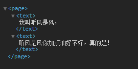

## 引言

在网页开发中，我们同样使用`JS`操作`DOM`，包括`数据渲染`，`事件监听`等，比如我现在要通过点击一个按钮后，替换段落中的本文信息，使用`JS`可以这么做：

```html
<p>我是谁？</p>
<button>点我点我</button>
```

```js
let btn = document.querySelector("button"),
    p = document.querySelector("p");
btn.onclick = function () {
    p.innerHTML = '我是听风是风啊！'
};
```

没问题，效果虽然实现了，但是类似的操作我们`总是得获取并操作DOM`，`逻辑层`与`渲染层` `高度耦合`，每一份数据我们似乎都得找到对应的DOM所在，并帮助它们相互关联，这很明显不太友好。

伴随发展，`angularjs`，`vue`，`react`的出现，我们知道了`MVVM`模式的存在，在开发中`逻辑层`与`渲染`也得以分离，微信小程序在开发模式上也借鉴了这一点，比如还是上面的效果，用小程序就可以这么做，我们分别在`index.wxml`和`index.js`中添加如下代码：

```html
<text>{{myName}}</text>
<button bindtap="setName">点我点我</button>
```

```js
const app = getApp()

Page({
  data: {
    myName:'我是谁？'
  },
  setName() {
    this.setData({ myName: "喷火龙" })
  }
})
```

接下来我们解释下小程序数据绑定到底怎么玩，以及其它几种常见的数据交互方式。

## 数据交互

### 数据绑定`{{}}`

熟悉`vue`等相关框架的同学对于上述例子一定十分熟悉，对于第一次了解这种用法的同学也不用担心，并不复杂，我们来解释下到底什么是意思。

首先看`WXML`，小程序使用`{{}}`表达式来`绑定解析JS文件中定义的变量`，而在`JS`文件的`data对象`中一般用于`定义小程序初始化所需数据`，比如例子中的变量`myName`有一个初始值。

```js
Page({
  data: {
    /* 页面初始数据写在这*/
  }
})
```

接下来就是如何通过`点击事件`让`myName`发生变化，在组件`button`上我们通过点击事件`bindtap`绑定了一个`setName`方法，注意，这个方法同样定义在`JS`文件`Page`对象中，与`data`对象同级，以往我们绑定方法一般会给`方法名后带括号`，==小程序的方法绑定并没有括号==，比如上面的`bindtap="setName"`。

```js
Page({
  data: {
    /* 页面初始数据写在这 */
  },
  方法名() {
    /* do something */
  }
});
```

`数据绑定`除了能用于解决`组件文本内容的变更`，还有一大作用就是`支持组件属性动态变更`，

**什么是组件属性？**

样式class是属性，组件内连样式style也是属性，比如我们可以有这样一个组件：

```html
<text class="name" style="color:#fff;background:#e4393c">{{myName}}</text>
```

那么通过`数据绑定`表达式，我们可以让样式也动起来，比如下面这个例子：

```html
<text class="{{defaultClass}}" style="color:#fff;background:{{backgroudColor}};display:block">{{myName}}</text>
<button bindtap="setName">点我</button>
```

```css
.my-name {
  height: 30px;
  width: 100px;
  text-align: center;
  line-height: 30px;
}

.my-name-new{
  height: 40px;
  width: 200px;
  text-align: center;
  line-height: 40px;
}
```

```css
const app = getApp()

Page({
  data: {
    myName: '我是谁？',
    defaultClass: 'my-name',
    backgroudColor: '#e4393c'
  },
  setName() {
    this.setData({
      myName: "喷火龙",
      defaultClass:'my-name-new',
      backgroudColor:'#bbded6'
    })
  }
})

```

在这个例子中，我们定义了一个`class变量`，此class默认值由JS文件中提供，除此之外，在`内联样式`style中的`background`属性也是变量，当点击按钮，我们切换了`class`的值以及`background`的值，在为属性使用`数据绑定`时，唯一需要注意的是**`{{}}始终被包裹在一对双引号中`，**关于数据绑定先说到这里，也算是`WXSS`的一部分补充。

### 基本逻辑语法

`{{}}`中除了单纯的`解析变量`，还能做`简单的逻辑运算`，比如算术计算：

```html
<text>{{num1+num2}}</text>
```

```js
Page({
  data: {
    num1: 1,
    num2: 2
  },
})
```

我们还能用于`字符串拼接`，比如下面的例子：

```html
<text>听风是风{{str}}</text>
```

```html
<text>{{"听风是风"+str}}</text>
```

```js
Page({
  data: {
    str: '很酷'
  },
})
```

这两种拼接方式都是可以的，因为在`{{}}`中解析的是变量，所以本身是字符时得加上引号。

另外，`{{}}`中还能使用`三元表达式`，也就是`根据条件决定`使用不同的结果：

```html
<text>{{userName?userName:'登录'}}</text>
```

```js
Page({
  data: {
    userName: ''
  },
})
```

比如上面这个例子就是一个简单的用户信息展示，如果有数据展示用户名，如果没有提示登录。

三元的用途还很多，比如结合样式使用，通过条件判断来决定使用哪种样式，这在实际开发中都非常实用，待大家执行探索。

### 条件逻辑

控制模板是否显示方面，在vue中有`v-if`，在angular中有`ng-if`，而在小程序中我们可以使用`wx:if`来达到同样的效果，当然我们还是得结合`{{}}`使用，比如：

```html
<text wx:if="{{bool}}">我叫听风是风</text>
```

注意，`wx:if`与我们以往使用框架中的效果一样，一旦`变量为false`，`整个组件不会加载`，在小程序解析的`wxml`模板中你都`找不到它`，这和组件加载但`display:none`是有区别的。

问题来了，假设我们希望`wx:if`不仅是控制一个组件，而是好几个组件的显示隐藏怎么办？这时候我们可以结合`block`组件使用，看下面的例子：

```html
<block wx:if="{{bool}}">
	<text>我叫听风是风，</text>
	<text>听风是风你加点油好不好，真的是！</text>
</block>
```

`block`虽然是个组件，但它本身并不会被渲染，只是`单纯起到容器的作用`，比如当`bool`为true可以看到wxml中并没有渲染`block`组件，所以大家不用担心会不会增加无用组件层级的问题。



实际开发中有这样一种情况，比如购物车页面，如果当前用户能请求回购物车数据，我们自然是展示购物车信息，如果请求回来没数据，我们肯定得给出购物车为空的友好提示，以angualrjs为例，我一般是提供2个盒子，大致这么个意思：

```html
<div class="cart">
    <div ng-if="bool"></div>
    <div ng-if="!bool"></div>
</div>
```

因为angularjs只提供了ng-if情况，这里通过 ! 取反值，模拟了if else的情况。

值得庆幸的是小程序不仅提供了`wx:if`，还提供了`wx:elif`以及`wx:else`，所以条件情况再多，我们都能应对自如，比如：

```html
<text wx:if="{{num > 0}}"> 大于0 </text>
<text wx:elif="{{num < 0}}"> 小于0 </text>
<text wx:else> 等于0 </text>
```

既然谈到了`wx:if`，用过vue的同学一定会想问小程序有没有类似`v-show`的指令呢？当然有，我们可以给组件添加`hidden`属性来达到`v-show`的效果，hidden接受一个Boolean值。`wx:if`与`hidden`的区别是，`wx:if`值为假时组件直接就不渲染，而`hidden`为真时组件还是会渲染，只是`display为none`。

### 2020.7.7 更新修改

另外关于`hidden`有个小坑，比如下面这个例子：

```html
<text hidden="false">1</text>
```

你会发现这个组件并不会显示，而正确的写法是这样：

```html
<text hidden="{{false}}">1</text>
```

出于angularjs以及其它框架的习惯，我一直觉得`{{}}`中应该解析变量，没想到这里小程序居然要使用`{{}}`包裹一个明确的布尔值。感谢[HZz.D.25'11💤](https://home.cnblogs.com/u/2090768/)指出。

所以站在我的角度，我还是推荐使用变量表示布尔值，这样更符合使用习惯，比如下面的例子：

```html
<view hidden="{{bool}}">1</view>
Page({
  data: {
    bool: false
  },
})
```

### 列表渲染

在上面的例子中我们提及购物车有数据以及无数据时的实现场景，如果有数据，我们其实就得将数据结合模板遍历出来，在angular中我们可以使用`ng-repeat`，vue中有`v-for`，很巧，小程序也提供了`wx:for`，我们先来看一个简单的例子：

```html
<view wx:for="{{array}}">
  {{index}}: {{item}}
</view>
Page({
  data: {
    array: [1,2,3,4]
  },
})
```


不难猜测，这里的`index`与`item`就是小程序默认给我们提供的，当遍历数组时，当前元素的索引与当前元素自身。

那么假设数组中的每个元素都是对象呢？其实还是一样的访问，比如下面这样：

```javascript
Page({
  data: {
    array: [{
      name:'echo'
    },{
      name:'听风是风'
    },{
      name:'时间跳跃'
    }]
  },
})
<view wx:for="{{array}}">
  {{item.name}}
</view>
```

有同学肯定要问了，小程序默认把索引和元素自身命名成了`index`与`item`，那我自己能不能改个名字呢？能，看下面例子：

```html
<view wx:for="{{array}}" wx:for-index="a" wx:for-item="b">
  {{a}}: {{b}}
</view>
```

我们可以使用`wx:for-index`与`wx:for-item`来自定义`index`与`item`的名字，想取什么随你开心。

上面的例子都是将`wx:for`加在了一个组件上面，比如我们要遍历购物车数据，那就有购物车图片，价格，总价，删除等等对应的组件，这么多组件怎么办？还记得前面提到的无私奉献的`block`组件吗？没错，我们可以用它将重要的组件包裹起来，像这样：

```html
<block wx:for="{{array}}">
  <view>{{index}}</view>
  <view>{{item}}</view>
</block>
```

最后，关于`wx:for`性能方法，我们不得不提`wx:key`，这玩意有啥用呢？打个比方，我们现在有数组[1,2,3,4]，小程序将这四项渲染了出来，现在我们修改重排了数组，变成了[4,3,2,1]，如果我们没添加`wx:key`，小程序会重新渲染，再次遍历新增四个组件。

而如果我们在遍历时添加了`wx:key`，小程序会以key作为一个查找标准，判断当前已经渲染出来的组件还有没有用，我们仔细看数组变化，它只是重新排了序，内容无变化，所以小程序会将之前已经创建好的组件直接再利用进行重排，而不是直接完全重新渲染一遍，这样就提升了渲染过程。

再比如[1,2,3,4]变成了[1,2,3,4,5]，有key就是在原有基础上新增一个即可，而不用重新遍历五个组件，大概就这么个意思。

OK，我们解释了`wx:key`作用之后，来说说`wx:key`接受什么做参数，这里直接引用官方介绍：

`wx:key` 的值以两种形式提供：

1. 可以是一个字符串，代表在 for 循环的 array 中 item 的某个属性，该属性的值需要是`列表`中**`唯一的字符串或数字`**，且`不能动态改变`。
2. 保留关键字 this 代表在 for 循环中的 item 本身，这种表示需要 `item 本身`是一个**`唯一的字符串或者数字`**。

我们分别对应这两种值给出两个例子：

字符串情况，表示`item`中的一个`属性`，且`属性的值`在`整个数组`中都是`独一无二`的数组或字符串：

```html
<view wx:for="{{array}}" wx:key="id" > {{item.name}} </view>
```

```js
Page({
  data: {
    array: [
      {id: 0, name: 'echo'},
      {id: 1, name: '听风是风'},
      {id: 2, name: '时间跳跃'},
      {id: 3, name: '行星飞行'},
    ]
  }
})
```

`this`情况，表示`item自身`，`item`应该是`独一无二`的数值或者字符串：

```html
<view wx:for="{{array}}" wx:key="*this" > {{item}} </view>
Page({
  data: {
    array: [1, 2, 3, 4]
  }
})
```

> 注意，使用过程中`this`前有个`星号`，虽然不加也没报错，但官方是加了所以还是加吧。

