# 小程序事件与冒泡机制

## 小程序事件

在小程序中，**事件是视图层到逻辑层的`通讯方式`**。

比如，我们可以将事件绑定在组件上，当用户操作该组件并触发事件时，事件会将用户行为反馈到逻辑层做处理，也就是对应的执行逻辑层中的事件处理函数。

当然，有时候行为反馈不一定是由用户来主动触发，举个生活中的例子，我们在腾讯视频看龙岭迷窟时，当播放到一集结尾，视频会自动播放下一集。将这个例子拿到小程序中来说，video组件便自带了`bindended`事件，只要视频播放到末尾便会触发该事件，小程序中存在很多由组件自身提供的事件，所以综合来说，**小程序中的事件由`用户行为反馈事件`和`组件状态反馈事件`两部分组成。**

微信小程序除了`WXML`，`WXSS`文件之外，还提供了`WXS脚本语言`，为什么突然扯到这个呢，因为从基础库版本`2.4.4`开始，支持使用`WXS响应事件`。针对于`IOS环境`，`WXS脚本`执行速度是`JavaScript的2-20倍`，安卓环境没啥差别，大体上来理解，用`WXS`解决事件问题具备一定优势。由于我们目前暂未了解`WXS`脚本，所以这里先不做探讨，后面会专门另起一篇文章介绍WXS脚本以及事件相关说明。学习总不能一口吃成胖子，我们一步步来。

所以本文还是主要围绕`用户行为反馈事件`展开讨论，让大家对于事件先有个基本概念。

还记得上篇文章中我们接触的第一个点击事件tap吗？我们来重现它，并以此加深对于事件的理解、

首先，我们在`index.wxml`中与`index.js`中添加如下代码：

```html
<button bindtap="alert">bindtap</button>
```

```js
Page({
  data: {},
  alert: function (event) {
    wx.showToast({
      title: '触发成功', // 标题
      icon: 'success', // 图标类型，默认success
      duration: 1500 // 提示窗停留时间，默认1500ms
    })
  }
})
```

有上述例子可知，实现一个`事件绑定`主要分为两步，第一步我们通过`bindtap`绑定了一个函数`alert`，第二我们在`Page构造器`中定义对应的`事件处理函数` `alert`。当户点击button组件时，该组件就会在Page中找到对应的事件函数并执行，这便是一次视图到逻辑的通讯过程。


需要注意的是，此时我们使用的事件是`tap`，`bind`只是一个`事件前缀`，这就像我们用原生JS事件时所有事件前都得加一个on，比如`onclick，onchange`，这是同一个道理。

除此之外，小程序中的事件支持`bindtap与bind:tap`两种写法，怎么用都行。

```html
<button bindtap="alert">bindtap</button>
<button bind:tap="alert">bindtap</button>
```

好了，在了解了事件基本概念后，我们来一一介绍小程序中提供的`用户交互事件`。

由于`大部分事件均与手指触碰有关`，所以为了大家更好的感受各个事件的作用，这里我推荐大家开启小程序调试器的自动预览，如下

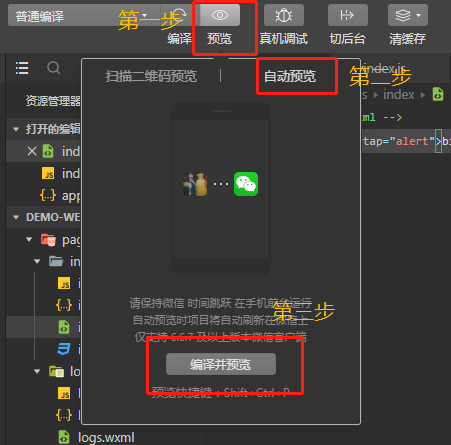

点击编译并预览后，登陆的微信账号即可预览我们的小程序项目，如果你修改了代码，记得手动点一次编译并预览按钮。

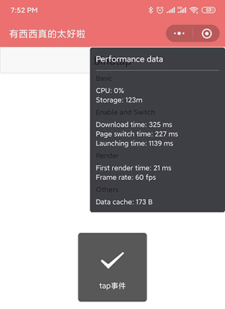

## 常见事件类型

注意，这里的`事件类型`均为`用户行为反馈事件`，相关说明直接引用官网，有个小规律，`小程序中所有事件名均为小写单词拼接，无驼峰拼接情况`，这点大家记住。

|      事件类型      |                           触发条件                           |
| :----------------: | :----------------------------------------------------------: |
|     touchstart     |                     手指触摸动作开始触发                     |
|     touchmove      |                      手指触摸后移动触发                      |
|    touchcancel     |             手指触摸动作被打断，如来电提醒，弹窗             |
|      touchend      |                       手指触摸动作结束                       |
|        tap         |                      手指触摸后马上离开                      |
|     longpress      | 手指触摸后，超过350ms再离开，如果指定了事件回调函数并触发了这个事件，tap事件将不被触发（与tap同时定义，优先级更高） |
|      longtap       |   手指触摸后，超过350ms再离开（推荐使用longpress事件代替）   |
|   transitionend    |  会在 WXSS transition 或 wx.createAnimation 动画结束后触发   |
|   animationstart   |            会在一个 WXSS animation 动画开始时触发            |
| animationiteration |          会在一个 WXSS animation 一次迭代结束时触发          |
|    animationend    |            会在一个 WXSS animation 动画完成时触发            |

现在，我们通过例子一一加深印象，还是使用上文提供的tap事件例子，JS代码不变，我们只需要切换事件名即可：

- `touchstart`事件

```html
<button bindtouchstart="alert">bindtap</button>
```


模拟器可能还不是很明显，大家如果通过手机预览可以发现，由于`button`组件按下去有个背景变灰的渐变，而`touchstart`事件即是手指触碰到组件的一瞬间方法就被执行，此时按钮还没完全按下去，大家多体验几次。

- `touchmove`事件

```html
<button bindtouchmove="alert">bindtap</button>
```

这个就非常明显了，手指按下按钮完全变灰后没执行，一定要我们按住手指并拖动才会触发。

- `touchcancel`事件

```html
<button bindtouchcancel="alert">bindtap</button>
```

这个我交大家怎么模拟，在手机上用**左手点击button组件不要放开**，用**右手点击小程序更多功能按钮**，此时会弹窗，由于触碰被打断，可以发现事件被顺利触发。

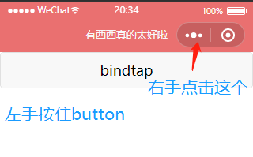

其次，左手按钮button，点击关闭小程序，也就是这个按钮，此时小程序会暂时退出并保存在手机后台中，通过后台直接再进入小程序，我们会发现`touchcancel`事件也会触发。

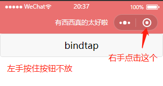

- `touchend`事件

```html
<button bindtouchend="alert">bindtap</button>
```

点击按钮，长按拖动都不会触发，直到手指离开屏幕便会触发。

- `tap`事件

```html
<button bindtap="alert">bindtap</button>
```

上文中给了例子，虽然官方说手指触碰后马上离开触发，事实证明我按住按钮十几秒后离开，也会触发，我默认理解为`click事件`。

- `longpress`事件

```html
<button bindlongpress="alert">bindtap</button>
```

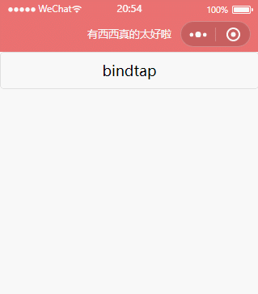

快速点击快速松开并不会触发该事件，只有点击超过350ms时才会触发。

- 与动画相关的API，由于涉及到了`小程序动画`，这里先通过官方动画例子展示API作用，动画怎么玩后面再做介绍（留个坑...）。

```html

<view class="box {{extraClasses}}"
  bindtransitionend="transitionEnd"
  bindanimationstart="animationStart"
  bindanimationiteration="animationIteration"
></view>

<button class="btn" bindtap="triggerTransition">触发CSS渐变</button>
<button class="btn" bindtap="triggerAnimation">触发CSS动画</button>
```

```css
.box {
  width: 100rpx;
  height: 100rpx;
  margin: 60rpx;
  background: red;
}
.btn {
  margin: 30rpx 60rpx 0;
}

.box-transition {
  transition: all 0.5s;
}
.box-moved {
  margin-left: 590rpx;
}

@keyframes box-ani {
  from {margin-left: 60rpx}
  to {margin-left: 590rpx}
}
.box-animation {
  animation: box-ani 1s alternate infinite;
}
```

```js
const app = getApp()

Page({
  data: {
    extraClasses: '',
  },
  triggerTransition: function () {
    if (this.data.extraClasses == 'box-transition box-moved') {
      this.setData({
        extraClasses: 'box-transition'
      })
    } else {
      this.setData({
        extraClasses: 'box-transition box-moved'
      })
    }
  },
  triggerAnimation: function () {
    this.setData({
      extraClasses: 'box-animation'
    })
  },
  transitionEnd: function () {
    console.log('渐变已结束')
  },
  animationStart: function () {
    console.log('动画已开始')
  },
  animationIteration: function () {
    console.log('动画进行中')
  },
  animationend:function () {
    console.log("动画结束")
  }
})
```

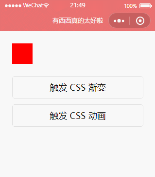

## 事件对象

在事件处理函数中，我们能接受到一个`event`对象参数，该参数包含了`当前事件类型`，以及`当前组件相关信息`，具体属性如下：

|      属性      |  类型   |                     说明                     |
| :------------: | :-----: | :------------------------------------------: |
|      type      | String  |              当前绑定的事件类型              |
|   timeStamp    | Integer |       页面打开到触发事件所经过的毫秒数       |
|     target     | Object  |        触发事件的组件的一些属性值集合        |
| currentTarget  | Object  |           当前组件的一些属性值集合           |
|     detail     | Object  |                  额外的信息                  |
|    touches     |  Array  | 触摸事件，当前停留在屏幕中的触摸点信息的数组 |
| changedTouches |  Array  |     触摸事件，当前变化的触摸点信息的数组     |

我们来看个例子：

```html
<button bindtap="alert" id="btn" data-name="听风是风" data-age="27">bindtap</button>
```

```js
Page({
  data: {},
  alert: function (event) {
    console.log(event);
  }
})
```

通过点击按钮任意区域，可以看到控制台输出如下数据：

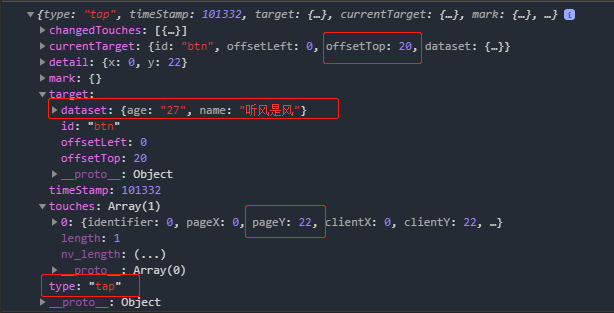

可以看到组件上自定义的`data-**`数据，组件X轴Y轴偏移量，鼠标点击时的坐标等等信息均有记录。

## 复习事件冒泡与理解小程序事件捕获/冒泡

我们知道，在J`avaScript事件监听`中，分为`捕获阶段--目标阶段--冒泡阶段`三个部分。考虑到有同学对于该部分知识有遗忘，这里做个简单补充。

我们先来看个JavaScript的例子：

```html
<div class="parent">
    父
    <div class="child">
        子
    </div>
</div>
```

```css
.parent{
    width: 200px;
    height: 200px;
    background-color: #bbded6;
}
.child{
    width: 100px;
    height: 100px;
    background-color: rgba(255,80,47,1);
}
```

```js
var parent = document.querySelector(".parent"),
    child = document.querySelector(".child");

parent.addEventListener("click", function () {
    console.log("A");
}, true);

parent.addEventListener("click", function () {
    console.log("B");
});

child.addEventListener("click", function () {
    console.log("D");
}, true);

child.addEventListener("click", function () {
    console.log("C");
}, false);
```


现在，让我们用鼠标点击红色区域，猜猜会一次输出什么呢？

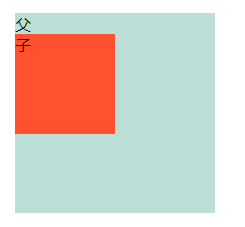

在说答案之前，我们先复习下`addEventListener`事件监听参数以及含义：

```javascript
element.addEventListener(event,function,useCapture)；
```

其中`event`与`function`为必填，`event表示事件类型`，`function为事件处理函数`，而`useCapture`为选填，它的`值为Boolean值`。用于`指定事件是否在捕获或者冒泡阶段执行`，`默认为false`，即在`冒泡阶段`执行，反之在`捕获阶段`执行。

而上文的例子中，我们用了一个父盒子包裹了一个子盒子，抛开根元素以及body，捕获与冒泡如下：

**捕获阶段：parent--child**

**冒泡阶段：child--parent**

再观察上述例子关于`useCapture`的值，所以答案是`ADCB`。

OK，花了点时间用于解释JS事件监听的冒泡概念。**小程序中事件同样存在捕获与冒泡阶段。**

比如我们前面所说的`bind`前缀就表示`事件在冒泡阶段执行`，而如果我们想事件在`捕获阶段`执行，可以在`bind`前面加上`capture`，即`capture-bind`表示`捕获阶段执行`。

**微信小程序中的捕获与冒泡执行与JS事件监听保持一致**，这里引用官方一张图解就一目了然了：

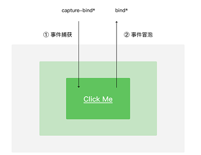

> **1、事件捕获**
> `捕获型事件`(event capturing)：事件从`最不精确的对象`(document 对象)`开始`触发，然后`到最精确`(也可以在窗口级别捕获事件，不过必须由开发人员特别指定)
>
> **2、事件冒泡**
> `冒泡型事件`：事件按照从`最特定的事件目标` `到最不特定的事件目标`(document对象)的顺序触发。
>
> **3、捕获和冒泡过程图**
>
> 
>
> `事件捕获`和`事件冒泡`属于两个`相反`的过程，这里可以有一个我感觉十分恰当的比喻，当你把一个可以漂浮在水面上的物品，使劲`向水里砸下去`，它会首先有一个下降的过程，这个过程就可以理解为从最顶层向事件发生的最具体元素（目标点）的`捕获过程`；之后由于浮力大于物体自身的重力，物体会在到`达最低点（ 最具体元素）之后漂浮到水面上`，这个过程`相对于事件捕获是一个回溯的过程`，即`事件冒泡`。
> 好了，对于事件捕获和事件冒泡有了一个概念上的理解，那我们就可以开始考虑实际的编码过程中的实际应用了。先贴上本文所需要的代码
>
> ```html
> <!DOCTYPE html>
> <html>
> <head>
>     <title>event</title>
> </head>
> <body>
>     <div id="obj1">
>         welcome
>         <h5 id="obj2">hello</h5>
>         <h5 id="obj3">world</h5>
>     </div>
>     <script type="text/javascript">
>         var obj1=document.getElementById('obj1');
>         var obj2=document.getElementById('obj2');
>         obj1.addEventListener('click',function(){
>             alert('hello');
>         },false);
>         obj2.addEventListener('click',function(){
>             alert('world');
>         })
>     </script>
> </body>
> </html>
> ```
>
> 如上所示，这是一个十分简单地文档结构：`document > html > body > div > h5`
> 并且分别在`obj1`,`obj2`上绑定了一个点击事件，由于`addEventListener`的第三个参数为`false`,所以页面是在`冒泡阶段`处理绑定事件。此时整个页面可以有三种行为出现
>
> 1. 点击文字`welcome`时，弹出`hello`。
>    此时就`只触发了绑定在obj1上的点击事件`。具体冒泡实现过程如下：`welcome` 属于`文本节点`，点击后，开始`从文本节点查找`，当前文本节点`没有绑定点击事件`，`继续向上`找，找到`父级`（id为obj1的div），`有`绑定的点击事件，`执行`，`再向上找`，`body`，`没有`绑定点击事件，再到`html`,`document`,`都没再有`绑定的点击事件，好，`整个冒泡过程结束`。
>
> 2. 点击文字`hello`时，`先弹出world`，`再弹出hello`。
>    具体冒泡的过程如下图所示
>
>    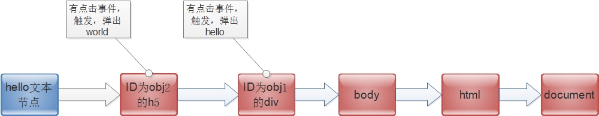
>
> 3. 点击world时，弹出hello。
>    具体冒泡过程和第二种情况类似，如下图
>
>    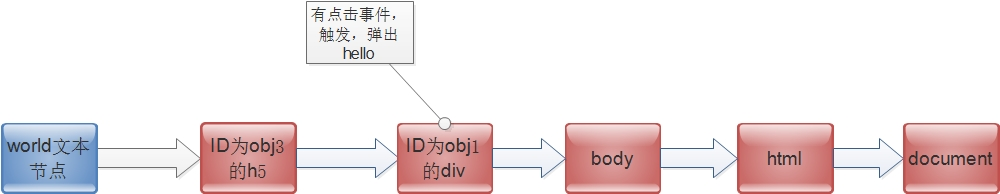
>
>    
>
> 理解了以上的内容，我们可以接着来讨论**`事件代理机制`。**
> 比如上面的代码，我们想要在点击每个h5标签时，弹出对应的innerHTML 。常规做法是遍历每个h5,然后在每个h5上绑定一个点击事件，这种做法在h5较少的时候可以使用，但如果有一万个h5，那就会导致性能降低。这时就需要事件代理出场了。
> 先贴代码
>
> ```js
> obj1.addEventListener('click',function(e){
>             var e=e||window.event;
>             if(e.target.nodeName.toLowerCase()=='h5'){
>                 alert(e.target.innerHTML);
>             }
> 
>         },false);
> ```
>
> 由于事件冒泡机制，点击了h5后会冒泡到div,此时就会触发绑定在div上的点击事件，再利用target找到事件实际发生的元素，就可以达到预期的效果。
>
> 
>
> **两种方式来阻止事件冒泡。**
> 方式一：`event.stopPropagation()`;
>
> ```js
> $("#div1").mousedown(function(event){
> event.stopPropagation();
> });
> ```
>
> 方式二：return false;
>
> ```js
> $("#div1").mousedown(function(event){
> return false;
> });
> ```
>
> 但是这两种方式是有区别的。`return false` 不仅阻止了事件往上冒泡，而且阻止了事件本身。`event.stopPropagation()` 则只阻止事件往上冒泡，不阻止事件本身。

```html
<view
  id="parent"
  bind:tap="tap1"
  capture-bind:tap="tap2"
>
  outer view
  <view
    id="child"
    bind:tap="tap3"
    capture-bind:tap="tap4"
  >
    inner view
  </view>
</view>
```

```css
#parent {
  display: block;
  background-color: #bbded6;
  color: #fff;
}
#child{
  background-color: rgba(255,80,47,1);
}
```

```js
Page({
  data: {},
  tap1: function (event) {
    console.log('tap1');
  },
  tap2: function (event) {
    console.log('tap2');
  },
  tap3: function (event) {
    console.log('tap3');
  },
  tap4: function (event) {
    console.log('tap4');
  },
})

```

当我们点击`inner view`区域，可以看到依次输出如下：

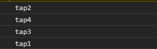

为了防止大家疑惑，这里我们先做个知识小结，首先我们前面说了事件支持`bind与bind:`两种写法，这两种写法`都不会阻止冒泡`，所以如果大家分别给`父子绑定`bind事件，点子区域，会先执行子的`bind`再执行父的`bind`，毕竟我们`没`使用`capture`定义`捕获阶段`，所以`全程就只有冒泡`。记住了，**bind不会阻止冒泡，添加capture前缀可以响应捕获阶段。**

那么问题来了，假设我们想**阻止冒泡**呢？这时候就得将`bind`替换为`catch`事件了，`catch`也支持两种写法`catch与catch:`，我们来试试下面这个例子：

```html
<view
  id="parent"
  catch:tap="tap1"
>
  outer view
  <view
    id="child"
    catch:tap="tap3"
  >
    inner view
  </view>
</view>
```

现在点击`inner view`区域，可以发现只输出了`tap3`，因为冒泡被阻止了。

那有同学又要问了，如果我在`catch`前添加`capture`前缀会怎么样？怎么样咱们修改例子试试不就知道了，看下方例子：

```html
<view
  id="parent"
  bind:tap="tap1"
  capture-catch:tap="tap2"
>
  outer view
  <view
    id="child"
    bind:tap="tap3"
    capture-catch:tap="tap4"
  >
    inner view
  </view>
</view>
```

我们将`capture-bind`都改为`capture-catch`，可以发现不管点击父区域还是子区域，都只会输出一个`tap2`，这是因为`capture-catch`会`中断捕获阶段和取消冒泡阶段`。所以不管点击哪，都是`从捕获阶段开始`，先捕获到父，然后中断捕获，也不会存在冒泡了，就这么个意思。

OK，来个小总结。

`bind`不会阻止冒泡，但如果想抓捕获阶段，可以添加前缀`capture`，也就是`capture-bind`。

`catch`会阻止冒泡，如果添加`capture`前缀，捕获阶段会中断的同时，也会阻止冒泡。

最后的最后，官方给了个贴心说明，除了上文中我们列举的`用户交互反馈事件`之外的其它`任意组件状态反馈事件`，`除非有特殊声明`，否则都是`非冒泡事件`。也就是说，上文给的用户交互反馈事件都是冒泡事件。

好了，关于小程序冒泡机制就聊到这。

> 总体来说，事件就是视图层到逻辑层的通讯方式。