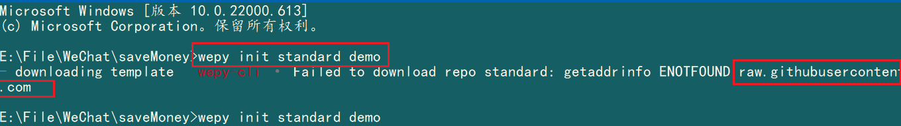
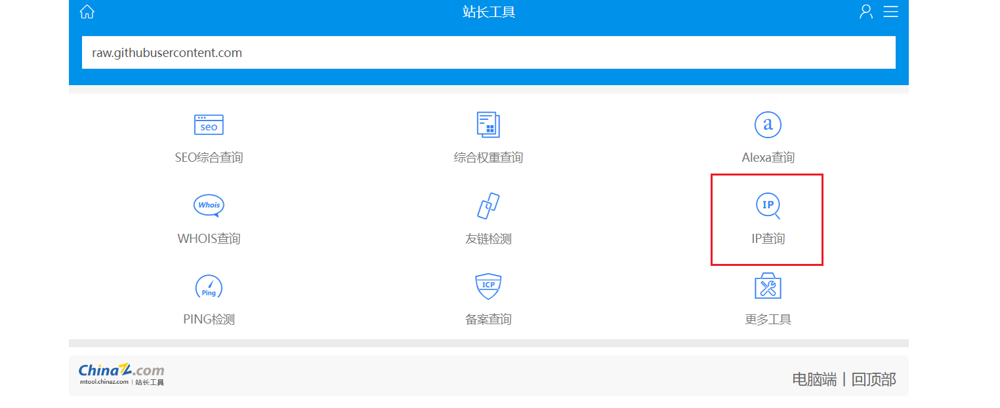
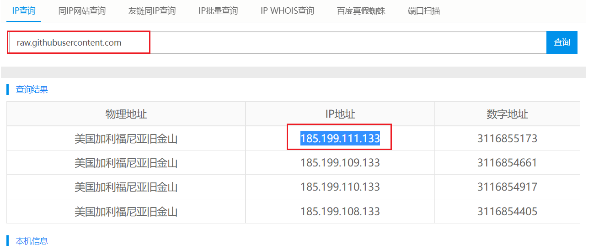
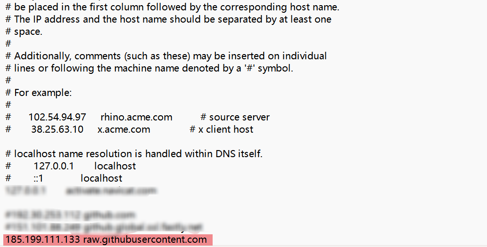
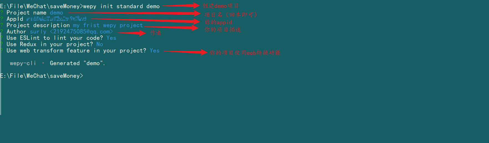
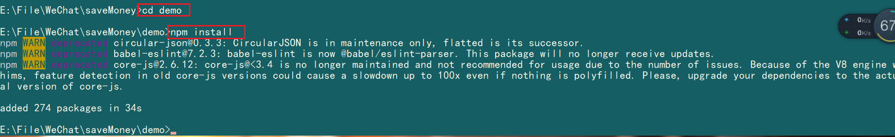

# 聚合WePY

[toc]

## 初始化报错



这个问题是因为“墙”的原因，需要添加代理，我是 Windows 系统的电脑，解决方法是：

1. 打开站长工具

   

   

2. 找到 `C:\Windows\System32\drivers\etc `的 `host `文件

   打开添加



## 安装配置



```sh
Project name demo  					// 项目名称
AppId              					//appid可以先不写，在小程序开发工具中设置
Project description A WePY project  // 创建wepy项目 ，一般默认
Author surly <2192475085@qq.com>    // 开发者名称
Use ESLint to lint your code? Yes
Use Redux in your project? No
Use web transform feature in your project? Yes
```

待项目创建成功后，可以在该文件夹下看到该项目工程的所有文件。但这是的项目只拥有一个框架，依旧是无法编译的，需要使用 `npm install` 命令安装项目依赖才行。

```sh
cd demo   //进入项目文件夹
npm install //安装项目依赖
```



> 注意：如果安装时没有报错，仅仅是警告非最新的版本，并不会影响代码的运行。

接下来，使用以下命令 "`wepy bulid --watch`" 来启动开发时监控代码改动自动构建功能。使用 `--watch `参数启动，会自动监控代码的改动，一旦代码有改动，保存后项目会重新构建。

```h
wepy bulid --watch
```

> ==运行该命令时，可能的报错处理：==
>
> ==报错1：==[WARNING] 未安装wepy-eslint，
>
> 执行`npm install wepy-eslint --save-dev` 或者在`wepy.config.js`中关闭`eslint`选项
>
> **解决办法：**按照提示，打开 `wepy.config.js` 文件，把 `eslint `属性设置为 `false`
>
> ==报错2：==[WARNING] 找不到编译器：wepy-compiler-less
>
> **解决办法：**分别运行下面的两条命令：`npm  install  less`、`npm  install  wepy-compiler-less`
>
> ```js
> npm install less
> npm install wepy-compiler-less
> ```
>
> ==报错3:==[Error] 找不到组件：wepy-com-toast
>
> **解决办法：**运行下面的命令：`npm install wepy-com-toast --save`
>
> ```sh
> npm install wepy-com-toast --save
> ```
>
> ==报错4：==[Error] ReferenceError: Unknown plugin "transform-class-properties" specified in "base" at 0, attempted to resolve relative to
>
> **解决办法：**运行下面的命令：npm install babel-plugin-transform-class-properties babel-plugin-transform-decorators-legacy babel-plugin-transform-export-extensions babel-plugin-transform-object-rest-spread babel-preset-env --save-dev
>
> ```sh
> npm install babel-plugin-transform-class-properties babel-plugin-transform-decorators-legacy babel-plugin-transform-export-extensions babel-plugin-transform-object-rest-spread babel-preset-env --save-dev
> ```
>
> ==上述命令 `wepy bulid --watch` 运行成功后，会在项目文件夹中生成一个 `dist` 文件夹，用于存放编译后的项目文件（这个文件夹中存放的是小程序代码）==

打开微信开发者工具，导入刚刚由 `WePY` 生成的 `dist `文件夹。项目启动后，调试器会出现`报错`信息，这主要是 `WePY `项目和原生小程序对于代码的不同处理方式造成的。

**解决办法：**打开**微信开发工具 -> 详情 -> 本地配置**，取消下面三项的勾选

1. ES6转ES5          
2. 上传代码时样式自动补全          
3. 上传代码时自动压缩混淆

这样一个完整的小程序 WePY 项目就创建完成了


