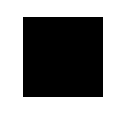

## path元素的能力

`path`元素是SVG基本形状中最强大的一个，它不仅能创建其他`基本形状`，还能创建`更多其他形状`。

比如`矩形`（直角矩形或者圆角矩形）、`圆形`、`椭圆`、`折线形`、`多边形`等。

更重要的是能够绘制一些`曲线`，如`贝塞尔曲线`、`二次曲线`等。

> `path`元素的`形状`是通过属性`d`来定义的，`d`属性通过“`命令和坐标`”的`序列`来控制`整个path绘制的路径`

### path的坐标命令

先采用总分的形式吧。

> - M = moveto
> - L = lineto
> - H = horizontal lineto
> - V = vertical lineto
> - C = curveto
> - S = smooth curveto
> - Q = quadratic Bézier curve
> - T = smooth quadratic Bézier curveto
> - A = elliptical Arc
> - Z = closepath

然后一个个来介绍主要分为直线命令和曲线命令

### 直线命令

直线命令主要有以下几种：

- `M`（moveto）：需要两个参数（`x轴`和`y轴`  `坐标`，`移动到的点`的x轴和y轴的坐标
- `L`（lineto）：需要两个参数（`x轴`和`y轴` `坐标`），它会在`当前位置`和`最新的位置`（`L前`面画笔所在的点）之间`画一条线段`。
- `H`（horizontal lineto）：一个参数，标明在`x轴移动到的位置，绘制水平线`
- `V`（vertical lineto）：一个参数，标明在`y轴移动到的位置，绘制垂直线`
- `Z`（ closepath）：从`当前点`画一条`直线`到`路径的起点`

**示例：**

==画一个正方形==

```html
<svg width="100px" height="100px" version="1.1" xmlns="http://www.w3.org/2000/svg">
  <path d="M10 10 H 90 V 90 H 10 L 10 10"/>
</svg>
```

**效果：**





**代码解析：**

首先定义了一个100x100的画布（坐标系），用M命令在（10，10）创建起点，通过H命令在水平方向移动到x轴为90的位置，y轴不变，也就是移动到（90， 10），再通过V命令移动到y轴为90的位置，x轴不变，也就是坐标为（90，90）的位置，再通过H命令在水平方向移动到x轴为10的位置，y轴不变，此刻的位置为（10，90），最后使用L命令在起点（10，10）的位置与上次的点（10，90）画一条直线，那么四条边就画完了。


> 地址
>
> [【SVG】SVG的夺命利器——path - 知乎 (zhihu.com)](https://zhuanlan.zhihu.com/p/432284368)