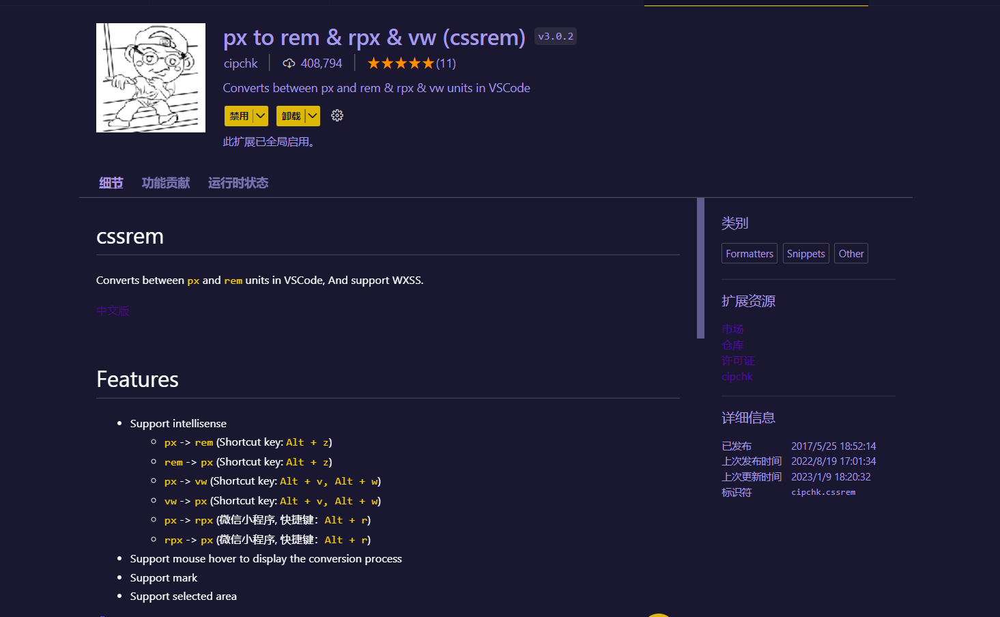

---

---

# 移动端的布局

## 常见的移动端的适配方案

1. 百分比 + 固定高度的布局方案
2. 少许的媒体查询设置字体
3. flex布局方案(弹性盒子布局)     <font>(常用移动端布局，客户端会出现兼容性问题)</font>
4. rem布局的方案

## flex布局方案

### flex容器和项目的概述

Flex是Flexible Box的缩写，意为`弹性布局`，用来为盒状模型提供最大的灵活性。

==任何一个容器都可以指定为Flex布局。==

```css
.box{
  display: flex;
}
```

行内元素也可以使用Flex布局。

```css
.box{
  display: inline-flex;
}
```

Webkit内核的浏览器，必须加上-webkit前缀。

```css
.box{
  display: -webkit-flex; /* Safari */
  display: flex;
}
```

#### 基本概念

采用Flex布局的元素，称为`Flex容器`（flex container），简称”`容器`”。它的`所有子元素`自动成为容器成员，称为`Flex项目`（flex item），简称”`项目`”。


容器默认存在两根轴：水平的`主轴`（main axis）和垂直的`交叉轴`（cross axis）。主轴的开始位置（与边框的交叉点）叫做main start，结束位置叫做main end；交叉轴的开始位置叫做cross start，结束位置叫做cross end。

项目默认沿主轴排列。单个项目占据的`主轴空间`叫做main size，占据的`交叉轴空间`叫做cross size。

### flex==容器==的属性的讲解

```web-idl


        flex-direction
        flex-wrap
        flex-flow
        justify-content
        align-items
        align-content


```


#### ==display：flex==

告诉容器我们要使用flex布局

<font>若要使用flex布局，容器样式里一定要加该属性，否者所有的flex的布局设计会失效</font>

#### ==flex-direction==

决定容器的排列方式

1. row（主轴从左到右排列）--->默认

   

2. row-reverse：主轴为水平方向，起点在右端。

   

3. column（主轴从上到下对项目排列）

   

4. column-reverse：主轴为垂直方向，起点在下沿。

   

#### ==flex-warp==

决定项目是否换行（项目排列不下时）

1. nowrap（不换行，默认）

   

2. warp（换行）

   

3. warp-reverse(换行反转)

   

#### ==flex-flow== 

flex-direction和flex-warp的缩写方式

```css
/* 默认值为row nowrap。 */
.box {
  flex-flow: <flex-direction> <flex-wrap>;
}


```


#### ==justify-content==

项目在==主轴上==的对齐方式

1. flex-start   (默认)左对齐

   

2. flex-end    右对齐

   

3. center       居中

   

4. space-between      两端对齐，项目之间的间隔都相等。

   

5. space-around        每个项目两侧的间隔相等。所以，项目之间的间隔比项目与边框的间隔大一 倍。

   

#### ==algin-items==

项目在==交叉轴==上的对齐方式

1. flex-start    交叉轴的起点对齐。

   

2. flex-end      交叉轴的终点对齐。

   

3. center         交叉轴的中点对齐。

   

4. baseline     项目的第一行文字的基线对齐。

   

5. stretch     （默认值）如果项目未设置高度或设为auto，将占满整个容器的高度。

   

#### ==align-content==

定义了`多根轴线`的对齐方式。如果项目只有一根轴线，该属性不起作用。

1. flex-start      与交叉轴的起点对齐。

   

2. flex-end      与交叉轴的终点对齐。

   

3. center      与交叉轴的中点对齐。

   

4. space-between      与交叉轴两端对齐，轴线之间的间隔平均分布。

   

5. space-around      每根轴线两侧的间隔都相等。所以，轴线之间的间隔比轴线与边框的间隔大一倍。

   

6. stretch（默认值）      轴线占满整个交叉轴。

   

### flex==项目==的属性的讲解

```tex

/*以下6个属性设置在项目上。*/
        order
        flex-grow
        flex-shrink
        flex-basis
        flex
        align-self


```

#### ==order==

定义项目的排列顺序。数值越小，排列越靠前，默认为0。


#### ==flex-grow==

1. 定义项目的放大比例，`默认为0`，即如果存在剩余空间，也不放大。

2. 如果所有项目的flex-grow属性都为1，则它们将等分`剩余空间`（如果有的话）。

   

3. 如果一个项目的flex-grow属性为2，其他项目都为1，则前者占据的剩余空间将比其他项多一倍。

#### ==flex-shrink==

1. 定义了项目的缩小比例，`默认为1`，即如果`空间不足`，该项目将缩小。

2. 如果所有项目的flex-shrink属性都为1，当`空间不足`时，都将等比例缩小

3. 如果一个项目的flex-shrink属性为`0`，其他项目都为1，则`空间不足`时，前者`不缩小`。

   

4. 负值对该属性无效。


#### ==flex-basis==

1. 定义了在分配多余空间之前，项目占据的主轴空间（main size）。浏览器根据这个属性，计算主轴是否有多余空间。它的`默认值为auto`，即项目的本来大小。

#### ==flex==

1. 是`flex-grow`, `flex-shrink` 和 `flex-basis`的简写，`默认值为0 1 auto`。后两个属性可选。

   ```
   .item {
     flex: none | [ <'flex-grow'> <'flex-shrink'>? || <'flex-basis'> ]
   }
   ```

   

2. 该属性有两个快捷值：`auto` (1 1 auto) 和 `none `(0 0 auto)。

<span alt="wavy">建议优先使用这个属性，而不是单独写三个分离的属性，因为浏览器会推算相关值。</span>

#### ==align-self==

1. 允许单个项目有与其他项目不一样的对齐方式

   

2. 可覆盖align-items属性

3. `默认值为auto`，表示继承父元素的align-items属性，如果没有父元素，则等同于stretch。

4. 该属性能取6个值，`除了auto`，其他都与`align-items`属性完全一致。

   ```css
   .item {
     align-self: auto | flex-start | flex-end | center | baseline | stretch;
   }
   ```

   

## rem布局

rem是css3新增的一个长度单位，之前已知的em表示的是一个字体的大小，而rem是根元素（`<html>`标签）的字体大小，在网页中也就是设置html的字体的大小

```css
html{
    font-size:16px
}
/*  1rem=1*16px=16px;  */
/*  2rem=2*16px=32px;  */

```

可以设置元素的高度直接用rem，然后根据不同的屏幕的大小设置不同的html字体的大小，来实现自动适配屏幕的目的。

### px转rem的方式

1. vs code插件转换

   

2. flexible方案

### 案例代码

```js
// rem等比适配配置文件
// 基准大小
const baseSize = 16;
// 设置 rem 函数
function setRem() {
    // 当前页面宽度相对于 1920宽的缩放比例，可根据自己需要修改。
    const scale = document.documentElement.clientWidth / 1920;
    // 设置页面根节点字体大小（“Math.min(scale, 2)” 指最高放大比例为2，可根据实际业务需求调整）
    document.documentElement.style.fontSize = baseSize * Math.min(scale, 2) + 'px';
}
// 初始化
setRem();
// 改变浏览器窗口大小时重新设置 rem
window.onresize = function () {
    setRem();
};
```


