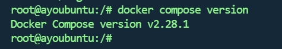

> 官网说明地址：https://docs.docker.com/compose/install/linux/
>
> https://juejin.cn/post/7091094985835020319

# Docker-Compose

## Docker-Compose 简介

Docker-Compose 项目是Docker官方的开源项目，负责实现对Docker容器集群的快速编排。

Docker-Compose 项目由 Python 编写，调用 Docker 服务提供的API来对容器进行管理。因此，只要所操作的平台支持 Docker API，就可以在其上利用Compose 来进行编排管理。

Docker Compose通过一个单独的`docker-compose.yml`模板文件(`YAML格式`)来定义**`一组`相关联的应用容器**，帮助我们实现`多个相互关联的Docker容器的快速部署`。

## 安装

检查是否安装

```shell
docker compose version
```

安装

```shell
sudo apt-get install docker-compose-plugin
```




## 参考截图


## 文件结构

### 文件示例

`docker-compose.yml`示例:

```yaml
version: "3"
services:
  redis:
    image: redis:alpine
    ports:
      - "6379"
    networks:
      - frontend
    deploy:
      replicas: 2
      update_config:
        parallelism: 2
        delay: 10s
      restart_policy:
        condition: on-failure
  db:
    image: postgres:9.4
    volumes:
      - db-data:/var/lib/postgresql/data
    networks:
      - backend
    deploy:
      placement:
        constraints: [node.role == manager]
  vote:
    image: dockersamples/examplevotingapp_vote:before
    ports:
      - 5000:80
    networks:
      - frontend
    depends_on:
      - redis
    deploy:
      replicas: 2
      update_config:
        parallelism: 2
      restart_policy:
        condition: on-failure
  result:
    image: dockersamples/examplevotingapp_result:before
    ports:
      - 5001:80
    networks:
      - backend
    depends_on:
      - db
    deploy:
      replicas: 1
      update_config:
        parallelism: 2
        delay: 10s
      restart_policy:
        condition: on-failure
  worker:
    image: dockersamples/examplevotingapp_worker
    networks:
      - frontend
      - backend
    deploy:
      mode: replicated
      replicas: 1
      labels: [APP=VOTING]
      restart_policy:
        condition: on-failure
        delay: 10s
        max_attempts: 3
        window: 120s
      placement:
        constraints: [node.role == manager]
  visualizer:
    image: dockersamples/visualizer:stable
    ports:
      - "8080:8080"
    stop_grace_period: 1m30s
    volumes:
      - "/var/run/docker.sock:/var/run/docker.sock"
    deploy:
      placement:
        constraints: [node.role == manager]

networks:
  frontend:
  backend:

volumes:
  db-data:
```

文件配置解释说明：

### 文件简介

> Docker Compose 使用 YAML 文件来定义服务。官方推荐的默认文件名为 compose.yml ，
>
> 但同时也支持 **docker-compose.yml。**
>
> 由于一个 compose 文件中定义的为一个项目的所有服务，所以一般为在创建 compose
>
> 文件之前先新建一个目录，目录名称一般为项目名称，然后再将项目所需的所有镜像、微服
>
> 务的 Dockerfile 放入该目录，并在该目录中新建 compose 文件。
>
> compose 文件中包含 6 个顶级属性：**version、services、networks、volumes、configs 与secrets**，及很多的它们下面所包含的属性。下面简单介绍一下常用的属性。

### version

> version 是一个顶级属性，但**已经过时**，不再需要在 compose 文件中出现了。

### serivces

> services 是一个顶级属性，用于定义一个应用中所包含的服务。Docker Compose 会将每
>
> 个服务部署在各自的容器中。其下包含的第一级的属性即为服务名称，这个名称可以根据服
>
> 务内容随意命名。而在服务名称下还可包含很多的属性，常用属性如下：
>
>  

#### **（1） build**

> 用于指定一个 Dockerfile 的路径。而该 Dockerfile 则是用于创建当前服务镜像的。这个
>
> 路径可以是以斜杠(/)开头的绝对路径，也可以是相对于当前 compose 文件的、以点(.)号开头
>
> 的相对路径。
>
> 如果 Dockerfile 文件名不是默认名称，则需要通过 build 下的 context 属性指定路径，
>
> dockerfile 属性指定文件名。

例如，

```
build:
 context: ./
 dockerfile: myDockerfile
```

#### **（2） image**

> 用户指定当前服务所需要使用的镜像，这个镜像可以是本地镜像，也可以是远程镜像仓
>
> 库中的镜像(会自动 pull)。
>
> 如果设置了 build，此时再设置的 image 属性即为构建出的镜像的名称与 Tag。

#### **（3） container_name**

> 该属性用于设置容器名称，但并不是必须的。如果没有设置该属性，容器名称则会采用
>
> “合成方式”。而合成时需要用到 services 下的第一级属性。
>
> 在 services 下存在一级属性，称为服务名称。该级属性是作为 services 下的第一级属性
>
> 出现的。服务名称将来会作为容器名称的一部分出现。容器的名称格式为：当前 compose
>
> 文件所在目录名_ 服务名称。
>
> 如果在 services 下没有指定 image 属性，而是使用 bild 属性，即没有现成的镜像，而是
>
> 根据 build 下指定的 Dockerfile 生成镜像，此时生成的镜像名称格式为：当前 compose 文件
>
> 所在目录名-服务名称。

#### **（4） ports**

> 一个列表。前面为暴露出的端口号，后面为容器中应用的端口号。如果仅设置了一个端
>
> 口号，那么这个端口号是容器中应用的端口号，其暴露到宿主机的端口号会被随机分配。

```
ports:
 - 80:80 # 绑定容器的 80 端口到主机的 80 端口
 - 9000:80 # 绑定容器的 80 端口到主机的 9000 端口
 - 443 # 绑定容器的 443 端口到主机的任意端口，容器启动时随机分配绑定的主机端口号
```

#### **（5） command**

> 用于覆盖 Dockerfile 中的 CMD 指令内容，即启动该服务容器后立即运行的命令。如果
>
> 直接按照Dockerfile中的CMD指令内容执行即可，则compose文件中无需该command属性。

#### **（6） depends_on**

> 一个列表。用于指定当前服务的启动所依赖的应用名称。即列表中指定的服务会先于当
>
> 前服务启动。

#### **（7） deploy**

> 用于指定当前服务容器的部署设置。其下有一个常用属性 replicas，用于指定该服务启
>
> 动的容器的数量。即实现一个服务多个容器。一旦指定了 deploy:replicas，就不能再指定
>
> container_name 属性了。因为各个启动的容器名称不能相同，而只能由系统自动生成。

```
services:
 frontend:
 image: awesome/webapp
 deploy:
 mode: replicated
 replicas: 6
```

#### **（8） networks**

> 用于指定当前服务容器要连接到的网络。该网络必须是已经存在的，或通过顶级属性
>
> networks 创建的网络。

#### **（9） volumes**

> 用于指定当前服务容器所使用到的所有 volume。这些 volume 可以使用路径与卷标两种方式。
>
> 例如，下面是路径方式，非常直观，易于查看，但需要管理本地路径。

```
db:
 image: mariadb:latest
 ports:
 - "3306:3306"
 volumes:
 - /etc/mysql:/var/lib/mysql
```

> 再如，下面是卷标方式，backend 与 backup 两个服务共享了 db-data 的卷，逻辑简洁明
>
> 了，且无需管理本地路径。但具体卷标所代表的是 Docker 主机的哪个路径，并不能直观的
>
> 看到。需要通过 docker volume inspect [卷标]来查看。

```
services:
 backend:
 image: awesome/database
 volumes:
 - db-data:/etc/data
 backup:
 image: backup-service
 volumes:
 - db-data:/var/lib/backup/data
volumes:
 db-data:
```

### networks

> networks 作为一个顶级属性，用于定义和创建应用中所使用到的所有网络。其下包含的
>
> 第一级属性即为网络名称，这个网络名称可以随意命名。而在网络名称下还可包含很多的属
>
> 性，常用属性如下：

```
services:
  app:
    networks:
     - app_bridge: #这里使用的并不是网络名称
networks:
  app_bridge:
    name: appBGnet # 这才是网络名称
    driver: bridge
```

#### **（1） name**

> networks 下的第一级属性—网络名称，并不是真正的网络名称，而仅仅是网络名称的一
>
> 部分。在真正生成网络后，其真正的网络名称格式为：当前 compose 文件所在目录名_
>
> networks 下的第一级属性。
>
> 但如果设置了name属性，则网络名称即为这里指定的名称，不会出现名称再合成情况。

#### **（2） driver**

> 用于指定网络驱动，缺省驱动为 Bridge。

#### **（3） attachable**

> 如果该属性设置为 true，则除了当前 compose 中定义的服务外，其它独立容器也可以
>
> 连接到此网络，并能与该网络中的服务及也连接到该网络的其它独立容器通信。缺省状态为
>
> false。

### volumes

> volumes 作为一个顶级属性，用于定义和创建应用中所使用到的所有 volume。其下包含
>
> 的第一级属性即为 volume 的卷标，这个卷标可以随意命名。这个卷标所代表的是当前Docker主机中的目录，至于该目录的具体位置，是由系统自动分配的。
>
> 在网络名称下还可包含很多的属性，但这些属性并不常用，所以这里不进行介绍了。

## docker-compose命令格式


## 演示

准备好对应的文件


镜像


### Dockerfile

```dockerfile
# 1、第一行必须指定 基础镜像信息
FROM jdk17
 
# 2、维护者信息
LABEL maintainer="空耳 <2192475085@qq.com>"

#设定时区
ENV TZ=Asia/Shanghai

# 切换到 root 用户，并设置时区
USER root
# 设置时区
RUN ln -snf /usr/share/zoneinfo/$TZ /etc/localtime && echo $TZ > /etc/timezone


# 拷贝主机上的 JAR 文件到容器中
COPY ayo-blog.jar app.jar
# 定义入口点
ENTRYPOINT ["java", "-jar", "app.jar"]

#拷贝jar包
#COPY ayo-blog.jar /app.jar

#入口
#ENTRYPOINT ["java","-jar","/app.jar"]
```

### docker-compose.yml

```yaml
name: blog-compose
#docker compose -p blog-compose ps => 查看启动状态
services:
  blog_mysql:
    #使用镜像 mysql:8.0.35
    image: mysql:8.0.35
    container_name: mysql
    ports:
      - "3306:3306"
    environment:
      TZ: Asia/Shanghai
      MYSQL_ROOT_PASSWORD: 123456
    volumes:
      - "/home/docker_volume/mysql/data:/var/lib/mysql"
      - "/home/docker_volume/mysql/init:/docker-entrypoint-initdb.d"
      - "/home/docker_volume/mysql/conf:/etc/mysql/conf.d"
    networks:
      - blog_networks
  blog_server:
    # 设置镜像名称为 "blog"
    image: blog  
    build:
      # 设置 Dockerfile 所在的路径
      context: /home/docker_volume/servers/blog
      # 指定 Dockerfile 的文件名
      dockerfile: Dockerfile
    #容器名  
    container_name: blog
    volumes:
      - "/home/docker_volume/nginx/html/upload:/upload"
    ports:
      - "8081:8081"
    networks:
      - blog_networks
    depends_on:
      - blog_mysql
  blog_nginx:
    image: nginx:1.26.1
    container_name: nginx
    ports:
      - "80:80"
      - "81:81"
    volumes:
      - "/home/docker_volume/nginx/conf/nginx.conf:/etc/nginx/nginx.conf"
      - "/home/docker_volume/nginx/html:/usr/share/nginx/html"
      - "/home/docker_volume/nginx/conf/conf.d:/etc/nginx/conf.d"
      - "/home/docker_volume/nginx/logs:/var/log/nginx"
      - "/home/docker_volume/nginx/logs/run:/var/run"
    networks:
      - blog_networks
    depends_on:
      - blog_server
networks:
  blog_networks:
    name: net-blog
```

### 准备好对应的文件夹目录

```shell
###########################nginx挂载准备目录
cd /home			# 进入/home目录
mkdir docker_volume	# 一个统一的docker挂载的目录
cd docker_volume	# 进入/home/docker_volume目录
mkdir nginx	# 创建用于挂载所有nginx配置文件的目录
cd nginx
mkdir html conf logs #创建三个文件夹
###########################mysql挂载准备目录
cd /home/docker_volume	# 进入/home/docker_volume目录
mkdir mysql	# 创建用于挂载所有mysql配置文件的目录
cd mysql
mkdir data init conf #创建三个文件夹
```

### 开始执行

首先查看基本信息


```shell
#启动相应的容器
docker compose -f "指定docker-compose.yml所在路径" -p 项目名称 up -d

#若当前所在路径就是docker-compose.yml所在路径 则可不写 => -f "指定docker-compose.yml所在路径"

#docker compose -f "/root/docker-compose.yml" -p blog-compose up -d
#docker compose up -d


#移除相应的容器
docker compose -f "指定docker-compose.yml所在路径" -p 项目名称 down

#docker compose -f "/root/docker-compose.yml" down -d
#docker compose -f /root/docker-compose.yml rm blog_mysql blog_server blog_nginx


#如果你希望同时删除与服务相关的卷，可以使用：
docker compose down -v
```


