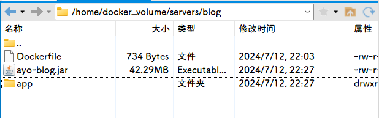
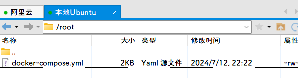

目录结构如下





## DockerFile

```dockerfile
# 1、第一行必须指定 基础镜像信息
FROM jdk17
 
# 2、维护者信息
LABEL maintainer="空耳 <2192475085@qq.com>"

#设定时区
ENV TZ=Asia/Shanghai

# 切换到 root 用户，并设置时区
USER root
# 设置时区
RUN ln -snf /usr/share/zoneinfo/$TZ /etc/localtime && echo $TZ > /etc/timezone

# 设置工作目录为根目录
WORKDIR /

# 创建 app 和 upload 目录
RUN mkdir /app /upload

# 拷贝主机上的 JAR 文件到容器中
COPY ayo-blog.jar /app/app.jar

# 定义入口点
ENTRYPOINT ["java", "-jar", "/app/app.jar"]
```


## docker-compose.yaml

```yaml
name: blog-compose
#docker compose -p blog-compose ps => 查看启动状态
services:
  blog_mysql:
    #使用镜像 mysql:8.0.35
    image: mysql:8.0.35
    container_name: mysql
    ports:
      - "3306:3306"
    environment:
      TZ: Asia/Shanghai
      MYSQL_ROOT_PASSWORD: 123456
    volumes:
      - "/home/docker_volume/mysql/data:/var/lib/mysql"
      - "/home/docker_volume/mysql/init:/docker-entrypoint-initdb.d"
      - "/home/docker_volume/mysql/conf:/etc/mysql/conf.d"
    networks:
      - blog_networks
  blog_server:
    # 设置镜像名称为 "blog"
    image: blog
    build:
      # 设置 Dockerfile 所在的路径
      context: /home/docker_volume/servers/blog
      # 指定 Dockerfile 的文件名
      dockerfile: Dockerfile
    #容器名
    container_name: blog
    volumes:
      - "/home/docker_volume/nginx/html/upload:/upload"
      - "/home/docker_volume/servers/blog/app:/app"
    ports:
      - "8081:8081"
    networks:
      - blog_networks
    depends_on:
      - blog_mysql
  blog_nginx:
    image: nginx:1.26.1
    container_name: nginx
    ports:
      - "80:80"
      - "81:81"
    volumes:
      - "/home/docker_volume/nginx/conf/nginx.conf:/etc/nginx/nginx.conf"
      - "/home/docker_volume/nginx/html:/usr/share/nginx/html"
      - "/home/docker_volume/nginx/conf/conf.d:/etc/nginx/conf.d"
      - "/home/docker_volume/nginx/logs:/var/log/nginx"
      - "/home/docker_volume/nginx/logs/run:/var/run"
    networks:
      - blog_networks
    depends_on:
      - blog_server
networks:
  blog_networks:
    name: net-blog
```

## 构建

进入/root

```shell
cd /root
```

构建

```shell
docker compose up -d
```

这个时候你会发现blog容器是启动不了的，结果如下

```shell
root@ayoubuntu:~# docker logs blog
Error: Unable to access jarfile /app/app.jar
```

- 在 Dockerfile 中使用 `COPY` 指令将文件复制到镜像中时，这些文件会成为镜像的一部分，被写入到镜像的文件系统中的特定路径下。
- 如果后续在运行容器时使用了挂载卷，并且挂载卷覆盖了镜像中已有的路径，那么容器运行时将使用挂载卷中的内容，而不是镜像中的内容。

而这里挂载卷的`/home/docker_volume/servers/blog/app`是没有东西的，所以覆盖的容器内的`/app`路径也是没有东西的

这时我们需要手动将`/home/docker_volume/servers/blog/ayo-blog.jar`下的文件复制到`/home/docker_volume/servers/blog/app/app.jar`

```shell
mkdir -p /home/docker_volume/servers/blog/app  # 确保目标目录存在

#将 /home/docker_volume/servers/blog/ayo-blog.jar
#文件复制到 
#/home/docker_volume/servers/blog/app/app.jar。
cp /home/docker_volume/servers/blog/ayo-blog.jar /home/docker_volume/servers/blog/app/app.jar
```

重启容器即可

```shell
docker restart blog
```

