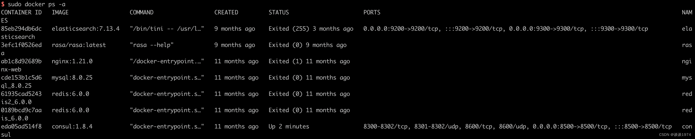
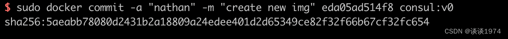
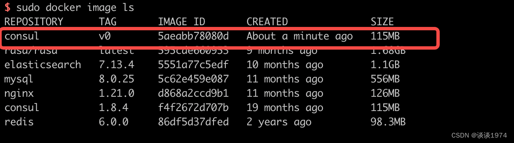
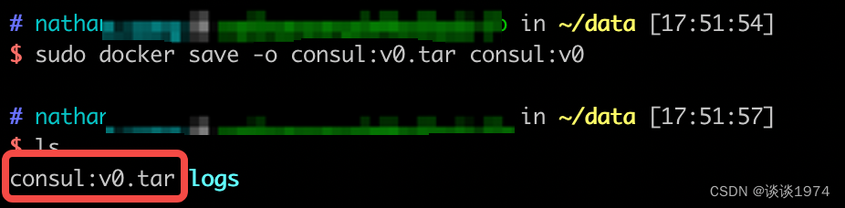
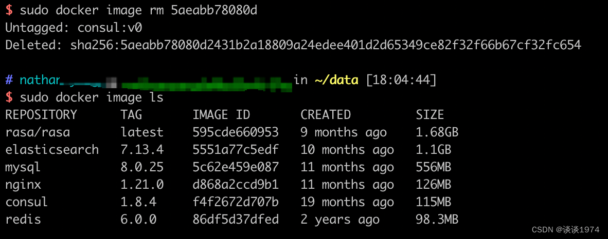
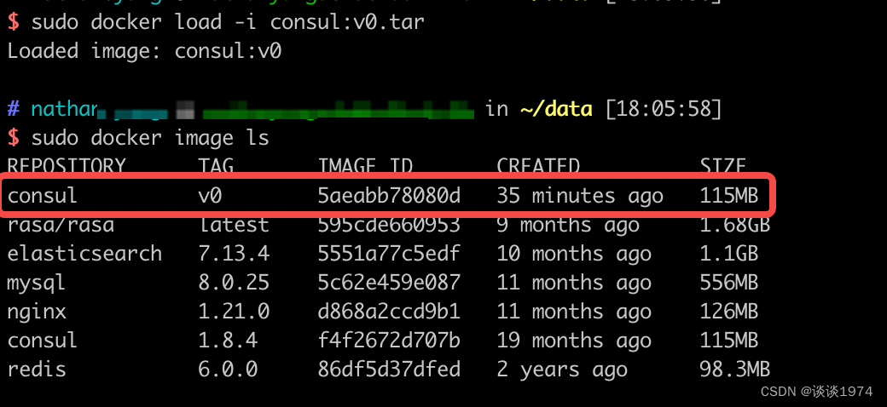

## 1. 容器打成镜像

Docker 提供了 `commit` 命令支持将容器重新打成镜像文件，其命令格式如下所示

```sh
 docker commit [OPTIONS] CONTAINER [REPOSITORY[:TAG]]
```

命令中的选项 `[OPTIONS]` 有如下候选：

| Option | 功能                           |
| ------ | ------------------------------ |
| -a     | 指定新镜像作者                 |
| -c     | 使用 Dockerfile 指令来创建镜像 |
| -m     | 提交生成镜像的说明信息         |
| -p     | 在 commit 时，将容器暂停       |

#### 过程示例

执行

```sh
sudo docker ps -a
```

 查看本机上的所有容器，此处笔者选择运行中的`consul` 容器 `eda05ad514f8` 为例子


执行

```sh
sudo docker commit -a "nathan" -m "create new img" eda05ad514f8 consul:v0

#docker commit -a "shanju" -m "山居Jenkins案例版" jenkins jenkins:shanju-test
```

 命令以容器为基础生成新的镜像 `consul:v0`，镜像 `id` 为 `5aeabb78080d2431b2a18809a24edee401d2d65349ce82f32f66b67cf32fc654`


执行

```sh
sudo docker image ls
```

 命令查看本机上的 Docker 镜像，可以看到已经成功制作镜像 consul:v0


## 2. 镜像打包

镜像文件经常有在服务器之间传输的需求，为此 Docker 提供了镜像打包和镜像加载的命令。

> 服务器间文件的传输可以借助 nc 工具，有兴趣的读者可参考 [nc 文件传输](https://blog.csdn.net/weixin_45505313/article/details/126347119#33__73)

#### 2.1 镜像打包为 tar 文件

Docker 的 `save` 命令可将镜像打包成 tar 文件，其格式如下

> OPTIONS 选项只有 `-o` 用于指定输出到的文件

```javascript
docker save [OPTIONS] IMAGE [IMAGE...]
```

##### 示例使用

```sh
sudo docker save -o consul:v0.tar consul:v0
```

命令执行完成后在当前目录下生成了 tar 文件



#### 2.2 从 tar 文件载入镜像

Docker 的 `load` 命令可从 tar 文件载入镜像，其命令格式如下

> OPTIONS 选项可选
>
> 1. `-i` 用于指定载入的镜像文件
> 2. `-q` 精简输出信息

```sh
docker load [OPTIONS]
```

##### 示例使用

由于笔者所有操作都是在同一台机器上，所以先执行 

```sh
sudo docker image rm 5aeabb78080d
```

 删除之前的镜像


执行

```sh
sudo docker load -i consul:v0.tar
```

 重新载入镜像

