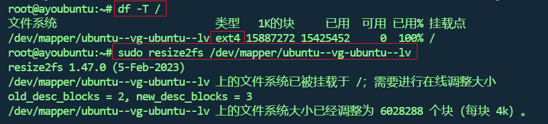
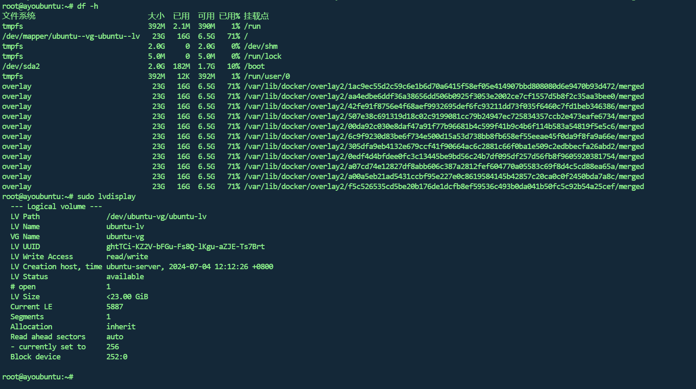

## 问题

嗯，下载一个镜像文件，导致绝大部分容器不能用

```sh
docker ps
```

结果如下

```sh
root@ayoubuntu:~# docker ps
CONTAINER ID   IMAGE                                                COMMAND                   CREATED       STATUS                          PORTS                                                                                                                             NAMES
7989605fd9e5   mongo:4.4.29                                         "docker-entrypoint.s…"   6 days ago    Restarting (14) 2 seconds ago                                                                                                                                     mongo
e9e0bafda39d   rocketmq-dashboard:1.0.0                             "sh -c 'java $JAVA_O…"   10 days ago   Up 3 minutes                    0.0.0.0:8808->8080/tcp, [::]:8808->8080/tcp                                                                                       rmqdashboard
275e49d36c3d   rocketmq:5.3.0                                       "./docker-entrypoint…"   10 days ago   Up 13 seconds                   0.0.0.0:10909->10909/tcp, :::10909->10909/tcp, 9876/tcp, 10912/tcp, 0.0.0.0:10911->10911/tcp, :::10911->10911/tcp                 rmqbroker
425fb8f93e71   rocketmq:5.3.0                                       "./docker-entrypoint…"   10 days ago   Up 3 minutes                    10909/tcp, 0.0.0.0:9876->9876/tcp, :::9876->9876/tcp, 10911-10912/tcp                                                             rmqnamesrv
9b1a222e79a7   mariadb:10.3.10                                      "docker-entrypoint.s…"   10 days ago   Up 16 seconds                   0.0.0.0:3307->3306/tcp, [::]:3307->3306/tcp                                                                                       mariadb
de474f788ab1   229abd21f68d                                         "sh /docker/entrypoi…"   3 weeks ago   Up 3 minutes                    0.0.0.0:8805->80/tcp, [::]:8805->80/tcp, 0.0.0.0:8806->443/tcp, [::]:8806->443/tcp, 0.0.0.0:8807->8080/tcp, [::]:8807->8080/tcp   dpanel
cd3bb9048018   fec0190c0fcd                                         "/usr/bin/tini -- /u…"   3 weeks ago   Up 3 minutes                    0.0.0.0:50000->50000/tcp, :::50000->50000/tcp, 0.0.0.0:9095->8080/tcp, [::]:9095->8080/tcp                                        jenkins
bab2a31b7f75   registry.cn-shanghai.aliyuncs.com/ayo/redis:7.2.5    "docker-entrypoint.s…"   7 weeks ago   Up 3 minutes                    0.0.0.0:6379->6379/tcp, :::6379->6379/tcp                                                                                         redis
7ae774acf890   registry.cn-shanghai.aliyuncs.com/ayo/mysql:8.0.35   "docker-entrypoint.s…"   7 weeks ago   Up 12 seconds                   0.0.0.0:3306->3306/tcp, :::3306->3306/tcp, 33060/tcp                                                                              mysql
4067dd59cccc   registry.cn-shanghai.aliyuncs.com/ayo/nginx:1.26.1   "/docker-entrypoint.…"   7 weeks ago   Up 3 minutes                    0.0.0.0:80-81->80-81/tcp, :::80-81->80-81/tcp                                                                                     nginx
185d1ec53091   07520491faf1                                         "/usr/bin/docker-ent…"   8 weeks ago   Up 3 minutes                    9000/tcp, 0.0.0.0:9010-9011->9010-9011/tcp, :::9010-9011->9010-9011/tcp                                                           minio
root@ayoubuntu:~# docker ps
CONTAINER ID   IMAGE                                                COMMAND                   CREATED       STATUS                          PORTS                                                                                                                             NAMES
7989605fd9e5   mongo:4.4.29                                         "docker-entrypoint.s…"   6 days ago    Restarting (14) 4 seconds ago                                                                                                                                     mongo
e9e0bafda39d   rocketmq-dashboard:1.0.0                             "sh -c 'java $JAVA_O…"   10 days ago   Up 3 minutes                    0.0.0.0:8808->8080/tcp, [::]:8808->8080/tcp                                                                                       rmqdashboard
275e49d36c3d   rocketmq:5.3.0                                       "./docker-entrypoint…"   10 days ago   Up 14 seconds                   0.0.0.0:10909->10909/tcp, :::10909->10909/tcp, 9876/tcp, 10912/tcp, 0.0.0.0:10911->10911/tcp, :::10911->10911/tcp                 rmqbroker
425fb8f93e71   rocketmq:5.3.0                                       "./docker-entrypoint…"   10 days ago   Up 3 minutes                    10909/tcp, 0.0.0.0:9876->9876/tcp, :::9876->9876/tcp, 10911-10912/tcp                                                             rmqnamesrv
9b1a222e79a7   mariadb:10.3.10                                      "docker-entrypoint.s…"   10 days ago   Up 17 seconds                   0.0.0.0:3307->3306/tcp, [::]:3307->3306/tcp                                                                                       mariadb
de474f788ab1   229abd21f68d                                         "sh /docker/entrypoi…"   3 weeks ago   Up 3 minutes                    0.0.0.0:8805->80/tcp, [::]:8805->80/tcp, 0.0.0.0:8806->443/tcp, [::]:8806->443/tcp, 0.0.0.0:8807->8080/tcp, [::]:8807->8080/tcp   dpanel
cd3bb9048018   fec0190c0fcd                                         "/usr/bin/tini -- /u…"   3 weeks ago   Up 3 minutes                    0.0.0.0:50000->50000/tcp, :::50000->50000/tcp, 0.0.0.0:9095->8080/tcp, [::]:9095->8080/tcp                                        jenkins
bab2a31b7f75   registry.cn-shanghai.aliyuncs.com/ayo/redis:7.2.5    "docker-entrypoint.s…"   7 weeks ago   Up 3 minutes                    0.0.0.0:6379->6379/tcp, :::6379->6379/tcp                                                                                         redis
7ae774acf890   registry.cn-shanghai.aliyuncs.com/ayo/mysql:8.0.35   "docker-entrypoint.s…"   7 weeks ago   Up 13 seconds                   0.0.0.0:3306->3306/tcp, :::3306->3306/tcp, 33060/tcp                                                                              mysql
4067dd59cccc   registry.cn-shanghai.aliyuncs.com/ayo/nginx:1.26.1   "/docker-entrypoint.…"   7 weeks ago   Up 3 minutes                    0.0.0.0:80-81->80-81/tcp, :::80-81->80-81/tcp                                                                                     nginx
185d1ec53091   07520491faf1                                         "/usr/bin/docker-ent…"   8 weeks ago   Up 3 minutes                    9000/tcp, 0.0.0.0:9010-9011->9010-9011/tcp, :::9010-9011->9010-9011/tcp                                                           minio
root@ayoubuntu:~# docker ps
CONTAINER ID   IMAGE                                                COMMAND                   CREATED       STATUS                          PORTS                                                                                                                             NAMES
7989605fd9e5   mongo:4.4.29                                         "docker-entrypoint.s…"   6 days ago    Restarting (14) 5 seconds ago                                                                                                                                     mongo
e9e0bafda39d   rocketmq-dashboard:1.0.0                             "sh -c 'java $JAVA_O…"   10 days ago   Up 3 minutes                    0.0.0.0:8808->8080/tcp, [::]:8808->8080/tcp                                                                                       rmqdashboard
275e49d36c3d   rocketmq:5.3.0                                       "./docker-entrypoint…"   10 days ago   Up 16 seconds                   0.0.0.0:10909->10909/tcp, :::10909->10909/tcp, 9876/tcp, 10912/tcp, 0.0.0.0:10911->10911/tcp, :::10911->10911/tcp                 rmqbroker
425fb8f93e71   rocketmq:5.3.0                                       "./docker-entrypoint…"   10 days ago   Up 3 minutes                    10909/tcp, 0.0.0.0:9876->9876/tcp, :::9876->9876/tcp, 10911-10912/tcp                                                             rmqnamesrv
9b1a222e79a7   mariadb:10.3.10                                      "docker-entrypoint.s…"   10 days ago   Up 18 seconds                   0.0.0.0:3307->3306/tcp, [::]:3307->3306/tcp                                                                                       mariadb
de474f788ab1   229abd21f68d                                         "sh /docker/entrypoi…"   3 weeks ago   Up 3 minutes                    0.0.0.0:8805->80/tcp, [::]:8805->80/tcp, 0.0.0.0:8806->443/tcp, [::]:8806->443/tcp, 0.0.0.0:8807->8080/tcp, [::]:8807->8080/tcp   dpanel
cd3bb9048018   fec0190c0fcd                                         "/usr/bin/tini -- /u…"   3 weeks ago   Up 3 minutes                    0.0.0.0:50000->50000/tcp, :::50000->50000/tcp, 0.0.0.0:9095->8080/tcp, [::]:9095->8080/tcp                                        jenkins
bab2a31b7f75   registry.cn-shanghai.aliyuncs.com/ayo/redis:7.2.5    "docker-entrypoint.s…"   7 weeks ago   Up 3 minutes                    0.0.0.0:6379->6379/tcp, :::6379->6379/tcp                                                                                         redis
7ae774acf890   registry.cn-shanghai.aliyuncs.com/ayo/mysql:8.0.35   "docker-entrypoint.s…"   7 weeks ago   Up 14 seconds                   0.0.0.0:3306->3306/tcp, :::3306->3306/tcp, 33060/tcp                                                                              mysql
4067dd59cccc   registry.cn-shanghai.aliyuncs.com/ayo/nginx:1.26.1   "/docker-entrypoint.…"   7 weeks ago   Up 3 minutes                    0.0.0.0:80-81->80-81/tcp, :::80-81->80-81/tcp                                                                                     nginx
185d1ec53091   07520491faf1                                         "/usr/bin/docker-ent…"   8 weeks ago   Up 3 minutes                    9000/tcp, 0.0.0.0:9010-9011->9010-9011/tcp, :::9010-9011->9010-9011/tcp                                                           minio
root@ayoubuntu:~# docker ps
CONTAINER ID   IMAGE                                                COMMAND                   CREATED       STATUS                          PORTS                                                                                                                             NAMES
7989605fd9e5   mongo:4.4.29                                         "docker-entrypoint.s…"   6 days ago    Restarting (14) 6 seconds ago                                                                                                                                     mongo
e9e0bafda39d   rocketmq-dashboard:1.0.0                             "sh -c 'java $JAVA_O…"   10 days ago   Up 3 minutes                    0.0.0.0:8808->8080/tcp, [::]:8808->8080/tcp                                                                                       rmqdashboard
275e49d36c3d   rocketmq:5.3.0                                       "./docker-entrypoint…"   10 days ago   Up 17 seconds                   0.0.0.0:10909->10909/tcp, :::10909->10909/tcp, 9876/tcp, 10912/tcp, 0.0.0.0:10911->10911/tcp, :::10911->10911/tcp                 rmqbroker
425fb8f93e71   rocketmq:5.3.0                                       "./docker-entrypoint…"   10 days ago   Up 3 minutes                    10909/tcp, 0.0.0.0:9876->9876/tcp, :::9876->9876/tcp, 10911-10912/tcp                                                             rmqnamesrv
9b1a222e79a7   mariadb:10.3.10                                      "docker-entrypoint.s…"   10 days ago   Up 19 seconds                   0.0.0.0:3307->3306/tcp, [::]:3307->3306/tcp                                                                                       mariadb
de474f788ab1   229abd21f68d                                         "sh /docker/entrypoi…"   3 weeks ago   Up 3 minutes                    0.0.0.0:8805->80/tcp, [::]:8805->80/tcp, 0.0.0.0:8806->443/tcp, [::]:8806->443/tcp, 0.0.0.0:8807->8080/tcp, [::]:8807->8080/tcp   dpanel
cd3bb9048018   fec0190c0fcd                                         "/usr/bin/tini -- /u…"   3 weeks ago   Up 3 minutes                    0.0.0.0:50000->50000/tcp, :::50000->50000/tcp, 0.0.0.0:9095->8080/tcp, [::]:9095->8080/tcp                                        jenkins
bab2a31b7f75   registry.cn-shanghai.aliyuncs.com/ayo/redis:7.2.5    "docker-entrypoint.s…"   7 weeks ago   Up 3 minutes                    0.0.0.0:6379->6379/tcp, :::6379->6379/tcp                                                                                         redis
7ae774acf890   registry.cn-shanghai.aliyuncs.com/ayo/mysql:8.0.35   "docker-entrypoint.s…"   7 weeks ago   Up 16 seconds                   0.0.0.0:3306->3306/tcp, :::3306->3306/tcp, 33060/tcp                                                                              mysql
4067dd59cccc   registry.cn-shanghai.aliyuncs.com/ayo/nginx:1.26.1   "/docker-entrypoint.…"   7 weeks ago   Up 3 minutes                    0.0.0.0:80-81->80-81/tcp, :::80-81->80-81/tcp                                                                                     nginx
185d1ec53091   07520491faf1                                         "/usr/bin/docker-ent…"   8 weeks ago   Up 3 minutes                    9000/tcp, 0.0.0.0:9010-9011->9010-9011/tcp, :::9010-9011->9010-9011/tcp                                                           minio
root@ayoubuntu:~# docker ps
CONTAINER ID   IMAGE                                                COMMAND                   CREATED       STATUS          PORTS                                                                                                                             NAMES
7989605fd9e5   mongo:4.4.29                                         "docker-entrypoint.s…"   6 days ago    Up 6 seconds    0.0.0.0:27017->27017/tcp, :::27017->27017/tcp                                                                                     mongo
e9e0bafda39d   rocketmq-dashboard:1.0.0                             "sh -c 'java $JAVA_O…"   10 days ago   Up 3 minutes    0.0.0.0:8808->8080/tcp, [::]:8808->8080/tcp                                                                                       rmqdashboard
275e49d36c3d   rocketmq:5.3.0                                       "./docker-entrypoint…"   10 days ago   Up 18 seconds   0.0.0.0:10909->10909/tcp, :::10909->10909/tcp, 9876/tcp, 10912/tcp, 0.0.0.0:10911->10911/tcp, :::10911->10911/tcp                 rmqbroker
425fb8f93e71   rocketmq:5.3.0                                       "./docker-entrypoint…"   10 days ago   Up 4 minutes    10909/tcp, 0.0.0.0:9876->9876/tcp, :::9876->9876/tcp, 10911-10912/tcp                                                             rmqnamesrv
9b1a222e79a7   mariadb:10.3.10                                      "docker-entrypoint.s…"   10 days ago   Up 21 seconds   0.0.0.0:3307->3306/tcp, [::]:3307->3306/tcp                                                                                       mariadb
de474f788ab1   229abd21f68d                                         "sh /docker/entrypoi…"   3 weeks ago   Up 3 minutes    0.0.0.0:8805->80/tcp, [::]:8805->80/tcp, 0.0.0.0:8806->443/tcp, [::]:8806->443/tcp, 0.0.0.0:8807->8080/tcp, [::]:8807->8080/tcp   dpanel
cd3bb9048018   fec0190c0fcd                                         "/usr/bin/tini -- /u…"   3 weeks ago   Up 3 minutes    0.0.0.0:50000->50000/tcp, :::50000->50000/tcp, 0.0.0.0:9095->8080/tcp, [::]:9095->8080/tcp                                        jenkins
bab2a31b7f75   registry.cn-shanghai.aliyuncs.com/ayo/redis:7.2.5    "docker-entrypoint.s…"   7 weeks ago   Up 3 minutes    0.0.0.0:6379->6379/tcp, :::6379->6379/tcp                                                                                         redis
7ae774acf890   registry.cn-shanghai.aliyuncs.com/ayo/mysql:8.0.35   "docker-entrypoint.s…"   7 weeks ago   Up 17 seconds   0.0.0.0:3306->3306/tcp, :::3306->3306/tcp, 33060/tcp                                                                              mysql
4067dd59cccc   registry.cn-shanghai.aliyuncs.com/ayo/nginx:1.26.1   "/docker-entrypoint.…"   7 weeks ago   Up 3 minutes    0.0.0.0:80-81->80-81/tcp, :::80-81->80-81/tcp                                                                                     nginx
185d1ec53091   07520491faf1                                         "/usr/bin/docker-ent…"   8 weeks ago   Up 3 minutes    9000/tcp, 0.0.0.0:9010-9011->9010-9011/tcp, :::9010-9011->9010-9011/tcp                                                           minio
root@ayoubuntu:~# docker ps
CONTAINER ID   IMAGE                                                COMMAND                   CREATED       STATUS                         PORTS                                                                                                                             NAMES
7989605fd9e5   mongo:4.4.29                                         "docker-entrypoint.s…"   6 days ago    Up 9 seconds                   0.0.0.0:27017->27017/tcp, :::27017->27017/tcp                                                                                     mongo
e9e0bafda39d   rocketmq-dashboard:1.0.0                             "sh -c 'java $JAVA_O…"   10 days ago   Up 4 minutes                   0.0.0.0:8808->8080/tcp, [::]:8808->8080/tcp                                                                                       rmqdashboard
275e49d36c3d   rocketmq:5.3.0                                       "./docker-entrypoint…"   10 days ago   Up 21 seconds                  0.0.0.0:10909->10909/tcp, :::10909->10909/tcp, 9876/tcp, 10912/tcp, 0.0.0.0:10911->10911/tcp, :::10911->10911/tcp                 rmqbroker
425fb8f93e71   rocketmq:5.3.0                                       "./docker-entrypoint…"   10 days ago   Up 4 minutes                   10909/tcp, 0.0.0.0:9876->9876/tcp, :::9876->9876/tcp, 10911-10912/tcp                                                             rmqnamesrv
9b1a222e79a7   mariadb:10.3.10                                      "docker-entrypoint.s…"   10 days ago   Restarting (1) 2 seconds ago                                                                                                                                     mariadb
de474f788ab1   229abd21f68d                                         "sh /docker/entrypoi…"   3 weeks ago   Up 3 minutes                   0.0.0.0:8805->80/tcp, [::]:8805->80/tcp, 0.0.0.0:8806->443/tcp, [::]:8806->443/tcp, 0.0.0.0:8807->8080/tcp, [::]:8807->8080/tcp   dpanel
cd3bb9048018   fec0190c0fcd                                         "/usr/bin/tini -- /u…"   3 weeks ago   Up 4 minutes                   0.0.0.0:50000->50000/tcp, :::50000->50000/tcp, 0.0.0.0:9095->8080/tcp, [::]:9095->8080/tcp                                        jenkins
bab2a31b7f75   registry.cn-shanghai.aliyuncs.com/ayo/redis:7.2.5    "docker-entrypoint.s…"   7 weeks ago   Up 3 minutes                   0.0.0.0:6379->6379/tcp, :::6379->6379/tcp                                                                                         redis
7ae774acf890   registry.cn-shanghai.aliyuncs.com/ayo/mysql:8.0.35   "docker-entrypoint.s…"   7 weeks ago   Restarting (1) 1 second ago                                                                                                                                      mysql
4067dd59cccc   registry.cn-shanghai.aliyuncs.com/ayo/nginx:1.26.1   "/docker-entrypoint.…"   7 weeks ago   Up 4 minutes                   0.0.0.0:80-81->80-81/tcp, :::80-81->80-81/tcp                                                                                     nginx
185d1ec53091   07520491faf1                                         "/usr/bin/docker-ent…"   8 weeks ago   Up 4 minutes                   9000/tcp, 0.0.0.0:9010-9011->9010-9011/tcp, :::9010-9011->9010-9011/tcp                                                           minio
```

可以发现所有容器都在重复重启，随便挑一个容器，查看日志

```sh
# 9b1a222e79a7填你自己的，或者填容器名也行
docker logs 9b1a222e79a7
```

输出如下

```s
root@ayoubuntu:~# docker logs 9b1a222e79a7
Initializing database


PLEASE REMEMBER TO SET A PASSWORD FOR THE MariaDB root USER !
To do so, start the server, then issue the following commands:

'/usr/bin/mysqladmin' -u root password 'new-password'
'/usr/bin/mysqladmin' -u root -h  password 'new-password'

Alternatively you can run:
'/usr/bin/mysql_secure_installation'

which will also give you the option of removing the test
databases and anonymous user created by default.  This is
strongly recommended for production servers.

See the MariaDB Knowledgebase at http://mariadb.com/kb or the
MySQL manual for more instructions.

Please report any problems at http://mariadb.org/jira

The latest information about MariaDB is available at http://mariadb.org/.
You can find additional information about the MySQL part at:
http://dev.mysql.com
Consider joining MariaDB's strong and vibrant community:
https://mariadb.org/get-involved/

Database initialized
MySQL init process in progress...
2024-10-10 18:01:04 0 [Note] mysqld (mysqld 10.3.10-MariaDB-1:10.3.10+maria~bionic) starting as process 103 ...
2024-10-10 18:01:04 0 [Note] InnoDB: Using Linux native AIO
2024-10-10 18:01:04 0 [Note] InnoDB: Mutexes and rw_locks use GCC atomic builtins
2024-10-10 18:01:04 0 [Note] InnoDB: Uses event mutexes
2024-10-10 18:01:04 0 [Note] InnoDB: Compressed tables use zlib 1.2.11
2024-10-10 18:01:04 0 [Note] InnoDB: Number of pools: 1
2024-10-10 18:01:04 0 [Note] InnoDB: Using SSE2 crc32 instructions
2024-10-10 18:01:04 0 [Note] InnoDB: Initializing buffer pool, total size = 256M, instances = 1, chunk size = 128M
2024-10-10 18:01:04 0 [Note] InnoDB: Completed initialization of buffer pool
2024-10-10 18:01:04 0 [Note] InnoDB: If the mysqld execution user is authorized, page cleaner thread priority can be changed. See the man page of setpriority().
2024-10-10 18:01:05 0 [Note] InnoDB: 128 out of 128 rollback segments are active.
2024-10-10 18:01:05 0 [Note] InnoDB: Creating shared tablespace for temporary tables
2024-10-10 18:01:05 0 [Note] InnoDB: Setting file './ibtmp1' size to 12 MB. Physically writing the file full; Please wait ...
2024-10-10 18:01:05 0 [Note] InnoDB: File './ibtmp1' size is now 12 MB.
2024-10-10 18:01:05 0 [Note] InnoDB: Waiting for purge to start
2024-10-10 18:01:05 0 [Note] InnoDB: 10.3.10 started; log sequence number 1630815; transaction id 21
2024-10-10 18:01:05 0 [Note] InnoDB: Loading buffer pool(s) from /var/lib/mysql/ib_buffer_pool
2024-10-10 18:01:05 0 [Note] Plugin 'FEEDBACK' is disabled.
2024-10-10 18:01:05 0 [Note] InnoDB: Buffer pool(s) load completed at 241010 18:01:05
2024-10-10 18:01:05 0 [Warning] 'user' entry 'root@9b1a222e79a7' ignored in --skip-name-resolve mode.
2024-10-10 18:01:05 0 [Warning] 'user' entry '@9b1a222e79a7' ignored in --skip-name-resolve mode.
2024-10-10 18:01:05 0 [Warning] 'proxies_priv' entry '@% root@9b1a222e79a7' ignored in --skip-name-resolve mode.
2024-10-10 18:01:05 0 [Note] Reading of all Master_info entries succeded
2024-10-10 18:01:05 0 [Note] Added new Master_info '' to hash table
2024-10-10 18:01:05 0 [Note] mysqld: ready for connections.
Version: '10.3.10-MariaDB-1:10.3.10+maria~bionic'  socket: '/var/run/mysqld/mysqld.sock'  port: 0  mariadb.org binary distribution
Warning: Unable to load '/usr/share/zoneinfo/leap-seconds.list' as time zone. Skipping it.
2024-10-10 18:01:11 10 [Warning] 'proxies_priv' entry '@% root@9b1a222e79a7' ignored in --skip-name-resolve mode.

2024-10-10 18:01:11 0 [Note] mysqld (initiated by: unknown): Normal shutdown
2024-10-10 18:01:11 0 [Note] Event Scheduler: Purging the queue. 0 events
2024-10-10 18:01:11 0 [Note] InnoDB: FTS optimize thread exiting.
2024-10-10 18:01:11 0 [Note] InnoDB: Starting shutdown...
2024-10-10 18:01:11 0 [Note] InnoDB: Dumping buffer pool(s) to /var/lib/mysql/ib_buffer_pool
2024-10-10 18:01:11 0 [Note] InnoDB: Buffer pool(s) dump completed at 241010 18:01:11
2024-10-10 18:01:12 0 [Note] InnoDB: Shutdown completed; log sequence number 1630824; transaction id 24
2024-10-10 18:01:12 0 [Note] InnoDB: Removed temporary tablespace data file: "ibtmp1"
2024-10-10 18:01:12 0 [Note] mysqld: Shutdown complete


MySQL init process done. Ready for start up.
```

从日志中可以看出，`MariaDB `容器在启动时遇到了磁盘空间不足的问题。具体错误信息如下：

```sh
2024-10-21 14:36:34 0 [ERROR] InnoDB: preallocating 12582912 bytes for file ./ibtmp1 failed with error 28
2024-10-21 14:36:34 0 [ERROR] InnoDB: Could not set the file size of './ibtmp1'. Probably out of disk space
2024-10-21 14:36:34 0 [ERROR] InnoDB: Unable to create the shared innodb_temporary
```

## 解决

### 检查磁盘空间

首先，检查宿主机的磁盘空间使用情况：

```sh
df -h
```

​	输出如下

```sh
文件系统                           大小  已用  可用 已用% 挂载点
tmpfs                              392M  2.0M  390M    1% /run
/dev/mapper/ubuntu--vg-ubuntu--lv   16G   15G     0  100% /
tmpfs                              2.0G     0  2.0G    0% /dev/shm
tmpfs                              5.0M     0  5.0M    0% /run/lock
/dev/sda2                          2.0G  182M  1.7G   10% /boot
tmpfs                              392M   12K  392M    1% /run/user/0
overlay                             16G   15G     0  100% /var/lib/docker/overlay2/1ac9ec55d2c59c6e1b6d70a6415f58ef05e414907bbd808080d6e9470b93d472/merged
overlay                             16G   15G     0  100% /var/lib/docker/overlay2/aa4edbe6ddf36a38656dd506b0925f3053e2002ce7cf1557d5b8f2c35aa3bee0/merged
overlay                             16G   15G     0  100% /var/lib/docker/overlay2/42fe91f8756e4f68aef9932695def6fc93211dd73f035f6460c7fd1beb346386/merged
overlay                             16G   15G     0  100% /var/lib/docker/overlay2/507e38c691319d18c02c9199081cc79b24947ec725834357ccb2e473eafe6734/merged
overlay                             16G   15G     0  100% /var/lib/docker/overlay2/00da92c030e8daf47a91f77b96681b4c599f41b9c4b6f114b583a54819f5e5c6/merged
overlay                             16G   15G     0  100% /var/lib/docker/overlay2/6c9f9230d83be6f734e500d15a53d738bb8fb658ef55eeae45f0da9f8fa9a66e/merged
overlay                             16G   15G     0  100% /var/lib/docker/overlay2/305dfa9eb4132e679ccf41f90664ac6c2881c66f0ba1e509c2edbbecfa26abd2/merged
overlay                             16G   15G     0  100% /var/lib/docker/overlay2/0edf4d4bfdee0fc3c13445be9bd56c24b7df095df257d56fb8f9605920381754/merged
overlay                             16G   15G     0  100% /var/lib/docker/overlay2/a07cd74e12827df8abb606c387a2812fef604770a05583c69f8d4c5cd88ea65a/merged
overlay                             16G   15G     0  100% /var/lib/docker/overlay2/f5c526535cd5be20b176de1dcfb8ef59536c493b0da041b50fc5c92b54a25cef/merged
overlay                             16G   15G     0  100% /var/lib/docker/overlay2/a00a5eb21ad5431ccbf95e227e0c8619584145b42857c20ca0c0f2450bda7a8c/merged
```

从 `df -h` 提供的输出来看，根文件系统 (`/`) 和 Docker 的 overlay 文件系统都已经达到了 100% 的使用率。这正是导致 MariaDB 容器无法启动的原因

`overlay` 只有不到15G的空间，感觉哪里不对，机器的硬盘空间应该很大的。

### 查看未被挂载的硬盘

```sh
lsblk
```

输出如下

```sh
root@ayoubuntu:~# lsblk
NAME                      MAJ:MIN RM  SIZE RO TYPE MOUNTPOINTS
sda                         8:0    0   40G  0 disk 
├─sda1                      8:1    0    1M  0 part 
├─sda2                      8:2    0    2G  0 part /boot
└─sda3                      8:3    0   23G  0 part 
  └─ubuntu--vg-ubuntu--lv 252:0    0 15.5G  0 lvm  /
sr0                        11:0    1 1024M  0 rom  
```

>1. **NAME**: 设备名称。
>2. **MAJ:MIN**: 主设备号和次设备号。
>3. **RM**: 可移动设备标志（1 表示可移动，0 表示不可移动）。
>4. **SIZE**: 设备大小。
>5. **RO**: 只读标志（1 表示只读，0 表示读写）。
>6. **TYPE**: 设备类型（disk 表示磁盘，part 表示分区，lvm 表示逻辑卷）。
>7. **MOUNTPOINTS**: 设备的挂载点。

- **sda**: 这是主磁盘，总大小为 40G。
    - **sda1**: 1M 的小分区，通常用于 BIOS 引导。
    - **sda2**: 2G 的分区，挂载在 `/boot`，用于存储启动文件。
    - **sda3**: 23G 的分区，用于 LVM（逻辑卷管理）。
- **sda3** 上有一个逻辑卷 `ubuntu--vg-ubuntu--lv`，大小为 15.5G，挂载在根目录 `/`。
- **sr0**: 这是一个光盘驱动器，大小为 1024M（1GB），目前未挂载任何光盘。

### 查看逻辑卷信息

```sh
vgdisplay
```

```sh
root@ayoubuntu:~# vgdisplay
  --- Volume group ---
  VG Name               ubuntu-vg
  System ID             
  Format                lvm2
  Metadata Areas        1
  Metadata Sequence No  3
  VG Access             read/write
  VG Status             resizable
  MAX LV                0
  Cur LV                1
  Open LV               1
  Max PV                0
  Cur PV                1
  Act PV                1
  VG Size               <23.00 GiB
  PE Size               4.00 MiB
  Total PE              5887
  Alloc PE / Size       3967 / <15.50 GiB
  Free  PE / Size       1920 / 7.50 GiB
  VG UUID               SXrXOL-MeRo-feec-fME7-2naP-Ujj6-bC2Vdh
```

>1. **VG Name**: 卷组的名称。
>    - `ubuntu-vg`: 卷组的名称为 `ubuntu-vg`。
>2. **System ID**: 系统标识符，通常为空。
>    - `System ID`: 空
>3. **Format**: 卷组的格式。
>    - `lvm2`: 使用 LVM2 格式。
>4. **Metadata Areas**: 卷组中的元数据区域数量。
>    - `1`: 有 1 个元数据区域。
>5. **Metadata Sequence No**: 元数据序列号，每次更改卷组时递增。
>    - `3`: 当前元数据序列号为 3。
>6. **VG Access**: 卷组的访问模式。
>    - `read/write`: 卷组支持读写操作。
>7. **VG Status**: 卷组的状态。
>    - `resizable`: 卷组可以动态调整大小。
>8. **MAX LV**: 卷组中允许的最大逻辑卷数量。
>    - `0`: 没有明确限制（默认值为 0 表示无限制）。
>9. **Cur LV**: 当前卷组中的逻辑卷数量。
>    - `1`: 当前有 1 个逻辑卷。
>10. **Open LV**: 当前打开的逻辑卷数量。
>    - `1`: 当前有 1 个逻辑卷被打开。
>11. **Max PV**: 卷组中允许的最大物理卷数量。
>    - `0`: 没有明确限制（默认值为 0 表示无限制）。
>12. **Cur PV**: 当前卷组中的物理卷数量。
>    - `1`: 当前有 1 个物理卷。
>13. **Act PV**: 当前激活的物理卷数量。
>    - `1`: 当前有 1 个物理卷被激活。
>14. **VG Size**: 卷组的总大小。
>    - `<23.00 GiB`: 卷组的总大小为 23.00 GiB。
>15. **PE Size**: 物理扩展（Physical Extent, PE）的大小。
>    - `4.00 MiB`: 每个 PE 的大小为 4.00 MiB。
>16. **Total PE**: 卷组中的总 PE 数量。
>    - `5887`: 卷组中有 5887 个 PE。
>17. **Alloc PE / Size**: 已分配的 PE 数量及其对应的大小。
>    - `3967 / <15.50 GiB`: 已分配 3967 个 PE，对应 15.50 GiB 的空间。
>18. **Free PE / Size**: 未分配的 PE 数量及其对应的大小。
>    - `1920 / 7.50 GiB`: 未分配 1920 个 PE，对应 7.50 GiB 的空间。
>19. **VG UUID**: 卷组的唯一标识符。
>    - `SXrXOL-MeRo-feec-fME7-2naP-Ujj6-bC2Vdh`: 卷组的 UUID。


- **卷组名称**: `ubuntu-vg`
- **总大小**: 23.00 GiB
- **已分配大小**: 15.50 GiB
- **未分配大小**: 7.50 GiB
- **物理卷数量**: 1
- **逻辑卷数量**: 1
- **PE 大小**: 4.00 MiB
- **卷组状态**: 可读写且可动态调整大小

根据 `lsblk`和`vgdisplay` 提供的输出，可以看到LVM 逻辑卷 `ubuntu-vg-ubuntu-lv` 当前大小为 15.5GB，而卷组 `ubuntu-vg` 中还有 7.5GB 的未分配空间。因此，可以直接扩展逻辑卷和文件系统，而不需要扩展物理卷。

### 扩展逻辑卷和文件系统

1. **扩展逻辑卷**： 使用 `lvextend` 命令将逻辑卷扩展到最大可用空间。

    ```sh
    sudo lvextend -l +100%FREE /dev/mapper/ubuntu--vg-ubuntu--lv
    ```

2. **扩展文件系统**： 根据文件系统的类型，使用相应的命令扩展文件系统。

    - 检查文件系统类型：

        ```sh
        df -T /
        ```

    - **对于 ext4 文件系统**：

        ```sh
        sudo resize2fs /dev/mapper/ubuntu--vg-ubuntu--lv
        ```

    - **对于 xfs 文件系统**：

        ```sh
        sudo xfs_growfs /
        ```

>```sh
>lvextend -L 10G /dev/mapper/ubuntu--vg-ubuntu--lv      //增大或减小至10G
>lvextend -L +10G /dev/mapper/ubuntu--vg-ubuntu--lv     //增加10G
>lvreduce -L -10G /dev/mapper/ubuntu--vg-ubuntu--lv     //减小10G
>lvresize -l  +100%FREE /dev/mapper/ubuntu--vg-ubuntu--lv   //按百分比扩容
>
>resize2fs /dev/mapper/ubuntu--vg-ubuntu--lv            //执行调整
>```



### 验证结果

1. **检查文件系统大小**：

    ```sh
    df -h
    ```

2. **检查逻辑卷大小**：

    ```sh
    sudo lvdisplay
    ```


