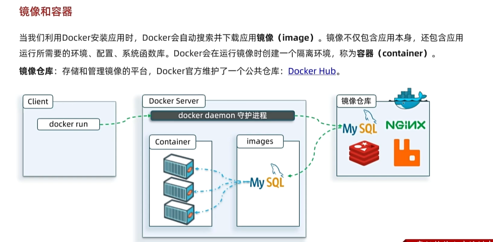
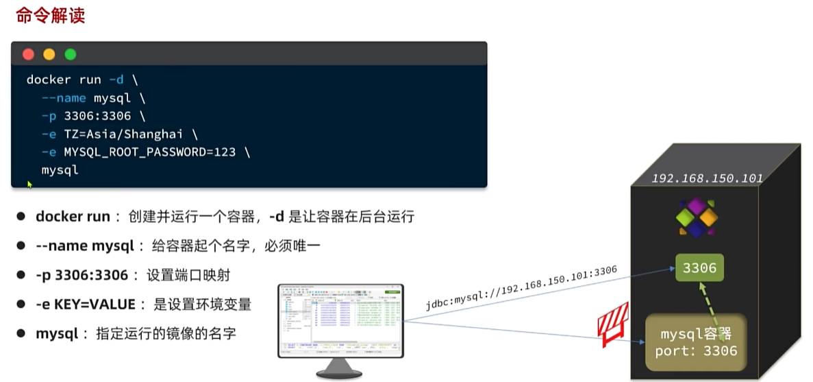
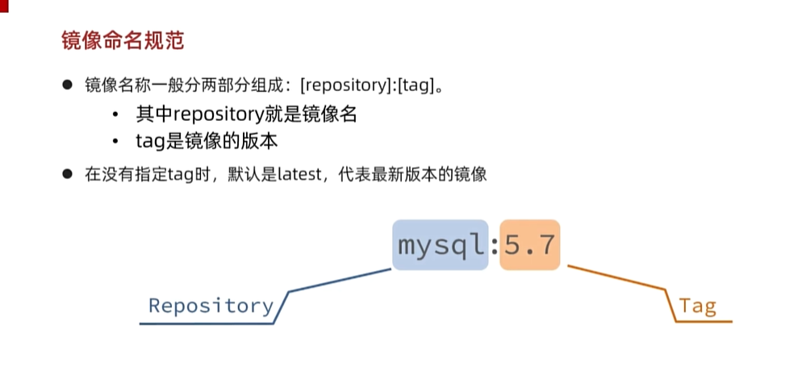
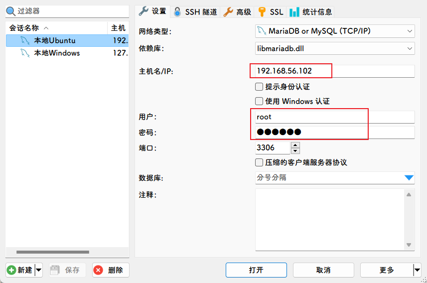
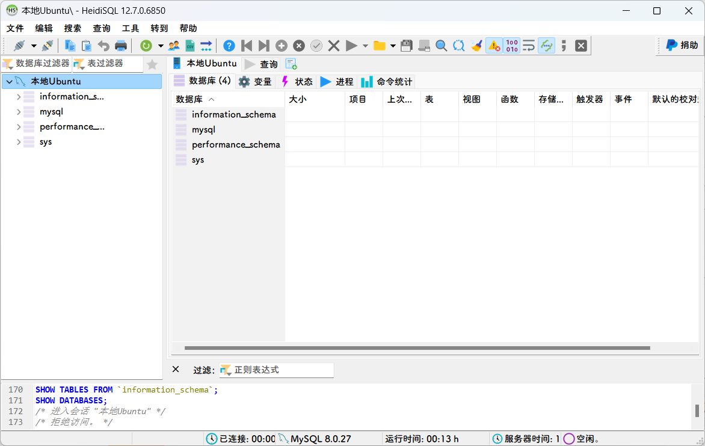

> 参考：https://blog.csdn.net/qq_61654952/article/details/139032657



## 启动mysql容器

```
docker run -d \
--name mysql \
-p 3306:3306 \
-e TZ=Asia/Shanghai \
-e MYSQL_ROOT_PASSWORD=123456 \
mysql
```





## 查看信息

查看本地安装的镜像`docker images`

```shell
root@ayoubuntu:/# docker images
REPOSITORY   TAG       IMAGE ID       CREATED       SIZE
mysql        latest    3218b38490ce   2 years ago   516MB
```

查看容器

```shell
#查看正在运行的容器
docker ps
#查看所有容器
docker ps -a
```

## 验证

打开连接`mysql`的IDE




## 总结


