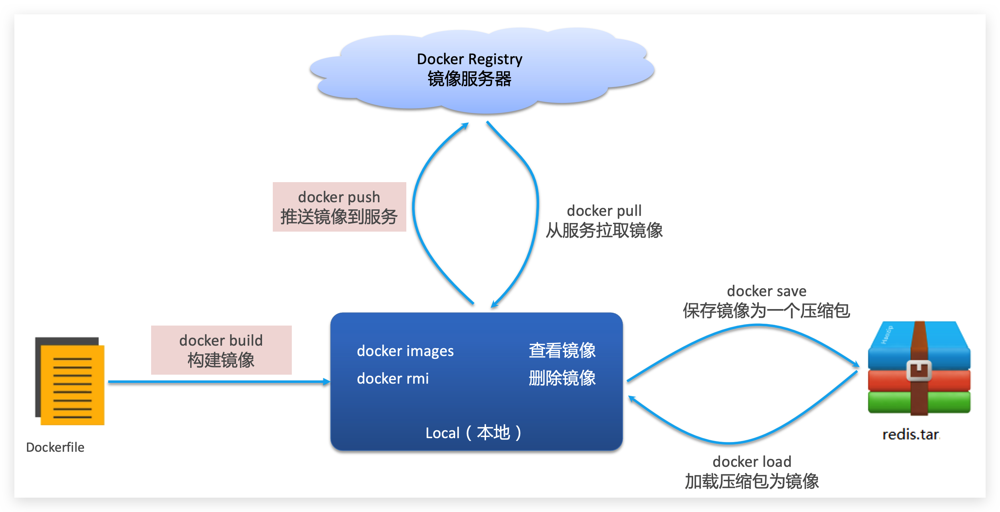
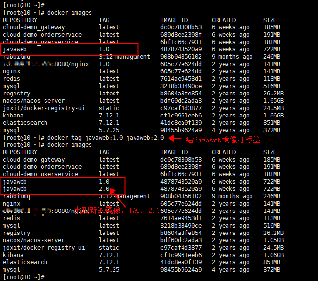
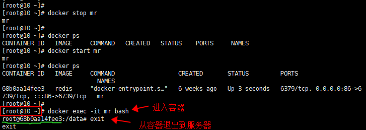
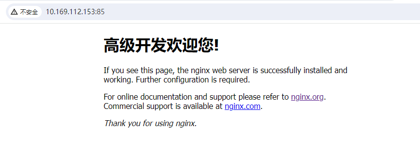
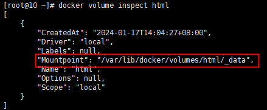
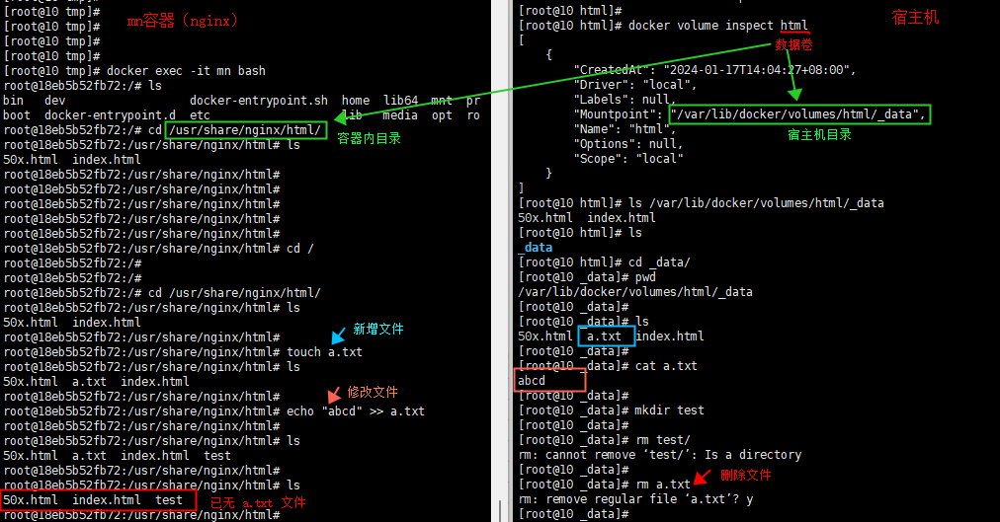

> 参考
> https://blog.csdn.net/qq_61654952/article/details/139032657
> https://cloud.tencent.com/developer/article/2393736

# docker 常用命令大全（基础、镜像、容器、数据卷）

## 1.docker基础命令

```shell
systemctl start docker     #启动docker
systemctl stop docker      #关闭docker
systemctl restart docker   #重启docker
systemctl enable docker    #设置开机自启动
systemctl status docker    #查看docker运行状态
docker version             #查看docker版本号信息
docker info
docker --help              #docker命令提示
```


## 2.docker镜像命令

### 2.1 镜像名称

镜像的名称组成：

- 镜名称一般分两部分组成：repository:tag。
- 在没有指定tag时，默认是latest，代表最新版本的镜像

如图：


这里的mysql就是repository，5.7就是tag，合一起就是镜像名称，代表5.7版本的MySQL镜像。

### 2.2 镜像命令

常见的镜像操作命令如图：



```shell
docker images  #查看镜像


#从服务器拉取镜像拉取镜像
docker pull 镜像名       #拉取最新版本的镜像
docker pull 镜像名:tag   #拉取镜像，指定版本
#推送镜像到服务
docker push 镜像名
docker push 镜像名:tag


docker save -o 保存的目标文件名称 镜像名 #保存镜像为一个压缩包
docker load -i 文件名    #加载压缩包为镜像

#从Docker Hub查找/搜索镜像
docker search [options] TERM      
docker search -f STARS=9000 mysql  #搜索stars收藏数不小于10以上的mysql镜像

#删除镜像。当前镜像没有被任何容器使用 才可以删除
docker rmi 镜像名/镜像ID     #删除镜像 
docker rmi -f 镜像名/镜像ID  #强制删除
docker rmi -f 镜像名 镜像名 镜像名     #删除多个 其镜像ID或镜像用用空格隔开即可 
docker rmi -f $(docker images -aq)  #删除全部镜像，-a 意思为显示全部, -q 意思为只显示ID

docker image rm 镜像名称/镜像ID  #强制删除镜像


#给镜像打标签【有时候根据业务需求 需要对一个镜像进行分类或版本迭代操作，此时就需要给镜像打上标签】
docker tag SOURCE_IMAGE[:TAG] TARGET_IMAGE[:TAG]
```




### 2.3 案例1--拉取、查看镜像

从DockerHub中拉取一个nginx镜像并查看

1）首先去[镜像仓库](https://cloud.tencent.com/product/tcr?from_column=20065&from=20065)搜索nginx镜像，比如[DockerHub](https://cloud.tencent.com/developer/tools/blog-entry?target=https%3A%2F%2Fhub.docker.com%2F&source=article&objectId=2393736):


2）根据查看到的镜像名称，拉取自己需要的镜像，通过命令：docker pull nginx


3）通过命令：docker images 查看拉取到的镜像

### 2.4 案例2--保存、导入镜像

需求：利用docker save将nginx镜像导出磁盘，然后再通过load加载回来

1）利用docker xx --help命令查看docker save和docker load的语法

例如，查看save命令用法，可以输入命令：

```sh
docker save --help
```


命令格式：

```shell
docker save -o [保存的目标文件名称] [镜像名称]
```

2）使用docker save导出镜像到磁盘 

运行命令：

```sh
docker save -o nginx.tar nginx:latest
```


3）使用docker load加载镜像

先删除本地的nginx镜像：

```sh
docker rmi nginx:latest
```

然后运行命令，加载本地文件：

```sh
docker load -i nginx.tar
```


## 3.docker容器命令

### 3.1 容器命令

docker容器的启动需要镜像的支持。

容器操作的命令如图：


容器保护三个状态：

- 运行：进程正常运行
- 暂停：进程暂停，CPU不再运行，并不释放内存
- 停止：进程终止，回收进程占用的内存、CPU等资源

其中：

- docker run：创建并运行一个容器，处于运行状态
- docker pause name：让一个运行的容器暂停
- docker unpause name：让一个容器从暂停状态恢复运行
- docker stop name：停止一个运行的容器（杀死进程、回收内存，仅剩文件系统）
- docker start name：让一个停止的容器再次运行
- docker restart name：重启容器
- docker rm：删除一个容器（进程、内存回收、文件系统彻底干掉）

```sh
docker ps      #显示正在运行的容器
docker ps -a   #-a,--all  显示全部容器，包括已停止的（默认只显示运行中的容器）

#容器怎么来？ docker run 创建并运行一个容器，处于运行状态。
#--name 给要运行的容器起的名字；   -p 将宿主机端口与容器端口映射，冒号左侧是宿主机端口，右侧是容器端口；   -d 表示可后台运行容器 （守护式运行）。具体样例见下
docker run --name containerName -p 80:80 -d nginx   

docker pause 容器名/容器ID    #让一个运行的容器暂停
docker unpause name  #让一个容器从暂停状态恢复运行
docker stop name     #停止一个运行的容器（杀死进程、回收内存，仅剩文件系统）
docker start name    #让一个停止的容器再次运行
docker restart name  #重启容器
#docker stop与docker kill的区别：都可以终止运行中的docker容器。类似于linux中的kill和kill -9这两个命令，docker stop与kill相似，docker kill与kill -9类似
docker kill 容器名    #杀掉一个运行中的容器
docker rename 容器名 新容器名  #更换容器名

#删除容器
docker rm 容器名/容器ID            #删除容器  
docker rm -f CONTAINER           #强制删除
docker rm -f 容器名 容器名 容器名   #删除多个容器 空格隔开要删除的容器名或容器ID
docker rm -f $(docker ps -aq)    #删除全部容器


docker logs 容器名        #查看容器运行日志         
docker logs -f 容器名     #持续跟踪日志
docker logs -f --tail=20 容器名  #查看末尾多少行


#进入容器执行命令，两种方式 docker exec 和 docker attach，推荐docker exec
#方式一 docker exec。
docker exec -it 容器名/容器ID bash
#方式二 docker attach，推荐使用docker exec
docker attach 容器名/容器ID

#从容器退到自己服务器中（不能用ctrl+C）
exit      #直接退出。未添加-d(持久化运行容器)时，执行此参数 容器会被关闭
ctrl+p+q  #优雅退出。无论是否添加-d参数，执行此命令容器都不会被关闭
```



```sh
#设置容器开机自启动
#法一 创建容器、使用docker run命令时，添加参数--restart=always，表示该容器随docker服务启动而自动启动
docker run --name mysqlLatest -p 3307:3306 --restart=always -d mysql

#若容器已启动，希望设置开机自启动
docker update 容器名/容器ID --restart=always
```

### 3.2 案例--创建并运行一个容器

创建并运行nginx容器的命令：

```sh
docker run --name containerName -p 80:80 -d nginx
```

命令解读：

- docker run ：创建并运行一个容器
- --name : 给容器起一个名字，比如叫做mn
- -p ：将宿主机端口与容器端口映射，冒号左侧是宿主机端口，右侧是容器端口。宿主机端口可以任意，只要没有被占用，容器内端口取决于应用本身
- -d：后台运行容器，一般都会加
- nginx：镜像名称，例如nginx，没写标签tag 默认最新版本

这里的`-p`参数，是将容器端口映射到宿主机端口。

默认情况下，容器是隔离环境，我们直接访问宿主机的80端口，肯定访问不到容器中的nginx。

现在，将容器的80与宿主机的80关联起来，当我们访问宿主机的80端口时，就会被映射到容器的80，这样就能访问到nginx了：

### 3.3 案例--进入容器，修改文件

**需求**：进入Nginx容器，修改HTML文件内容，添加“高级开发欢迎您”

**提示**：进入容器要用到docker exec命令。

**步骤**：

1）进入容器。进入我们刚刚创建的nginx容器的命令为：

```sh
docker exec -it mn bash
#docker exec -it mr redis-cli
```

命令解读：

- docker exec ：进入容器内部，执行一个命令【exit 从容器内部退出】
- -it : 给当前进入的容器创建一个标准输入、输出终端，允许我们与容器交互
- mn ：要进入的容器的名称name
- bash：进入容器后执行的命令，bash是一个linux终端交互命令。之前的cd ls都是bash命令的一部分；  redis-cli  直接连接redis

2）进入nginx的HTML所在目录 /usr/share/nginx/html（查看官方文档）

容器内部会模拟一个独立的Linux文件系统，看起来如同一个linux服务器一样：


nginx的环境、配置、运行文件全部都在这个文件系统中，包括我们要修改的html文件。

**查看DockerHub网站中的nginx页面**，可以知道nginx的html目录位置在`/usr/share/nginx/html`

我们执行命令，进入该目录：

```sh
cd /usr/share/nginx/html
```

 查看目录下文件：


3）修改index.html的内容

容器内没有vi命令，无法直接修改，我们用下面的命令来修改：

```sh
sed -i -e 's#Welcome to nginx#高级开发欢迎您#g' -e 's#<head>#<head><meta charset="utf-8">#g' index.html

#或者
sed -i 's#Welcome to nginx#高级开发欢迎您#g' index.html
sed -i 's#<head>#<head><meta charset="utf-8">#g' index.html
```

在浏览器访问自己的虚拟机地址，例如我的是：http://10.169.112.153:85/，即可看到结果：



停掉容器：退出容器

### 3.4 小结

docker run命令的常见参数有哪些？

- --name：指定容器名称
- -p：指定端口映射
- -d：让容器后台运行

查看容器日志的命令：

- docker logs
- 添加 -f 参数可以持续查看日志

查看容器状态：

- docker ps
- docker ps -a 查看所有容器，包括已经停止的

## 4.数据卷

在3.3的nginx案例中，修改nginx的html页面时，需要进入nginx内部。并且因为没有编辑器，修改文件也很麻烦。

这就是因为容器与数据（容器内文件）耦合带来的后果。


要解决这个问题，必须将数据与容器解耦，这就要用到数据卷了。

### 4.1 什么是数据卷

**数据卷（volume）**是一个虚拟目录，指向宿主机文件系统中的某个目录。

- 可供容器使用的特殊目录，可以在容器之间共享和重用
- 对数据卷的修改会立即生效，对数据卷的更新 不会影响镜像
- 卷会一直存在，直到没有容器使用


一旦完成数据卷挂载，对容器的一切操作都会作用在数据卷对应的宿主机目录了。

这样，我们操作宿主机的/var/lib/docker/volumes/html目录，就等于操作容器内的/usr/share/nginx/html目录了。

两个文件挂载同一个数据卷，数据共享；升级 容器删了，但数据卷没删、硬盘目录还在

### 4.2 数据卷操作命令

#### 4.2.1 挂载数据卷

在创建容器时，可以通过 -v 参数来挂载一个数据卷到某个容器内目录，命令格式如下：

```sh
docker run \
  --name mn \
  -v html:/root/html \
  -p 8080:80
  nginx \
```

这里的-v就是挂载数据卷的命令：

- -v volumeName:/targetContainerPath         **如果容器运行时volume不存在，会自动被创建出来**。大多情况下不用自己手动创建数据卷，由docker自动完成
- `-v html:/root/htm` ：把html数据卷挂载到容器内的/root/html这个目录中

**容器内新建、删除、修改文件——宿主机外部挂载的目录同步**

**容器删除——宿主机外部挂载的目录不会同步**【不会因为容器的删除 而删除其挂载在外部宿主机的目录】

#### 4.2.2 数据卷操作的基本语法

```sh
docker volume [COMMAND]
```

docker volume命令是数据卷操作，根据命令后跟随的command来确定下一步的操作：

- create  volumeName        创建一个volume，一般关联宿主机/var/lib/docker/volumes/目录下
- inspect volumeName        显示一个或多个volume的信息
- ls             列出所有的volume
- prune     删除未使用的volume
- rm volumeName        删除一个或多个指定的volume

**注意** 

1）docker inspect volumeName查询到的Mountpoint 表示该**数据卷**在**宿主机哪个目录**（一般无需我们设置），**数据卷——宿主机目录**

2）docker run中的-v表示   将**该容器内某个目录**挂载到**数据卷**，**数据卷——容器内目录**

#### 4.2.3 将容器挂载到本地目录

容器不仅可以挂载数据卷，也可以直接挂载到宿主机目录下，关联关系如下

- 带数据卷模式：宿主机目录 --> 数据卷 ---> 容器内目录
- 宿主机目录 ---> 容器内目录

如图：


**语法**：

目录挂载与数据卷挂载的语法是类似的：【之前数据卷挂载是-v volumeName:/targetContainerPath，而且可挂载文件 宿主机文件内容可直接覆盖容器内文件】

- -v 宿主机目录:容器内目录
- -v 宿主机文件:容器内文件

**示例**：

创建并运行一个MySQL容器，将宿主机目录直接挂载到容器。

1）通过docker pull mysql:5.7.25 拉取mysql镜像   

2）创建目录/tmp/mysql/data

3）创建目录/tmp/mysql/conf，并在该目录下新建文件hmy.cnf，写入如下内容

```cnf
[mysqld]
skip-name-resolve
character_set_server=utf8
datadir=/var/lib/mysql
server-id=1000
```

4）去DockerHub查阅资料，创建并运行MySQL容器，要求：

① 挂载/tmp/mysql/data到mysql容器内[数据存储](https://cloud.tencent.com/product/cdcs?from_column=20065&from=20065)目录

② 挂载/tmp/mysql/conf/hmy.cnf到mysql容器的配置文件

③ 设置MySQL密码

```sh
docker run --name mm -e MYSQL_ROOT_PASSWORD=123 -p 3307:3306 -v /tmp/mysql/conf/hmy.cnf:/etc/mysql/conf.d/hmy.cnf -v /tmp/mysql/data:/var/lib/mysql -d mysql:5.7.25
```

.d 结尾表示目录directory，-e 设置环境变量

### 4.3 案例

#### 4.3.1 创建和查看数据卷

**需求**：创建一个数据卷，并查看数据卷在宿主机的目录位置

① 创建数据卷

```sh
docker volume create html
```

② 查看所有数据

```sh
docker volume ls
```


③ 查看数据卷详细信息卷

```sh
docker volume inspect html
```



可以看到，我们创建的html这个数据卷关联的宿主机目录为`/var/lib/docker/volumes/html/_data`目录。

#### 4.3.2 给nginx挂载数据卷

**需求**：创建一个nginx容器，修改容器内的html目录内的index.html内容

**分析**：3.3案例中，我们进入nginx容器内部，已经知道nginx的html目录所在位置/usr/share/nginx/html ，我们需要把这个目录挂载到html这个数据卷上，方便操作其中的内容。

**提示**：运行容器时使用 -v 参数挂载数据卷fifer

步骤：

① 创建容器并挂载数据卷到容器内的HTML目录

```sh
docker run --name mn -v html:/usr/share/nginx/html -p 80:80 -d nginx      
```

② 进入html数据卷所在位置，并修改HTML内容

```sh
# 查看html数据卷的位置
docker volume inspect html
# 进入该目录
cd /var/lib/docker/volumes/html/_data  #数据卷在此处，容器在上面-v右边
# 修改文件
vi index.html
```

**经测试发现**

- 容器内新建、删除、修改文件——宿主机外部挂载的目录同步
- 容器删除——宿主机外部挂载的目录不会同步



#### 4.3.3 给redis挂载本地目录

```sh
docker run -p 6379:6379 --name redis -v /mydata/redis/data:/data \
-v /mydata/redis/conf/redis.conf:/etc/redis/redis.conf \
-d redis redis-server /etc/redis/redis.conf

#使用redis镜像执行redis-cli命令连接
docker exec -it redis redis-cli
```

redis默认配置 没有持久化（到硬盘），所有数据存在内存中，重启redis(docker restart redis) 数据就没有了——往redis.conf中加入 appendonly yes（最新版默认持久化，不需要此操作）

### 4.4 小结

- 数据卷的作用：
    - 将容器与数据分离，解耦合，方便操作容器内数据，保证[数据安全](https://cloud.tencent.com/solution/data_protection?from_column=20065&from=20065)
- 数据卷操作：
    - docker volume create volumeName：创建数据卷
    - docker volume ls：查看所有数据卷
    - docker volume inspect volumeName：查看数据卷详细信息，包括关联的宿主机目录位置
    - docker volume rm volumeName：删除指定数据卷
    - docker volume prune：删除所有未使用的数据卷
- docker run的命令中通过 -v 参数挂载文件或目录到容器中：
    - -v volume名称:容器内目录
    - -v 宿主机文件:容器内文件
    - -v 宿主机目录:容器内目录
- 数据卷挂载与目录直接挂载的
    - 数据卷挂载耦合度低，由docker来管理目录，但是目录较深，不好找（自动化 隐藏细节）
    - 目录挂载耦合度高，需要我们自己管理目录，不过目录容易寻找查看（细节自己管理实现 没有自动化）

## 5.总结

1. 容器生命周期管理：
    - `docker run`: 运行一个新容器。
    - `docker start`: 启动一个停止的容器。
    - `docker stop`: 停止一个运行中的容器。
    - `docker restart`: 重启一个运行中的容器。
    - `docker pause`: 暂停容器中的所有进程。
    - `docker unpause`: 恢复暂停的容器中的所有进程。
    - `docker kill`: 强制停止一个运行中的容器。
    - `docker rm`: 删除一个或多个容器。
    - `docker ps`: 列出正在运行的容器。
    - `docker ps -a`: 列出所有容器，包括停止的容器。
2. 镜像管理：
    - `docker images`: 列出本地的镜像。
    - `docker pull`: 从仓库中拉取一个镜像。
    - `docker build`: 根据 Dockerfile 构建一个镜像。
    - `docker tag`: 给镜像打标签。
    - `docker rmi`: 删除一个或多个镜像。
3. 容器操作：
    - `docker exec`: 在运行中的容器中执行命令。
    - `docker attach`: 进入一个正在运行的容器。
    - `docker cp`: 在容器和本地文件系统之间复制文件或目录。
    - `docker inspect`: 显示容器的详细信息。
4. 网络：
    - `docker network ls`: 列出 Docker 网络。
    - `docker network create`: 创建一个 Docker 网络。
    - `docker network connect`: 将容器连接到网络。
    - `docker network disconnect`: 将容器从网络断开连接。
5. 数据卷：
    - `docker volume ls`: 列出 Docker 数据卷。
    - `docker volume create`: 创建一个 Docker 数据卷。
    - `docker volume rm`: 删除一个或多个 Docker 数据卷。
6. Docker Compose（用于定义和运行多容器的应用）：
    - `docker-compose up`: 构建并启动应用的所有服务。
    - `docker-compose down`: 停止并移除应用的所有服务。
    - `docker-compose build`: 重新构建服务。
    - `docker-compose logs`: 查看服务的日志。