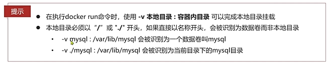

```shell
#查看volume命令
docker volume --help
```

`注意：数据卷挂载操作只能在容器创建的时候进行，容器创建完成后是无法进行挂载的`

# Docker数据卷（volume）

`docker`的理念将运行的环境打包形成`容器`运行，运行可以伴随容器，但是我们对`数据`的要求是希望`持久化`，`容器之间`可以`共享数据`，`Docker`容器产生的数据，如果不通过`docker commit`生成新的镜像，使得`数据`作为容器的一部分保存下来，那么当容器被删除之后，数据也就没了。而且，如果不进行`数据卷挂载`的话，对**容器配置文件**进行修改需要进入**容器内部**修改，十分麻烦，我们对容器为了能够保存数据并且方便修改，在docker容器中使用卷。

>  `卷`就是`目录`或者`文件`，存在于一个或者多个容器中，但是不属于联合文件系统，因此能够绕过Union File System提供一些用于`持久化数据`或`共享数据`的特点。 
>
>   **`数据卷（volume）`**是一个`虚拟目录`，指向`宿主机文件系统中的某个目录`，它们的修改是**双向同步**的，类似于vue中的双向绑定。**多个容器也可以绑定到相同的数据卷目录上** 

`卷`的设计目的就是`数据的持久化`，完全独立于容器的生存周期，因此Docker不会在容器删除时删除其挂载的数据卷。 

 **两个作用：**

- 持久化数据
- 共享数据

 **一个特点：** 

- 即时生效
- 卷的更新不影响镜像
- 即使容器停止或被删除，卷默认也一致存在

### 数据卷操作命令

**数据卷操作的基本语法：**

```shell
docker volume [COMMAND]
```

语法解析：docker volume命令是数据卷操作，根据命令后跟随的command来确定下一步的操作

文档中提供的COMMAND有5个：

- ​    create 创建一个数据卷(volume)
- ​    inspect 显示一个或多个数据卷(volume)的信息
- ​    ls 列出所有的数据卷(volume)
- ​    prune 删除全部未使用的数据卷(volume)
- ​    rm 删除一个或多个指定的数据卷(volume)

创建数据卷

```shell
docker volume create 数据卷名称
# 示例：
docker volume create html
```

查看数据卷创建数据卷

```shell
docker volume ls
```

查看数据卷详细信息 

```shell
docker volume inspect 数据卷名称
# 示例：
docker volume inspect html
```

删除全部未使用的数据卷

```shell
docker volume prune 数据卷名称
# 示例：
docker volume prune html
```

删除一个或多个指定的数据卷

```shell
docker volume rm  数据卷名称
# 示例：
docker volume rm  html
```

>  注意：所有docker容器内的卷，没有指定目录的情况下在`/var/lib/docker/volumes/xxxx/_data `

### 数据卷挂载

容器挂载数据卷时，数据卷可以存在也可以不存在，**数据卷不存在的话，会自动去创建数据卷。**

我们在创建容器时，可以通过 -v 参数来挂载一个数据卷到某个容器内目录，命令格式如下：

```shell
docker run \
  --name mn \
  -v html:/root/html \
  -p 8080:80
  nginx \
```

 这里的-v就是挂载数据卷的命令：

-  `-v html:/root/htm` ：把html数据卷挂载到容器内的/root/html这个目录中 

#### 修改`Nginx`主页内容

以修改`Nginx`主页内容为例：

参照官网知道	


nginx的静态资源目录在`/usr/share/nginx/html`下

第一步： 创建容器并挂载数据卷到容器内的HTML目录

```shell
# 解释部分
									# \是命令换行符 
docker run \						# 创建并运行一个容器
  --name myNginx \					# 给容器个名字叫myNginx
  -v html:/usr/share/nginx/html \	# 把html数据卷挂载到容器内的/usr/share/nginx/html这个目录中
  -p 80:80 \						# 把宿主机的80端口映射到容器内的80端口
  -d \								# 后台运行
  nginx \;							# 需要启动的镜像名称
  
# 可直接复制部分 	
docker run --name nginx -v html:/usr/share/nginx/html -p 80:80 -d nginx:1.26.1
```

>```shell
>#进入运行容器
>docker exec -it nginx bash
>
>cd /usr/share/nginx/html
>
>root@d13ebd4dfcce:/usr/share/nginx/html# ls
>50x.html  index.html
>```
>
>
>
>由于docker对于镜像（或者容器）来说只会准备最基本的程序运行的必要环境，所以在docker的容器中是不存在外部liunx所含的`vim`或者`ll`等命令，也就是说你在容器内是没法更改文件，只能查看文件目录`ls`，这就要求我们将目录挂载到外部的liunx对应的目录上去来进行文件的操作
>
>```shell
>#退出运行的容器
>exit 
>```

第二步：查看数据卷所在的位置 

```shell
docker volume inspect html            # 查看html数据卷，指向的宿主机中的具体文件夹位置
```

此时html数据卷的Mountpoint就已经指向宿主机的/var/lib/docker/volumes/html/_data目录。

**第三步：在宿主机中进入`html`数据卷所在位置，并修改HTML内容**

```shell
# 进入Mountpoint指向的目录
cd /var/lib/docker/volumes/html/_data
# 修改Nginx主页的index.html文件
vi index.html
```

注意点：

- 一个容器可以挂载多个目录，一个目录也可以被多个容器挂载。
- 如果创建容器时忘记挂载，是无法再去挂载数据卷的。只能删除容器，再创建新容器时挂载数据卷。

> 覆盖关系： 
>
> - 数据卷中没有文件时，会将容器目录中的文件挂载到数据卷中。
> - 数据卷中有文件时，会将数据卷中的文件覆盖容器目录中的文件。

查看数据卷挂载信息

```shell
#语法
docker inspect 容器名称

docker inspect nginx
```


### 本地磁盘挂载 （直接挂载模式）

容器不仅仅可以`挂载数据卷`，也可以直接`挂载到宿主机目录上`。关联关系如下：

-  带数据卷模式：宿主机目录 --> 数据卷 ---> 容器内目录 
-  直接挂载模式：宿主机目录 ---> 容器内目录 

 磁盘挂载的语法：

```shell
# 语法方面其实也就只有-v 参数有区别，其它都是没区别的
# 注意：宿主机文件挂载容器内文件的操作，使用数据卷是做不到的
-v [宿主机目录]:[容器内目录]
-v [宿主机文件]:[容器内文件]		
```

在这里我们演示使用磁盘挂载`MySql`的数据保存目录和`MySql`的配置文件。 

**第一步、拉取镜像**

```shell
#拉取
docker pull swr.cn-north-4.myhuaweicloud.com/ddn-k8s/docker.io/mysql:8.0.35
#起别名
docker tag  swr.cn-north-4.myhuaweicloud.com/ddn-k8s/docker.io/mysql:8.0.35  mysql:8.0.35
#删除多出来的
docker rmi swr.cn-north-4.myhuaweicloud.com/ddn-k8s/docker.io/mysql:8.0.35
```


**第二步：准备宿主机中的文件目录**

```shell
cd /home			# 进入/home目录
mkdir docker_volume	# 一个统一的docker挂载的目录
cd docker_volume	# 进入/home/docker_volume目录
mkdir mysql	# 创建用于挂载所有mysql配置文件的目录
cd mysql
mkdir data init conf #创建三个文件夹
```

**第三步：进行挂载**

```shell
docker run \
	--name mysql \
	-e MYSQL_ROOT_PASSWORD=123456 \
	-p 3306:3306 \
	-v /home/docker_volume/mysql/data:/var/lib/mysql \
	-v /home/docker_volume/mysql/init:/docker-entrypoint-initdb.d \
	-v /home/docker_volume/mysql/conf:/etc/mysql/conf.d \
	-d \
	mysql:8.0.35
```

>  ```shell
>  docker run \	# 创建并运行一个容器 	
>  --name mysql \	# 给容器个名字叫mysql
>  -e MYSQL_ROOT_PASSWORD=123456 \	# 设置mysql登录，密码为root 	
>  -p 3306:3306	# 把宿主机3306端口和容器的3306端口相关联 	
>  -v /home/docker_volume/mysql/conf:/etc/mysql/conf.d  \ # mysql配置文件	
>  -v /home/docker_volume/mysql/data:/var/lib/mysql \ \	# mysql数据文件
>  -v /home/docker_volume/mysql/init:/docker-entrypoint-initdb.d \ # mysql启动要执行的文件夹
>  -d \	# 后台运行 	
>  mysql:8.0.35	# 需要启动的镜像名称 
>  ```

### 数据卷挂载和磁盘挂载的优缺点

数据卷挂载方式：使用数据卷挂载的方式，Docker会自动在宿主机上帮我们创建数据卷对应的真实目录。容器挂载时只需要挂载到数据卷上，而不用关心数据卷指向的真实目录在哪里。即使将来容器被删除了，数据卷中或者宿主机挂载到容器的目录中的内容是不会随着容器的删除而丢失的。

- 优点：这种方式相当于把挂载全部交给Docker本身处理，方便快捷。
- 缺点：真实挂载目录由Docker生成，目录较深，不方便查找。

 磁盘挂载方式：直接挂载到宿主机目录上，不再有中间的数据卷，而是容器和宿主机的直接交互。

- 优点：目录和文件更好找也更好维护，并且能直接把目录或者文件挂载到容器上。
- 缺点：目录和文件需要我们自行创建和维护。


