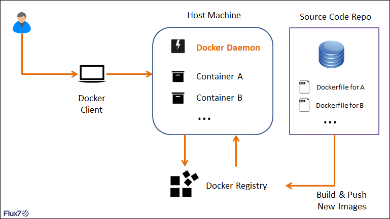
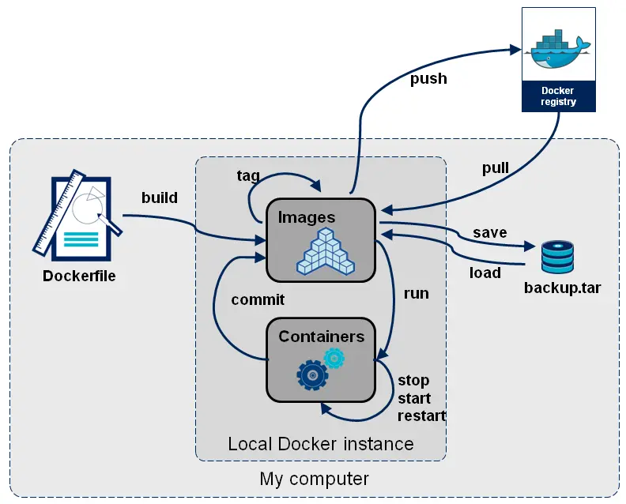
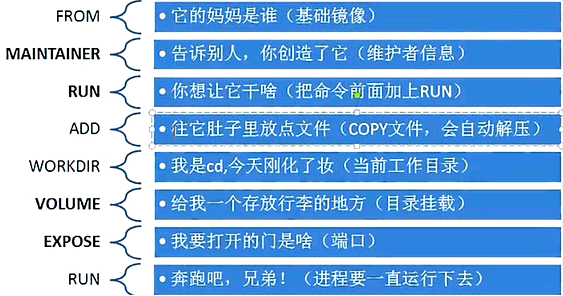
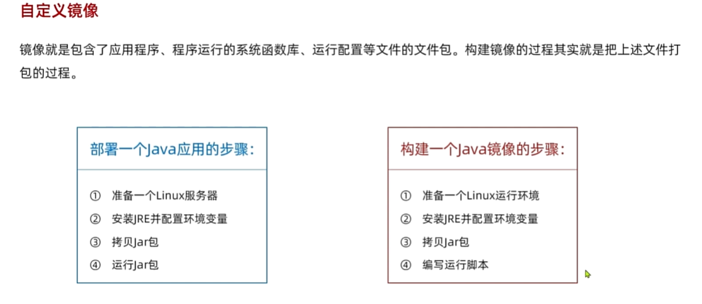
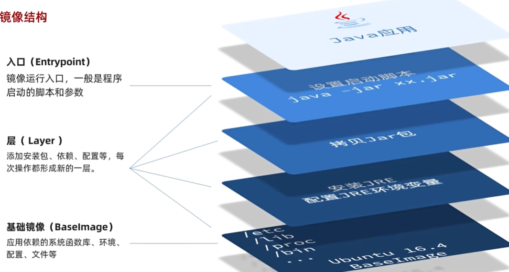
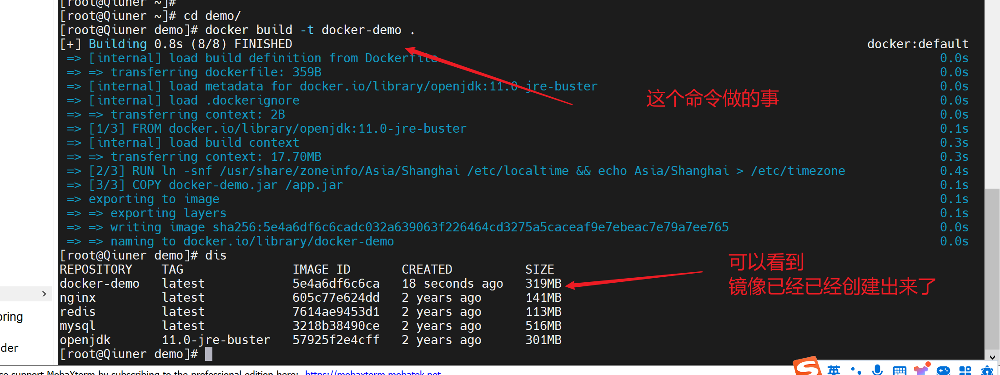
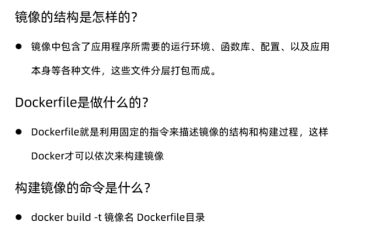

# Dockerfile 详解

## Dockerfile 概念

我们使用 `Dockerfile` 定义镜像，依赖镜像来运行容器，因此 `Dockerfile` 是镜像和容器的关键，`Dockerfile` 可以非常容易的定义镜像内容，同时在我们后期的微服务实践中，`Dockerfile` 也是重点关注的内容，今天我们就来一起学习它。

首先通过一张图来了解 `Docker` **镜像**、**容器**和 **Dockerfile** 三者之间的关系。



通过上图可以看出使用 `Dockerfile` 定义镜像，运行镜像启动容器。

Docker 镜像是一个特殊的文件系统，除了提供容器运行时所需的程序、库、资源、配置等文件外，还包含了一些为运行时准备的一些配置参数（如匿名卷、环境变量、用户等）。镜像不包含任何动态数据，其内容在构建之后也不会被改变。

镜像的定制实际上就是定制每一层所添加的配置、文件。如果我们可以把每一层修改、安装、构建、操作的命令都写入一个脚本，用这个脚本来构建、定制镜像，那么之前提及的无法重复的问题、镜像构建透明性的问题、体积的问题就都会解决。这个脚本就是`Dockerfile`。

`Dockerfile` 是一个**文本文件**，其内包含了一条条的指令(Instruction)，**每一条指令构建一层**，因此每一条指令的内容，就是描述该层应当如何构建。有了 Dockerfile，当我们需要定制自己额外的需求时，只需在 Dockerfile 上添加或者修改指令，重新生成 image 即可，省去了敲命令的麻烦。

## Docker commit 那么方便，为什么要学 DockerFile ？

此前我构建镜像都是使用 `Docker commit`，简单又明确。但是一段时间后我就犯迷糊了，`commit` 出来的镜像都是什么啊，那个描述信息真的会有人很详细的去写？镜像多了自己都记不住了。而且，`commit `到底打包了些什么东西啊？我后来突然意识到。是像虚拟机快照那样吗？会把当时的容器状态全都打包进去吗？还是说只是单纯的打包一下当时的文件？

`Docker commit `一个很不方便的地方就在于，难以回顾它是怎么来的，比方说我这里使用 commit 构建了一个 `CentOS + vim` 镜像，查看它的构建历史发现：

```shell
[root@centos7 ~]# docker history centos-vim:v1.0
IMAGE               CREATED             CREATED BY                                      SIZE 
8df43092cfd1        6 minutes ago       /bin/bash                                      140MB 
67591570dd29        4 years ago         /bin/sh -c #(nop)  CMD ["/bin/bash"]            0B   
<missing>           4 years ago         /bin/sh -c #(nop)  LABEL name=CentOS Base Im…   0B   
<missing>           4 years ago         /bin/sh -c #(nop) ADD file:940c77b6724c00d42…  192MB
<missing>           4 years ago         /bin/sh -c #(nop)  MAINTAINER https://github…   0B  
```

说真的，这要不是我自己创建的，我还真不知道它有些什么。而且，就算是我自己创建的，我也仅是知道它有 CentOS + vim，至于还有没有点别的什么，不知道啊！！！

#### Docker commit 的弊端：

-  如果是安装软件包、编译构建，那会有大量的无关内容被添加进来，如果不小心清理，将会导致镜像极为臃肿。 
-  使用 `Docker commit` 意味着所有对镜像的操作都是**黑箱操作**，生成的镜像也被称为**黑箱镜像**，换句话说，就是除了制作镜像的人知道执行过什么命令、怎么生成的镜像，别人根本无从得知。而且，即使是这个制作镜像的人，过一段时间后也无法记清具体在操作的。虽然 `docker diff` 或许可以告诉得到一些线索，但是远远不到可以确保生成一致镜像的地步。这种黑箱镜像的后期维护工作是非常痛苦的。 
-  镜像所使用的分层存储，除当前层外，之前的每一层都是不会发生改变的，换句话说，任何修改的结果仅仅是在当前层进行标记、添加、修改，而不会改动上一层。如果使用 Docker commit 制作镜像，以及后期修改的话，每一次修改都会让镜像更加臃肿一次，所删除的上一层的东西并不会丢失，会一直如影随形的跟着这个镜像，即使根本无法访问到。这会让镜像更加臃肿。 

#### Docker build 方式镜像生成新的镜像：

`Docker build` 的方式生成新镜像的**前提条件是有一个旧的基础镜像**，在此基础上通过 Docker build 命令执行dockerfile 文件从而生成一个新的镜像，不同于Docker commit，是镜像–> 镜像的转化。当然，是否转化正确是需要将镜像 Docker run起来的哦。

#### Dockerfile的优点：

-  能够自由灵活的与`宿主机`联系，比如，某些配置文件在宿主机验证并使用过后很好用，那么，可以将文件copy到镜像中，（这个动作是写在dockerfile里），add 远程主机的配置文件到镜像中，定义onbuild动作等等各种灵活的功能。docker commit不能做到这些事情，因为是在一个封闭的在运行中的容器中，无法做复制拷贝宿主机文件的事情。 
-  dockerfile本身就是一个比较详细的构建文档，有这个文档就可以清楚的知道新构建的镜像经历了怎样的变化。没有黑箱操作的困扰了，后期的维护更为方便了。 
-  后期可扩展性强，一个文件就可以在哪都可以运行镜像了。（前提有网，有安装docker环境） 

#### Dockerfile的缺点：

编写不容易，因为需要对脚本这些比较了解，有Linux基础的人才可以编写出好用的dockerfile，上手难度大。

## Docker镜像制作的工作逻辑

首先需要有一个制作镜像的目录，该目录下有个文件，**名称必须为**`Dockerfile`，Dockerfile有指定的格式，#号开头为注释，指令默认用大写字母来表示，以区分指令和参数，docker build读取Dockerfile是按顺序依次Dockerfile里的配置，且**第一条非注释指令必须是`FROM` 开头**，表示基于哪个基础镜像来构建新镜像。可以根据已存在的任意镜像来制作新镜像。

**.dcokerignore**：把文件路径写入到`.dockerignore`，对应的路径将不会被打包到新镜像

`docker build`命令用于从`Dockerfile`构建镜像。可以在`docker build`命令中使用`-f`标志指向文件系统中任何位置的`Dockerfile`。

例：

```shell
docker build -f /path/to/a/Dockerfile
```



#### Dockerfile 文件格式

Dockerfile文件格式如下：

```Dockerfile
##  Dockerfile文件格式

# This dockerfile uses the ubuntu image
# VERSION 2 - EDITION 1
# Author: docker_user
# Command format: Instruction [arguments / command] ..
 
# 1、第一行必须指定 基础镜像信息
FROM ubuntu
 
# 2、维护者信息
MAINTAINER docker_user docker_user@email.com
 
# 3、镜像操作指令
RUN echo "deb http://archive.ubuntu.com/ubuntu/ raring main universe" >> /etc/apt/sources.list
RUN apt-get update && apt-get install -y nginx
RUN echo "\ndaemon off;" >> /etc/nginx/nginx.conf
 
# 4、容器启动执行指令
CMD /usr/sbin/nginx
```

Dockerfile 分为四部分：**基础镜像信息、维护者信息、镜像操作指令、容器启动执行指令**。一开始必须要指明所基于的镜像名称，接下来一般会说明维护者信息；后面则是镜像操作指令，例如 RUN 指令。每执行一条RUN 指令，镜像添加新的一层，并提交；最后是 CMD 指令，来指明运行容器时的操作命令。

用一张图来描述一下：



#### 构建镜像

`docker build` 命令会根据 `Dockerfile 文件`及上下文构建`新 Docker 镜像`。**构建上下文是指 Dockerfile 所在的本地路径**或一个URL（Git仓库地址）。构建上下文环境会被递归处理，所以构建所指定的路径还包括了子目录，而URL还包括了其中指定的子模块。

将当前目录做为构建上下文时，可以像下面这样使用docker build命令构建镜像：

```shell
#直接执行当前目录下的Dockerfile 文件进行构建
docker build .
#直接执行当前目录下的Dockerfile 文件进行构建，并对构建成功的镜像起一个别名docker-demo
docker build -t docker-demo .

# . => 表示当前目录
# -t => 表示tag，意思就是起别名
```

说明：构建会在 Docker 后台守护进程（daemon）中执行，而不是`CLI`中。构建前，构建进程会将全部内容（递归）发送到守护进程。大多情况下，应该将一个空目录作为构建上下文环境，并将 Dockerfile 文件放在该目录下。

在构建上下文中使用的 Dockerfile 文件，是一个构建指令文件。为了提高构建性能，可以通过`.dockerignore`文件排除上下文目录下不需要的文件和目录。

在 Docker 构建镜像的第一步，docker CLI 会先在上下文目录中寻找`.dockerignore`文件，根据`.dockerignore` 文件排除上下文目录中的部分文件和目录，然后把剩下的文件和目录传递给 Docker 服务。

Dockerfile 一般位于构建上下文的根目录下，也可以通过`-f`指定该文件的位置：

```shell
docker build -f /path/to/a/Dockerfile .
```

构建时，还可以通过`-t`参数指定构建成镜像的仓库、标签。

```shell
docker build -t nginx/v3 .
```

如果存在多个仓库下，或使用多个镜像标签，就可以使用多个`-t`参数：

```shell
docker build -t nginx/v3:1.0.2 -t nginx/v3:latest .
```

在 Docker 守护进程执行 Dockerfile 中的指令前，首先会对 Dockerfile 进行语法检查，有语法错误时会返回：

```shell
docker build -t nginx/v3 .
Sending build context to Docker daemon 2.048 kB
Error response from daemon: Unknown instruction: RUNCMD
```

#### 缓存

Docker 守护进程会一条一条的执行 Dockerfile 中的指令，而且会在每一步提交并生成一个新镜像，最后会输出最终镜像的ID。生成完成后，Docker 守护进程会自动清理你发送的上下文。 Dockerfile文件中的每条指令会被独立执行，并会创建一个新镜像，RUN cd /tmp等命令不会对下条指令产生影响。 Docker 会重用已生成的中间镜像，以加速docker build的构建速度。以下是一个使用了缓存镜像的执行过程：

```shell
$ docker build -t svendowideit/ambassador .
Sending build context to Docker daemon 15.36 kB
Step 1/4 : FROM alpine:3.2
 ---> 31f630c65071
Step 2/4 : MAINTAINER SvenDowideit@home.org.au
 ---> Using cache
 ---> 2a1c91448f5f
Step 3/4 : RUN apk update &&      apk add socat &&        rm -r /var/cache/
 ---> Using cache
 ---> 21ed6e7fbb73
Step 4/4 : CMD env | grep _TCP= | (sed 's/.*_PORT_\([0-9]*\)_TCP=tcp:\/\/\(.*\):\(.*\)/socat -t 100000000 TCP4-LISTEN:\1,fork,reuseaddr TCP4:\2:\3 \&/' && echo wait) | sh
 ---> Using cache
 ---> 7ea8aef582cc
Successfully built 7ea8aef582cc
```

构建缓存仅会使用本地父生成链上的镜像，如果不想使用本地缓存的镜像，也可以通过`--cache-from`指定缓存。指定后将不再使用本地生成的镜像链，而是从`镜像仓库`中下载。

##### 寻找缓存的逻辑

Docker 寻找缓存的逻辑其实就是树型结构根据 `Dockerfile` 指令遍历子节点的过程。下图可以说明这个逻辑。

```shell
     FROM base_image:version           Dockerfile:
           +----------+                FROM base_image:version
           |base image|                RUN cmd1  --> use cache because we found base image
           +-----X----+                RUN cmd11 --> use cache because we found cmd1
                / \
               /   \
       RUN cmd1     RUN cmd2           Dockerfile:
       +------+     +------+           FROM base_image:version
       |image1|     |image2|           RUN cmd2  --> use cache because we found base image
       +---X--+     +------+           RUN cmd21 --> not use cache because there's no child node
          / \                                        running cmd21, so we build a new image here
         /   \
RUN cmd11     RUN cmd12
+-------+     +-------+
|image11|     |image12|
+-------+     +-------+
```

大部分指令可以根据上述逻辑去寻找缓存，除了 ADD 和 COPY 。这两个指令会复制文件内容到镜像内，除了指令相同以外，Docker 还会检查每个文件内容校验(不包括最后修改时间和最后访问时间)，如果校验不一致，则不会使用缓存。

除了这两个命令，Docker 并不会去检查容器内的文件内容，比如 `RUN apt-get -y update`，每次执行时文件可能都不一样，但是 Docker 认为命令一致，会继续使用缓存。这样一来，以后构建时都不会再重新运行`apt-get -y update`。

如果 Docker 没有找到当前指令的缓存，则会构建一个新的镜像，并且之后的所有指令都不会再去寻找缓存。

#### 上下文路径

上下文路径，是指 docker 在构建镜像，有时候想要使用到本机的文件（比如复制），docker build 命令得知这个路径后，会将路径下的所有内容打包。

解析：由于 docker 的运行模式是 C/S。我们本机是 C，docker 引擎是 S。实际的构建过程是在 docker 引擎下完成的，所以这个时候无法用到我们本机的文件。这就需要把我们本机的指定目录下的文件一起打包提供给 docker 引擎使用。

如果未说明最后一个参数，那么默认上下文路径就是 Dockerfile 所在的位置。

注意：上下文路径下不要放无用的文件，因为会一起打包发送给 docker 引擎，如果文件过多会造成过程缓慢。

比方说：

```shell
ending build context to Docker daemon 1.38GB
```

我就觉着纳闷儿…

## Dockerfile 指令详解

#### FROM 指定基础镜像

FROM 指令用于指定其后构建新镜像所使用的基础镜像。FROM 指令必是 Dockerfile 文件中的首条命令，启动构建流程后，Docker 将会基于该镜像构建新镜像，FROM 后的命令也会基于这个基础镜像。

FROM语法格式为：

```dockerfile
FROM <image>
FROM <image>:<tag>
FROM <image>:<digest>
```

通过 FROM 指定的镜像，可以是任何有效的基础镜像。FROM 有以下限制：

- FROM 必须 是 Dockerfile 中第一条非注释命令
- 在一个 Dockerfile 文件中创建多个镜像时，FROM 可以多次出现。只需在每个新命令 FROM 之前，记录提交上次的镜像 ID。
- tag 或 digest 是可选的，如果不使用这两个值时，会使用 latest 版本的基础镜像

#### RUN 执行命令

在镜像的构建过程中执行特定的命令，并生成一个中间镜像。格式:

```dockerfile
#shell格式
RUN <command>
#exec格式
RUN ["executable", "param1", "param2"]
```

- RUN 命令将在当前 image 中执行任意合法命令并提交执行结果。命令执行提交后，就会自动执行 Dockerfile 中的下一个指令。
- 层级 RUN 指令和生成提交是符合 Docker 核心理念的做法。它允许像版本控制那样，在任意一个点，对 image 镜像进行定制化构建。
- RUN 指令创建的中间镜像会被缓存，并会在下次构建中使用。如果不想使用这些缓存镜像，可以在构建时指定 `--no-cache` 参数，如：`docker build --no-cache`。

注意：Dockerfile 的指令每执行一次都会在 docker 上新建一层。所以过多无意义的层，会造成镜像膨胀过大。例如：

```dockerfile
FROM centos
RUN yum -y install wget
RUN wget -O redis.tar.gz "http://download.redis.io/releases/redis-5.0.3.tar.gz"
RUN tar -xvf redis.tar.gz
```

以上执行会创建 3 层镜像。可简化为以下格式：

```dockerfile
FROM centos
RUN apt -y install wget \
	&& wget -O redis.tar.gz "http://download.redis.io/releases/redis-5.0.3.tar.gz" \
    && tar -xvf redis.tar.gz
```

如上，以 && 符号连接命令，这样执行后，只会创建 1 层镜像。

#### COPY 复制文件

格式：

```dockerfile
COPY <源路径>... <目标路径>
COPY ["<源路径1>",... "<目标路径>"]
```

和 RUN 指令一样，也有两种格式，一种类似于命令行，一种类似于函数调用。COPY 指令将从构建上下文目录中 <源路径> 的文件/目录复制到新的一层的镜像内的`<目标路径>`位置。比如：

```dockerfile
COPY package.json /usr/src/app/
```

`<源路径>`可以是多个，甚至可以是通配符，其通配符规则要满足 Go 的 filepath.Match 规则，如：

```dockerfile
COPY hom* /mydir/
COPY hom?.txt /mydir/
```

`<目标路径>`可以是容器内的绝对路径，也可以是相对于工作目录的相对路径（工作目录可以用 WORKDIR 指令来指定）。目标路径不需要事先创建，如果目录不存在会在复制文件前先行创建缺失目录。

此外，还需要注意一点，使用 COPY 指令，源文件的各种元数据都会保留。比如读、写、执行权限、文件变更时间等。这个特性对于镜像定制很有用。特别是构建相关文件都在使用 Git 进行管理的时候。

#### ADD 更高级的复制文件

ADD 指令和 COPY 的格式和性质基本一致。但是在 COPY 基础上增加了一些功能。比如`<源路径>`可以是一个 URL，这种情况下，Docker 引擎会试图去下载这个链接的文件放到`<目标路径>`去。

在构建镜像时，复制上下文中的文件到镜像内，格式：

```dockerfile
ADD <源路径>... <目标路径>
ADD ["<源路径>",... "<目标路径>"]
```

**注意** 如果 docker 发现文件内容被改变，则接下来的指令都不会再使用缓存。关于复制文件时需要处理的/，基本跟正常的 copy 一致。

#### ENV 设置环境变量

格式有两种：

```dockerfile
ENV <key> <value>
ENV <key1>=<value1> <key2>=<value2>...
```

这个指令很简单，就是设置环境变量而已，无论是后面的其它指令，如 RUN，还是运行时的应用，都可以直接使用这里定义的环境变量。

```dockerfile
ENV VERSION=1.0 DEBUG=on \
    NAME="Happy Feet"
```

这个例子中演示了如何换行，以及对含有空格的值用双引号括起来的办法，这和 Shell 下的行为是一致的。

#### EXPOSE 声明可用端口

仅仅只是声明端口。

作用：

```shell
帮助镜像使用者理解这个镜像服务的守护端口，以方便配置映射。
在运行时使用随机端口映射时，也就是 docker run -P 时，会自动随机映射 EXPOSE 的端口。
```

格式：

```dockerfile
EXPOSE <端口1> [<端口2>...]

EXPOSE <port> [<port>...]
```

EXPOSE 指令并不会让容器监听 host 的端口，如果需要，需要在 docker run 时使用 `-p`、`-P` 参数来发布容器端口到 host 的某个端口上。

#### VOLUME 定义匿名卷

定义匿名数据卷。在启动容器时忘记挂载数据卷，会自动挂载到匿名卷。

作用：

```txt
避免重要的数据，因容器重启而丢失，这是非常致命的。
避免容器不断变大。
```

格式：

```do
VOLUME ["<路径1>", "<路径2>"...]
VOLUME <路径>
```

在启动容器 docker run 的时候，我们可以通过 -v 参数修改挂载点。

#### WORKDIR 指定工作目录

指定工作目录。用 WORKDIR 指定的工作目录，会在构建镜像的每一层中都存在。（WORKDIR 指定的工作目录，必须是提前创建好的）。

docker build 构建镜像过程中的，每一个 RUN 命令都是新建的一层。只有通过 WORKDIR 创建的目录才会一直存在。

格式：

```do
WORKDIR <工作目录路径>
```

通过WORKDIR设置工作目录后，Dockerfile 中其后的命令 RUN、CMD、ENTRYPOINT、ADD、COPY 等命令都会在该目录下执行。 如，使用WORKDIR设置工作目录：

```dockerfile
WORKDIR /a
WORKDIR b
WORKDIR c
RUN pwd
```

在以上示例中，pwd 最终将会在 `/a/b/c` 目录中执行。在使用 docker run 运行容器时，可以通过`-w`参数覆盖构建时所设置的工作目录。

#### USER 指定当前用户

USER 用于指定运行镜像所使用的用户：

```dockerfile
USER daemon
```

使用USER指定用户时，可以使用用户名、UID 或 GID，或是两者的组合。以下都是合法的指定试：

```dockerfile
USER user
USER user:group
USER uid
USER uid:gid
USER user:gid
USER uid:group
```

使用USER指定用户后，Dockerfile 中其后的命令 RUN、CMD、ENTRYPOINT 都将使用该用户。镜像构建完成后，通过 docker run 运行容器时，可以通过 `-u` 参数来覆盖所指定的用户。

#### CMD

CMD用于指定在容器启动时所要执行的命令。CMD 有以下三种格式：

```do
CMD ["executable","param1","param2"]
CMD ["param1","param2"]
CMD command param1 param2
```

省略可执行文件的 exec 格式，这种写法使 CMD 中的参数当做 ENTRYPOINT 的默认参数，此时 ENTRYPOINT 也应该是 exec 格式，具体与 ENTRYPOINT 的组合使用，参考 ENTRYPOINT。

**注意** 与 RUN 指令的区别：RUN 在构建的时候执行，并生成一个新的镜像，CMD 在容器运行的时候执行，在构建时不进行任何操作。

#### ENTRYPOINT

ENTRYPOINT 用于给容器配置一个可执行程序。也就是说，每次使用镜像创建容器时，通过 ENTRYPOINT 指定的程序都会被设置为默认程序。ENTRYPOINT 有以下两种形式：

```dockerfile
ENTRYPOINT ["executable", "param1", "param2"]
ENTRYPOINT command param1 param2
```

ENTRYPOINT 与 CMD 非常类似，不同的是通过`docker run`执行的命令不会覆盖 ENTRYPOINT，而`docker run`命令中指定的任何参数，都会被当做参数再次传递给 ENTRYPOINT。Dockerfile 中只允许有一个 ENTRYPOINT 命令，多指定时会覆盖前面的设置，而只执行最后的 ENTRYPOINT 指令。

`docker run`运行容器时指定的参数都会被传递给 ENTRYPOINT ，且会覆盖 CMD 命令指定的参数。如，执行`docker run <image> -d`时，-d 参数将被传递给入口点。

也可以通过`docker run --entrypoint`重写 ENTRYPOINT 入口点。如：可以像下面这样指定一个容器执行程序：

```dockerfile
ENTRYPOINT ["/usr/bin/nginx"]
```

完整构建代码：

```dockerfile
# Version: 0.0.3
FROM ubuntu:16.04
MAINTAINER 何民三 "cn.liuht@gmail.com"
RUN apt-get update
RUN apt-get install -y nginx
RUN echo 'Hello World, 我是个容器' \ 
   > /var/www/html/index.html
ENTRYPOINT ["/usr/sbin/nginx"]
EXPOSE 80
```

使用docker build构建镜像，并将镜像指定为 itbilu/test：

```shell
docker build -t="itbilu/test" .
```

构建完成后，使用itbilu/test启动一个容器：

```shell
docker run -i -t  itbilu/test -g "daemon off;"
```

在运行容器时，我们使用了 `-g "daemon off;"`，这个参数将会被传递给 ENTRYPOINT，最终在容器中执行的命令为 `/usr/sbin/nginx -g "daemon off;"`。

#### ARG

ARG用于指定传递给构建运行时的变量：

```do
ARG <name>[=<default value>]
```

如，通过ARG指定两个变量：

```dockerfile
ARG site
ARG build_user=IT笔录
```

以上我们指定了 site 和 build_user 两个变量，其中 build_user 指定了默认值。在使用 docker build 构建镜像时，可以通过 `--build-arg <varname>=<value>` 参数来指定或重设置这些变量的值。

```shell
docker build --build-arg site=itiblu.com -t itbilu/test .
```

这样我们构建了 itbilu/test 镜像，其中site会被设置为 itbilu.com，由于没有指定 build_user，其值将是默认值 IT 笔录。

#### ONBUILD

ONBUILD用于设置镜像触发器：

```do
ONBUILD [INSTRUCTION]
```

当所构建的镜像被用做其它镜像的基础镜像，该镜像中的触发器将会被钥触发。 如，当镜像被使用时，可能需要做一些处理：

```dockerfile
[...]
ONBUILD ADD . /app/src
ONBUILD RUN /usr/local/bin/python-build --dir /app/src
[...]
```

#### STOPSIGNAL

STOPSIGNAL用于设置停止容器所要发送的系统调用信号：

```dockerfile
STOPSIGNAL signal
```

所使用的信号必须是内核系统调用表中的合法的值，如：SIGKILL。

#### SHELL

SHELL用于设置执行命令（shell式）所使用的的默认 shell 类型：

```dockerfile
SHELL ["executable", "parameters"]
```

SHELL在Windows环境下比较有用，Windows 下通常会有 cmd 和 powershell 两种 shell，可能还会有 sh。这时就可以通过 SHELL 来指定所使用的 shell 类型：

```dockerfile
FROM microsoft/windowsservercore

# Executed as cmd /S /C echo default
RUN echo default

# Executed as cmd /S /C powershell -command Write-Host default
RUN powershell -command Write-Host default

# Executed as powershell -command Write-Host hello
SHELL ["powershell", "-command"]
RUN Write-Host hello

# Executed as cmd /S /C echo hello
SHELL ["cmd", "/S"", "/C"]
RUN echo hello
```

## Dockerfile 示例

#### **构建Nginx运行环境**

```dockerfile
# 指定基础镜像
FROM sameersbn/ubuntu:14.04.20161014

# 维护者信息
MAINTAINER sameer@damagehead.com

# 设置环境
ENV RTMP_VERSION=1.1.10 \
    NPS_VERSION=1.11.33.4 \
    LIBAV_VERSION=11.8 \
    NGINX_VERSION=1.10.1 \
    NGINX_USER=www-data \
    NGINX_SITECONF_DIR=/etc/nginx/sites-enabled \
    NGINX_LOG_DIR=/var/log/nginx \
    NGINX_TEMP_DIR=/var/lib/nginx \
    NGINX_SETUP_DIR=/var/cache/nginx

# 设置构建时变量，镜像建立完成后就失效
ARG BUILD_LIBAV=false
ARG WITH_DEBUG=false
ARG WITH_PAGESPEED=true
ARG WITH_RTMP=true

# 复制本地文件到容器目录中
COPY setup/ ${NGINX_SETUP_DIR}/
RUN bash ${NGINX_SETUP_DIR}/install.sh

# 复制本地配置文件到容器目录中
COPY nginx.conf /etc/nginx/nginx.conf
COPY entrypoint.sh /sbin/entrypoint.sh

# 运行指令
RUN chmod 755 /sbin/entrypoint.sh

# 允许指定的端口
EXPOSE 80/tcp 443/tcp 1935/tcp

# 指定网站目录挂载点
VOLUME ["${NGINX_SITECONF_DIR}"]

ENTRYPOINT ["/sbin/entrypoint.sh"]
CMD ["/usr/sbin/nginx"]
```

#### **构建tomcat 环境**

```dockerfile
# 指定基于的基础镜像
FROM ubuntu:13.10  

# 维护者信息
MAINTAINER zhangjiayang "zhangjiayang@sczq.com.cn"  
  
# 镜像的指令操作
# 获取APT更新的资源列表
RUN echo "deb http://archive.ubuntu.com/ubuntu precise main universe"> /etc/apt/sources.list
# 更新软件
RUN apt-get update  
  
# Install curl  
RUN apt-get -y install curl  
  
# Install JDK 7  
RUN cd /tmp &&  curl -L 'http://download.oracle.com/otn-pub/java/jdk/7u65-b17/jdk-7u65-linux-x64.tar.gz' -H 'Cookie: oraclelicense=accept-securebackup-cookie; gpw_e24=Dockerfile' | tar -xz  
RUN mkdir -p /usr/lib/jvm  
RUN mv /tmp/jdk1.7.0_65/ /usr/lib/jvm/java-7-oracle/  
  
# Set Oracle JDK 7 as default Java  
RUN update-alternatives --install /usr/bin/java java /usr/lib/jvm/java-7-oracle/bin/java 300     
RUN update-alternatives --install /usr/bin/javac javac /usr/lib/jvm/java-7-oracle/bin/javac 300     

# 设置系统环境
ENV JAVA_HOME /usr/lib/jvm/java-7-oracle/  
  
# Install tomcat7  
RUN cd /tmp && curl -L 'http://archive.apache.org/dist/tomcat/tomcat-7/v7.0.8/bin/apache-tomcat-7.0.8.tar.gz' | tar -xz  
RUN mv /tmp/apache-tomcat-7.0.8/ /opt/tomcat7/  
  
ENV CATALINA_HOME /opt/tomcat7  
ENV PATH $PATH:$CATALINA_HOME/bin  

# 复件tomcat7.sh到容器中的目录 
ADD tomcat7.sh /etc/init.d/tomcat7  
RUN chmod 755 /etc/init.d/tomcat7  
  
# Expose ports.  指定暴露的端口
EXPOSE 8080  
  
# Define default command.  
ENTRYPOINT service tomcat7 start && tail -f /opt/tomcat7/logs/catalina.out
```

`tomcat7.sh`命令文件

```sh
export JAVA_HOME=/usr/lib/jvm/java-7-oracle/  
export TOMCAT_HOME=/opt/tomcat7  
  
case $1 in  
start)  
  sh $TOMCAT_HOME/bin/startup.sh  
;;  
stop)  
  sh $TOMCAT_HOME/bin/shutdown.sh  
;;  
restart)  
  sh $TOMCAT_HOME/bin/shutdown.sh  
  sh $TOMCAT_HOME/bin/startup.sh  
;;  
esac  
exit 0
```

#### 制作自定义Java镜像



##### 在Liunx部署Java

1.准备Linux运行环境 

2.安装JRE配置环境

3.上传打包后的项目jar文件

4.编写脚本并启动

```shell
java -jar xxx.jar
```

5.大功告成

##### 镜像在docker中的结构



1.准备好项目jar包、Dockerfile 文件，以及docker运行了jar包执行所需要的环境容器

```dockerfile
# 1、第一行必须指定 基础镜像信息
FROM jdk17
 
# 2、维护者信息
MAINTAINER 空耳 2192475085@qq.com
 
#设定时区
ENV TZ=Asia/Shanghai
RUN ln -snf /usr/share/zoneinfo/$TZ /etc/localtime && echo $TZ > /etc/timezone

#拷贝jar包
COPY docker-demo.jar /app.jar

#入口
ENTRYPOINT ["java"，"-jar"，"/app.jar"]
```

2.docker导入或则拉去jdk镜像

```shell
docker load -i jdk17.tar
```

3.构建jar包的docker镜像

```shell
docker build -t docker-demo .

#.表示当前目录 => 即Dockerfile 文件所在的路径
#-t docker-demo表示给镜像起别名为docker-demo

#这条语句的意思就是在当前目录执行Dockerfile文件构建一个名为docker-demo的镜像
```



4.启动项目

```shell
docker run -d --name dd -p 8080:8080 docker-demo
```


## 总结



## 原则与建议

- 容器轻量化。从镜像中产生的容器应该尽量轻量化，能在足够短的时间内停止、销毁、重新生成并替换原来的容器。
- 使用 `.dcokerignore`。在大部分情况下，Dockerfile 会和构建所需的文件放在同一个目录中，为了提高构建的性能，应该使用 `.dcokerignore 来过滤掉不需要的文件和目录。
- 为了减少镜像的大小，减少依赖，仅安装需要的软件包。
- 一个容器只做一件事。解耦复杂的应用，分成多个容器，而不是所有东西都放在一个容器内运行。如一个 Python Web 应用，可能需要 Server、DB、Cache、MQ、Log 等几个容器。一个更加极端的说法：One process per container。
- 减少镜像的图层。不要多个 Label、ENV 等标签。
- 使用构建缓存。如果不想使用缓存，可以在构建的时候使用参数`--no-cache=true`来强制重新生成中间镜像。
