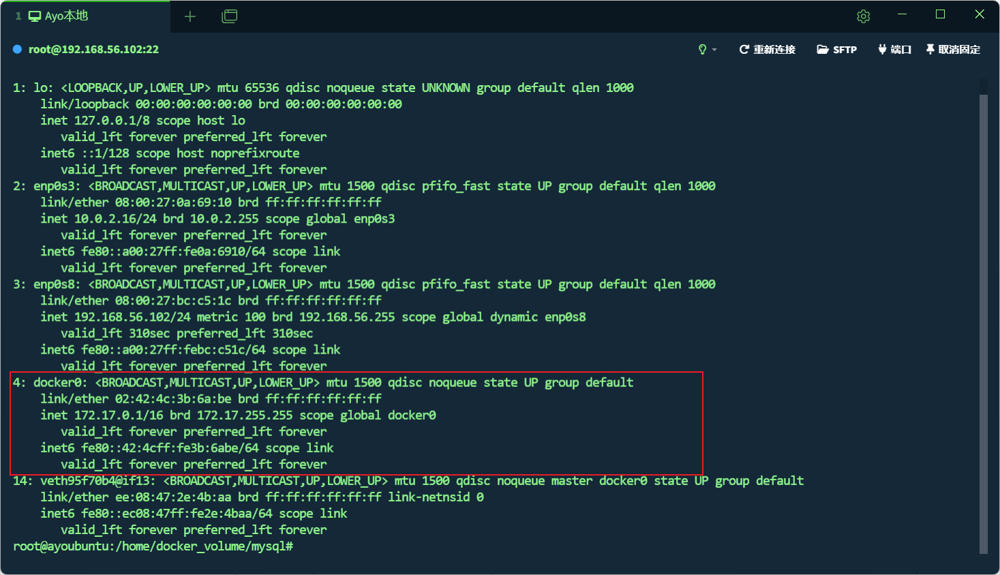
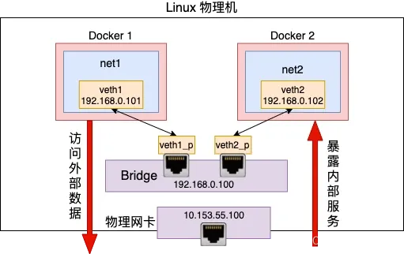
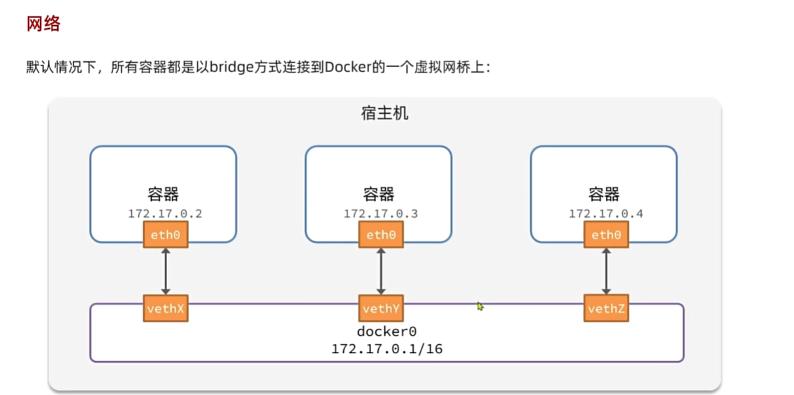
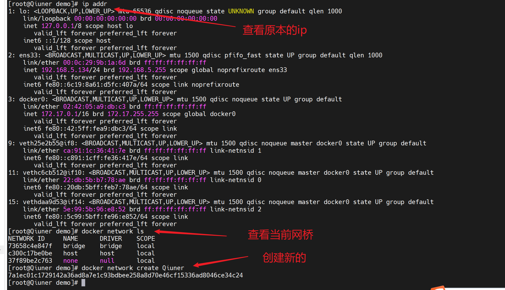
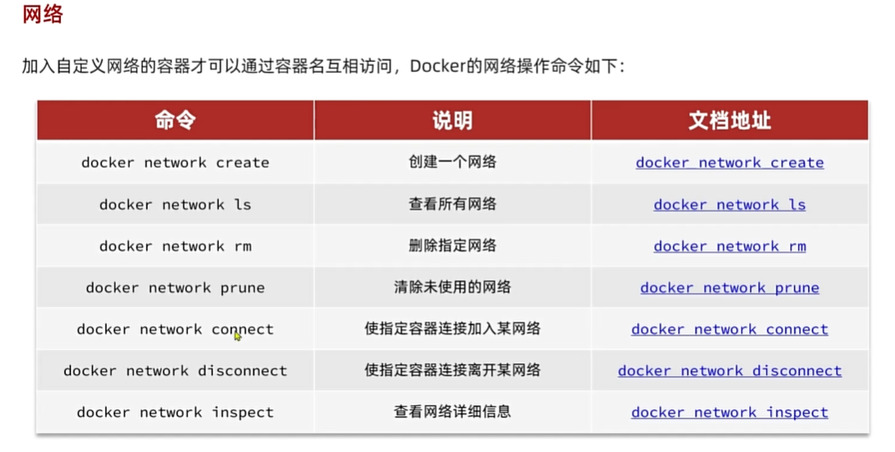
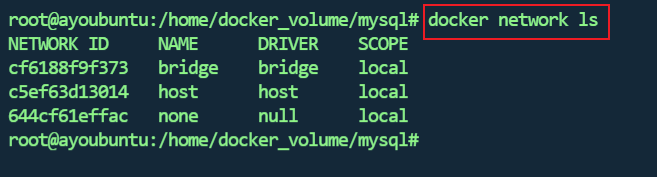
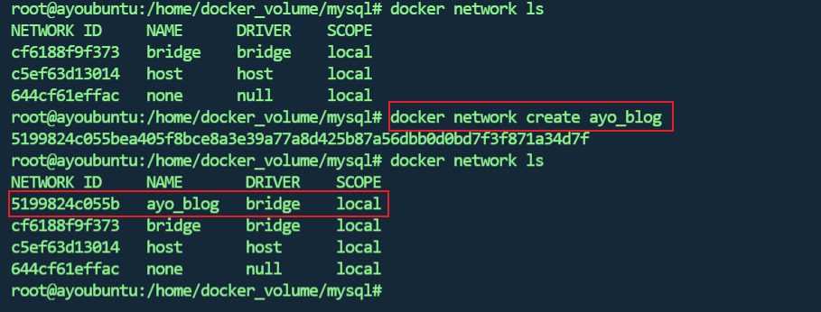
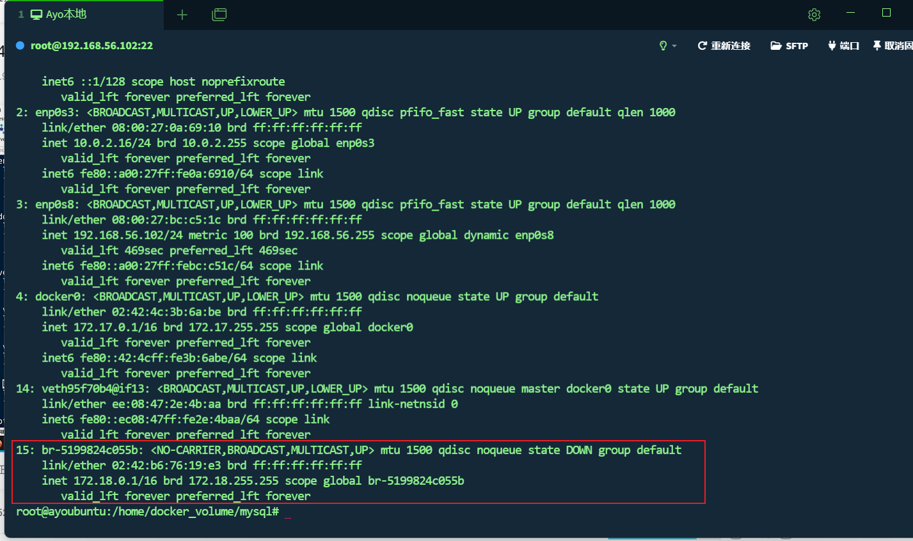
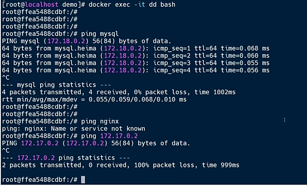

`同网桥下的两个容器可以通过容器名互相访问`

## Docker网路基础理论

`docker`使用`Linux桥接网卡`，在宿主机`虚拟一个docker容器网桥（docker0）`，docker启动一个容器时会根据docker网桥的网段分配给容器一个IP地址，称为`Container-IP`，同时`Docker网桥`是`每个容器的默认网络网关`。因为在同一宿主机内的容器都接入同一个网桥，这样**容器之间就能够通过容器的Container-IP直接通信**。

`docker网桥`是`宿主机虚拟出来`的，并不是真实存在的网络设备，**外部网络是无法寻址到的**，这也意味着外部网络无法通过直接`Container-IP`访问到容器。

如果容器希望外部访问能够访问到，可以通过`映射容器端口`到`宿主主机(端口映射)`，即`docker run`创建容器时候通过`-p`或`-P`参数来启用，访问容器的时候就通过`宿主机IP:容器端口`访问容器。

```shell
ip a
```





## Docker网络模型的基本概念

Docker网络模型是一套用于管理和维护容器网络通信的机制。在深入探讨不同类型的Docker网络之前，我们先来了解一些基本的网络知识。

#### OSI模型与容器网络

开放系统互联（OSI）模型是一种网络通信的参考模型，将通信分为七个不同的层次，从物理连接到应用层。与之类似，Docker网络模型也将网络通信分为不同的层次，从容器内部的通信到跨主机的通信。这种类比有助于我们更好地理解容器网络的不同层次以及各个层次之间的关系。

#### 理解IP地址、子网掩码和网关

`IP地址`在网络中充当了**设备的唯一标识符**。它是网络通信的基础，使得不同设备可以在网络上互相识别和交流。而`子网掩码`则用来定义`IP地址`中哪部分`代表网络`，哪部分`代表主机`。这种分割有助于`路由器`等设备判断`数据包的流向`。

在容器网络中，每个容器都有自己的`IP地址`，它们可以通过这些IP地址进行通信。同时，为了实现容器与外部网络的交互，容器所在的主机还需要一个特殊的IP地址，称为`网关`。网关充当了`容器`与`外部网络`之间的中转站，负责将数据包正确地传递给目标。

理解这些基本的网络概念对于理解Docker网络模型和容器间的通信机制至关重要。接下来，我们将深入探讨不同类型的Docker网络，以及如何在容器中应用这些概念。

## Docker网络模式

| Docker网络模式  | 配置                      | 说明                                                         |
| --------------- | ------------------------- | ------------------------------------------------------------ |
| host模式        | –net=host                 | 容器和宿主机共享`Network namespace`。 容器将不会虚拟出自己的网卡，配置自己的IP 等，而是使用宿主机的IP和端口。 |
| container模式   | –net=container:NAME_or_ID | 容器和另外一个容器共享`Network namespace`。 kubernetes中的pod就是多个容器共享一个Network namespace。 创建的容器不会创建自己的网卡，配置自己的 IP， 而是和`一个指定的容器共享IP、端口范围`。 |
| none模式        | –net=none                 | 容器有独立的Network namespace，并没有对其进行任何网络设置，如分配veth pair和网桥连接，配置IP等。 `该模式关闭了容器的网络功能。` |
| bridge模式      | –net=bridge               | (`默认模式`)。此模式会为每一个容器分配、设置IP等，并将容器连接到一个`docker0虚拟网桥`，通过`docker0网桥`以及`Iptable nat`表配置与宿主机通信 |
| Macvlan network | 无                        | 容器具备Mac地址，使其显示为网络上的物理 设备                 |
| Overlay         | 无                        | (覆盖网络): 利用VXLAN实现的bridge模式                        |

### bridge模式

默认的网络模式。bridge模式下容器没有一个公有ip,只有宿主机可以直接访问,外部主机是不可见的,但容器通过宿主机的NAT规则后可以访问外网。

#### Bridge 桥接模式的实现步骤

- Docker Daemon利用veth pair技术，在宿主机上创建两个虚拟网络接口设备，假设为veth0 和veth1。而veth pair技术的特性可以保证无论哪一个veth接收到网络报文，都会将报文传输给另一方。
- Docker Daemon将veth0附加到Docker Daemon创建的docker0网桥上。保证宿主机的网络报 文可以发往veth0;
- Docker Daemon 将veth1添加到Docker Container所属的namespace下，并被改名为eth0。 如此一来，保证宿主机的网络报文若发往veth0则立即会被eth0接收，实现宿主机到Docker Container网络的联通性;同时也保证Docker Container单独使用eth0，实现容器网络环境的隔离性。

#### Bridge桥接模式的缺陷

Docker Container不具有一个公有IP，即和宿主机eth0不处于同一个网段。导致的结果是宿主机以外的世界不能直接和容器进行通信。

##### 注意

eth设备是成双成对出现的，一端是容器内部命名为eth0，一端是加入到网桥并命名的veth(通常命名为veth)，它们组成了一个数据传输通道，一端进一端出，veth设备连接了两个网络设备并实现了数据通信。

### Host网络模式

host模式相当于Vmware中的NAT模式，与宿主机在同一个网络中，但`没有独立IP地址`。

启动容器使用host模式，容器将不会获得一个独立的Network Namespace，而是和宿主机共用一个Network Namespace。

容器将不会虚拟出自己的网卡，配置自己的IP等，而是使用宿主机的IP和端口。除此之外容器的其他方面，比如文件系统、进程列表等还是和宿主机隔离

使用host模式的容器可以直接使用宿主机的IP地址与外界通信，容器内部的服务端口也可以使用宿主机的端口，不需要进行NAT，`host最大的优势就是网络性能比较好`，docker host上已经使用的端口就不能再用了，网络的隔离性不好。

host网络模式需要在容器创建时指定–network=host

host模式是bridge桥接模式很好的补充。采用host模式的Docker Container，可以直接使用宿主机的IP地址与外界进行通信，若宿主机的eth0是一个公有IP，那么容器也拥有这个公有IP。同时容器内服务的端口也可以使用宿主机的端口，无需额外进行NAT转换。

host模式可以让容器共享宿主机网络栈,这样的好处是外部主机与容器直接通信,但是容器的网络缺少隔离性。

#### Host网络模式的缺陷

使用Host模式的容器不再拥有隔离、独立的网络环境。虽然可以让容器内部的服务和传统情况无差别、无改造的使用，但是由于网络隔离性的弱化，该容器会与宿主机共享竞争网络栈的使用; 另外，容器内部将不再拥有所有的端口资源，原因是部分端口资源已经被宿主机本身的服务占用，还有部分端口已经用以bridge网络模式容器的端口映射。

### Container网络模式

一种特殊host网络模式， ontainer网络模式是Docker中一种较为特别的网络的模式。在容器创建时使用– network=container:vm1指定。(vm1指定的是运行的容器名)处于这个模式下的 Docker 容器会共享一个网络环境,这样两个容器之间可以使用localhost高效快速通信。

#### Container网络模式的缺陷

Container网络模式没有改善容器与宿主机以外世界通信的情况(和桥接模式一样，不能连接宿主机以外的其他设备)。

这个模式指定新创建的容器和已经存在的一个容器共享一个Network Namespace，而不是和宿主机共享。新创建的容器不会创建自己的网卡，配置自己的IP，而是和一个指定的容器共享IP、端口范围等。 同样，两个容器除了网络方面，其他的如文件系统、进程列表等还是隔离的。两个容器的进程可以通过lo网卡设备通信

### none模式

使用none模式，Docker容器拥有自己的Network Namespace，但是，并不为Docker容器进行任何网络配置。`Docker容器没有网卡、IP、路由等信息。需要我们自己为Docker容器添加网卡、配置IP等。`

这种网络模式下容器只有lo回环网络，没有其他网卡。none模式可以在容器创建时通过-- network=none来指定。`这种类型的网络没有办法联网，封闭的网络能很好的保证容器的安全性。`

## docker容器创建流程

- 创建一对`虚拟接口/网卡`，也就是`veth pair`，分别放到`本地主机`和`新容器`中;
- 本地主机一端`桥接`到默认的` docker0 `或`指定网桥`上，并具有一个`唯一的名字`，如 vetha596da4;
- `容器`一端放到`新容器`中，并修改名字作为` eth0`，这个`网卡/接口`**只在容器的名字空间可见**;
- 从网桥可用地址段中(也就是与该bridge对应的network)获取一个空闲地址分配给容器的 eth0，并配置默认路由到桥接网卡 vetha596da4。
- 容器就可以使用 eth0 虚拟网卡来连接其他容器和其他网络。 如果不指定--network，创建的容器默认都会挂到 docker0 上，使用本地主机上 docker0 接口的 IP 作为 所有容器的默认网关。
- 进入容器查看网络地址

```shell
#第一种方式:
docker exec -it nginx bash
ip a

#第二种方式:
docker exec -it nginx ip a	
```

>```
>docker exec -it dd bash
>```
>
>##### 命令解析
>
>1. `docker exec`:
>    - `docker exec` 是用于在运行中的容器内执行命令的 Docker 命令。
>2. `-it`:
>    - `-i`（interactive）: 选项使得容器保持标准输入（STDIN）打开，从而可以交互式地输入命令。
>    - `-t`（tty）: 选项分配一个伪终端，提供一个终端接口。这两个选项通常一起使用，允许用户在容器中进行交互式的命令行操作。
>3. `dd`:
>    - `dd` 是目标容器的名称或 ID。这个名称或 ID 标识了你希望进入的运行中的容器。
>4. `bash`:
>    - `bash` 是你希望在目标容器中运行的命令。在这里，它启动一个 Bash shell，这样你就可以在容器内进行命令行操作。

## 网络基本用法



- 这里的**网络ip是分配的 因此会出现`每次服务启动ip都有变化`的情况**

    >这就导致在项目里连接的mysql地址每次都会由于服务器启动变化

- 虚拟网桥（virtual bridge）是一个虚拟网络设备，它的作用类似于物理交换机，用于在不同的网络接口之间进行转发数据包。在 Docker 中，虚拟网桥主要用于连接宿主机和容器，使它们能够相互通信并与外部网络进行通信。



- 不是查看当前网桥，是列出docker当前存在的所有网络



### 操作



##### **1.创建网络**

```shell
docker network create ayo_blog
```



```shell
ip a
```



会发现多了个网卡

##### 2.将目标容器加入目标网络（容器存在）

```shell
docker network connect ayo_blog mysql
```

查看mysql容器

```shell
docker inspect mysql
```

会发现它存在两个网桥

```shell
"Networks": {
                "ayo_blog": {
                    "IPAMConfig": {},
                    "Links": null,
                    "Aliases": [],
                    "MacAddress": "02:42:ac:12:00:02",
                    "DriverOpts": {},
                    "NetworkID": "5199824c055bea405f8bce8a3e39a77a8d425b87a56dbb0d0bd7f3f871a34d7f",
                    "EndpointID": "a75de727cadda62500269c2d2db61d641ac4bc6bb1c4362a473bf11797a606be",
                    "Gateway": "172.18.0.1",
                    "IPAddress": "172.18.0.2",
                    "IPPrefixLen": 16,
                    "IPv6Gateway": "",
                    "GlobalIPv6Address": "",
                    "GlobalIPv6PrefixLen": 0,
                    "DNSNames": [
                        "mysql",
                        "4475d75879b3"
                    ]
                },
                "bridge": {
                    "IPAMConfig": null,
                    "Links": null,
                    "Aliases": null,
                    "MacAddress": "02:42:ac:11:00:02",
                    "DriverOpts": null,
                    "NetworkID": "cf6188f9f373cc54a5117d781b87612647a69f1136e29617c749985a43eb5252",
                    "EndpointID": "d2c0bcf6b3fd21cfd0cc18feb007d6c721b61903667420ff6f0c7cb00ca11c8c",
                    "Gateway": "172.17.0.1",
                    "IPAddress": "172.17.0.2",
                    "IPPrefixLen": 16,
                    "IPv6Gateway": "",
                    "GlobalIPv6Address": "",
                    "GlobalIPv6PrefixLen": 0,
                    "DNSNames": null
                }
            }
```

##### 3.将目标容器加入目标网络（容器不存在）

在容器创建的一瞬间直接绑定到对应的网桥下面

```shell
docker run \
	--name mysql \
	-e MYSQL_ROOT_PASSWORD=123456 \
	-p 3306:3306 \
	-v /home/docker_volume/mysql/data:/var/lib/mysql \
	-v /home/docker_volume/mysql/init:/docker-entrypoint-initdb.d \
	-v /home/docker_volume/mysql/conf:/etc/mysql/conf.d \
	-d \
	--network ayo_blog \
	mysql:8.0.35
```

查看mysql容器

```shell
docker inspect mysql
```

会发现它只会有一个网桥，不会再加入默认网桥

```shell
"Networks": {
                "ayo_blog": {
                    "IPAMConfig": null,
                    "Links": null,
                    "Aliases": null,
                    "MacAddress": "02:42:ac:12:00:02",
                    "DriverOpts": null,
                    "NetworkID": "5199824c055bea405f8bce8a3e39a77a8d425b87a56dbb0d0bd7f3f871a34d7f",
                    "EndpointID": "d97010c91de949c9e0ef77a420e5643d89398bfe23dd67b3bb37315e32fcc55e",
                    "Gateway": "172.18.0.1",
                    "IPAddress": "172.18.0.2",
                    "IPPrefixLen": 16,
                    "IPv6Gateway": "",
                    "GlobalIPv6Address": "",
                    "GlobalIPv6PrefixLen": 0,
                    "DNSNames": [
                        "mysql",
                        "0bd7cc79b051"
                    ]
                }
            }
```

##### 4.进入容器

```shell
docker exec -it mysql bash
```

这个时候你ping同网桥下的容器可以ping通，ping不通网桥下的哪怕用ip地址也不能ping通



> dd和mysql在一个网桥下，nginx在默认网桥下，dd和mysql都不在默认网桥下

`同网桥下的两个容器可以通过容器名互相访问`
