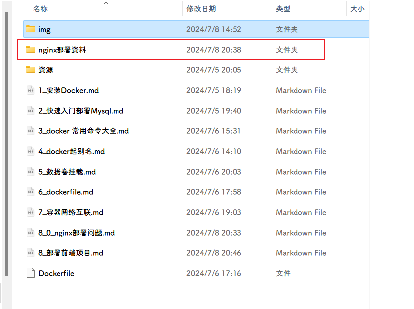

>https://blog.csdn.net/qq_38215042/article/details/108768017
>
>https://blog.csdn.net/qq_45314556/article/details/126991597
>
>https://blog.csdn.net/qq_39267743/article/details/128239124

# 前端部署

创建一个Nginx容器将对应的资源部署

## 1.准备工作



目录结构如下

```shell
.
├── conf
│   ├── conf.d
│   │   ├── base.conf
│   │   └── default.conf
│   ├── fastcgi.conf
│   ├── fastcgi_params
│   ├── mime.types
│   ├── modules -> /usr/lib/nginx/modules
│   ├── nginx.conf
│   ├── nginx.conf_back
│   ├── scgi_params
│   └── uwsgi_params
├── html
│   ├── 404
│   │   ├── 404.html
│   │   ├── css
│   │   │   ├── index.css
│   │   │   └── reset.css
│   │   └── js
│   │       ├── index.js
│   │       ├── jquery-3.0.0.min.js
│   │       └── parallax.min.js
│   └── web
│       ├── css
│       │   └── style.css
│       └── index.html
├── logs
│   ├── access.log
│   ├── error.log
│   └── run
│       └── nginx.pid
└── modules -> /usr/lib/nginx/modules
```

## 2.创建网络

```shell
docker network create ayo_blog
```

## 3.启动容器并挂载目录

```shell
docker run -d \
--name nginx \
-p 80:80 \
-p 81:81 \
-v /home/docker_volume/nginx/conf/nginx.conf:/etc/nginx/nginx.conf \
-v /home/docker_volume/nginx/html:/usr/share/nginx/html \
-v /home/docker_volume/nginx/conf/conf.d:/etc/nginx/conf.d \
-v /home/docker_volume/nginx/logs:/var/log/nginx \
-v /home/docker_volume/nginx/logs/run:/var/run \
--network ayo_blog \
nginx:1.26.1
```

>具体参考：[点我](./8_0_nginx部署问题.md)

## 4.编写nginx配置文件

```nginx
##############################nginx.conf##############################
user  nginx;
worker_processes  auto;

error_log  /var/log/nginx/error.log notice;
pid        /var/run/nginx.pid;

#error_log  logs/error.log;
#error_log  logs/error.log  notice;
#error_log  logs/error.log  info;

#pid        logs/nginx.pid;

events {
		worker_connections  1024;
}

http {
#		set $basepath $ayo_base_path;			
		
#		include mime.types;
		include /etc/nginx/mime.types;
		default_type  application/octet-stream;
		#在Nginx下默认不允许列出整个目录。
		autoindex off;
		
		log_format  main  	'$remote_addr - $remote_user [$time_local] "$request" '
						'$status $body_bytes_sent "$http_referer" '
						'"$http_user_agent" "$http_x_forwarded_for"';
		
		access_log  /var/log/nginx/access.log  main;

		sendfile        on;
		#tcp_nopush     on;

		#keepalive_timeout  0;
		keepalive_timeout  65;

		#gzip  on;
		
		#开启自定义错误页面
		proxy_intercept_errors on;
		fastcgi_intercept_errors on;	

		# 添加的指令 更具自己的系统选择
		include /etc/nginx/conf.d/*.conf;
		# include ./conf/*.conf;  # linux版本

}

```


```shell
##############################base.conf##############################
server {
	listen       81;
	listen  [::]:81;
	server_name  localhost;

	source_charset utf-8;
	charset utf-8;
	# 开启目录访问 off关闭 on开启
#	autoindex on;

	#access_log  logs/host.access.log  main;
	
    # 设置默认根目录  
    root /usr/share/nginx/html;  
    
  
    # 处理/page请求，假设您希望/page/index.html被服务  
    location /web {  
        alias /usr/share/nginx/html/web; # 使用alias直接指定路径  
        index index.html index.htm;  
        add_header 'Access-Control-Allow-Origin' '*';  
        add_header 'Access-Control-Allow-Credentials' 'true';  
    }  
  
#    error_page   500 502 503 504  /50x.html;
#        location = /50x.html {
#            root   html;
#    }
  
  
    error_page   500 502 503 504  /404/404.html;  
    # 设置404错误页面  
    error_page 404 403 /404/404.html;  

}
```

## 5.验证

重启nginx容器

```shell
docker restart nginx
```

浏览器访问


