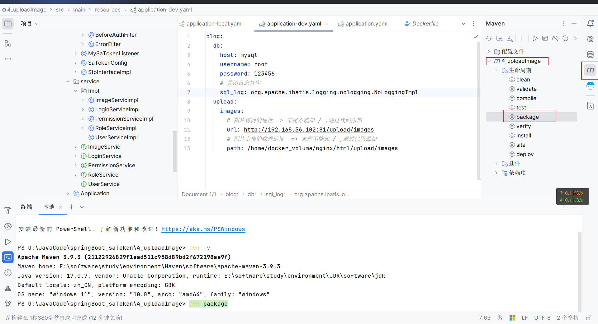
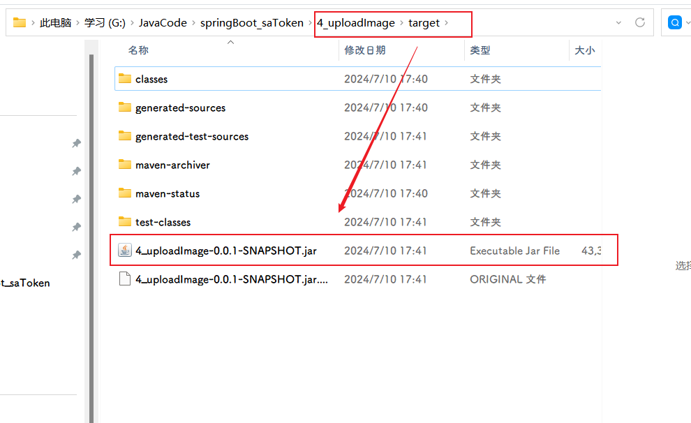

## 1.准备Dockerfile

```Dockerfile
# 1、第一行必须指定 基础镜像信息
FROM jdk17
 
# 2、维护者信息
LABEL maintainer="空耳 <2192475085@qq.com>"
 
#设定时区
ENV TZ=Asia/Shanghai

# 切换到 root 用户，并设置时区
USER root
# 设置时区
RUN ln -snf /usr/share/zoneinfo/$TZ /etc/localtime && echo $TZ > /etc/timezone

# 安装 tzdata 包，并配置时区
# RUN ln -snf /usr/share/zoneinfo/$TZ /etc/localtime && echo $TZ > /etc/timezone \
#    && apt-get update && apt-get install -y tzdata && rm -rf /var/lib/apt/lists/*

#拷贝jar包
COPY ayo-blog.jar /app.jar

#入口
ENTRYPOINT ["java","-jar","/app.jar"]
```

## 2.yaml配置切换到对应的环境上去


## 3.打包项目

#### 方式一：命令


```shell
mvn package
```

#### 方式二：点击



> 报错
>
> ```shell
> [ERROR] Please refer to G:\JavaCode\springBoot_saToken\4_uploadImage\target\surefire-reports for the individual test results.
> [ERROR] Please refer to dump files (if any exist) [date].dump, [date]-jvmRun[N].dump and [date].dumpstream.
> ```
>
> 报错信息中建议你查看具体的测试结果和可能存在的 `dump` 文件。这种情况通常是由于 `Maven` 执行测试时某些测试未通过或者出现异常导致的。
>
> ### 解决方法：
>
> 1. **查看测试报告**： Maven 在执行测试后会生成测试报告，你可以根据路径 `G:\JavaCode\springBoot_saToken\4_uploadImage\target\surefire-reports` 查看具体的测试结果文件。这些文件通常包含有关每个测试类和测试方法的详细信息，包括通过和失败的情况。
>
> 2. **查找并分析 dump 文件**： 如果报错信息中提到了 dump 文件，例如 `[date].dump`, `[date]-jvmRun[N].dump` 等，你可以查看这些文件以获取更多关于失败的测试或异常的详细信息。这些 dump 文件通常包含 JVM 运行时的状态信息和异常堆栈跟踪，有助于定位问题所在。
>
> 3. **检查测试代码和配置**： 如果测试未通过或者出现异常，首先检查测试代码本身。确保测试覆盖到了期望的场景，并且能够正确处理各种输入和条件。另外，检查项目的依赖和配置，特别是与测试相关的配置，如测试数据、环境变量等。
>
> 4. **更新依赖和插件**： 确保你的 Maven 依赖和插件是最新的版本，特别是与测试相关的插件，如 Surefire 插件。有时旧版本的插件可能会导致执行问题或不兼容的情况。
>
> 5. **清理和重新构建**： 如果问题持续存在，尝试清理 Maven 项目并重新构建。使用以下命令可以清理项目：
>
>     ```bash
>     mvn clean
>     ```
>
>     然后重新运行 Maven 打包命令：
>
>     ```bash
>     mvn package
>     ```
>
>     通过这些步骤，你应该能够定位并解决 Maven 打包时出现的问题。确保在处理测试失败时，详细查看测试报告和 dump 文件，这将有助于更快速地定位和修复问题。

#### 打包完成

打包完成后会在项目的`target`目录下生成一个`jar`文件



## 4.上传构建


将`jar`文件和`Dockerfile`文件上传到服务器

然后进入目标路径（也可以不进入）构建镜像对象

```shell
docker build -t 起个镜像名[:设置版本号] dockerfile所在位置

#例如：当前路径就在dockerfile所在
docker build -t blog .
```

> ### **构建报错**
>
> ```bash
>  => ERROR [2/3] RUN ln -snf /usr/share/zoneinfo/Asia/Shanghai /etc/localtime && echo Asia/Shanghai > /etc/timezone                        3.1s
> ------                                                                                                                                         
>  > [2/3] RUN ln -snf /usr/share/zoneinfo/Asia/Shanghai /etc/localtime && echo Asia/Shanghai > /etc/timezone:
> 2.710 ln: failed to create symbolic link '/etc/localtime': Permission denied
> ```
>
> 这个错误表明在你的 Docker 构建过程中出现了权限问题，具体是在设置时区时出现了 `Permission denied` 错误。这通常是由于在 Docker 容器中无法直接操作 `/etc/localtime` 文件导致的。
>
> ### 解决方法
>
> 试了N种方法后，修改DockerFile，先切换到 root 用户，再设置时区
>
> ```dockerfile
> #设定时区
> ENV TZ=Asia/Shanghai
> # 切换到 root 用户，并设置时区
> USER root
> # 设置时区
> RUN ln -snf /usr/share/zoneinfo/$TZ /etc/localtime && echo $TZ > /etc/timezone
> ```
>
> 


## 5.生成项目容器运行

#### 项目

```shell
docker run -d \
--name blog \
-p 8081:8081 \
-v /home/docker_volume/nginx/html/upload/images:/upload/images \
--network ayo_blog \
blog
```

## 6.mysql部署

#### 准备挂载目录

```bash
cd /home			# 进入/home目录
mkdir docker_volume	# 一个统一的docker挂载的目录
cd docker_volume	# 进入/home/docker_volume目录
mkdir mysql	# 创建用于挂载所有mysql配置文件的目录
cd mysql
mkdir data init conf #创建三个文件夹

##################
# data 对应mysql的数据目录
# conf 对应mysql的配置目录
# init mysql初始化要执行的sql文件就放在这
##################
```

#### 运行容器

```shell
############################################不挂载
docker run -d \
	--name mysql  \
	--restart=always \
	-e TZ=Asia/Shanghai \
	-e MYSQL_ROOT_PASSWORD=123456 \
	-p 3309:3306 \
	mysql:8.0.35

############################################测试挂载
docker run -d \
	--name mysql \
	-e TZ=Asia/Shanghai \
	-e MYSQL_ROOT_PASSWORD=123456 \
	-p 3306:3306 \
	-v /home/docker_volume/mysql/data:/var/lib/mysql \
	-v /home/docker_volume/mysql/init:/docker-entrypoint-initdb.d \
	-v /home/docker_volume/mysql/conf:/etc/mysql/conf.d \
	--network ayo_blog \
	mysql:8.0.35
	
############################################最终使用
docker run -d \
	--name mysql \
	--restart=always \
	-e TZ=Asia/Shanghai \
	-e MYSQL_ROOT_PASSWORD='123456' \
	-p 3306:3306 \
	-v /home/docker_volume/mysql/data:/var/lib/mysql \
	-v /home/docker_volume/mysql/init:/docker-entrypoint-initdb.d \
	-v /home/docker_volume/mysql/conf:/etc/mysql/conf.d \
	mysql:8.0.35

```

#### 导出sql文件在远程执行

导出sql


连接远程mysql服务，并创建同名数据库


执行导出的sql文件


## 7.验证

我的本地Ubuntu地址在`192.168.56.102`

进入我的项目发布地址：http://192.168.56.102:8081/blog/doc.html


操作成功
