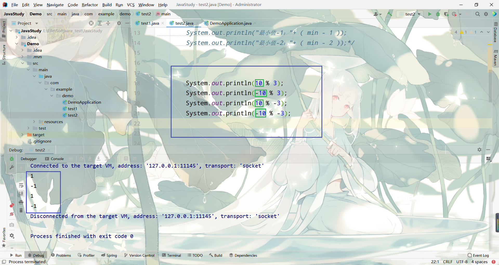
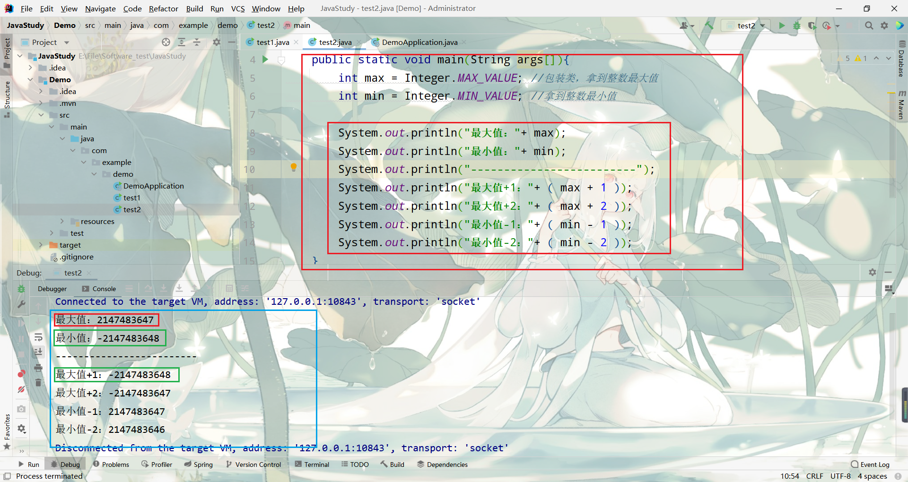
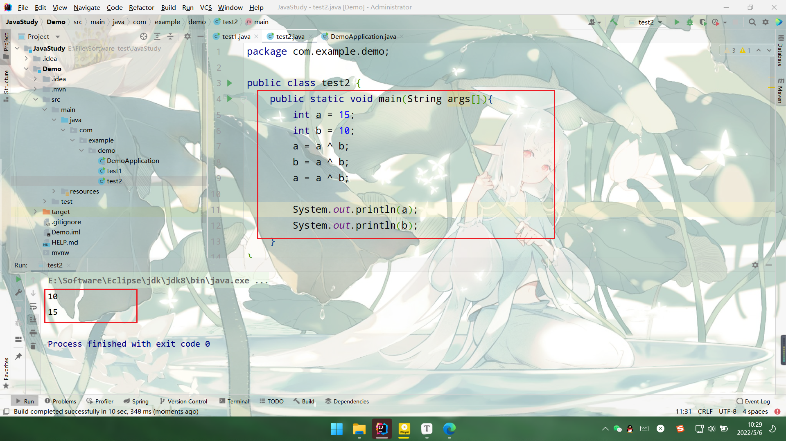
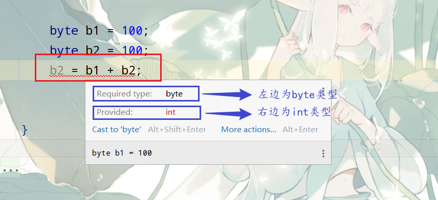
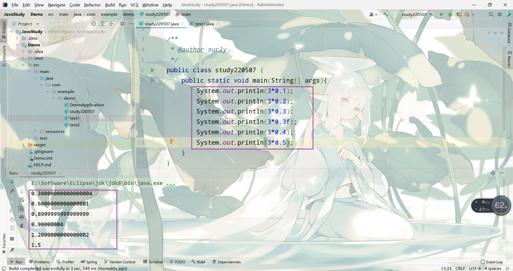

# 算数运算符

[toc]


| 符号 |   说明    |
| :--: | :-------: |
|  +   |    加     |
|  -   |    减     |
|  *   |    乘     |
|  /   |    除     |
|  %   | 求余/取模 |

> `整数`除以`整数`一定是`整数`，例如3/2=1，余数1除不了2被省略
>
> 
>
> `%`表示`取模`，即拿运算结果的`余数`，列入4%3=1
>
> `%`有`符号`问题，结果永远与`被除数`一致，可以理解为表达式的左边



## 关系运算符

| 符号 |    说明    |
| :--: | :--------: |
|  >   |    大于    |
|  <   |    小于    |
|  >=  | 大于或等于 |
|  <=  | 大于或小于 |
|  ==  |    等于    |
|  !=  |   不等于   |

> ==注意：==上述关系运算符只适用于八个`基本数据类型`，不适用于`字符串类型`的
>
> `字符串类型`有专门的的比较方法，即`equals()`，验证两个字符串是否`相等`
>
> 关系运算符的运算结果都是`布尔值`
>
> `!`表示 `非/取反`

## 运算符的优先级

| 优先级 |                      运算符                      |  结合性  |
| :----: | :----------------------------------------------: | :------: |
|   1    |                    ()、[]、{}                    | 从左向右 |
|   2    |                !、+、-、~、++、--                | 从右向左 |
|   3    |                     *、/、%                      | 从左向右 |
|   4    |                       +、-                       | 从左向右 |
|   5    |                    «、»、>>>                     | 从左向右 |
|   6    |             <、<=、>、>=、instanceof             | 从左向右 |
|   7    |                      ==、!=                      | 从左向右 |
|   8    |                        &                         | 从左向右 |
|   9    |                        ^                         | 从左向右 |
|   10   |                        \|                        | 从左向右 |
|   11   |                        &&                        | 从左向右 |
|   12   |                       \|\|                       | 从左向右 |
|   13   |                        ?:                        | 从右向左 |
|   14   | =、+=、-=、*=、/=、&=、\|=、^=、~=、«=、»=、>>>= | 从右向左 |

> 遇到优先级问题不知道怎么判断，可以加小括号防止
>
> 例如：(3%5)+3  `>` 7-(5/6)

## 案例

### 输入个三位数，求各个位数的和

```java
int num = 123;
int geWei = num%10;
int shiWei = num/10%10;
int baiWei = num/100;

int sum = geWei + shiWei + baiWei
```

**规律如下：**

输入个五位数，求各个位数的和

```java
int num = 12345;
int geWei     = num  /1        %10;
int shiWei    = num  /10       %10;
int baiWei    = num  /100      %10;
int qianWei   = num  /1000     %10;
int wanWei    = num  /10000    %10;

int sum = geWei + shiWei + baiWei + qianWei + wanWei
```

> 通项：num`/`num所在位的最小值`%`10

### 两个数交换

一般初学者的做法

```java
int a = 15；
int b = 10；
a = b;
b = a;

//此时 a=10，b=10，自己理解！！！
```

**方法一：**通过临时中间变量

实际上一般防止这种赋值导致的值丢失的问题，我们会借助一个`临时`的`中间变量`来进行临时的值存储

```java
int a = 15;
int b = 10;
int c = a;
a = b;
b = c;
```

**方法二：**通过数学运算(不推荐)

我们也可以通过数学的加减来操作，但一般不建议，因为数据都有取值范围，如果进行相加相减，可能会导致数据的范围溢出

```java
a = a + b;  //25
b = a - b;	//15
a = a - b;  //10
```

变量溢出如下

> 最大值加一变成最小值。最小值减一变成最大值

**方法三：**位运算

```java
a = a ^ b;  
b = a ^ b;	
a = a ^ b;  
```

位运算是`效率最高`的,位运算的本质是`2进制的运算`，具体的后续再阐明

## 逻辑运算符

|    符号    | 说明 |
| :--------: | :--: |
|    `！`    |  非  |
| `&&` / `&` |  与  |
| `||` / `|` |  或  |

```java
System.out.println(2<1 && 1/0==0);  //false
System.out.println(2>1 || 1/0==0);	//true
```

```java
System.out.println(2<1 & 1/0==0);  
System.out.println(2>1 | 1/0==0);	

//报错
//Exception in thread "main" java.lang.ArithmeticException: / by zero
//算数异常 来自0
```

**两个符号**的逻辑运算符`&&`、`||`会根据`真值表`判断（**短路特性**）

像案例里的 `&&`当其验证`第一个`表达式为`false`时，则会发生`短路效应`，`直接跳过`第二个验证，返回false

`||`当其验证`第一个`表达式为`true`时，则会发生`短路效应`，`直接跳过`第二个验证，返回true

所有`&&`被称作为`短路与`，`||`被称作为`短路非`

> 逻辑与和逻辑非根据真值表验证，当验证一半觉得没必要再验证的时候，直接略过后续的验证，返回最终结果

**一个符号**则前后`两个都要验证`，当验证表达式`除数为0`，则直接`报错`

> 
>
> **细节一**
>
> ```java
> a = a + 2;
> //等价于
> a += 2;
> ```
>
> 即`右边`的`a`  `左边`也有，则可以`省略不写`，直接将`+`号放`=`号`前`即可
>
> **面试题**
>
> ```java
> int a = 15;
> a =+ 10;
> //请问：a等于多少
> ```
>
> 结果：a为10，应为 a=+10表示将右边的`正10 (+10)`赋值给左边的`a`，平时正号都是省略不写，所以容易忽视，以此也可以理解为什么要将`+=`的`+`放前面去
>
> 
>
> **细节二**
>
> | 自增/自减 |        说明         |
> | :-------: | :-----------------: |
> |    i++    | 自增1，**先用后增** |
> |    ++i    | 自增1，**先增后用** |
> |    i--    | 自减1，**先用后减** |
> |    --i    | 自减1，**先减后用** |
>
> ```java
>  int a = 10;
> System.out.println(a++); //10
> System.out.println(a);	 //11
> ```
>
> ```java
> int a = 10;
> System.out.println(a++);//10
>  System.out.println(a++);//11
> ```
>
> ```java
> int a = 10;
> System.out.println(++a); //11
> System.out.println(a);  //11
> ```
>
> 
>
> **细节三**
>
> 对于`整数`来说只含有时 `=` `+=`具有内置转换器
>
> ```java
> byte a = 10；//int
> float b = 123.4; //报错，浮点类型默认为double，大转小需要强制转换
> float b = 123.4f;
> ```
>
> ```java
> byte b1 = 100;
> byte b2 = 100;
> b2 = b1 = b2;//报错
> ```
>
> 
>
> 特例：对于`小于int`的`整数`情况(`byte`、`short`)，运算结果`不为数据类型本身`，而是`int类型`，即 `byte+byte`/`short+short` -----》`int`
>
> 所以一般需要强制转换
>
> ```java
>  b2 = (byte)(b1 + b2);
> ```
>
> 上述的`+=`由于内置转换器，所以下述案例不会报错
>
> ```java
> byte b1 = 100;
> byte b2 = 100;
> b2 += b1;
> ```
>
> 虽然`b2 += b1`类似于`b2 = b1 + b2`，但第一个表达式由于`整数` `只`含有`+=`会有内置转换器将其转换，第二个表示除了`=`还具有`+`所以不具有内置转换器的属性
>
> ==只有short和char具有这种特例==

> 字符串判断相等：equals()
>
> 字符串判断不相等：!equals()
>
> ```java
> String a = "abc";
> String b = "abc";
> System.out.println(a.equals(b)); //true  判断a、b是否相等
> System.out.println(!a.equals(b)); //false 判断a、b是否不相等
> 
> //有些情况
> System.out.println(a==b);//true
> //结果好像也对，但这关系到类和对象的引用问题，后续会说明，不建议字符串使用这种方法来进行验证
> ```
>
> 

## 三目运算符

```java
min=(a<b)?a:b;
```

其中"(a<b)?a:b"是一个"条件表达式",它是这样执行的:如果a<b为真,则表达式取a值,否则取b值.

条件运算符由两个符号组成"**?**"和"**:**", 要求有3个操作对象,所以也叫它**三目运算符**

**语法**：

```java
parp = 布尔值？如果为true赋值此结果:如果为假赋值此结果
```

> **细节四：**
>
> 
>
>  **表层原因**：**`float`和`int`都是`32bit`**
>
> `int`的范围能够容纳下2的32次方个数字
>
> `float`的小数，单0到1之间就有无穷小个数字，因此2的32次方个位置无法容纳全部小数
>
> **深层原因：** **计算机是`二进制`的**
>
> 任何整数都是可以用**2的各个次方`和/差`表示**，例如整数`5`可以表示为**2^2^+2^1^=5**，整数`7`可以表示为**2^3^-2^1^=7**
>
> 但小数无法完美使用**2的各个次方`和/差`表示**
>
> ==具体解决过程后续的包装类会再具体解决==

