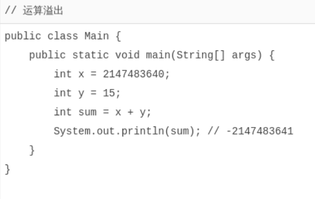

# 整数运算

[toc]

---

Java的整数运算遵循四则运算规则，可以使用任意嵌套的小括号。四则运算规则和初等数学一致。例如：


`整数`的数值表示不但是`精确`的，而且整数`运算永远是精确`的，即使是除法也是精确的，因为**两个整数相除只能得到结果的整数**部分：

```java
int x = 12345 / 67; // 184
```

求余运算使用`%`：

```java
int y = 12345 % 67; // 12345÷67的余数是17
```

特别注意：整数的除法对于除数为0时运行时将报错，但编译不会报错。

### 溢出

要特别注意，整数由于存在范围限制，如果计算结果超出了范围，就会产生`溢出`，而**溢出*不会出错***，却会得到一个奇怪的结果：



要解释上述结果，我们把整数`2147483640`和`15`换成二进制做加法：

```java
  0111 1111 1111 1111 1111 1111 1111 1000
+ 0000 0000 0000 0000 0000 0000 0000 1111
-----------------------------------------
  1000 0000 0000 0000 0000 0000 0000 0111
```

由于最高位计算结果为`1`，因此，加法结果变成了一个负数。

要解决上面的问题，可以把`int`换成`long`类型，由于`long`可表示的整型范围更大，所以结果就不会溢出：

```java
long x = 2147483640;
long y = 15;
long sum = x + y;
System.out.println(sum); // 2147483655
```

还有一种`简写的运算符`，即`+=`，`-=`，`*=`，`/=`，它们的使用方法如下：

```java
n += 100; // 3409, 相当于 n = n + 100;
n -= 100; // 3309, 相当于 n = n - 100;
```

### 自增/自减

Java还提供了`++`运算和`--`运算，它们可以对一个整数进行加1和减1的操作：


注意`++`写在前面和后面计算结果是不同的，`++n`表示先加1再引用n，`n++`表示先引用n再加1。不建议把`++`运算混入到常规运算中，容易自己把自己搞懵了。

### 移位运算

在计算机中，整数总是以二进制的形式表示。例如，`int`类型的整数`7`使用4字节表示的二进制如下：

```java
00000000 0000000 0000000 00000111
```

可以对整数进行移位运算。对整数7左移1位将得到整数14，左移两位将得到整数28：

```java
int n = 7;       // 00000000 00000000 00000000 00000111 = 7
int a = n << 1;  // 00000000 00000000 00000000 00001110 = 14
int b = n << 2;  // 00000000 00000000 00000000 00011100 = 28
int c = n << 28; // 01110000 00000000 00000000 00000000 = 1879048192
int d = n << 29; // 11100000 00000000 00000000 00000000 = -536870912
```

左移29位时，由于最高位变成`1`，因此结果变成了负数。

类似的，对整数28进行右移，结果如下：

```java
int n = 7;       // 00000000 00000000 00000000 00000111 = 7
int a = n >> 1;  // 00000000 00000000 00000000 00000011 = 3
int b = n >> 2;  // 00000000 00000000 00000000 00000001 = 1
int c = n >> 3;  // 00000000 00000000 00000000 00000000 = 0
```

如果对一个负数进行右移，最高位的`1`不动，结果仍然是一个负数：

```java
int n = -536870912;
int a = n >> 1;  // 11110000 00000000 00000000 00000000 = -268435456
int b = n >> 2;  // 11111000 00000000 00000000 00000000 = -134217728
int c = n >> 28; // 11111111 11111111 11111111 11111110 = -2
int d = n >> 29; // 11111111 11111111 11111111 11111111 = -1
```

还有一种无符号的右移运算，使用`>>>`，它的特点是不管符号位，右移后高位总是补`0`，因此，对一个负数进行`>>>`右移，它会变成正数，原因是最高位的`1`变成了`0`：

```java
int n = -536870912;
int a = n >>> 1;  // 01110000 00000000 00000000 00000000 = 1879048192
int b = n >>> 2;  // 00111000 00000000 00000000 00000000 = 939524096
int c = n >>> 29; // 00000000 00000000 00000000 00000111 = 7
int d = n >>> 31; // 00000000 00000000 00000000 00000001 = 1
```

对`byte`和`short`类型进行移位时，会首先转换为`int`再进行位移。

> 仔细观察可发现，`左移`实际上就是`不断地×2`，`右移`实际上就是`不断地÷2`。

### 位运算

`位运算`是`按位`进行`与`、`或`、`非`和`异或`的运算。

==与运算==的规则是，必须两个数同时为`1`，结果才为`1`：

```java
n = 0 & 0; // 0
n = 0 & 1; // 0
n = 1 & 0; // 0
n = 1 & 1; // 1
```

==或运算==的规则是，只要任意一个为`1`，结果就为`1`：

```java
n = 0 | 0; // 0
n = 0 | 1; // 1
n = 1 | 0; // 1
n = 1 | 1; // 1
```

`非运算`的规则是，`0`和`1`互换（转成二进制的情况下，具体参考汇编）：

```java
n = ~0; // -1
n = ~1; // -2


//规则  一个数取反减1
~1 => -1-1
~0 => -0-1
    
//说明 ~ 运算是效率最高的运算，且其结果永远是整数(丢失小数部分)   
```

`异或运算`的规则是，如果两个数不同，结果为`1`，否则为`0`：

```java
n = 0 ^ 0; // 0
n = 0 ^ 1; // 1
n = 1 ^ 0; // 1
n = 1 ^ 1; // 0
```

对两个整数进行位运算，实际上就是按位对齐，然后依次对每一位进行运算。例如：


上述按位与运算实际上可以看作两个整数表示的IP地址`10.0.17.77`和`10.0.17.0`，通过与运算，可以快速判断一个IP是否在给定的网段内。

### 运算优先级

在`Java`的计算表达式中，运算优先级从`高到低`依次是：

- `()`
- `!` `~` `++` `--`
- `*` `/` `%`
- `+` `-`
- `<<` `>>` `>>>`
- `&`
- `|`
- `+=` `-=` `*=` `/=`

记不住也没关系，只需要**加括号就可以保证运算的优先级**正确。

### 类型自动提升与强制转型

在运算过程中，如果参与运算的两个数类型不一致，那么计算结果为`较大类型`的整型。例如，`short`和`int`计算，结果总是`int`，原因是`short`首先自动被转型为`int`：


也可以将结果`强制转型`，即将**大范围的整数转型为小范围**的整数。强制转型使用`(类型)`，例如，将`int`强制转型为`short`：

```java
int i = 12345;
short s = (short) i; // 12345
```

要注意，超出范围的强制转型会得到错误的结果，原因是转型时，`int`的两个高位字节直接被扔掉，仅保留了低位的两个字节：


因此，强制转型的结果很可能是错的。

### 练习

计算前N个自然数的和可以根据公式：

```txt
(1+N)×N2\frac{(1+N)\times N}22(1+N)×N
```

请根据公式计算前N个自然数的和：

```java
package test;
public class test1 {
    public static void main(String[] args) {
        int i = 99;
        int sum = (1+i)*i/2;
        System.out.println(sum);
    }
}
```

### 小结

整数运算的结果永远是精确的；

运算结果会自动提升；

可以强制转型，但超出范围的强制转型会得到错误的结果；

应该选择合适范围的整型（`int`或`long`），没有必要为了节省内存而使用`byte`和`short`进行整数运算。
