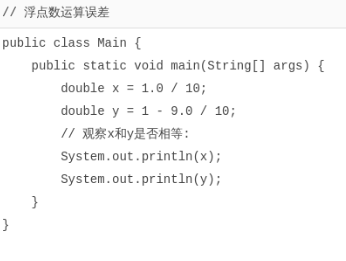
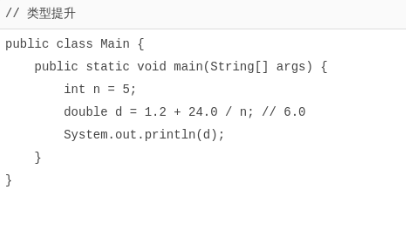
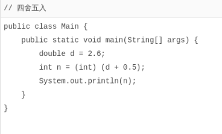

# 浮点数运算

[toc]

`浮点数`运算和`整数`运算相比，只能进行`加减乘除`这些数值计算，`不能`做`位运算`和`移位运算`。

在计算机中，浮点数虽然表示的范围大，但是，浮点数有个非常重要的特点，就是**浮点数常常无法精确表示**。

举个栗子：

浮点数`0.1`在计算机中就无法精确表示，因为十进制的`0.1`换算成二进制是一个无限循环小数，很显然，无论使用`float`还是`double`，都只能存储一个`0.1`的近似值。但是，`0.5`这个浮点数又可以精确地表示。

因为**浮点数常常无法精确表示，因此，浮点数运算会产生误差**：



由于**浮点数存在运算误差**，所以`比较两个浮点数是否相等`常常会出现错误的结果。正确的比较方法是`判断两个浮点数之差的绝对值是否小于一个很小的数`：

```java
// 比较x和y是否相等，先计算其差的绝对值:
double r = Math.abs(x - y);
// 再判断绝对值是否足够小:
if (r < 0.00001) {
    // 可以认为相等
} else {
    // 不相等
}
```

浮点数在内存的表示方法和整数比更加复杂。Java的浮点数完全遵循[IEEE-754](https://web.archive.org/web/20070505021348/http://babbage.cs.qc.edu/courses/cs341/IEEE-754references.html)标准，这也是绝大多数计算机平台都支持的浮点数标准表示方法。

### 类型提升

如果参与运算的两个数其中一个是整型，那么`整型`可以`自动提升`到`浮点型`：



需要特别注意，在一个`复杂的四则运算`中，两个整数的运算`不会出现自动提升`的情况。例如：

```java
double d = 1.2 + 24 / 5; // 5.2
```

计算结果为`5.2`，原因是编译器计算`24 / 5`这个子表达式时，按两个整数进行运算，结果仍为整数`4`。

### 溢出

整数运算在除数为`0`时会报错，而浮点数运算在除数为`0`时，不会报错，但会返回几个特殊值：

- `NaN`表示Not a Number
- `Infinity`表示无穷大
- `-Infinity`表示负无穷大

例如：

```java
double d1 = 0.0 / 0; // NaN
double d2 = 1.0 / 0; // Infinity
double d3 = -1.0 / 0; // -Infinity
```

这三种特殊值在实际运算中很少碰到，我们只需要了解即可。

### 强制转型

可以将`浮点数`强制转型为`整数`。在转型时，`浮点数的小数部分会被丢掉`。如果**转型后超过了整型能表示的最大范围，将返回整型的最大值**。例如：

```java
int n1 = (int) 12.3; // 12
int n2 = (int) 12.7; // 12
int n2 = (int) -12.7; // -12
int n3 = (int) (12.7 + 0.5); // 13
int n4 = (int) 1.2e20; // 2147483647
```

如果要进行四舍五入，可以对浮点数加上0.5再强制转型：



### 小结

浮点数常常无法精确表示，并且浮点数的运算结果可能有误差；

比较两个浮点数通常比较它们的差的绝对值是否小于一个特定值；

整型和浮点型运算时，整型会自动提升为浮点型；

可以将浮点型强制转为整型，但超出范围后将始终返回整型的最大值。
