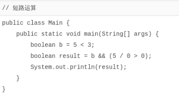
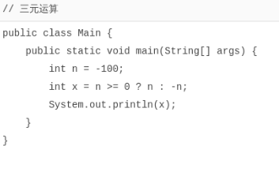

# 布尔运算

[toc]

对于布尔类型`boolean`，永远只有`true`和`false`两个值。

布尔运算是一种关系运算，包括以下几类：

- 比较运算符：`>`，`>=`，`<`，`<=`，`==`，`!=`
- 与运算 `&&`
- 或运算 `||`
- 非运算 `!`

下面是一些示例：

```java
boolean isGreater = 5 > 3; // true
int age = 12;
boolean isZero = age == 0; // false
boolean isNonZero = !isZero; // true
boolean isAdult = age >= 18; // false
boolean isTeenager = age >6 && age <18; // true
```

关系运算符的优先级从`高到低`依次是：

- `!`
- `>`，`>=`，`<`，`<=`
- `==`，`!=`
- `&&`
- `||`

### 短路运算

布尔运算的一个重要特点是短路运算。如果一个布尔运算的表达式能提前确定结果，则后续的计算不再执行，直接返回结果。

因为`false && x`的结果总是`false`，无论`x`是`true`还是`false`，因此，与运算在确定第一个值为`false`后，不再继续计算，而是直接返回`false`。

我们考察以下代码：



如果没有短路运算，`&&`后面的表达式会由于除数为`0`而报错，但实际上该语句并未报错，原因在于与运算是短路运算符，提前计算出了结果`false`。

如果变量`b`的值为`true`，则表达式变为`true && (5 / 0 > 0)`。因为无法进行短路运算，该表达式必定会由于除数为`0`而报错，可以自行测试。

类似的，对于`||`运算，只要能确定第一个值为`true`，后续计算也不再进行，而是直接返回`true`：

```java
boolean result = true || (5 / 0 > 0); // true
```

### 三元运算符

Java还提供一个三元运算符`b ? x : y`，它根据第一个布尔表达式的结果，分别返回后续两个表达式之一的计算结果。示例：



上述语句的意思是，判断`n >= 0`是否成立，如果为`true`，则返回`n`，否则返回`-n`。这实际上是一个求绝对值的表达式。

注意到三元运算`b ? x : y`会首先计算`b`，如果`b`为`true`，则只计算`x`，否则，只计算`y`。此外，`x`和`y`的类型必须相同，因为返回值不是`boolean`，而是`x`和`y`之一。

### 小结

与运算和或运算是短路运算；

三元运算`b ? x : y`后面的类型必须相同，三元运算也是“短路运算”，只计算`x`或`y`。
