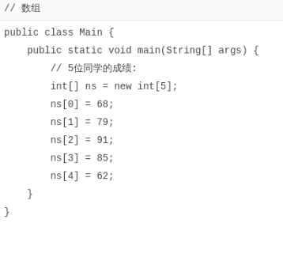
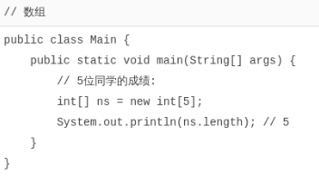
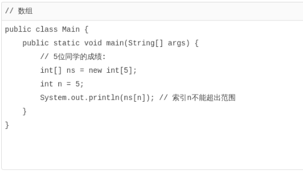
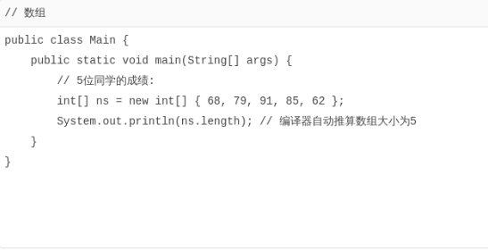
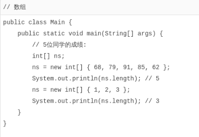
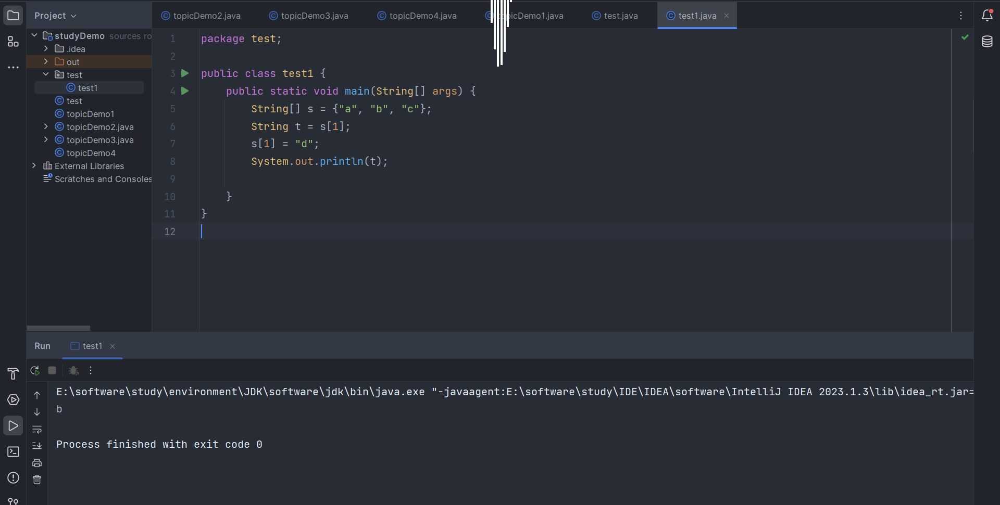

# 数组类型

[toc]

如果我们有一组类型相同的变量，例如，5位同学的成绩，可以这么写：

```java
public class Main {
    public static void main(String[] args) {
        // 5位同学的成绩:
        int n1 = 68;
        int n2 = 79;
        int n3 = 91;
        int n4 = 85;
        int n5 = 62;
    }
}
```

但其实没有必要定义5个`int`变量。可以使用数组来表示“一组”`int`类型。代码如下：



定义一个数组类型的变量，使用数组类型“类型[]”，例如，`int[]`。和单个基本类型变量不同，数组变量初始化必须使用`new int[5]`表示创建一个可容纳5个`int`元素的数组。

Java的数组有几个特点：

- 数组所有元素初始化为默认值，整型都是`0`，浮点型是`0.0`，布尔型是`false`；
- **数组一旦创建后，大小就不可改变**。

要访问数组中的某一个元素，需要使用索引。数组索引从`0`开始，例如，5个元素的数组，索引范围是`0`~`4`。

可以修改数组中的某一个元素，使用赋值语句，例如，`ns[1] = 79;`。

可以用`数组变量.length`获取数组大小：



数组是`引用类型`，在使用索引访问数组元素时，如果`索引超出范围`，运行时将`报错`：



也可以在定义数组时直接指定初始化的元素，这样就不必写出数组大小，而是由编译器自动推算数组大小。例如：



还可以进一步简写为：

```java
int[] ns = { 68, 79, 91, 85, 62 };
```

注意数组是引用类型，并且数组大小不可变。我们观察下面的代码：



数组大小变了吗？看上去好像是变了，但其实根本没变。

对于数组`ns`来说，执行`ns = new int[] { 68, 79, 91, 85, 62 };`时，它指向一个5个元素的数组：

```txt
     ns
      │
      ▼
┌───┬───┬───┬───┬───┬───┬───┐
│   │68 │79 │91 │85 │62 │   │
└───┴───┴───┴───┴───┴───┴───┘
```

执行`ns = new int[] { 1, 2, 3 };`时，它指向一个_新的_3个元素的数组：

```txt
     ns ──────────────────────┐
                              │
                              ▼
┌───┬───┬───┬───┬───┬───┬───┬───┬───┬───┬───┐
│   │68 │79 │91 │85 │62 │   │ 1 │ 2 │ 3 │   │
└───┴───┴───┴───┴───┴───┴───┴───┴───┴───┴───┘
```

但是，原有的5个元素的数组并没有改变，只是无法通过变量`ns`引用到它们而已。

### 字符串数组

如果`数组元素`**不是基本类型**，而是一个`引用类型`，那么，修改数组元素会有哪些不同？

`字符串`是`引用类型`，因此我们先定义一个字符串数组：

```java
String[] names = {
    "ABC", "XYZ", "zoo"
};
```

对于`String[]`类型的数组变量`names`，它实际上包含3个元素，但每个元素都指向某个字符串对象：

```txt
          ┌─────────────────────────┐
    names │   ┌─────────────────────┼───────────┐
      │   │   │                     │           │
      ▼   │   │                     ▼           ▼
┌───┬───┬─┴─┬─┴─┬───┬───────┬───┬───────┬───┬───────┬───┐
│   │░░░│░░░│░░░│   │ "ABC" │   │ "XYZ" │   │ "zoo" │   │
└───┴─┬─┴───┴───┴───┴───────┴───┴───────┴───┴───────┴───┘
      │                 ▲
      └─────────────────┘
```

对`names[1]`进行赋值，例如`names[1] = "cat";`，效果如下：

```txt
          ┌─────────────────────────────────────────────────┐
    names │   ┌─────────────────────────────────┐           │
      │   │   │                                 │           │
      ▼   │   │                                 ▼           ▼
┌───┬───┬─┴─┬─┴─┬───┬───────┬───┬───────┬───┬───────┬───┬───────┬───┐
│   │░░░│░░░│░░░│   │ "ABC" │   │ "XYZ" │   │ "zoo" │   │ "cat" │   │
└───┴─┬─┴───┴───┴───┴───────┴───┴───────┴───┴───────┴───┴───────┴───┘
      │                 ▲
      └─────────────────┘
```

这里注意到原来`names[1]`指向的字符串`"XYZ"`并没有改变，仅仅是将`names[1]`的引用从指向`"XYZ"`改成了指向`"cat"`，其结果是字符串`"XYZ"`再也无法通过`names[1]`访问到了。

对“指向”有了更深入的理解后，试解释如下代码：

> 输出 => b



> 在上述代码中，输出仍然是 "b" 的原因是因为在执行 `String t = s[1];` 这一行时，变量 `t` 被赋值为数组 `s` 中索引为 1 的元素，即 "b"。
>
> 然后，在执行 `s[1] = "d";` 这一行时，将数组 `s` 中索引为 1 的元素修改为 "d"。但这并不会影响之前已经赋值给变量 `t` 的值，因为 `t` 只是一个字符串类型的变量，它的值在赋值时已经确定，后续数组 `s` 的修改不会对它产生影响。
>
> 因此，最终在执行 `System.out.println(t);` 输出时，仍然会输出变量 `t` 的初始值 "b"。

### 小结

数组是同一数据类型的集合，数组一旦创建后，大小就不可变；

可以通过索引访问数组元素，但索引超出范围将报错；

数组元素可以是值类型（如int）或引用类型（如String），但数组本身是引用类型；
