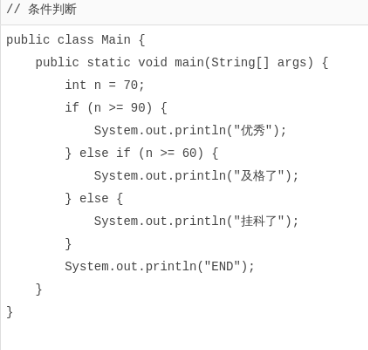

# if判断

[toc]

### if判断

在Java程序中，如果要根据条件来决定是否执行某一段代码，就需要`if`语句。

`if`语句的基本语法是：

```java
if (条件) {
    // 条件满足时执行
}
```

根据`if`的计算结果（`true`还是`false`），JVM决定是否执行`if`语句块（即花括号{}包含的所有语句）。

让我们来看一个例子：


当条件`n >= 60`计算结果为`true`时，`if`语句块被执行，将打印`"及格了"`，否则，`if`语句块将被跳过。修改`n`的值可以看到执行效果。

注意到`if`语句包含的块可以包含多条语句：


当`if`语句块只有一行语句时，可以省略花括号{}：


但是，省略花括号并不总是一个好主意。假设某个时候，突然想给`if`语句块增加一条语句时：


由于使用缩进格式，很容易把两行语句都看成`if`语句的执行块，但实际上只有第一行语句是`if`的执行块。在使用git这些版本控制系统自动合并时更容易出问题，所以不推荐忽略花括号的写法。

### else

`if`语句还可以编写一个`else { ... }`，当条件判断为`false`时，将执行`else`的语句块：


修改上述代码`n`的值，观察`if`条件为`true`或`false`时，程序执行的语句块。

注意，`else`不是必须的。

还可以用多个`if ... else if ...`串联。例如：



串联的效果其实相当于：

```java
if (n >= 90) {
    // n >= 90为true:
    System.out.println("优秀");
} else {
    // n >= 90为false:
    if (n >= 60) {
        // n >= 60为true:
        System.out.println("及格了");
    } else {
        // n >= 60为false:
        System.out.println("挂科了");
    }
}
```

在串联使用多个`if`时，要*特别注意*判断顺序。观察下面的代码：

​	

执行发现，`n = 100`时，满足条件`n >= 90`，但输出的不是`"优秀"`，而是`"及格了"`，原因是`if`语句从上到下执行时，先判断`n >= 60`成功后，后续`else`不再执行，因此，`if (n >= 90)`没有机会执行了。

正确的方式是按照判断范围从大到小依次判断：

```java
// 从大到小依次判断：
if (n >= 90) {
    // ...
} else if (n >= 60) {
    // ...
} else {
    // ...
}
```

或者改写成从小到大依次判断：

```java
// 从小到大依次判断：
if (n < 60) {
    // ...
} else if (n < 90) {
    // ...
} else {
    // ...
}
```

使用`if`时，还要特别注意边界条件。例如：


假设我们期望90分或更高为“优秀”，上述代码输出的却是“及格”，原因是`>`和`>=`效果是不同的。

前面讲过了浮点数在计算机中常常无法精确表示，并且计算可能出现误差，因此，判断浮点数相等用`==`判断不靠谱：


正确的方法是利用差值小于某个临界值来判断：


### 判断引用类型相等

在Java中，判断值类型的变量是否相等，可以使用`==`运算符。但是，判断引用类型的变量是否相等，`==`表示“引用是否相等”，或者说，是否指向同一个对象。例如，下面的两个String类型，它们的内容是相同的，但是，分别指向不同的对象，用`==`判断，结果为`false`：


要判断引用类型的变量内容是否相等，必须使用`equals()`方法：


注意：执行语句`s1.equals(s2)`时，如果变量`s1`为`null`，会报`NullPointerException`：


要避免`NullPointerException`错误，可以利用短路运算符`&&`：


还可以把一定不是`null`的对象`"hello"`放到前面：例如：`if ("hello".equals(s)) { ... }`。

### 小结

`if ... else`可以做条件判断，`else`是可选的；

不推荐省略花括号`{}`；

多个`if ... else`串联要特别注意判断顺序；

要注意`if`的边界条件；

要注意浮点数判断相等不能直接用`==`运算符；

引用类型判断内容相等要使用`equals()`，注意避免`NullPointerException`。
