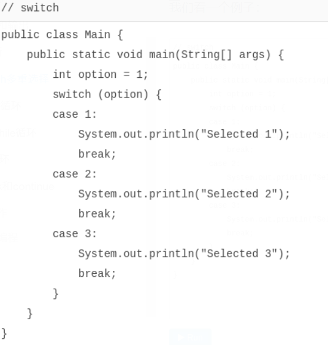
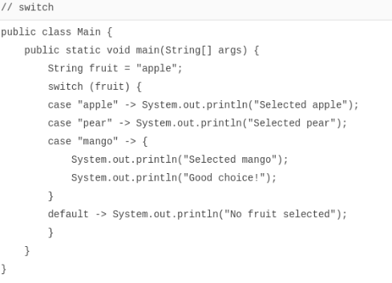

# switch多重选择

[toc]

#### switch多重选择

除了if语句外，还有一种条件判断，是根据某个表达式的结果，分别去执行不同的分支。

例如，在游戏中，让用户选择选项：

1. 单人模式
2. 多人模式
3. 退出游戏

这时，`switch`语句就派上用场了。

`switch`语句根据`switch (表达式)`计算的结果，跳转到匹配的`case`结果，然后继续执行后续语句，直到遇到`break`结束执行。

我们看一个例子：



修改`option`的值分别为`1`、`2`、`3`，观察执行结果。

如果`option`的值没有匹配到任何`case`，例如`option = 99`，那么，`switch`语句不会执行任何语句。这时，可以给`switch`语句加一个`default`，当没有匹配到任何`case`时，执行`default`：


如果把`switch`语句翻译成`if`语句，那么上述的代码相当于：

```java
if (option == 1) {
    System.out.println("Selected 1");
} else if (option == 2) {
    System.out.println("Selected 2");
} else if (option == 3) {
    System.out.println("Selected 3");
} else {
    System.out.println("Not selected");
}
```

对于多个`==`判断的情况，使用`switch`结构更加清晰。

同时注意，上述“翻译”只有在`switch`语句中对每个`case`正确编写了`break`语句才能对应得上。

使用`switch`时，注意`case`语句并没有花括号`{}`，而且，`case`语句具有“*穿透性*”，漏写`break`将导致意想不到的结果：


当`option = 2`时，将依次输出`"Selected 2"`、`"Selected 3"`、`"Not selected"`，原因是从匹配到`case 2`开始，后续语句将全部执行，直到遇到`break`语句。因此，任何时候都不要忘记写`break`。

如果有几个`case`语句执行的是同一组语句块，可以这么写：


使用`switch`语句时，只要保证有`break`，`case`的顺序不影响程序逻辑：

```java
switch (option) {
case 3:
    ...
    break;
case 2:
    ...
    break;
case 1:
    ...
    break;
}
```

但是仍然建议按照自然顺序排列，便于阅读。

`switch`语句还可以匹配字符串。字符串匹配时，是比较“内容相等”。例如：


`switch`语句还可以使用枚举类型，枚举类型我们在后面讲解。

### 编译检查

使用IDE时，可以自动检查是否漏写了`break`语句和`default`语句，方法是打开IDE的编译检查。

在Eclipse中，选择`Preferences` - `Java` - `Compiler` - `Errors/Warnings` - `Potential programming problems`，将以下检查标记为Warning：

- ‘switch’ is missing ‘default’ case
- ‘switch’ case fall-through

在Idea中，选择`Preferences` - `Editor` - `Inspections` - `Java` - `Control flow issues`，将以下检查标记为Warning：

- Fallthrough in ‘switch’ statement
- ‘switch’ statement without ‘default’ branch

当`switch`语句存在问题时，即可在IDE中获得警告提示。

### switch表达式

使用`switch`时，如果遗漏了`break`，就会造成严重的逻辑错误，而且不易在源代码中发现错误。从Java 12开始，`switch`语句升级为更简洁的表达式语法，使用类似模式匹配（Pattern Matching）的方法，保证只有一种路径会被执行，并且不需要`break`语句：



注意新语法使用`->`，如果有多条语句，需要用`{}`括起来。不要写`break`语句，因为新语法只会执行匹配的语句，没有穿透效应。

很多时候，我们还可能用`switch`语句给某个变量赋值。例如：

```java
int opt;
switch (fruit) {
case "apple":
    opt = 1;
    break;
case "pear":
case "mango":
    opt = 2;
    break;
default:
    opt = 0;
    break;
}
```

使用新的`switch`语法，不但不需要`break`，还可以直接返回值。把上面的代码改写如下：


这样可以获得更简洁的代码。

### yield

大多数时候，在`switch`表达式内部，我们会返回简单的值。

但是，如果需要复杂的语句，我们也可以写很多语句，放到`{...}`里，然后，用`yield`返回一个值作为`switch`语句的返回值：


### 小结

`switch`语句可以做多重选择，然后执行匹配的`case`语句后续代码；

`switch`的计算结果必须是整型、字符串或枚举类型；

注意千万不要漏写`break`，建议打开`fall-through`警告；

总是写上`default`，建议打开`missing default`警告；

从Java 14开始，`switch`语句正式升级为表达式，不再需要`break`，并且允许使用`yield`返回值。
