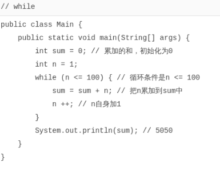
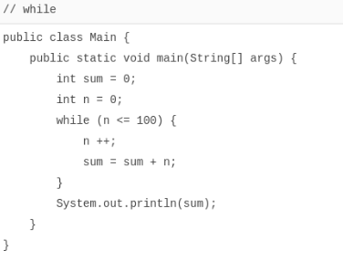
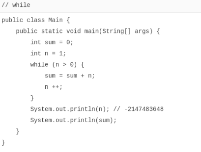

# while循环

[toc]

### while循环

循环语句就是让计算机根据条件做循环计算，在条件满足时继续循环，条件不满足时退出循环。

例如，计算从1到100的和：

```java
1 + 2 + 3 + 4 + … + 100 = ?
```

除了用数列公式外，完全可以让计算机做100次循环累加。因为计算机的特点是计算速度非常快，我们让计算机循环一亿次也用不到1秒，所以很多计算的任务，人去算是算不了的，但是计算机算，使用循环这种简单粗暴的方法就可以快速得到结果。

我们先看Java提供的`while`条件循环。它的基本用法是：

```java
while (条件表达式) {
    循环语句
}
// 继续执行后续代码
```

`while`循环在每次循环开始前，首先判断条件是否成立。如果计算结果为`true`，就把循环体内的语句执行一遍，如果计算结果为`false`，那就直接跳到`while`循环的末尾，继续往下执行。

我们用while循环来累加1到100，可以这么写：



注意到`while`循环是先判断循环条件，再循环，因此，有可能一次循环都不做。

对于循环条件判断，以及自增变量的处理，要特别注意边界条件。思考一下下面的代码为何没有获得正确结果：



如果循环条件永远满足，那这个循环就变成了死循环。死循环将导致100%的CPU占用，用户会感觉电脑运行缓慢，所以要避免编写死循环代码。

如果循环条件的逻辑写得有问题，也会造成意料之外的结果：



表面上看，上面的`while`循环是一个死循环，但是，Java的`int`类型有最大值，达到最大值后，再加1会变成负数，结果，意外退出了`while`循环。

### 小结

`while`循环先判断循环条件是否满足，再执行循环语句；

`while`循环可能一次都不执行；

编写循环时要注意循环条件，并避免死循环。
