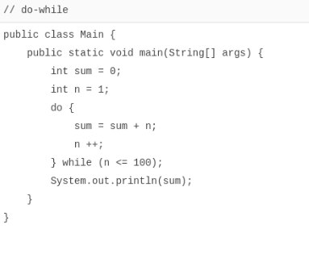

# do while循环do while循环

在Java中，`while`循环是先判断循环条件，再执行循环。而另一种`do while`循环则是先执行循环，再判断条件，条件满足时继续循环，条件不满足时退出。它的用法是：

```java
do {
    执行循环语句
} while (条件表达式);
```

可见，`do while`循环会至少循环一次。

我们把对1到100的求和用`do while`循环改写一下：



使用`do while`循环时，同样要注意循环条件的判断。

### 小结

`do while`循环先执行循环，再判断条件；

`do while`循环会至少执行一次。
