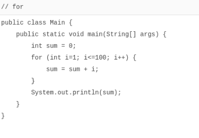
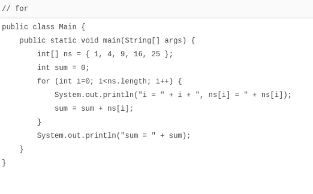
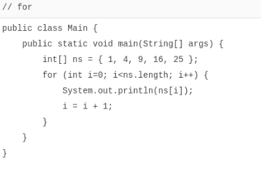
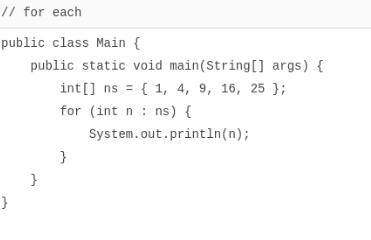

# for循环

### for循环

除了`while`和`do while`循环，Java使用最广泛的是`for`循环。

`for`循环的功能非常强大，它使用计数器实现循环。`for`循环会先初始化计数器，然后，在每次循环前检测循环条件，在每次循环后更新计数器。计数器变量通常命名为`i`。

我们把1到100求和用`for`循环改写一下：



在`for`循环执行前，会先执行初始化语句`int i=1`，它定义了计数器变量`i`并赋初始值为`1`，然后，循环前先检查循环条件`i<=100`，循环后自动执行`i++`，因此，和`while`循环相比，`for`循环把更新计数器的代码统一放到了一起。在`for`循环的循环体内部，不需要去更新变量`i`。

因此，`for`循环的用法是：

```java
for (初始条件; 循环检测条件; 循环后更新计数器) {
    // 执行语句
}
```

如果我们要对一个整型数组的所有元素求和，可以用`for`循环实现：



上面代码的循环条件是`i<ns.length`。因为`ns`数组的长度是`5`，因此，当循环`5`次后，`i`的值被更新为`5`，就不满足循环条件，因此`for`循环结束。

思考：如果把循环条件改为i<=ns.length，会出现什么问题？

注意`for`循环的初始化计数器总是会被执行，并且`for`循环也可能循环0次。

使用`for`循环时，千万不要在循环体内修改计数器！在循环体中修改计数器常常导致莫名其妙的逻辑错误。对于下面的代码：



虽然不会报错，但是，数组元素只打印了一半，原因是循环内部的`i = i + 1`导致了计数器变量每次循环实际上加了`2`（因为`for`循环还会自动执行`i++`）。因此，在`for`循环中，不要修改计数器的值。计数器的初始化、判断条件、每次循环后的更新条件统一放到`for()`语句中可以一目了然。

如果希望只访问索引为奇数的数组元素，应该把`for`循环改写为：

```java
int[] ns = { 1, 4, 9, 16, 25 };
for (int i=0; i<ns.length; i=i+2) {
    System.out.println(ns[i]);
}
```

通过更新计数器的语句`i=i+2`就达到了这个效果，从而避免了在循环体内去修改变量`i`。

使用`for`循环时，计数器变量`i`要尽量定义在`for`循环中：

```java
int[] ns = { 1, 4, 9, 16, 25 };
for (int i=0; i<ns.length; i++) {
    System.out.println(ns[i]);
}
// 无法访问i
int n = i; // compile error!
```

如果变量`i`定义在`for`循环外：

```java
int[] ns = { 1, 4, 9, 16, 25 };
int i;
for (i=0; i<ns.length; i++) {
    System.out.println(ns[i]);
}
// 仍然可以使用i
int n = i;
```

那么，退出`for`循环后，变量`i`仍然可以被访问，这就破坏了变量应该把访问范围缩到最小的原则。

### 灵活使用for循环

`for`循环还可以缺少初始化语句、循环条件和每次循环更新语句，例如：

```java
// 不设置结束条件:
for (int i=0; ; i++) {
    ...
}
```

```java
// 不设置结束条件和更新语句:
for (int i=0; ;) {
    ...
}
```

```java
// 什么都不设置:
for (;;) {
    ...
}
```

通常不推荐这样写，但是，某些情况下，是可以省略`for`循环的某些语句的。

### for each循环

`for`循环经常用来遍历数组，因为通过计数器可以根据索引来访问数组的每个元素：

```java
int[] ns = { 1, 4, 9, 16, 25 };
for (int i=0; i<ns.length; i++) {
    System.out.println(ns[i]);
}
```

但是，很多时候，我们实际上真正想要访问的是数组每个元素的值。Java还提供了另一种`for each`循环，它可以更简单地遍历数组：



和`for`循环相比，`for each`循环的变量n不再是计数器，而是直接对应到数组的每个元素。`for each`循环的写法也更简洁。但是，`for each`循环无法指定遍历顺序，也无法获取数组的索引。

除了数组外，`for each`循环能够遍历所有“可迭代”的数据类型，包括后面会介绍的`List`、`Map`等。

### 小结

`for`循环通过计数器可以实现复杂循环；

`for each`循环可以直接遍历数组的每个元素；

最佳实践：计数器变量定义在`for`循环内部，循环体内部不修改计数器；
