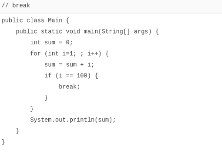
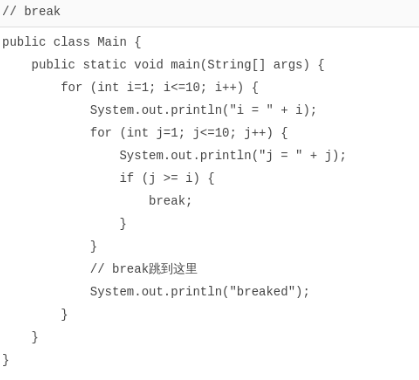
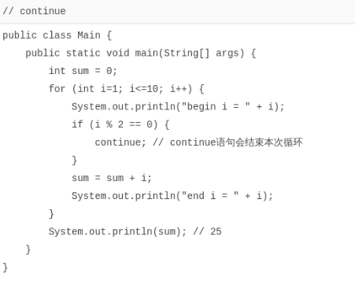

# break和continue

[toc]

### break和continue

无论是`while`循环还是`for`循环，有两个特别的语句可以使用，就是`break`语句和`continue`语句。

### break

在循环过程中，可以使用`break`语句跳出当前循环。我们来看一个例子：

使用`for`循环计算从1到100时，我们并没有在`for()`中设置循环退出的检测条件。但是，在循环内部，我们用`if`判断，如果`i==100`，就通过`break`退出循环。

因此，`break`语句通常都是配合`if`语句使用。要特别注意，`break`语句总是跳出自己所在的那一层循环。例如：

上面的代码是两个`for`循环嵌套。因为`break`语句位于内层的`for`循环，因此，它会跳出内层`for`循环，但不会跳出外层`for`循环。

### continue

`break`会跳出当前循环，也就是整个循环都不会执行了。而`continue`则是提前结束本次循环，直接继续执行下次循环。我们看一个例子：

注意观察`continue`语句的效果。当`i`为奇数时，完整地执行了整个循环，因此，会打印`begin i=1`和`end i=1`。在i为偶数时，`continue`语句会提前结束本次循环，因此，会打印`begin i=2`但不会打印`end i = 2`。

在多层嵌套的循环中，`continue`语句同样是结束本次自己所在的循环。

### 小结

`break`语句可以跳出当前循环；

`break`语句通常配合`if`，在满足条件时提前结束整个循环；

`break`语句总是跳出最近的一层循环；

`continue`语句可以提前结束本次循环；

`continue`语句通常配合`if`，在满足条件时提前结束本次循环。
