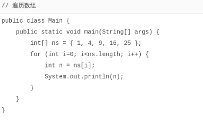
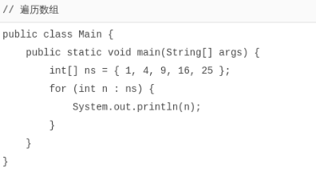
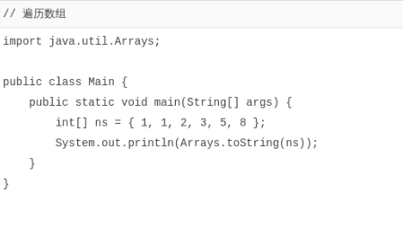

# 遍历数组

### 遍历数组

我们在Java程序基础里介绍了数组这种数据类型。有了数组，我们还需要来操作它。而数组最常见的一个操作就是遍历。

通过`for`循环就可以遍历数组。因为数组的每个元素都可以通过索引来访问，因此，使用标准的`for`循环可以完成一个数组的遍历：



为了实现`for`循环遍历，初始条件为`i=0`，因为索引总是从`0`开始，继续循环的条件为`i<ns.length`，因为当`i=ns.length`时，`i`已经超出了索引范围（索引范围是`0` ~ `ns.length-1`），每次循环后，`i++`。

第二种方式是使用`for each`循环，直接迭代数组的每个元素：



注意：在`for (int n : ns)`循环中，变量`n`直接拿到`ns`数组的元素，而不是索引。

显然`for each`循环更加简洁。但是，`for each`循环无法拿到数组的索引，因此，到底用哪一种`for`循环，取决于我们的需要。

### 打印数组内容

直接打印数组变量，得到的是数组在JVM中的引用地址：

```java
int[] ns = { 1, 1, 2, 3, 5, 8 };
System.out.println(ns); // 类似 [I@7852e922
```

这并没有什么意义，因为我们希望打印的数组的元素内容。因此，使用`for each`循环来打印它：

```java
int[] ns = { 1, 1, 2, 3, 5, 8 };
for (int n : ns) {
    System.out.print(n + ", ");
}
```

使用`for each`循环打印也很麻烦。幸好Java标准库提供了`Arrays.toString()`，可以快速打印数组内容：



### 小结

遍历数组可以使用`for`循环，`for`循环可以访问数组索引，`for each`循环直接迭代每个数组元素，但无法获取索引；

使用`Arrays.toString()`可以快速获取数组内容。
