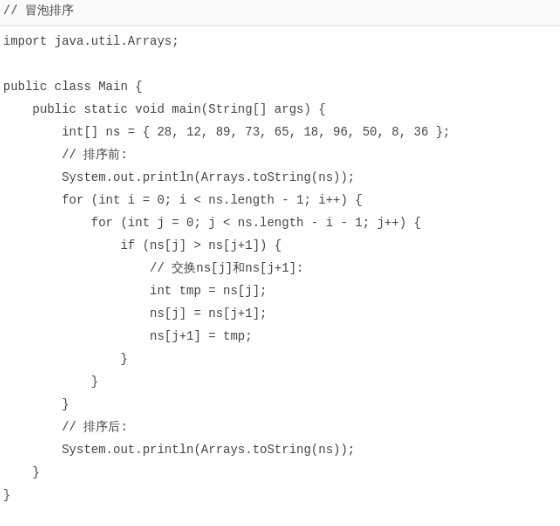
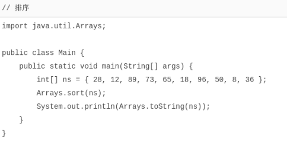

# 数组排序

[toc]

### 数组排序

------

对数组进行排序是程序中非常基本的需求。常用的排序算法有`冒泡排序`、`插入排序`和`快速排序`等。

我们来看一下如何使用`冒泡排序`算法对一个整型数组`从小到大`进行排序：



冒泡排序的特点是，每一轮循环后，最大的一个数被交换到末尾，因此，下一轮循环就可以“刨除”最后的数，每一轮循环都比上一轮循环的结束位置靠前一位。

另外，注意到交换两个变量的值必须借助一个临时变量。像这么写是错误的：

```java
int x = 1;
int y = 2;

x = y; // x现在是2
y = x; // y现在还是2
```

正确的写法是：

```java
int x = 1;
int y = 2;
int t = x; // 把x的值保存在临时变量t中, t现在是1

x = y; // x现在是2
y = t; // y现在是t的值1
```

实际上，Java的标准库已经内置了排序功能，我们只需要调用JDK提供的`Arrays.sort()`就可以排序：



必须注意，对数组排序实际上修改了数组本身。例如，排序前的数组是：

```java
int[] ns = { 9, 3, 6, 5 };
```

在内存中，这个整型数组表示如下：

```java
      ┌───┬───┬───┬───┐
ns───▶│ 9 │ 3 │ 6 │ 5 │
      └───┴───┴───┴───┘
```

当我们调用`Arrays.sort(ns);`后，这个整型数组在内存中变为：

```java
      ┌───┬───┬───┬───┐
ns───▶│ 3 │ 5 │ 6 │ 9 │
      └───┴───┴───┴───┘
```

即变量`ns`指向的数组内容已经被改变了。

如果对一个字符串数组进行排序，例如：

```java
String[] ns = { "banana", "apple", "pear" };
```

排序前，这个数组在内存中表示如下：

```txt
                   ┌──────────────────────────────────┐
               ┌───┼──────────────────────┐           │
               │   │                      ▼           ▼
         ┌───┬─┴─┬─┴─┬───┬────────┬───┬───────┬───┬──────┬───┐
ns ─────▶│░░░│░░░│░░░│   │"banana"│   │"apple"│   │"pear"│   │
         └─┬─┴───┴───┴───┴────────┴───┴───────┴───┴──────┴───┘
           │                 ▲
           └─────────────────┘
```

调用`Arrays.sort(ns);`排序后，这个数组在内存中表示如下：

```java
                   ┌──────────────────────────────────┐
               ┌───┼──────────┐                       │
               │   │          ▼                       ▼
         ┌───┬─┴─┬─┴─┬───┬────────┬───┬───────┬───┬──────┬───┐
ns ─────▶│░░░│░░░│░░░│   │"banana"│   │"apple"│   │"pear"│   │
         └─┬─┴───┴───┴───┴────────┴───┴───────┴───┴──────┴───┘
           │                              ▲
           └──────────────────────────────┘
```

原来的3个字符串在内存中均没有任何变化，但是`ns`数组的每个元素指向变化了。

### 小结

常用的排序算法有`冒泡排序`、`插入排序`和`快速排序`等；

冒泡排序使用两层`for`循环实现排序；

交换两个变量的值需要借助一个临时变量。

可以直接使用Java标准库提供的`Arrays.sort()`进行排序；

对数组排序会直接修改数组本身。
